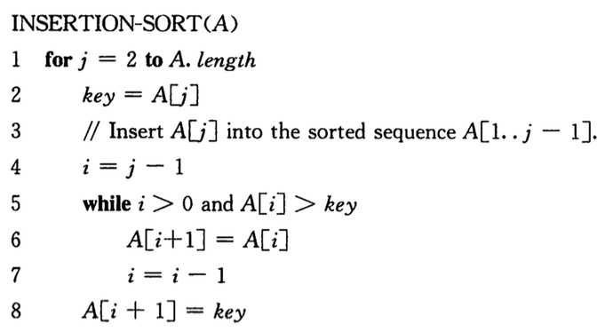

# 算法导论(第三版)

<!-- MarkdownTOC -->

- 第 1 章：算法在计算中的作用
- 第 2 章：算法基础
    - 2.1 插入排序

<!-- /MarkdownTOC -->

## 第 1 章：算法在计算中的作用

许多有趣算法问题所共有的两个特征：

1. 存在许多候选解，但绝大多数候选解都没有解决手头的问题。寻找一个真正的解或一个最好的解可能是一个很大的挑战。
2. 存在实际应用。

## 第 2 章：算法基础

### 2.1 插入排序

