# 推荐系统实践

<!-- MarkdownTOC -->

- 推荐系统评测
    - 离线实验
    - 评测指标
    - 评测维度
- 利用用户行为数据
    - 基于用户的协同过滤算法
    - 基于物品的协同过滤算法
    - UserCF 和 ItemCF 优缺点对比
- 隐语义模型
- 基于图的模型
- 冷启动问题
- 利用用户标签数据
    - 一个最简单的算法
    - 改进：TF-IDF
    - 改进：数据稀疏性
    - 改进：标签清理
    - 基于图的推荐算法

<!-- /MarkdownTOC -->

---

推荐算法的本质是通过一定的方式将用户和物品联系起来，而不同的推荐系统利用了不同的方式。

几乎所有的推荐系统应用都是由前台的展示页面、后台的日志系统以及推荐算法系统 3 部分构成的。

亚马逊推荐列表的组成部分：

+ 推荐结果的标题、缩略图以及其他内容属性
+ 推荐结果的平均分
+ 推荐理由

基于物品的推荐系统还是比较流行的(Amazon, Netflix)

Pandora 背后的音乐推荐算法主要来自于一个叫做**音乐基因工程**的项目。

音乐推荐的特点：

+ 物品空间大(相对于书和电影而言)
+ 消费每首歌代价很小
+ 物品种类丰富
+ 听一首歌耗时很少
+ 物品重用率很高
+ 用户充满激情
+ 上下文相关(和心情，场景有关)
+ 次序很重要
+ 很多播放列表资源
+ 不需要用户全神贯注
+ 高度社会化

## 推荐系统评测

三个参与方：用户、物品提供者和提供推荐系统的网站，一个好的推荐系统是能够令三方共赢的系统。

### 离线实验

1. 通过日志系统获得用户行为数据，并按照一定格式生成一个标准的数据集
2. 将数据集按照一定的规则分成训练集和测试集
3. 在训练集上训练用户兴趣模型，在测试集上进行预测
4. 通过事先定义的离线指标评测算法在测试集上的预测结果

### 评测指标

**用户满意度**

调查问卷，推荐结果的直接反馈按钮(豆瓣电台)

**预测准确度**

可以通过离线实验计算，分为不同的研究方向

1. **评分预测**。一般通过`均方根误差(RMSE)`和`平均绝对误差(MAE)`计算。Netflix 认为 RMSE 加大了对预测不准的用户物品评分的惩罚(平方)，因而对系统的评测更加苛刻。研究表明，如果评分系统是基于整数建立的(即用户给的评分都是整数)，那么对预测结果取整会降低 MAE 的误差
2. **TopN 预测**。一般通过`准确率(precision)/召回率(recall)`度量。主要目的应该是找到用户最有可能感兴趣的电影，而不是预测用户看了电影会给多少分，所以 TopN 更符合实际的应用需求。
3. **覆盖率(coverage)**。对物品长尾的发掘能力。有两个著名的指标可以用来定义覆盖率：`信息熵`和`基尼系数(Gini Index)`。推荐系统的初衷是消除马太效应，但是现在的主流推荐算法是具有马太效应的。
4. **多样性**。描述了推荐列表中物品两两之间的不相似性。
5. **新颖性**。给用户推荐那些他们以前没有听说过的物品。最简单的方法是利用推荐结果的平均流行度。困难的是如何在不牺牲精度的情况下提高多样性和新颖性。
6. **惊喜度(serendipity)**。Guy Shani "Evaluatin Recommendation Systems" 如果推荐结果和用户的兴趣不相似，但却让用户觉得满意，那么就可以说推荐结果的惊喜度很高，而推荐的新颖性仅仅取决于用户是否听过这个推荐结果。Yuan Cao Zhang "Auralist:introducing serendipity into music recommendation", Tomoko Murakami "Metrics for evaluating the serendipity of recommendation lists"
7. **信任度**。只能通过问卷调查的方式。提高信任度主要有两种方法。首先增加透明度(transparency), Henriette Cramer "The effects of transparency on trust in and aceeptance of a content-based art recommender"，也就是提供推荐解释，了解推荐系统运行的机制。关于推荐系统信任度的研究主要集中在评论网站 Epinion 的推荐系统(Paolo Massa "Trust-aware recommender systems")
8. **实时性**。第一是满足用户新的行为变化，第二是将新加入系统的物品推荐给用户
9. **健壮性**。抗击作弊的能力(Neil Hurley "Tutorial on Robustness of Recommender System")。
10. **商业目标**。

### 评测维度

+ 用户维度：主要包括用户的人口统计学信息、活跃度以及是不是新用户
+ 物品维度：包括物品的属性信息、流行度、平均分以及是不是新加入的物品等
+ 时间维度：包括季节，是工作日还是周末，是白天还是晚上

## 利用用户行为数据

用户行为：显性反馈行为(explicit feedback)和隐性反馈行为(implicit feedback)

很多数据分布都满足一种称为 Power Law 的分布(长尾分布)，Zipf 定律

### 基于用户的协同过滤算法

主要包括两个步骤：

1. 找到和目标用户兴趣相似的用户集合
2. 找到这个集合中的用户喜欢的，且目标用户没有听说过的物品推荐给目标用户

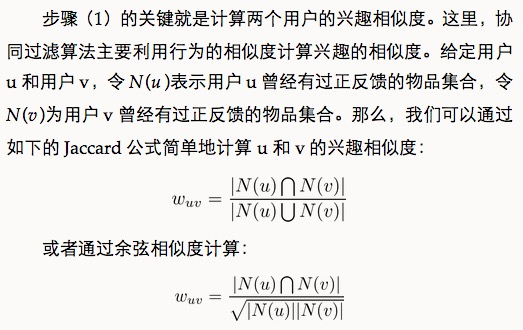

实践过程中用倒排表是比较快捷的方法。

一些注意事项：

1. 对于超级热门的书籍，并不能认为两个用户都买过就是兴趣相似。
2. 两个用户对冷门物品采取过同样的行为更能说明他们兴趣的相似度。(John S. Breese "Empirical Analysis of Predictive Algorithms for Collaborative Filtering")

对于热度较高的物品需要一定的惩罚，一般是用 log

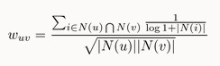

### 基于物品的协同过滤算法

业界基本使用这个(Linden Greg "Amazon.com Recommendations: Item-to-Item Collaborative Filtering")

并不利用物品的内容属性计算物品之间的相似度，主要通过分析用户的行为记录物品之间的相似度。该算法认为，物品 A 和物品 B 具有很大的相似度是因为喜欢物品 A 的用户大都也喜欢物品 B。

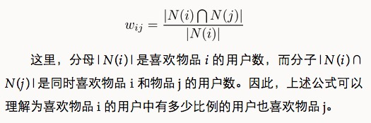

主要包括两个步骤：

1. 计算物品之间的相似度
2. 根据物品的相似度和用户的历史行为给用户生成推荐列表

但是如果其中一个物品很热门，那么得到的相似系数就会很大，所以分母需要开根号惩罚一下。

用户活跃度问题，John S. Breese "Empirical Analysis of Predicitve Algorithms for Collaborative Filtering" 提出了一个称为 IUF(Inverse User Frequence)的参数，活跃用户对物品相似度的贡献应该小于不活跃的用户

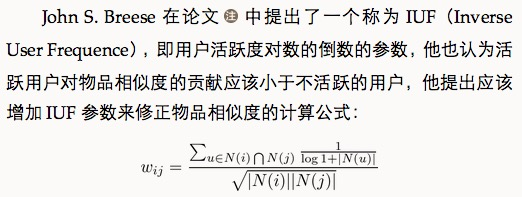

物品相似度的归一化，Karypis 在研究中发现如果将相似度矩阵按最大值归一化(George Karypis "Evaluation of Item-based Top-N Recommendation Algorithms")

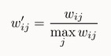

### UserCF 和 ItemCF 优缺点对比

x | UserCF | ItemCF
---|---|---
性能 | 适用于用户较少的场合，如果用户很多，计算用户相似度矩阵代价很大 | 适用于物品数明显小于用户数的场合，如果物品很多，计算物品相似度矩阵代价很大
领域 | 时效性较强，用户个性化兴趣不太明显的领域 | 长尾物品丰富，用户个性化需求强烈的领域
实时性 | 用户有新行为，不一定造成推荐结果立即变化 | 用户有新行为，一定会导致推荐结果的实时变化
冷启动 | 在新用户对很少的物品产生行为后，不能立即对他进行个性化推荐，因为用户相似度表是每隔一段时间离线计算的 | 新用户只要对一个物品产生行为，就可以给他推荐和该物品相关的其他物品
x | 新物品上线后一段时间，一旦有用户对物品产生行为，就可以将新物品推荐给和对它产生行为的用户兴趣相似的其他用户 | 但没有办法在不离线更新物品相似度表的情况下将新物品推荐给用户
推荐理由 | 很难提供令用户信服的推荐解释 | 利用用户的历史行为给用户做推荐解释，可以令用户比较信服

**哈利波特问题**

对于太热门的物品分子仍然会非常接近热门书籍的热度，可以采用下面的方法

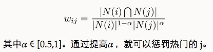

## 隐语义模型

相关名词：LFM(latnet factor model), LSI, pLSA, LDA, Topic Model。这些技术和方法本质上是相通的，其中很多方法都可以用于个性化推荐系统。

核心思想是通过隐含特征(latent factor)联系用户兴趣和物品，采取基于用户行为统计的自动聚类。

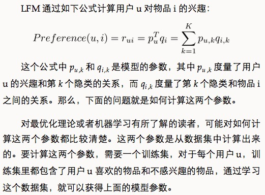

找寻负样本时需要遵循以下原则：

+ 对每个用户，要保证正负样本的平衡(数目相似)
+ 对每个用户采样负样本时，要选取那些很热门，用户却没有行为的物品

一般认为，很热门而用户却没有行为更加代表用户对这个物品不感兴趣。因为对于冷门的物品，用户可能是压根没在网站中发现这个物品，所以谈不上是否感兴趣。

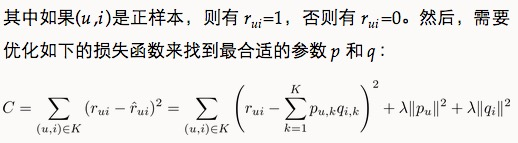

LFM 模型在实际使用中有一个困难，就是很难实现实时的推荐。经典的 LFM 模型每次训练时都需要扫描所有的用户行为记录，这样才能计算出用户隐类向量( p~u )和物品隐类向量( q~i )

LFM 是一种基于机器学习的方法，具有比较好的理论基础。这个方法和基于邻域的方法(比如 UserCF, ItemCF)相比，各有优缺点。

+ **理论基础** LFM具有比较好的理论基础，它是一种学习方法，通过优化一个设定的指标建立最优的模型。基于邻域的方法更多的是一种基于统计的方法，并没有学习过程。
+ **离线计算的空间复杂度** 基于邻域的方法需要维护一张离线的相关表。在离线计算相关表的过程中，如果用户/物品数很多，将会占据很大的内存。假设有 M 个用户和 N 个物品，在计算相关表的过程中，我们可能会获得一张比较稠密的临时相关表（尽管最终我们对每个物品只保留 K 个最相关的物品，但在中间计算过程中稠密的相关表是不可避免的），那么假设是用户相关表，则需要`O(M*M)`的空间，而对于物品相关表，则需要`O(N*N)`的空间。而LFM在建模过程中，如果是F个隐类，那么它需要的存储空间是`O(F*(M+N))`，这在M和N很大时可以很好地节省离线计算的内存。在Netflix Prize中，因为用户数很庞大（40多万），很少有人使用UserCF算法（据说需要30 GB左右的内存），而LFM由于大量节省了训练过程中的内存（只需要4 GB），从而成为Netflix Prize中最流行的算法。
+ **离线计算的时间复杂度**　假设有 M 个用户、N 个物品、K条用户对物品的行为记录。那么，UserCF 计算用户相关表的时间复杂度是`O(N*(K/N)^2)`，而ItemCF计算物品相关表的时间复杂度是`O(M*(K/M)^2)`。而对于LFM，如果用F个隐类，迭代S次，那么它的计算复杂度是`O(K*F*S)`。那么，如果`K/N > F*S`，则代表UserCF的时间复杂度低于LFM，如果 `K/M>F*S`，则说明 ItemCF 的时间复杂度低于 LFM。在一般情况下，LFM 的时间复杂度要稍微高于 UserCF 和 ItemCF，这主要是因为该算法需要多次迭代。但总体上，这两种算法在时间复杂度上没有质的差别。
+ **在线实时推荐**　UserCF 和 ItemCF 在线服务算法需要将相关表缓存在内存中，然后可以在线进行实时的预测。以 ItemCF 算法为例，一旦用户喜欢了新的物品，就可以通过查询内存中的相关表将和该物品相似的其他物品推荐给用户。因此，一旦用户有了新的行为，而且该行为被实时地记录到后台的数据库系统中，他的推荐列表就会发生变化。而从 LFM 的预测公式可以看到，LFM 在给用户生成推荐列表时，需要计算用户对所有物品的兴趣权重，然后排名，返回权重最大的 N 个物品。那么，在物品数很多时，这一过程的时间复杂度非常高，可达`O(M*N*F)`。因此，LFM 不太适合用于物品数非常庞大的系统，如果要用，我们也需要一个比较快的算法给用户先计算一个比较小的候选列表，然后再用 LFM 重新排名。另一方面，LFM 在生成一个用户推荐列表时速度太慢，因此不能在线实时计算，而需要离线将所有用户的推荐结果事先计算好存储在数据库中。因此，LFM不能进行在线实时推荐，也就是说，当用户有了新的行为后，他的推荐列表不会发生变化。
+ **推荐解释**　ItemCF 算法支持很好的推荐解释，它可以利用用户的历史行为解释推荐结果。但 LFM 无法提供这样的解释，它计算出的隐类虽然在语义上确实代表了一类兴趣和物品，却很难用自然语言描述并生成解释展现给用户。

## 基于图的模型

用户行为很容易用二分图表示，因此很多图的算法都可以用到推荐系统中。

基于图的模型（graph-based model）是推荐系统中的重要内容。其实，很多研究人员把基于邻域的模型也称为基于图的模型，因为可以把基于邻域的模型看做基于图的模型的简单形式。

令G(V,E)表示用户物品二分图，其中V=V~U ∪ V~I 由用户顶点集合 V~U 和物品顶点集合 V~I 组成。对于数据集中每一个二元组(u, i)，图中都有一套对应的边e(v~u ,v~i )，其中 v~u ∈ V~U 是用户 u 对应的顶点，v~i ∈ V~I 是物品 i 对应的顶点。下图是一个简单的用户物品二分图模型，其中圆形节点代表用户，方形节点代表物品，圆形节点和方形节点之间的边代表用户对物品的行为。比如图中用户节点A和物品节点a、b、d相连，说明用户A对物品a、b、d产生过行为。

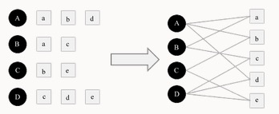

度量图中两个顶点之间相关性的方法很多，但一般来说图中顶点的相关性主要取决于下面3个因素：

+ 两个顶点之间的路径数；
+ 两个顶点之间路径的长度；
+ 两个顶点之间的路径经过的顶点。

而相关性高的一对顶点一般具有如下特征：

+ 两个顶点之间有很多路径相连；
+ 连接两个顶点之间的路径长度都比较短；
+ 连接两个顶点之间的路径不会经过出度比较大的顶点。

Fouss Francois "Random-Walk Computation of Similarities between Nodes of a Graph with Application to Collaborative Recommendation"

介绍一种基于随机游走的PersonalRank算法(Taher "Topic-Sensitive PageRank")

假设要给用户 u 进行个性化推荐，可以从用户 u 对应的节点 v~u 开始在用户物品二分图上进行随机游走。游走到任何一个节点时，首先按照概率 α 决定是继续游走，还是停止这次游走并从 v 节点开始重新游走。如果决定继续游走，那么就从当前节点指向的节点中按照均匀分布随机选择一个节点作为游走下次经过的节点。这样，经过很多次随机游走后，每个物品节点被访问到的概率会收敛到一个数。最终的推荐列表中物品的权重就是物品节点的访问概率。

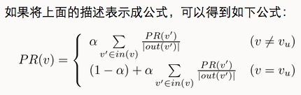

但是计算量较大，有两种解决办法：减少迭代次数或者是从矩阵论出发重新设计算法，暂略

## 冷启动问题

冷启动问题（cold start）主要分3类。

+ **用户冷启动**　用户冷启动主要解决如何给新用户做个性化推荐的问题。当新用户到来时，我们没有他的行为数据，所以也无法根据他的历史行为预测其兴趣，从而无法借此给他做个性化推荐。
+ **物品冷启动**　物品冷启动主要解决如何将新的物品推荐给可能对它感兴趣的用户这一问题。
+ **系统冷启动**　系统冷启动主要解决如何在一个新开发的网站上（还没有用户，也没有用户行为，只有一些物品的信息）设计个性化推荐系统，从而在网站刚发布时就让用户体验到个性化推荐服务这一问题。

对于这3种不同的冷启动问题，有不同的解决方案。一般来说，可以参考如下解决方案。

+ **提供非个性化的推荐**　非个性化推荐的最简单例子就是热门排行榜，我们可以给用户推荐热门排行榜，然后等到用户数据收集到一定的时候，再切换为个性化推荐。
+ 利用用户注册时提供的年龄、性别等数据做粗粒度的个性化。
+ 利用用户的社交网络账号登录（需要用户授权），导入用户在社交网站上的好友信息，然后给用户推荐其好友喜欢的物品。
+ 要求用户在登录时对一些物品进行反馈，收集用户对这些物品的兴趣信息，然后给用户推荐那些和这些物品相似的物品。
+ 对于新加入的物品，可以利用内容信息，将它们推荐给喜欢过和它们相似的物品的用户。
+ 在系统冷启动时，可以引入专家的知识，通过一定的高效方式迅速建立起物品的相关度表。

能够用来启动用户兴趣的物品需要具有以下特点：

+ **比较热门**　如果要让用户对一个物品进行反馈，前提是用户知道这个物品是什么东西。以电影为例，如果一开始让用户进行反馈的电影都很冷门，而用户不知道这些电影的情节和内容，也就无法对它们做出准确的反馈。
+ **具有代表性和区分性**　启动用户兴趣的物品不能是大众化或老少咸宜的，因为这样的物品对用户的兴趣没有区分性。还以电影为例，用一部票房很高且广受欢迎的电影做启动物品，可以想象的到的是几乎所有用户都会喜欢这部电影，因而无法区分用户个性化的兴趣。
+ **启动物品集合需要有多样性**　在冷启动时，我们不知道用户的兴趣，而用户兴趣的可能性非常多，为了匹配多样的兴趣，我们需要提供具有很高覆盖率的启动物品集合，这些物品能覆盖几乎所有主流的用户兴趣。

Nadav Golbandi在论文中探讨了选择启动物品的问题，提出可以用一个决策树解决这个问题(“Adaptive Bootstrapping of Recommender Systems Using Decision Trees”)

Nadav Golbandi 的算法首先会从所有用户中找到具有最高区分度的物品 i，然后将用户分成 3 类。然后在每类用户中再找到最具区分度的物品，然后将每一类用户又各自分为 3 类，也就是将总用户分成9类，然后这样继续下去，最终可以通过对一系列物品的看法将用户进行分类。而在冷启动时，我们从根节点开始询问用户对该节点物品的看法，然后根据用户的选择将用户放到不同的分枝，直到进入最后的叶子节点，此时我们就已经对用户的兴趣有了比较清楚的了解，从而可以开始对用户进行比较准确地个性化推荐。

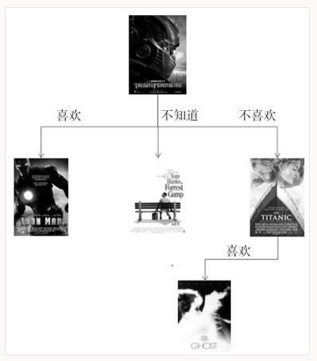

通过一个简单的例子解释Nadav Golbandi的算法。如图所示，假设通过分析用户数据，我们发现《变形金刚》最有区分度。而在喜欢《变形金刚》的用户中《钢铁侠》最有区分度，不知道《变形金刚》的用户中《阿甘正传》最有区分度，不喜欢《变形金刚》的用户中《泰坦尼克号》最有区分度。进一步分析，我们发现不喜欢《变形金刚》但喜欢《泰坦尼克号》的用户中，《人鬼情未了》最有区分度。那么，假设来了一个新用户，系统会首先询问他对《变形金刚》的看法，如果他说不喜欢，我们就会问他对《泰坦尼克》号的看法，如果他说喜欢，我们就会问他对《人鬼情未了》的看法，如果这个时候用户停止了反馈，我们也大概能知道该用户可能对爱情片比较感兴趣，对科幻片兴趣不大。

一般来说，物品的内容可以通过向量空间模型(Vector Space Model)表示，该模型会将物品表示成一个关键词向量。如果物品的内容是一些诸如导演、演员等实体的话，可以直接将这些实体作为关键词。但如果内容是文本的形式，则需要引入一些理解自然语言的技术抽取关键词。

向量空间模型在内容数据丰富时可以获得比较好的效果。以文本为例，如果是计算长文本的相似度，用向量空间模型利用关键词计算相似度已经可以获得很高的精确度。

如何建立文章、话题和关键词的关系是话题模型（topic model）研究的重点。代表性的话题模型有LDA。

任何模型都有一个假设，LDA 作为一种生成模型，对一篇文档产生的过程进行了建模。话题模型的基本思想是，一个人在写一篇文档的时候，会首先想这篇文章要讨论哪些话题，然后思考这些话题应该用什么词描述，从而最终用词写成一篇文章。因此，文章和词之间是通过话题联系的。LDA 中有 3 种元素，即**文档**、**话题**和**词语**。每一篇文档都会表现为词的集合，这称为**词袋模型(bag of words)**。每个词在一篇文章中属于一个话题。令D为文档集合，`D[i]`是第 i 篇文档。`w[i][j]`是第 i 篇文档中的第 j 个词。`z[i][j]`是第 i 篇文档中第 j 个词属于的话题。

LDA 的计算过程包括初始化和迭代两部分。首先要对 z 进行初始化，而初始化的方法很简单，假设一共有 K 个话题，那么对第 i 篇文章中的第 j 个词，可以随机给它赋予一个话题。同时，用 NWZ(w,z)记录词 w 被赋予话题 z 的次数，NZD(z,d)记录文档 d 中被赋予话题 z 的词的个数。LDA可以很好地将词组合成不同的话题。

在使用 LDA 计算物品的内容相似度时，我们可以先计算出物品在话题上的分布，然后利用两个物品的话题分布计算物品的相似度。比如，如果两个物品的话题分布相似，则认为两个物品具有较高的相似度，反之则认为两个物品的相似度较低。计算分布的相似度可以利用 KL 散度

## 利用用户标签数据

标签系统的最大优势在于可以发挥群体的智能，获得对物品内容信息比较准确的关键词描述，而准确的内容信息是提升个性化推荐系统性能的重要资源。

打标签作为一种重要的用户行为，蕴含了很多用户兴趣信息，因此深入研究和利用用户打标签的行为可以很好地指导我们改进个性化推荐系统的推荐质量。同时，标签的表示形式非常简单，便于很多算法处理。标签系统中的推荐问题主要有以下两个。

+ 如何利用用户打标签的行为为其推荐物品（基于标签的推荐）？
+ 如何在用户给物品打标签时为其推荐适合该物品的标签（标签推荐）？

一个用户标签行为的数据集一般由一个三元组的集合表示，其中记录(u, i, b)表示用户 u 给物品 i 打上了标签 b。当然，用户的真实标签行为数据远远比三元组表示的要复杂，比如用户打标签的时间、用户的属性数据、物品的属性数据等。但是本章为了集中讨论标签数据，只考虑上面定义的三元组形式的数据，即用户的每一次打标签行为都用一个三元组（用户、物品、标签）表示。

### 一个最简单的算法

拿到了用户标签行为数据，相信大家都可以想到一个最简单的个性化推荐算法。这个算法的描述如下所示。

+ 统计每个用户最常用的标签。
+ 对于每个标签，统计被打过这个标签次数最多的物品。
+ 对于一个用户，首先找到他常用的标签，然后找到具有这些标签的最热门物品推荐给这个用户。

对于上面的算法，用户u对物品i的兴趣公式如下：

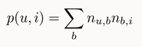

这里，B(u)是用户 u 打过的标签集合，B(i)是物品i被打过的标签集合，n~u，b 是用户 u 打过标签 b 的次数，n~b，i 是物品 i 被打过标签 b 的次数。

### 改进：TF-IDF

前面这个公式倾向于给热门标签对应的热门物品很大的权重，因此会造成推荐热门的物品给用户，从而降低推荐结果的新颖性。另外，这个公式利用用户的标签向量对用户兴趣建模，其中每个标签都是用户使用过的标签，而标签的权重是用户使用该标签的次数。这种建模方法的缺点是给热门标签过大的权重，从而不能反应用户个性化的兴趣。这里我们可以借鉴TF-IDF的思想，对这一公式进行改进：

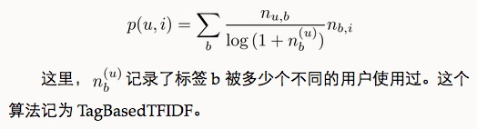

同理，我们也可以借鉴TF-IDF的思想对热门物品进行惩罚，从而得到如下公式：

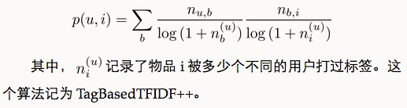

和TagBasedTFIDF算法相比，除了多样性有所下降，其他指标都有明显提高。这一结果表明，适当惩罚热门标签和热门物品，在增进推荐结果个性化的同时并不会降低推荐结果的离线精度。

### 改进：数据稀疏性

在前面的算法中，用户兴趣和物品的联系是通过B(u)∩B(i)中的标签建立的。但是，对于新用户或者新物品，这个集合（B(u)∩B(i)）中的标签数量会很少。为了提高推荐的准确率，我们可能要对标签集合做扩展，比如若用户曾经用过“推荐系统”这个标签，我们可以将这个标签的相似标签也加入到用户标签集合中，比如“个性化”、“协同过滤”等标签。

进行标签扩展有很多方法，其中常用的有话题模型(topic model)，不过这里遵循简单的原则介绍一种基于邻域的方法。

标签扩展的本质是对每个标签找到和它相似的标签，也就是计算标签之间的相似度。最简单的相似度可以是同义词。如果有一个同义词词典，就可以根据这个词典进行标签扩展。如果没有这个词典，我们可以从数据中统计出标签的相似度。

如果认为同一个物品上的不同标签具有某种相似度，那么当两个标签同时出现在很多物品的标签集合中时，我们就可以认为这两个标签具有较大的相似度。对于标签b，令N(b)为有标签b的物品的集合，n~b，i 为给物品 i 打上标签 b 的用户数，我们可以通过如下余弦相似度公式计算标签 b 和标签 b' 的相似度：

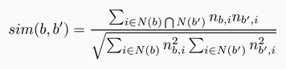

进行标签扩展确实能够提高基于标签的物品推荐的准确率和召回率，但可能会稍微降低推荐结果的覆盖率和新颖度。

### 改进：标签清理

不是所有标签都能反应用户的兴趣。同时，标签系统里经常出现词形不同、词义相同的标签。

标签清理的另一个重要意义在于将标签作为推荐解释。如果我们要把标签呈现给用户，将其作为给用户推荐某一个物品的解释，对标签的质量要求就很高。首先，这些标签不能包含没有意义的停止词或者表示情绪的词，其次这些推荐解释里不能包含很多意义相同的词语。

一般来说有如下标签清理方法：

+ 去除词频很高的停止词；
+ 去除因词根不同造成的同义词，比如recommender system和recommendation system；
+ 去除因分隔符造成的同义词，比如collaborative_filtering和collaborative-filtering。

为了控制标签的质量，很多网站也采用了让用户进行反馈的思想，即让用户告诉系统某个标签是否合适。关于这方面的研究可以参考Grou-pLens的Shilad Wieland Sen同学的博士论文(Nurturing Tagging Communities)

### 基于图的推荐算法

