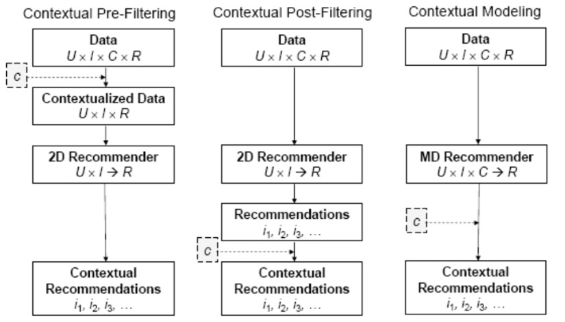

# 文献综述 Literature Review

<!-- MarkdownTOC -->

- Recommender System
    - Related Papers
    - What is a Recommender System
        - The Recommender Problem
        - Approaches to Recommendation
        - What works
    - Traditional Methods
        - Collaborative Filtering
            - User-based Collaborative Filtering
            - Item-Item Collaborative Filtering
            - Challenges of Nearest-neighbor Collaborative Filtering
            - Model-based Collaborative Filtering
            - Limitations of Collaborative Filtering
        - Content-based Recommendations
            - Advantages
            - Disadvantages
            - Content-based Method
    - Novel Methods
        - Learning to Rank
            - Metrics
            - Approaches
        - Context-aware Recommendations
            - Pre-Filtering
        - Deep Learning
        - Similarity
        - Social Recommendations
    - Hybrid Approaches
    - References
- 基于遗传算法的新书推荐系统研究
- Paper

<!-- /MarkdownTOC -->

## Recommender System

### Related Papers

+ The Recommender Problem Revisited. KDD and Recsys 2014 Tutorial
+ KDD: Big & Personal: data and models behind Netflix recommendations. 2013
+ SIGKDD Explorations: Mining large streams of user data for personalized recommendations. 2012
+ Recsys: Building industrial-scale real-world recommender systems. 2012
+ Recys - Walk the Talk: Analyzing the relation between implicit and explicit feedback for preference elicitation. 2011
+ SIGIR – Wisdom of the Few. 2009
+ CARS – Implicit context-aware recommendations. 2009
+ UMAP – I like it I like it not. 2009

### What is a Recommender System

Chris Anderson in "The Long Tail"

> We are leaving the age of information and entering the age of recommendation

CNN Money, "The race to create a 'smart' Google"

> The Web, they say, is leaving the era of search and entering one of dicovery. What's the difference? Search is what you do when you're looking for something. Discovery is when something wonderful that you didn't know existed, or din't know how to ask for, finds you.

Information overload.

#### The Recommender Problem

+ Estimate a **utility function** that **automatically predicts** how a user will like an item.
+ Based on: Past behavior, Relations to tother users, Item similarity, Context
+ Let `C` be set of all users and let `S` be set of all possible recommendable items
+ Let `u` be a utility function measuring the usefulness of item `s` to user `c`, i.e., `u: C x S -> R`, where `R` is a totally ordered set
+ For each user `c` in `C`, we want to choose items `s` in `S` that maximize `u`

#### Approaches to Recommendation

Offline: Learning Process, Model/Clusters

Online: Decision Process, Recommended Items

+ Collaborative filtering(CF): Recommend items based only on the users past behavior
    + **User-based**: Find similar users to me and recommend what they liked
    + **Item-based**: Find similar items to those that I have previously liked
+ Content-based: Recommend based on item features
+ Personalized Learning to Rank: Treat recommendation as a ranking problem
+ Demographic: Recommend based on user features
+ Social recommendations(trust-based)
+ Hybrid: Combine any of the above

**Recommendation as data mining**

The core of the Recommendation Engine can be assimilated to a general data mining problems:

+ Data Preparation
    + Feature selection
    + Dimensionality Reduction
    + Normalization
    + Data Subsetting
+ Data Mining
    + Clustering
    + Classification
    + Rule Generation
+ Postprocessing
    + Filtering
    + Visualization
    + Pattern Interpretation

**Serendipity**

+ Unsought finding
+ Don't recommend items the user already knows or **would have found anyway**
+ Expand the user's taste into neighboring areas by improving the obvious
+ Collaborative filtering can offer controllable serendipity(e.g. controlling how many neighbors to use in the recommendation)

#### What works

+ Depends on the **domain** and particular **problem**
+ However, in the general case it has been demonstrated that the best isolated approach is CF.
    + Other approaches can be hybridized to improve results in specific cases (cold-start problem)
+ What matters:
    + **Data preprocessing**: outlier removal, denoising, removal of global effects (e.g. individual user's average)
    + "Smart" dimensionality reduction using MF/SVD
    + Combining methods

### Traditional Methods

传统方法可能不够足够个性化，但是总体来说更加容易控制，也有比较好的预期

#### Collaborative Filtering

**The CF Ingredients**

+ List of `m` Users and a list of `n` Items
+ Each user has a `list of items` with associated `opinion`
    + Explicit opinion - a rating score
    + Sometimes the rating is implicitly - purchase records or listen to tracks
+ `Active user` for whom the CF prediction task is performed
+ `Metric` for measuring `similarity between users`
+ Method for selecting a subset of `neighbors`
+ Method for `predicting a rating` for items not currently rated by the active user

**The basic steps**

+ Identify set of ratings for the `target/active user`
+ Identify set of users most similar ot the target/active user according to a similarity function(`neighborhood formation)
+ Identify the products these similar users liked
+ `Generate a prediction` - rating that would be given by the target user to the product - for each one of these products
+ Based on this predicted rating recommend a set of top N products

**Pros & Cons**

+ Pros:
    + Requires `minimal knowledge` engineering efforts
    + Users and products are symbols without any internal structure or characteristics
    + Produces good-enough results in most cases
+ Cons:
    + Requires a large number of `reliable` user feedback data to bootstrap
    + Requires products to be standardized (users should have bought `exactly` the same product)
    + Assumes that `prior behavior determines current behavior` without taking into account contextual knoledge(session-level)

**Netflix Prize's first conclusion: it is really extremely simple to produce "reasonable" recommendations and extremly difficult to improve them.**

##### User-based Collaborative Filtering

+ A collection of user `u~i, i=1,...,n` and a collection of products `p~j, j=1,...,m`
+ An `n x m` matrix of ratings v~ij, with v~ij = ? if user i did not rate product j
+ Prediction for user i and product j is computed

+ Similarity can be computed by Pearson correlation

**Challenges**

+ Sparsity - evaluation of large item sets, users purchases are under 1%
+ Difficult to make predictions based on nearest neighbor algorithms => Accuracy of recommendation may be poor
+ Scalability - Nearest neighbor require computation that grows with both the number of users and the number of items
+ Poor relationship among like minded but sparse-rating users
+ Solution: usage of lantent models to capture similarity between users & items in a reduced dimensinal space

##### Item-Item Collaborative Filtering

+ Look into the items that target users has rated
+ Compute how similar they are to the target item
    + Similarity only using past ratings from other users
+ Select k most similar items
+ Compute Prediction by taking weighted average on the target user's ratings on the most similar items

**Item Similarity Computation**

+ Similarity between items `i` & `j` computed by finding users who have rated them and then applying a similarity function to their ratings
+ `Cosine-based Similarity` - items are vectors in the `m` dimensinal user space (difference in rating scale between users is not taken into account)

+ `Correlation-based Similarity` - using the Pearson-r correlation(used only in cases where the users rated both item i & item j)

+ `Adjusted Cosine Similarity` - each pair in the co-rated set corresponds to a different user(takes care of difference in rating scale)

**Prediction Computation**

+ Generating the prediction - look into the target users ratings and use techniques to obtain predictions
+ `Weighted Sum` - how the active user rates the similar items

**Performance Implications**

+ Bottleneck - Similarity computation
+ Time complexity, highly time consuming with millions of users and items in the database

##### Challenges of Nearest-neighbor Collaborative Filtering

**Sparsity Problem**

+ Typically: large product sets, user ratins for a small percentage of them
+ Standard CF must have a number of users comparable to one tenth of the size of the product catalogue
+ Methods of dimensionality reduction
    + Matrix Factorization
    + Clustering
    + Projection(PCA ...)

**Scalability Problem**

+ Nearest neighbor algorithms require computations that grows with both the number of customers and products
+ With millions of customers and products a web-based recommender can suffer serious scalability problems
+ The worst case complexity is O(mn)(`m` customers and `n` product)
+ But in practice the complexity is O(m+n) since for each customer only a small number of products are considered
+ Some clustering techniques like K-means can help

**Performance Implications**

+ User-based CF - similarity between users is dynamic, precomputing user neighborhood can lead to poor predictions
+ Item-based CF - similarity between items is static
+ Enables precomputing of item-time similarity => prediction process involves only a table lookup for the similarity values & computation of the weighted sum

##### Model-based Collaborative Filtering

+ Use the entire user-item database to generate a prediction
+ Usage of statistical techniques to find the neighbors - e.g. nearest-neighbor
+ First develop a model of user
+ Type of model:
    + Probabilistic (e.g. Bayesian Network)
    + Clustering
    + Rule-based approaches (e.g. Association Rules)
    + Classification
    + Regression
    + LDA

**Clustering**

+ Pros
    + Clustering techniques can be used to work on aggregated data
    + Can also be applied as a first step for shrinking the slection of relevant neighbors in a collaborative filtering algorithm and improve performance
    + Can be used to capture laten tsimilarities between users or items
+ Cons
    + Recommendations may be less relevant than collaborative filtering

**Locality-sensitive Hashing(LSH)**

+ Method for grouping similar items in highly dimensional spaces
+ Find a hashing function s.t. similar items are grouped in the same buckets
+ Main application is Nearest-neighbors
    + Hashing function is found iteratively by concatenating random hashing functions
    + Addresses on eof NN main concerns: performance

**Association Rules**

+ Past purchases are transformed into relationships of common purchases
+ These association rules are then used to make recommendations
+ Recommendations are constrained to some minimum levels of confidence
+ Pros
    + Fast to implement
    + Fast to execute
    + Not much storage space required
    + Not individual specific
    + Very successful in broad applications for large populations
+ Cons
    + Not suitable if knowledge of preferences change rapidly
    + It is temptingto not apply restrictive confidence rules => May lead to literally `stupid` recommendations

**Classifiers**

+ Classifiers are general computational models trained using positive and negative examples
+ They may take in inputs
    + Vector of item features
    + Preferences of customers
    + Relations among item
+ E.g. Logistic Regression, Bayesian Networks, Support Vector Machines, Decision Trees, etc.
+ Pros
    + Versatile
    + Can be combined with other methods to improve accuracy of recommendations
+ Cons
    + Need a relevant training set
    + May overfit(Regularization)

##### Limitations of Collaborative Filtering

+ Cold Start: There need s to be enough other users already in the system to find a match. New items need to get enough ratings
+ Popularity Bias: Hard to recommend items to someone with unique tastes
    + Tends to recommend popular items(items from the tail do not get so much data)

#### Content-based Recommendations

+ Recommendations based on information on the content of items rather than on other users' opinions/interactions
+ Use a machine learing algorithm to induce a model of the users preferences from examples based on a featural description of content
+ In content-based recommendations, the system tries to recommend items similar to those a given user has liked in the past
+ A pure content-based recommender system makes recommendations for a user based solely on the profile built up by analyzing the content of items which that user has rated in the past

**What is content?**

+ It can be explicit attributes or characteristics of the item
+ It can also be textual content(title, description, table of content, etc)
    + Several techniques to compute the distance between two textual documents
    + Can use NLP techniques to extract content features
+ Common for recommending **text-based** products(web pages, usenet news messsages)
+ Items to recommend are `described` by their associated **features**(e.g. keywords)
+ User Model structured in a similar way as the content: features/keywords more likely to occur in the preferred documents(lazy approach)
    + Text documents recommended based on a comparison between their content(words appearing) and user model(a set of preferred words)
+ The user model can also be a classifier based on whatever technique(Neural Networds, Naive Bayes...)

##### Advantages

+ No need for data on other users
    + No cold-start or sparsity problems
+ Able to recommend to users with unique tastes
+ Able to recommend new and unpopular items
    + No first-rater problem
+ Can provide explanations of recommended items by listing content-features that caused an item to be recommended

##### Disadvantages

+ Requires content that can be encoded as meaningful features
+ Some kind of items are not amenable to easy feature extraction methods(e.g. movies, music)
+ Even for texts, IR techniques cannot consider multimedia information, aesthetic qualities, download time
    + If you rate positively a page it could be not related to the presence of certian keywords
+ Users' tastes must be represented as a learnable function of these content features
+ Hard to exploit quality judgements of other users
+ Difficult to implement serendipity
+ Easy to overfit(e.g. for a user with few data points we may "pigeon hole" her)

##### Content-based Method

+ Let Content be an `item` profile, i.e. a set of attributes characterizing item `s`.
+ Content usually described with keywords
+ Importance(informativeness) of word k~j in document d~j is determined with some weighting measure w~ij
+ One of the best-know measures in IR is the term frequency/inverse document frequency(TF-IDF)

**Content-based User Profile**

+ Let `ContentBasedProfile(c)` be the profile of user `c` containing preferences of this user profiles are obtained by:
    + analyzing the content of the previous items
    + using keyword analysis techniques
+ For example, `ContentBasedProfile(c)` can be defined as a vector of weights (w~c1 ,..., w~ck ) where weight w~ci denotes the importance of keyword k~i to user `c`

**Similarity Measures**

In content-based systems, the utility function `u(c,s)` is usually defined as:

    u(c, s) = score(ContentBasedProfile(c), Content(s))

Both `ContentBasedProfile(c)` of user `c` and `Content(s)` of document `s` can be represented as TF-IDF vectors of keyword weights

Utility function `u(c,s)` usually represented by some scoring heuristic defined in terms of vectors, such as the cosine similarity measure

### Novel Methods

#### Learning to Rank

+ Most recommendations are presented in a sorted list
+ Recommendation can be understood as a ranking problem
+ Popularity is the obvious baseline
+ Ratings prediction is a clear secondary data input that allows for personalization
+ Many other features can be added
+ Machine learning problem: goal is to construct ranking model from training data
+ Training data can be a partial order or binary judgments(relevant/not relevant)
+ Resulting order of the items typically induced from a numerical score
+ Learning to rank is a key element for personalization
+ You can treat the problem as a standard supervised classification problem

##### Metrics

+ Quality of ranking measured using metrics as
    + Normalized Discounted Cumulative Generating
    + Mean Reciprocal Rank(MRR)
    + Fraction of Concordant Pairs(FCP)
+ But, it is hard to optimize machine-learned models directly on these measures(they are not differentiable)
+ Recent research on models that directly opimize ranking measures

##### Approaches

+ Pointwise
    + Ranking fucntion minimizes loss function defined on individual relevance judgment
    + Ranking score based on regression or classification
    + Ordinal regression, Logistic regression, SVM, GBDT, ...
+ Pairwise
    + Loss function is defined on pair-wise preferences
    + Goal: minimize number of inversions in ranking
    + Ranking problem is then transformed into the binary classification problem
    + RankSVM, RankBoost, RankNet, FRank
+ Listwise
    + Indirect Loss Function
        + RankCosine: similarity between ranking list and ground truth as loss function
        + ListNet: KL-divergence as loss function by defining a probability distribution
        + Problem: optimization of listwise loss function may not optimize IR metrics
    + Directly optimizing IR measure(difficult since they are not differentiable)
    + Directly optimize IR measures through Genetic Programming
    + Directly optimize measures with Simulated Annealing
    + Gradient descent on smoothed version of bojective function(e.g. CLiMF presented at RECsys 2012 or TFMAP at SIGIR 2012)
    + SVM-MAP relaxes the MAP metric by adding it to the SVM constraints
    + AdaRank uses boosting to optimize NDCG

#### Context-aware Recommendations

Context is an important factor to consider in personalized Recommendation.

Three types of Architecutre for using context in recommendation(Adomavicius, Tuzhilin, 2008)

+ Contextual Pre-filtering
    + Context information used to select relevant portions of data
+ Contextual Post-filtering
    + Contextual information is used to filter/constrain/re-rank final set of recommendation
+ Contextual Modeling
    + Context information is used directly as part of learning preference models

Variants and combinations of these are possible

##### Pre-Filtering

**Tensor Factorization**

**Factorization Machines**

#### Deep Learning

#### Similarity

#### Social Recommendations

### Hybrid Approaches

### References

## 基于遗传算法的新书推荐系统研究

关于实现个性化新书推荐系统的研究现已提出多种解决方案，其主要思路均是将各类智能算法融入到系统中通过自主分析用户的检索意图及个性化需求，从而实现新书推荐系统的个性化和智能化。

文献[3]提出了一类基于密度的动态协同新书推荐算法，通过动态跟踪用户的兴趣变化调整新书推荐策略，提高了图书的推荐精度。武建伟，俞晓红，陈文清.基于密度的动态协同过滤图书推荐算法[J].计算机应用研究，2010，27(8):3013~3015

在众多智能算法中，遗传算法作为一类并行性强、自适应性好的全局优化搜索算法也逐步应用到了数字图书馆各类系统的设计开发中。 遗传算法是一种模拟生物界自然选择和自然遗传机制的随机搜索算法，其本质是一种高效、并行、全局搜索的方法，它能在搜索过程中自动获取和累积有关搜索空间的知识，并自适应地控制搜索过程以求得最优解。利用遗传算法在关于数字图书馆系统的开发研究中，遗传算法均体现出了良好的性能。本文提出一类基于遗传算法的新书推荐方法(Genetic Algorithm Based New Book Recommendation，GAN-Book)。GANBook 算法首先在新书集合中随机生成初始种群即一定数量的新书子集，然后以特定读者兴趣为适应度，利用遗传操作的反复优化，最终找出最优个体即最符合读者兴趣的图书子集完成新书推荐。

## Paper

[1] “基于遗传算法的新书推荐系统研究,” pp. 1–5, Mar. 2015.

