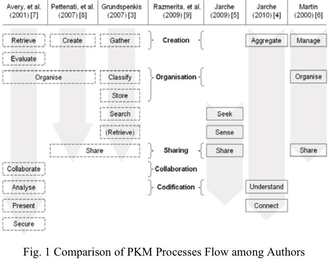
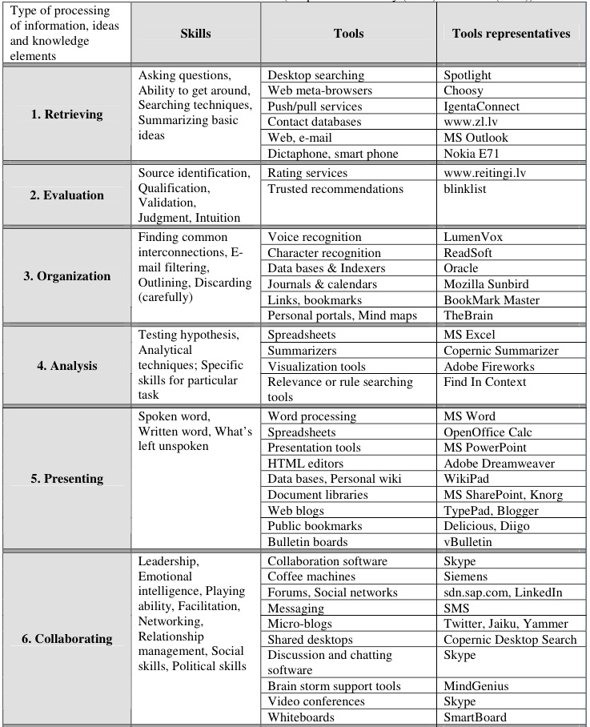
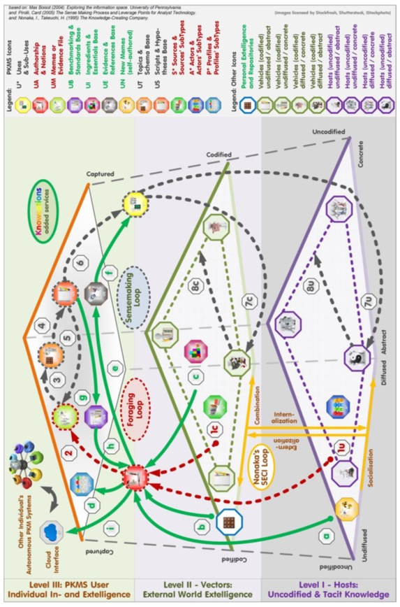

# An Effective Toolkit for Personal Information Management

## Abstract

This paper presents an effective toolkit for personal information management(PIM). The development of this toolkit is based on the idea that new information retrieval methods and natural language processing methods can help people extract useful information when facing the information explosion/chaos/overload. With a automatic and unified information processing pipeline, this toolkit focuses on improving the effectvieness of three main PIM processes: get/retrive, understand/analyse and connect/organize.

## Introduction

Personal Information Management(PIM) is the focus of many scholars in the area of Personal Knowledge Management(PKM) and it is the it is the process to capture or locate knowledge as defined by Seufert et al. (2003) The data is transformed to information and vice versa in this process and it is mainly deal with the past knowledge, as argued by Russell Ackoff (1989). Knowledge conversion is in the form of explicit knowledge (from one media, e.g. hard copy to another media, e.g. electronic copy), and is the combination process as suggested by Nonaka and Takeuchi (1995).

The PIM is the foundation of PKM, where individuals are able to create their own knowledge database for immediate or future use in this process.The required skills / competences in PIM are retrieving, evaluating and organising, which are the skills playing significant roles in capture / locate knowledge.

Nowadays the most famous product close to PIM is 'Evernote', a note application that can be used in almost every platform. But it can only meet the needs of getting/retrieving information, when it comes to understand and connect the information, it becomes useless.

So we need a tool to help us understand what our notes are and find connection between our notes as well as the other information in the Internet.

## Literature Review

PKM is still an under-explored or under-researched area (Pauleen 2009; Tsui 2002; Zhang 2009). The main problem is that there is no exact definition of what knowledge is. Different scholars have their own ideas about knowledge and knowledge management.

Irrespective of how personal knowledge management is defined by different scholars, Cheong and Tsui (2010 Forthcoming) argued that the key purpose of personal knowledge management is to provide a framework for individuals to manage new information, integrate it and enrich each individual knowledge database in an effective manner; doing this successfully will empower each individual to easily apply their own personal knowledge to deal with new and old problems, to learn from new experience and to create new knowledge; and it is a continuous and interactive process which is not independent of other knowledge management.

Here's the comparison of PKM process among different authors:

But these year there is another more complex model which becomes the most popular model. There are four core components in this model, namely Personal Information Management (PIM), Personal Knowledge Internalisation (PKI), Personal Wisdom Creation (PCW) and Inter-Personal Knowledge Transferring (IKT).

Based on this model, there are some attempts to apply it to daily usage. PKM Tools[6], adopted from Dorsey (2000) and Barth (2005), use lots of cross-platform application to finish the PKM pipeline.

Knowcations[5], another Generation Knowledge Management System, using the 'Information Space' or 'I-Space' model with a 33-dimensianl matrix to build the system.

They are all too complicated for people to use in daily life. So I want to build a toolkit to make PIM available to more people in an elegant and easy-to-use way.

## Method

There are several aspects of this PIM system. All in all, it contains a directory-based offline/online note application powered by python and a PIM assistant using the techniques of information retrieval, natural language processing and recommender system.

The note application is implemented with python and flask, using direct mapping from folders to notebooks and files to notes. Anyone who knows how to use file explorer in any operating system can use it without learning effort.

Information retrieval is based on the TextRank method[7], and Automatic Summarization[8] to generate daily report for specific user according to his interests.

For natural language processing, with the help of NLTK[9], I modified the processing pipeline to handle Chinese(NLTK originally not support Chinese) to extract useful information from the user's notes.

Now that we have the selected daily information that will be merged into the note application and the important information from the notes, lots of applications can be done on this basis. I'll make a book recommender system as an example. Based on tags[10] and collaborative filtering[11], it will recommend related books from user's notes to help people extend their range of knowledge.

These three parts improves the effectvieness of three main PIM processes(get/retrive, understand/analyse and connect/organize) with an unified and easy-to-use program that can also be integrated with other services(such as github/dropbox) easily.

## Reference

[1] Schmitt, U., 2013. Managing Personal Knowledge to make a Difference, 27th British Academy of Management Conference Proceedings (BAM), Sep 10–12, 2013, Liverpool, UK, 978–0–9549608–6–5.

[2] “Personal Knowledge Management,” pp. 1–63, Apr. 2013.

[3] Bora, “Effective Personal Knowledge Management: A Proposed Online Framework,” pp. 1–9, Jan. 2013.

[4] K. F. Cheong, “From Skills and Competences to outcome-based Collaborative Work: Tracking a decade’s development of Personal Knowledge Management (PKM) Models,” Sep. 2012.

[5] Schmitt, U., 2013. Knowcations - Conceptualizing a Personal Second Generation Knowledge Management System, 8th Conference on Knowledge, Information & Creativity Support Systems (KICSS), Nov 07–09, 2013, Krakow, Poland, 978–83–912831–6–5.

[6] Kaspars O., Janis G., 2011, Modular Personal Knowledge Management System and Mobile Technology Cross-Platform Solution Towards Learning Environment Support

[7] “TextRank: Bringing Order into Texts,” pp. 1–8, Mar. 2015.

[8] A. Nenkova, “Automatic Summarization,” FNT in Information Retrieval, vol. 5, no. 2, pp. 103–233, 2011.

[9] Bird, Steven. "NLTK: the natural language toolkit." Proceedings of the COLING/ACL on Interactive presentation sessions. Association for Computational Linguistics, 2006.

[10] Y. G. P. D. Y. Z. Guandong Xu, “SemRec: A Semantic Enhancement Framework for Tag based Recommendation,” pp. 1–6, Jun. 2011.

[11] “Book Recommendation System Based on Collaborative Filtering and Association Rule Mining for College Students,” pp. 1–4, Nov. 2014.
