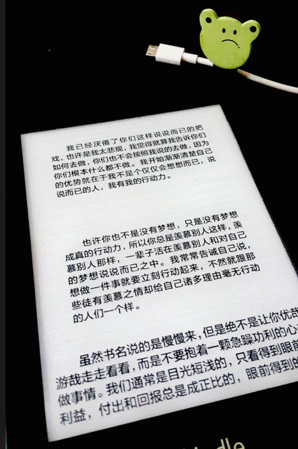
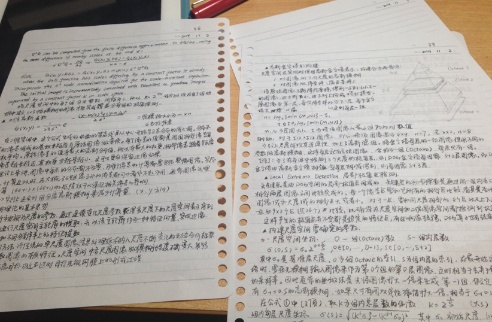

# 精神极简之道

知道自己要什么已属不易，倘若想要再进一步，分辨出自己不想要什么，则更需要用时间和经验细细打磨，方能窥见初心。而这正是极简主义者的生活态度：用极度削减的方式，将注意力集中在为数不多的事物上；这种模式令人心绪平静，感官敏锐。我们活得太累，工作学习生活中往往身不由己，日复一日的打卡生活也让人看不到希望，倘若你也有这样的困扰，不妨来看看我的精神极简之道。

大部分人不快乐的根源，在于没有自己的生活，没有自己的精神。每天24个小时，除去睡觉的时间，有多少时间是留给自己，而不是留给工作留给学习留给涌入的信息的？答案恐怕不容乐观。

人来人往，熙熙攘攘，七嘴八舌，嬉笑怒骂，周而复始。上一次倾听自己内心的声音是什么时候？上一次安静独处是什么时候？上一次专心致志全情投入是什么时候？上一次由衷为自己高兴自豪是什么时候？还记得起来吗？

无论现在你的答案是什么，都可以做点什么，走上精神极简之路：

1. 不盲目浪费自己的时间与精力，找一两项真正想做的精神活动，去探索去深究。
2. 减少社交网络的输入，不要想着取悦所有人，该屏蔽的屏蔽，真正去处真正的朋友，而不是泛泛之交。
3. 工作学习的时候远离手机，专心致志。
4. 大部分新闻都和自己没有太大的关系，不是从事相关专业的，完全可以不看新闻。
5. 少关注些名人和哗众取宠的话题，宁缺毋滥。
6. 极简手机与电脑应用(参考前面的几篇文章)

可能这些方法都不够具体，所以列出来我的一些习惯，供大家参考，没有太多逻辑，想到哪里是哪里，见谅：

1. 早起一些，看看禅修的书或者练练字，都是很好的开始一天的方式。
2. 规律运动很重要，生理的安定更容易带来精神安定。
3. 可能的话，多把自己的想法写下来，不断打磨
4. 定期收拾生活环境，只留下常用的，住得简单些

精神极简的努力充分印证了少就是多这个道理，尝试一下，也许就会爱上这种感觉，继而像我一样，走上极简主义者之路。
