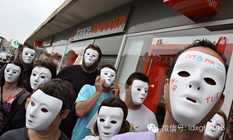
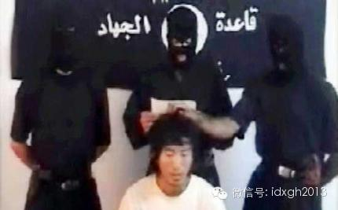
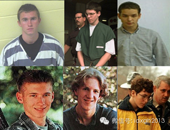
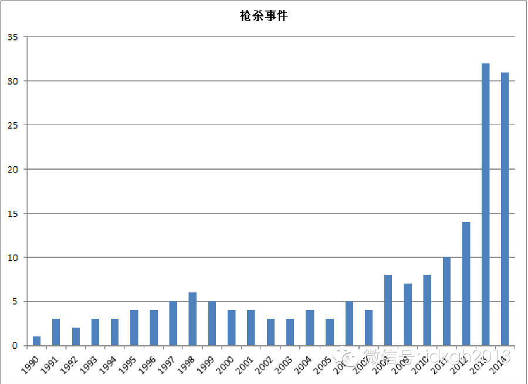

**2014年7月15日晚，广州市一辆公交车发生爆炸起火，造成2人死亡，32人受伤。这已是2014年发生的第4起纵火案。为何公交车纵火案频发？**

**  
**

文/陈铭  

  

近年来，中国出现了连续的公交车纵火爆炸案、医院杀医案、幼儿园屠童案，在国外一些研究看来，某类暴力恐怖事件频发，是典型的犯罪跟风效应——大众媒介在传播报道事件
时，无意中为潜在的犯罪者提供了模仿对象，并抑制了其内心对暴力的抵御。  

  

不过，此说一直备受争议。但某些类型的暴力案件（劫持、绑架和炸弹）极度高发，且并非随机分布，常常是在时间轴上以团簇聚集，这说明一定时间内，大众传播会提高相应的
发案频率——虽然它不会导致暴力总量的增长。

  

特定组织内的自杀现象，或许可以侧面证明大众传播与特定行为的模仿关系。

  

2010年，富士康连续有14名员工跳楼，它由此背上了“血汗工厂”骂名；这一年，美国康奈尔大学也因6人连续自杀备受困扰；富士康自杀潮的前一年，华为公司同样出现
了自杀潮。自杀传染性表现最强烈的当属法国电信，2008年有24人自杀。

  

法国电信员工对该公司发生的系列自杀事件表示不满

  

自杀发生率最高的地方是军队。据俄罗斯军方统计，美国占领伊拉克期间，俄军自杀人数远高于同期美军阵亡人数，不过，统计表明，并不讳言军中自杀现象的美、俄等国军队，
自杀现象更像是随机分布，而无团簇聚集的特征。它有别于前述组织最大的特征，就是军队的封闭性，军人自杀一般很难被大众传播详细报道，这无意中阻断了模仿的链条。

  

**【犯罪学习教材】**  

**  
**

研究者们认为，对大众传播中的暴力事件最敏感也最善于模仿的是政治暴力，即基于政治原因针对政府或国有组织的有计划恐怖行为——1960年代巴勒斯坦恐怖分子劫持民航
飞机后，迅速引来其他恐怖组织效法。挟持飞机乘客变成一种模型，并扩散成一波潮流，直到1970年代公共交通的安全管制升级之后为止。

  

接下来，袭击大使馆又占据主流。一项对1970年代大使馆袭击事件的研究表明，该类型的恐怖行为同样具有传播性。近期出现簇集现象的恐怖行为是人质斩首，它造成的震撼
与影响要远大于前两者。911事件之后，自杀式爆炸袭击也开始流行。

  

2004年日本人质香田证生被伊拉克武装分子斩首

  

前面谈到的自杀现象也是如此。日本富士山下的青木原森林，是一片被梦幻化的自杀圣地，每年有几十人自杀于此。在“请珍惜生命”的告语贴出来后，自杀人数不减反增——它
事实上起到了吸引自杀者的作用。明星的自杀常常也常常导致跟风者以相同的方式自杀。

  

一个成型的方法是造成跟风效应的主要原因之一。

  

青木原森林标语

  

有组织的恐怖分子通常更注重犯罪的成功率，而恐怖行为事发后，详细新闻报道间接提供了有效教材，他们可从中选取最优方案，或通过失败案例完善其技术手段，出现跟风效应
也就不足为奇。  

  

与恐怖组织不同，对于个人自发产生的模仿行为，成因更复杂，更带有个人情绪所以新闻除了提供方法上的启发，在情绪上也常常强烈影响了模仿者。

  

1971年，一个名叫丹•库伯的人在手提箱里装了炸弹，劫持了一架从波兰到西雅图的飞机。他获得20万美元赎金和两个降落伞后，从拉斯维加斯低空上跳下飞机后消失。库
伯在当时的报道中被奉为“邪典英雄”，它无意中启发了许多蠢蠢欲动的罪犯，短时间内出现了几十起类似劫机事件。  

  

此类恐怖事件的影响是显性的，对成功犯罪者的崇拜感会刺激脑内杏仁核（位于脑垂体后）分泌引发激进情绪的激素，并刺激肾上腺素的分泌，抑制同样位于杏仁核内恐惧激素的
分泌。当然部分犯罪分子从中学到靠谱的跑路方法，也是主要模仿因素之一。

  

**【卢凯迪斯和他的模仿者】**  

**  
**

有种案例是隐性而无法阻断的，从1996年到今天像流感一样持续席卷西方各国，这就是校园枪击案。  

  

校园枪击案频发在公民可持枪的美国。1979年就有了现代意义第一起被广泛报道的校园枪击案。一名16岁女孩在当年1月份的某星期一，
20分钟内射杀了校长、门卫，并伤了9名6-12岁的小学生和几名老师。投降后她告诉媒体和警察，她仅仅是讨厌星期一而已。

  

这很容易让人想到**《为什么有人天生残忍》（点击最下方“阅读原文”调取）**中提到的“因镜像神经元失能导致共情能力的缺失，也就是无法感受到受害者的痛苦，于是
把杀人当成一件非常平常的事。”跟风效应也大多起源于这样的暴力事件实施者。

  

此后只出现零星的类似枪击案，且都不像“典型”案例。直到1996年，一起枪击案几乎成了接下来所有校园枪击案的模板。  

  

1996年2月，华盛顿州，一名14岁的少年巴里•卢凯迪斯带着他父亲的猎枪和两把手枪，一身黑色风衣，走进了他就读的中学——卢凯迪斯的形象和装扮深受小说《愤怒》
、电影《天生杀人狂》和《荒野大镖客》的影响。

  

在数学课上，他先杀了两名邻座的同学，并重伤了另一名，然后开枪射杀了讲台前的数学老师。在余下15名歇斯底里哭喊的学生面前，他说出了这句话：“This sure
beats algebra, doesn't it?”恰恰来自斯蒂芬•金的小说《Rage》。最后他被冲进来的体育老师制服。

  

法庭上的巴里•卢凯迪斯

  

这起枪击案的特殊之处在于，它包含了角色扮演心理（即模仿文学、影视、漫画、游戏中的角色）要素。研究显示，一个人装扮成模仿对象时，会出现性格和行为偏离。卢凯迪斯
正是将自己带入扮演的角色中，他在淡化自我意识的同时，不但情绪激昂并抑制了恐惧。  

  

事后官方的调查研究表明，卢凯迪斯是个缺乏共情能力的人，他曾劝离异的母亲用暴力方式报复父亲，并让她把感受写下来。

  

一周后，加州又发生一起枪击案。16岁的男生道格拉斯•布拉德利用左轮手枪伤了三名学生，随后开枪自杀。1997年2月，16岁的埃文•拉姆齐向两名14岁的伙伴透露
了自杀倾向，两名伙伴建议他“带几个人走”，随即拉姆齐杀了校长和一名学生，后被警方制服。

  

卢凯迪斯在美国触发了一系列枪击案，大部分是模仿式的校园枪击案，它甚至蔓延到欧洲一些枪支管制的国家。

  

这些枪击案的跟风不仅体现在手段上，很多跟风者都与卢凯迪斯有年龄、家庭背景甚至相貌的相似性：生于中产阶级的年轻白人男生，带着雀斑，一副邻家男孩的样子，装备精良
、计划详细，无明显精神病症状。

  

由于少年枪手的形象与他们的行为反差甚远，媒体通常会详细描述他们的一切，对那些各方面都与卢凯迪斯极为相似潜在的模仿者来说，这些报道无意中激发了他们对枪手的强烈
带入感。

  

典型校园枪击案例中的实施者，其身份背景和相貌特征体现出相似性

  

在2001—2002年，美国校园突然沉寂下来。研究者认为，这或许是由于911事件吸引了太多媒体关注，校园枪击因此也失去了新闻触发因素，直到2002年后才重新
开始。而2010年后，校园枪击案事件频率增大——互联网社交媒体的崛起，使大众传播的速度更快，并且案件的细节也更详尽细致。

  

美国校园枪击案分析

  

**【跟风效应中媒体的责任与伦理】**

  

中国的公交车纵火案，校园杀幼童案的犯案者也具有身份的相似性，即多为无根的社会底层人物。但他们与国外校园枪击案或其他犯罪制造者有一个极大的不同，即他们生活原本
就面临巨大压力，其身份处境较容易积累反社会情绪。

  

而中国社会的阶层高度分化和观念的高度极化，使得新闻媒体本能地受人文关怀动机驱动，倾向于细致描写犯案者的生存状况，以警醒社会正在不断积累的恶意，但对具有强烈反
社会情绪且有相似背景的人来说，它很容易构成一种无意识的启发。

  

有一点值得注意，个人犯罪的跟风效应往往是无差别杀人的恐怖行为。这些犯案者具备犯罪条件，却往往不具有目标人选，而大众传播中报复社会的案例，无意中帮他们“找”到
了一个发泄的目标。

  

不过，对那些跟风实施反社会暴力行为的人来说，他们在获得启发时，往往已处于最后的临界点，只是无法确定手段和对象——广州公交车爆炸燃烧案的实施者此前已有过多次不
成功犯罪。这也是为什么跟风的反社会暴力在高频出现后又突然沉寂的原因。

  

媒体这个大众传播中最重要的节点在跟风效应中应负何种责任，国外一直争论不休。有人认为，大众传播是跟风现象重要推动者。但反对者则指出，即使没有媒体播报，那些原本
拥有犯罪倾向的人同样会寻找各种方式来实施犯罪。

  

1972年库布里克取消描述青少年暴力犯罪的电影《发条橙》在英国的发行，因为电影上映后出现了一系列模仿片中暴力场景的青少年犯罪。

  

媒体必须报道事实的另一个伦理原则是：公众有知情权，以便自行判断周围的环境是否安全。这是最高原则。校园枪击案和社会不稳定因素造成的报复行为，在不同社会有明显不
同的发生频率。  

  

不过，如何减少报道中无意诱发跟风效应，已作为技术进入欧美国家的新闻伦理，并不断完善，而相关技术部门的影响同样功不可没，譬如1994年美国疾控中心为减少跟风性
自杀，曾向媒体提出建议，后来被用于其他跟风性暴力活动。

  

这里列举几条：1.媒体需要注意用词的倾向，减少对相应事件导致死亡的荣誉感或神圣感；2.减少对实施者特别倾向特征的描述，比如“邻家男孩”“社会底层”，以减少共
情感；3.需要注意避免对地方或种族的刻板印象；4.媒体应该在报道后提供类似情况的帮助建议。

  

或许，中国需要借鉴美国经验的远非新闻媒体。幼儿园屠童案连续发生后，一些地方的幼儿园、小学立即加强戒备，甚至增派警力，但风头过后随即如常，医院杀医案频发，有些
医院突然增派安保力量，今天有些地方公交车甚至不许带打火机和粉末、液体包装上车，对反社会者犯罪者来说，这或许是他们根本想象不到的震撼性效果。

  

> 版权声明：  
大象公会所有文章均为原创，版权归大象公会所有。如希望转载，请事前联系我们： bd@idaxiang.org

大象公会：知识、见识、见闻

微信：idxgh2013

微博：@大象公会

投稿：letters@idaxiang.org

商务合作：bd@idaxiang.org

[阅读原文](http://mp.weixin.qq.com/s?__biz=MjM5NzQwNjcyMQ==&mid=203645574&idx=1&sn
=d02541781add1519a3bcd9e907cd1654&scene=0#rd)

