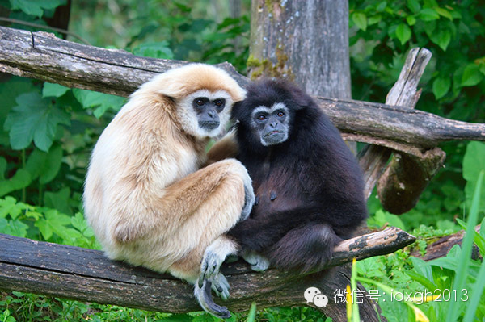
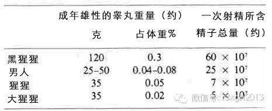
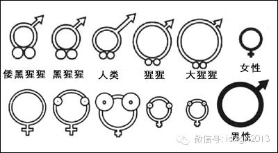
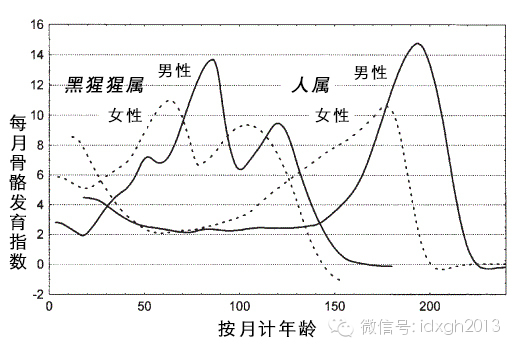

**尽管多数人类会结成单偶制家庭，但无论在生理还是心理上，配偶关系都未必和谐。两性关系的纠结冲突，源自人类的两难境地。**

**  **

文/辉格

  

婚姻的历史或许和现代智人的历史一样漫长，甚至更漫长，多数人在成年后都会寻找配偶并建立一夫一妻的家庭。正统道德观念也总是将婚姻描绘成忠贞恩爱的和谐互助关系，在
西方基督教价值观所引领的现代化过程中，单偶制婚姻更获得了伦理上的优势，其他婚姻形式日益被视为遗风陋俗。

  

但另一方面，人们也都心知肚明，夫妻关系充满了纷争、欺瞒、压制和背叛，在各大文明中，这些冲突也都是闲聊、戏剧和文学中永恒的热门主题；其实，一种道德规范若总是被
挂在嘴边，成为表彰和说教的内容，这一事实本身就表明，它被遵守得不太好。

  

在现代社会，大概有1/4的婚内人士曾经出轨，各种出于医学目的的基因调查，常发现比例惊人（有时高达两位数百分比）的亲子关系并不像被调查者所认为的那么真实，总的
说来，那些对亲子关系信心十足的父亲，大约有2-3%的机会是喜当爹了，而那些心存疑虑的，他们的怀疑则有1/4的几率可以得到证实。

  

实际上，在我们的灵长类近亲中，长臂猿才是恩爱忠贞的典范，它们以单偶制核心家庭为单位分割领地，婚姻一旦达成便终身不渝，子女成年后即被逐出领地，每个家庭都在各自
领地孤立谋生，猿啼相闻而老死不相往来，因此夫妻也很少有出轨机会。

  

_忠贞恩爱的长臂猿夫妻_

  

反观人类，尽管多数也会结成单偶制家庭，但无论在生理还是心理上，却处处暴露出配偶关系的不和谐：与固定配偶的长臂猿和大猩猩相比，男人的睾丸（相对于体重）很大，更
接近乱交的黑猩猩和倭黑猩猩，这显示他们因配偶出轨而面临的精子战争强度颇高，因而需要更发达的睾丸来制造更多的精子。

  

_人科动物睾丸重量对照表。__数据显示黑猩猩的精子竞争最为激烈，而大猩猩的精子竞争最不激烈。这与实地记录的交配行为相符。精液样本通过电流刺激采集而得。_

  

男女的性嫉妒都很强烈，对配偶出轨的线索也非常敏感，这说明配偶出轨是常见而重大的风险，因而需要特别加以警惕；不过嫉妒内容男女有所不同，男人最怕戴绿帽喜当爹，女
人则最怕丈夫背弃养家和保护妻儿的承诺，将资源用到其他女人身上。

  

男人的硕大阴茎（在灵长类中最粗最长且遥遥领先）也是个不和谐信号：这或许暗示了他们（至少在进化史的某个阶段）经常以强制性手段获得交配机会，因为在雌性不配合的情
况下，较长的阴茎有利于交配成功（以强奸惯犯出名的鸭子便有着一条和身体差不多长的阴茎），而阴茎的粗大则有利精子战争——可以更有效的将其他男性的精子泵吸出去。

  

_人科动物阴茎、睾丸尺寸与体型关系示意图_

  

两性关系的纠结冲突，源自人类所面临的两难境地：抚养和保护子女的任务，要求他们结成以单偶制为主的长期配偶关系，但同时，他们又是群居且高度社会化的动物，其社会结
构十分不利于配偶关系的稳定，这一两难所带来的纠结困境，至今仍是两性关系的背景主题。

  

【雌性的投资策略】

  

要说清楚这个问题，需要回到养育后代——人类作为生物的核心任务上来，这要求采取进化生物学的视角；当然，进化论和遗传收益不能解释一切，但作为一个思考的起点，它带
来的启示是其他学科所无法比拟的。

  

生物学家将繁殖后代的努力视为一项投资，其回报是可见未来的后代数量，提高回报的基本途径有三条：1）繁殖尽可能多的后代，2）提高每个后代的存活至繁殖年龄的机会，
3）帮助每个后代获得最佳的繁殖机会。

  

对三条途径的不同侧重，构成了投资策略的两种倾向：偏重第一条途径的数量策略和偏重后两条途径的质量策略；实际的策略选择是两种倾向的权衡，权衡结果将由个体所面临的
边际投资收益曲线决定，即，分别投入各途径的最后一份资源的收益相等。

  

这里存在一个自反馈效应，早先的选择会改变后续选择的边际收益曲线，结果将导致策略倾向的两极分化；最初的分化发生配子大小上：雄性制造数量多、体积小、包含营养物质
少的精子，雌性制造数量少、体积大、营养物质多的卵子——这已成了生物学家区分雌雄的标准。

  

在从鱼类向哺乳动物的进化谱系上，雌性的投资策略朝质量优先的方向上越走越远（注：该谱系只是整个进化树的一小部分，所以并不能说这是进化的普遍倾向）；体外受精的水
生动物常常产下极大数量的卵，然后听任其自生自灭，其全部投资仅在于卵内营养。

  

爬行类的卵更大，通常还有钙质硬壳加以保护，但和鸟类和哺乳类相比，其策略仍是极端偏向于数量的，一窝海龟蛋有上百个，但仅仅在新生幼龟集体冲向大海的那段危险旅程中
，就要被吃掉90%，如果冲锋发生在白天，死亡率更高达99%，平均每四千个海龟蛋里只有一个能变成成年海龟。

  

_新孵化海龟奔向大海的生死大冲锋_

  

相比之下，鸟类不仅花几周时间孵蛋，还要将幼雏喂养到羽翼丰满为止；哺乳类则更进一步，把幼崽留在体内养育和保护，有蹄类一直等到幼崽能独立行动才让它脱离母体，接着
还要经历漫长的哺乳期，许多食肉类还会帮助子女学习捕猎技能；长臂猿还会协助新近自立门户的子女建立自己的领地。

  

日益高涨的投资需求，让雌性不堪重负，不得不寻求雄性的合作，而雄性也逐渐“认识到”，在新的条件下，单纯追求数量的策略越来越不合算，缺乏养护的后代即便能存活下来
，也极少能获得繁殖机会。

  

【男性的供养能力】

  

对于人类，最初让两性合作变得不可或缺的，是这样几个大幅加重抚养负担的因素。

  

首先，人类有一颗硕大的头颅，脑容量三倍于黑猩猩，这给分娩带来了困难，为适应直立行走而改造的骨盆更加剧了这一困难，进化为此找到的解决方案是提前分娩，可以说每个
人类婴儿都是早产儿，格外脆弱因而需要更多保护和照顾。

  

_人类与黑猩猩骨骼发育曲线对比_

  

其次，复杂的语言和社会关系，使得人类儿童需要学习的知识和技能远远多于其他动物，为此人类延长了发育期，在大约七岁到青春期之间（相当于小学阶段），多出了一段漫长
的身体发育平台期，这自然又加重了抚养孩子的负担。

  

第三个因素更加致命，让女性几乎丧失了独立抚养孩子的希望：杀婴；在存在配偶关系因而亲子关系可以确定，但这种关系又经常发生变动，同时雄性在体能上处于压倒性优势的
条件下，就可能出现杀婴，非洲狮便是一例，不幸的是，人类恰好也同时满足了这三个条件。

  

通过杀死前任留下的孩子，新上位的雄性不仅消灭了若干潜在竞争对手，也可让他们的母亲结束哺乳并尽快怀上他的孩子（因为哺乳期通常是不孕的）；但这一结果对女性是灾难
性的，促使她们寻求忠实可靠的长期配偶，设法让丈夫留在身边共同保护孩子。

  

正是在孩子抚养问题上的共同利益，让男性和女性结成了婚姻这一古老的神圣同盟，并通过家庭这一合伙企业，将质量投资策略推向了极致：除了漫长的教育期，我们对子女的帮
助延伸到了成年期甚至第三代：为他们准备彩礼和嫁妆，帮助他们带孩子，将社会地位和关系资源传给他们，最后还留给他们遗产。

  

然而，神圣同盟并不和谐，因为我们的社会结构与固定配偶关系存在着根本冲突；固定配偶只有在夫妻的边际投资收益相当时才能维持，妻子的边际收益受其生育数限制（原始条
件下很少超过十胎），假如一个丈夫的供养能力也在此限度内，婚姻便可稳定，对多数男性，这一条件是成立的，否则人类就不会有婚姻了。

  

问题是人类社会存在团队合作和等级结构，使得男性供养能力脱离了个人能力的限度，变得高度差异化且变动不居，权力和财富可以让男人能够供养的孩子数远远超出妻子的生育
能力，此时假如他被束缚在婚姻之内，就只能被迫将全部资源用于提升现有孩子的抚养质量，而这很可能不如另外娶妻多生几个孩子合算。

  

如果供养能力的不对称是稳定的，那也没问题，只须将单妻关系换成恰当比例的多妻（或多夫）关系即可，问题是，男性的地位、权力和财富并不是在婚姻缔结之初就确定并且恒
定不变的，在生活竞技场上，个人境遇随时可能发生巨大变化，这就要求他们采取更为灵活多变的策略。

  

实际上，人类社会的复杂性，迫使男女双方都采用了可变的组合式策略，同时也诱使他们采取各种机会主义行动，在婚姻之外，双方都备有相机行事的候选预案，以便最大程度保
护自己的遗传利益，在下一篇文章《微妙的人类性策略》中，我会对这些策略做详细介绍。

**[大象公会所有文章均为原创，版权归大象公会所有。如希望转载，请事前联系我们：bd@idaxiang.org ]**

** **

[阅读原文](http://mp.weixin.qq.com/s?__biz=MjM5NzQwNjcyMQ==&mid=200913345&idx=1&sn
=234ab8bb91355051c49203a41e1f1892&scene=1#rd)

