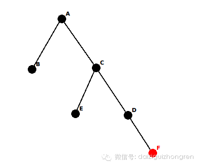
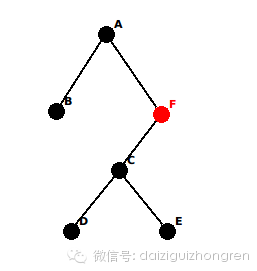
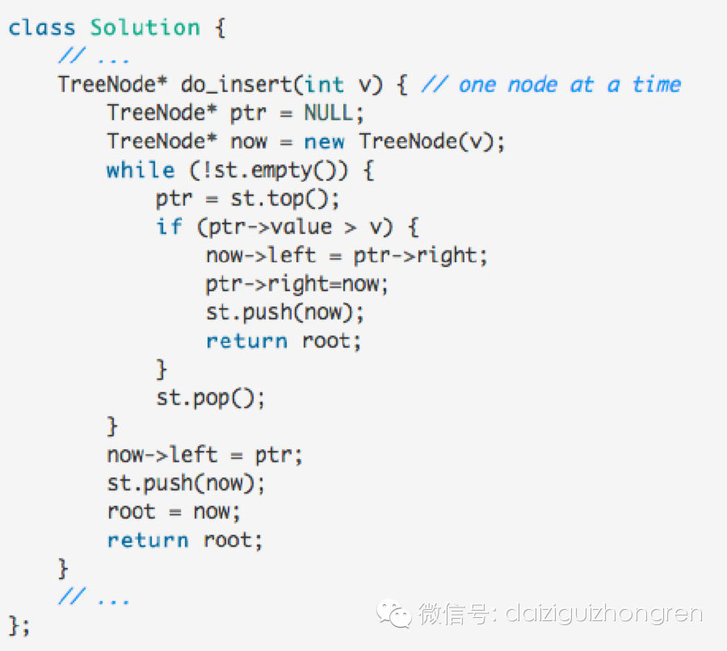
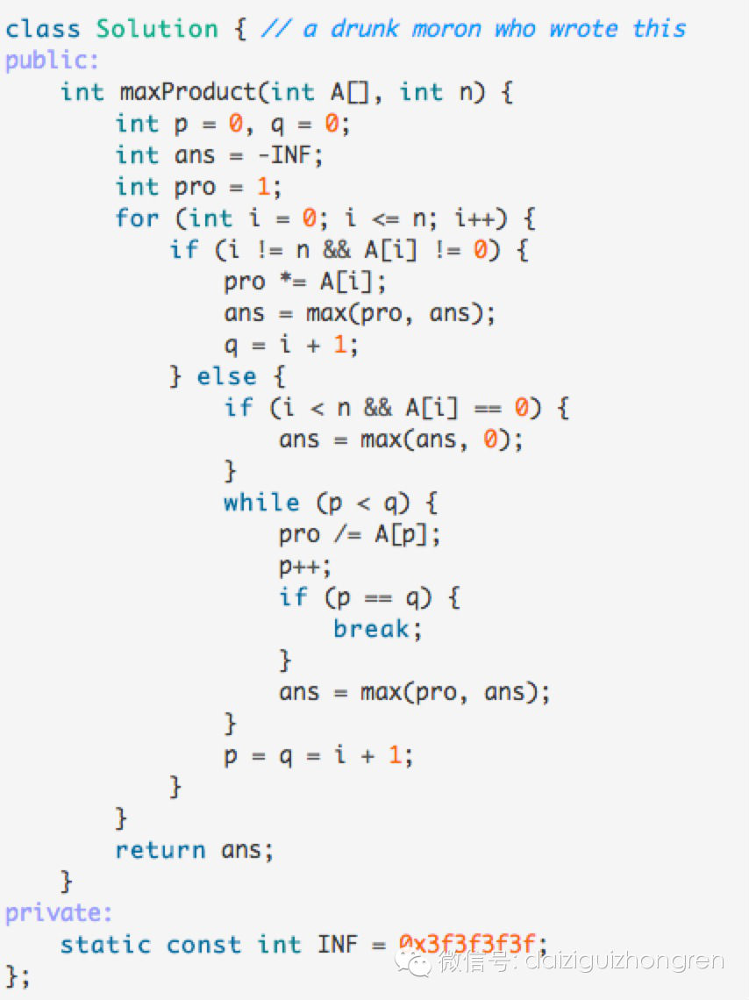
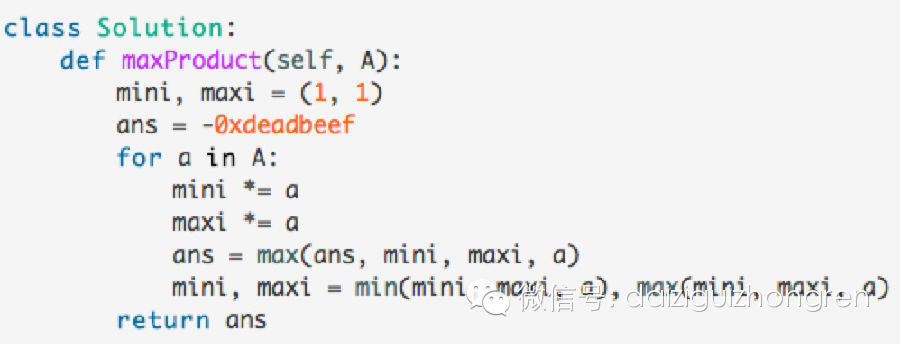

### _**题意**_

给你一个包含整数1…n的集合S。接下来进行n-1次操作，每次操作从集合S中选取两个数，在加、减、乘三种运算中选取一种，将结果放回再集合S。在n-
1次操作完成后，集合S中只剩下一个数。求问一种取数和运算策略，使最后的结果为24。

举例：

S = [1, 2, 3, 4, 5]

我们选取(2, 5)，并进行加法运算，获得结果7。再将7放回集合S中。

此时，S = [1, 3, 4, 7]。

### _**数据范围**_

1 <= n <= 100000

  

### _**解答**_

> 建议：请思考10分钟后再来看答案

我们日常写代码，往往是为了实现一个功能或者实现一套逻辑。这时候，我们做的事一般是从零开始，然后逐步迭代，最终实现目标。

这是正常的一种思维方式，也是不错的思维。但是，在我们做题时，按部就班的思路往往会束缚我们的想法。我经常自黑说：**“做什么题都像做模拟题”**，实际上就是这
样一个道理。

对于此题，如果我们从零开始思考，必然会遇到“第一次选哪两个数”、“第二次选哪两个数”这样的问题，而解决这种问题的方式大多只能有暴力搜索一种方式。而根据这题的
数据规模，暴力搜索在时间和空间上都是不可能的。

当然，也有的同学善于逆向思维，但是，同样也会进入暴力搜索的死路中。

那么这题如何思考呢？ 我们不妨试试归纳法。

假设`n = k`，并且有`f(k)`，使得`f(k)=>24`。那么，易得，对于`f(k + 2)=>f(k) * ((k + 2) - (k +
1))=>24`。

此时，我们只需要找到`f(k)=>24`，就可以证明所有`f(k + 2x) => 24`。聪明的同学们必然可以手动算出`f(4) =
24`的过程，这可以证明对于所有`k >= 4`的偶数，总有`f(k) => 24`。

`f(5) => 24`略微复杂一点，但是也不在话下。这样我们的结论已经扩展到了`k >= 4`的所有整数。

又由于在`k = [1, 2, 3]`时，`f(k)`必须不能推出24。我们的结论已经推广到了所有正整数。此题得证。

## _**归纳法**_

在Udi Manber的_Introdcution to Algorithms - A creative
approach_一书中，在第二章就对数学归纳法进行了大篇幅的的讲解。而在一般的算法书中，这个位置往往是给了算法分析。

归纳法是一种“非常有力的证明方法”，可以提供一种想问题的方法，同时可以证明算法的正确性。

归纳法的基本过程如下：

> Let T be a theorem we want to prove.

>

> Suppose that T includes a parameter n whose value can be any natural number.

>

> Instead of proving directly that T holds for all values of n, we prove the
following two conditions:

>

>   1. T holds for n = 1

>

>   2. For every n > 1, if T holds for n - 1, then T holds for n

## _**归纳法应用 —— 笛卡尔树**_

> 已知一个最大堆的中序遍历序里，要求恢复该最大堆。

或者用另外一种方法来表示，

> 给定一个数组，求一个二叉树，这个二叉树的父节点总比子节点要大，并且这棵树的中序遍历与原数组相同

如果我们从build from scratch的角度来思考这个问题，那么得出来的结论一定是O(n^2)的 ——
每次找到（子）数组的最大值，然后partition这个数组，直到构造出整棵树。

### _**换一种思考方式**_

我们尝试用归纳法的思维去考虑这道题。假设我们已经有一棵树，这棵树满足上面所说的条件，且这棵树展开后为数组的前k项。

此时，我们想要插入第k+1项，有以下几种情况。

  1. `A[k+1] <= A[k]`，此时第k+1项会成为到第k项的右儿子，这样树展开时，第k项和第k+1项必然相联，并且也满足父节点必须比子节点大的条件。

  2. `A[k+1] > A[k]`，第k+1项必然会成为第k项的左儿子。但是我们还需要考虑，第k项的父节点比第k+1项小的情况。经过思考，我们不难发现，第k+1项的左儿子t，一定是第k项祖先节点中小于第k+1项的最大值。而第k+1项则替换掉节点t的位置。

  

情况一示意图：

情况二示意图：

由此一来，原本看起来复杂的思路一下子变的简单。我们可以把一个复杂的问题化归到重复的子问题上来。这样我们只需要每次解决一个问题了。

关键代码如下：

  

  

## **_课后习题 - 最大子段乘积_**

这是Leetcode新加的一题，在昨天吃撑了喝醉了的情况下，勉强AC，今天看来，自己还是too young too simple啊。

> 给你一个int数组，求这个int数组的最大子段乘积。（不需要考虑溢出）

### **_从零开始的想法_**

最大子段乘积必然是一段不含有0的子段。所以我们可以把子段分割为k段，每一段都不包含0。

对于每一个子段，要满足两个条件，一是尽量为正，二是尽量包含更多的数。

所以对于子段A[l…r]，最大乘积只能为A[m…r]或A[l…m]两种情况。所以我们维护两个指针，就可以求得最后的结果了。

不过。。。等下。。。这真特么twisted啊。。。_(:з」∠)_

  

### **_用归纳法解决这个问题_**

让我们做一个假设，对于A[k]来说，我们已知`mini = min(A[i...k])`和`maxi = max(A[i...k])`。mini和maxi是
以k结尾的子段中，乘积绝对值最大的负数/正数。所以无论乘一个负数还是一个正数，maxi和mini的值只会是`maxi * a`和`mini * a`。

那么，对于第k+1项来说，以第k+1项结尾的最大子序列必为`max(mini * A[k+1], maxi * A[k+1],
A[k+1])`(mini和maxi可能为0)。

同时，我们继续维护mini和maxi两个值。此时，我们就有了一个循环的子问题。代码也就在我们的笔下了。

  

  

【分析完毕】

阅读原文 举报

[阅读原文](http://mp.weixin.qq.com/s?__biz=MjM5ODIzNDQ3Mw==&mid=200458211&idx=1&sn
=8ae4a9a51788a605c4094fab570100bc&scene=0#rd)

