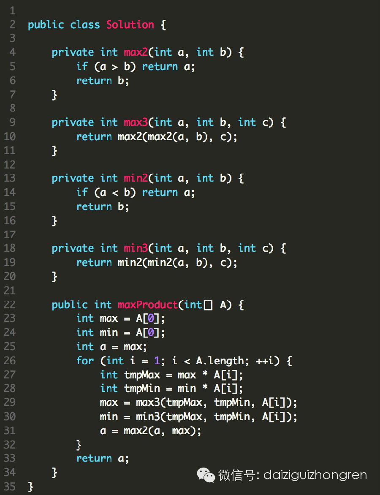

#### 题目

给定一个数组，至少有一个元素。请计算子数组最大乘积是多少？

例如：

>   * 给定数组 [2, 3, -2, 4]

>

>   * 经过计算，得到最大乘积为6。子数组为[2,3]。

题目来自Leetcode。

#### 分析

这个题目，有经验的同学，看过一遍，就知道肯定是动态规划了，可具体要如何规划呢？我想，有的同学还记得子数组的最大和吧？是不是觉得很激动，O(n)就可以解决了。
一样的思路！但是不好意思，错了！

错在哪里呢？乘法口诀还记得么？负负得正，就可恶在这里。在加法里，负负可得不到正。

那这个题目怎么办？O(n^2)么？是否要计算保存之前的所有状态？不必如此，其实就多了数组中的元素为负情况的考虑。因为负负得正，我们除了考虑当前的最大值之外，
还需要考虑当前的最小值。

原因是，如果最小值是负的，而且当前是负的，那么乘积之后是正数，很可能就大于当前最大的。

所以遍历一遍，计算以每个元素结尾的最大值最小值，最后找到全局的最大值。就是我们要的结果了。

粗糙、直白的代码如下：

  

【分析完毕】

阅读

__ 举报

[阅读原文](http://mp.weixin.qq.com/s?__biz=MjM5ODIzNDQ3Mw==&mid=200559586&idx=1&sn
=7d7e7ed20f92e437d0924403e8ac2a37&scene=0#rd)

