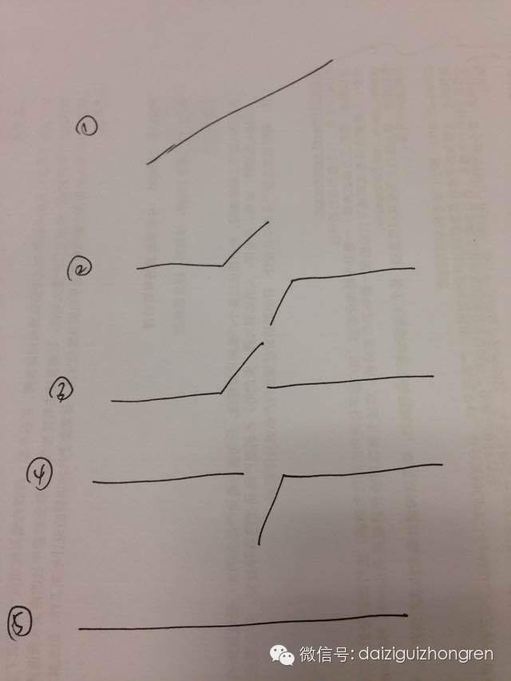
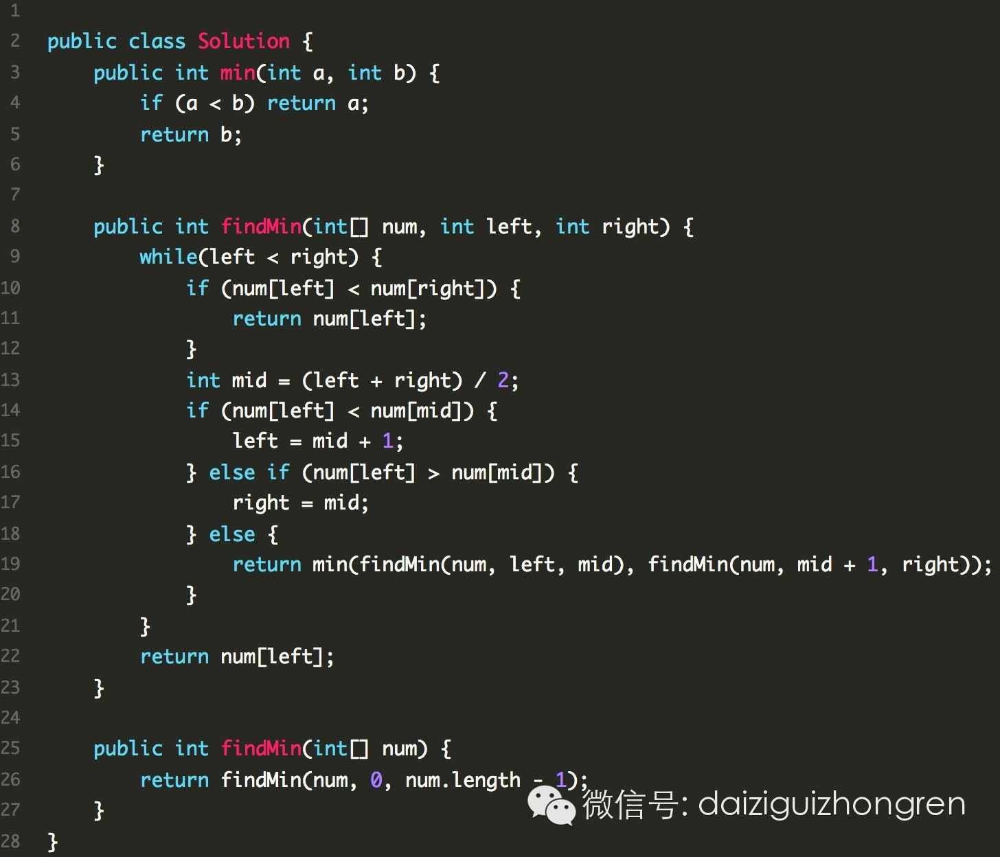

### 旋转数组最小值II

### 题目

一个有序的数组，在从某一个位置开始，旋转到数组的另一端

举例：

0 1 2 3 4 5 6 -> 4 5 6 0 1 2 3

在这个变换之后的数组中，找到最小值。

#### 注意：

  * 有可能不旋转的哦。

  * 数组元素有重复

#### 题目来自Leetcode: Find Minimum in Rotated Sorted Array II

### 分析

之前分析过没有重复的情况，最主要的有两点：

  1. 考虑完全思路

  2. 找好切入点

其实这两点是相关的，一个好的切入点，有利于覆盖完全的思路。这里的切入点可能有，用left，right，mid表示数组的左右中索引：

  1. left和mid的数组值关系

  2. left和right的数组值关系

right和mid是一样的，那个入手好呢？见下图

手绘，忍着看

left和right的关系少，而且简单。我们不妨从这个开始判断。

其实Leetcode上有问到，有什么变化？其实变化就在于num[left]==num[mid]==num[right]的时候，需要两边都要考虑，不能只考虑一
边。

对照着上面的图，大家仔细体会。和图一样粗糙的代码如下：

  

【分析完毕】

阅读原文

阅读

__ 举报

[阅读原文](http://mp.weixin.qq.com/s?__biz=MjM5ODIzNDQ3Mw==&mid=200687853&idx=1&sn
=2794f5e5faeb36143076d2a06db6f8dc&scene=0#rd)

