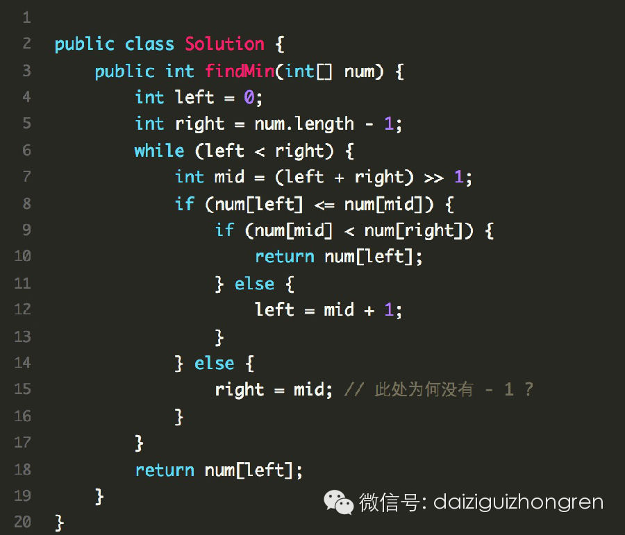

  

### 题目

一个有序的数组，在从某一个位置开始，旋转到数组的另一端

举例：

0 1 2 3 4 5 6 -> 4 5 6 7 0 1 2

在这个变换之后的数组中，找到最小值。注意：有可能不旋转的哦。

#### 题目来自Leetcode: Find Minimum in Rotated Sorted Array

### 分析

这类的题目，应该如何分析呢？首先肯定不是O(n)的解法，那就没意思了。我们注意到，数组是由一个有序数组变换而来的。在一个有序数组中查找某个元素，我们可以有O
(logn)的时间复杂度。

那这个题目呢？是否可以使用二分查找呢？当然是可以的。但这个题目要处理的情况会多一些，这个题目就难在这里，怎么考虑完整各个条件，没有遗漏。二分基本都可以想到，
但是写出正确的代码，不仅仅需要思路，边界条件都要考虑清楚。

我们首先想想，变换之后，都会有哪些情况呢？

  1. 4 5 6 1 2 3

  2. 1 2 3 4 5 6

  3. 2 1

  4. 1

  5. 3 1 2

大家都想到了么？有了以上需要考虑的case，该如何落实到代码逻辑呢？其实，我们使用二分的思路，将每一个例子走一遍，基本就可以得到规律了，关键点就是看二分中间
值和最左边的值，以及最右边值的关系。具体过程，大家自己逐个走一遍。会得到如下的结论。

假设left, right, mid为左右中的数组索引：

  1. 当num[left] < num[mid]，上面的前两个例子会出现这个情况。

    1. 如果num[mid] < num[right]，则直接返回num[left], 就是完全递增的情况

    2. 如果num[mid] > num[right]，则left = mid + 1

  2. 当num[left] = num[mid]，这个在二分的过程中会出现，后面和小于的情况一致。

  3. 当num[left] > num[mid]，上面的后两个例子会出现这个情况。

    1. 如果num[mid] < num[right]，此时在右侧继续二分，right = mid, 注意这里不能 - 1， 考虑 3,1,2这中情况

    2. 如果num[mid] > num[right]， 这种情况是不存在的。

这样的题目，有的时候凭脑袋想，容易乱。不妨在纸上写写，开始的时候会比较多，但写完了再看看，就可以精简。多动动笔，这不是什么丢人的事。反而是一种好习惯。

下面是代码：

  

【纳贤信息】

这是一个创业项目，我们在做一件改变传统行业的事情，这必将会是一场变革。我们在上海办公，创业的方向是“变革招聘行业”。我们需要iOS的程序员，有激情，有很强的
学习能力，和我们一起引领这一场变革。我们在等你：zh.milo@gmail.com

  

  

阅读原文

阅读

__ 举报

[阅读原文](http://mp.weixin.qq.com/s?__biz=MjM5ODIzNDQ3Mw==&mid=200575654&idx=1&sn
=49006a4f9bae6b04a0c420a4da8664e7&scene=0#rd)

