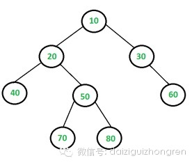

#### **原题**

这个LIS问题，可不是Longest Increasing Subsequence，而是Largest Independent
Set，含义如下：给定一棵二叉树，找到满足如下条件的最大节点集合：集合中的任意两个节点之间，都没有边。如下图：

LIS大小为5，为{10,40,60,70,80}.

  

【思考一下~~~】

  

#### **分析**

这个题目与前几期的题目颇有类似，而且，一个二叉树的问题。通常来讲，树的问题一般都是可以通过递归来解决的。递归是自顶向下的分析问题，分析原问题是否能够分解为子
问题。那么LIS问题呢？我们从LIS集合大小入手，设f(x)为以x为根的数的LIS的大小，根据题目中的定义：

  

  1. 当x不在LIS中时，f(x)=sum(所有儿子节点的f(儿子))

  2. 当x在LIS中的时候，则x的儿子节点肯定不在LIS中，考虑孙子节点，则f(x)=sum(所有孙子节点的f(孙子)) + 1，后面的1是x本身。

  

上面的描述，转换为代码，很简单。但是效率确实很低，是指数级的。而且，上面的递归过程中，子问题重复的比较多。最明显的就是，x的儿子节点x的父节点的孙子节点，几
乎都要重复计算，所以改进空间很大。改进的方法，最直接的就是采用缓存将计算过的子问题，缓存起来，待后面直接使用，很简单，却又是非常实用的。

那么动态规划如何解呢？动态规划是自底向上解决问题，对于上面的递归过程，如何表示x是否在LIS中呢？微博上@曹鹏博士 给出的解法是非常好的:

  

  1. dp[0,1][x]表示以节点x为根的子树不取或取x的结果，第一维取0，表示x不在LIS中，第一维取1，表示x在LIS中；

  2. dp[0][leaf]=0，dp[1][leaf]=value of the leaf

  3. dp[0][x]=max of max dp[t=0,1][y is son of x], dp[1][x]=sum of dp[0][y is son of x] + value of x.

  4. 最后取max(dp[0][root],dp[1][root])

  

这里比较有意思的是第一维来表示第二维的节点，作为根节点，是否在LIS中。上面的过程在，前序或者后序的基础之上进行都可以，原则就是一点，有儿子的，就先计算完儿
子，再计算父节点。

  

【分析完毕】

  

阅读原文 举报

[阅读原文](http://mp.weixin.qq.com/s?__biz=MjM5ODIzNDQ3Mw==&mid=200406422&idx=1&sn
=78a11c72752f2cf5bf7b0142105b50af&scene=0#rd)

