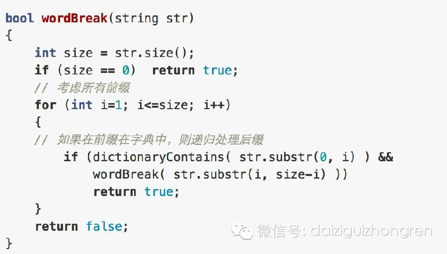
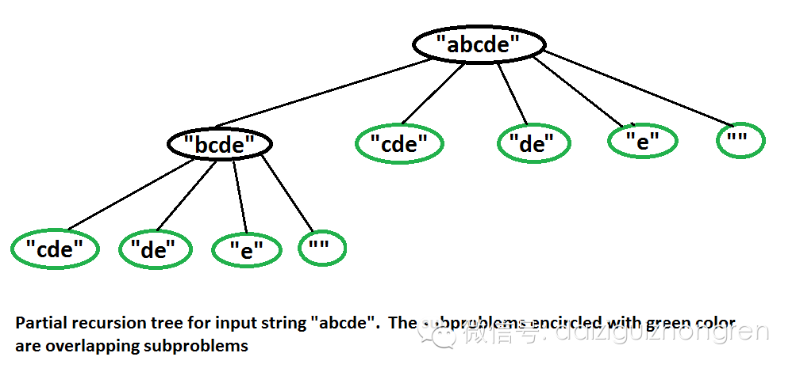
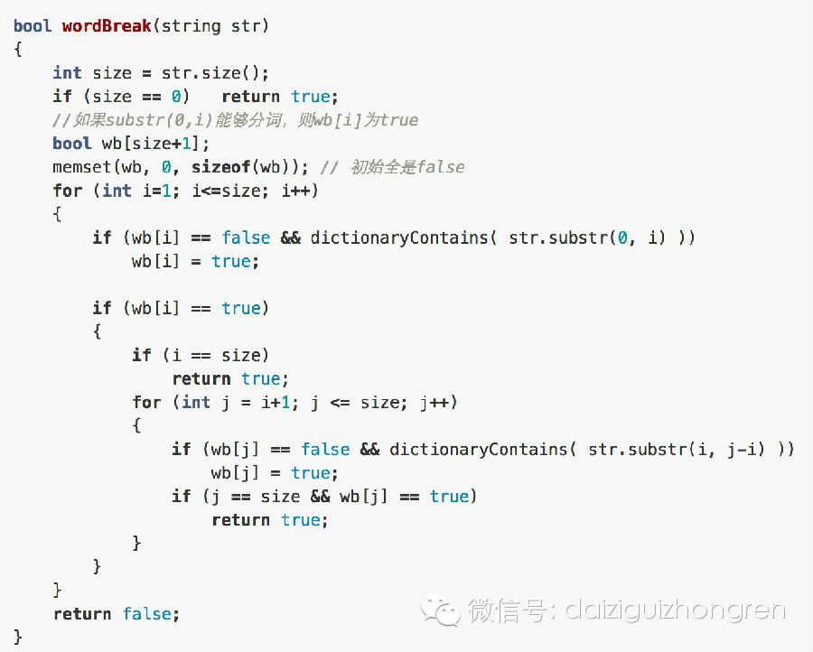

#### **原题**

给定字符串，以及一个字典，判断字符串是否能够拆分为字段中的单词。例如，字段为{hello，world}，字符串为hellohelloworld，则可以拆分为
hello,hello,world，都是字典中的单词。

  

【惯例思考时间~~五分钟~~~】

  

#### **分析**

这个题目唤作“分词问题”，略显宽泛。只是想提及这个问题，这是在自然语言处理，搜索引擎等等领域中，非常基础的一个问题，解决的方法也比较多，相对比较成熟，不过这
仍旧是一个值得进一步探索的问题。那我们先从这个简单的题目入手，看看如何处理题目中这个问题。
最直接的思路就是递归，很简单。我们考虑每一个前缀，是否在字典中？如果在，则递归处理剩下的字串，如果不在；则考虑其他前缀。示例代码如下：

  

在上面的代码中：每一种情况都要处理substr，程序的耗时比较长，如果在OJ上提交，干脆超时的，那么如何改进呢？

  

这个题目的处理，上期的题目是很相似的。在递归子问题中，找重复的

子问题。也非常明显，如下图所示：

  

所以，通过动态规划的方法，可以通过有较大幅度的提升，同样，这个题目与前面的每一个状态都有关系的，所以，是一个二重循环，时间复杂度为O(n^2)。示例代码如下
：

  

  

除此之外，这个问题的方法是非常多的，大家还有什么思路呢？欢迎大家展开思路，在微博上互动讨论。

  

经过上一期的问题，还有这一期的，我想对于这类问题，递归以及动态规划方法的改进，童鞋们应该有比较好的体会了。希望大家能多做写联系，比如在OJ上，熟能生巧，提升
代码功力。

  

【分析完毕】

  

阅读原文 举报

[阅读原文](http://mp.weixin.qq.com/s?__biz=MjM5ODIzNDQ3Mw==&mid=200409620&idx=1&sn
=ef237693da9986e074cac2d4291d4c1c&scene=0#rd)

