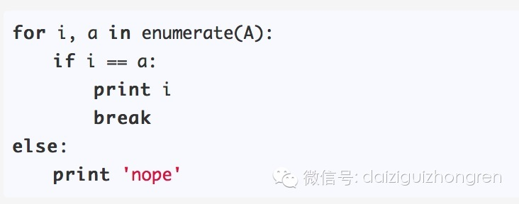
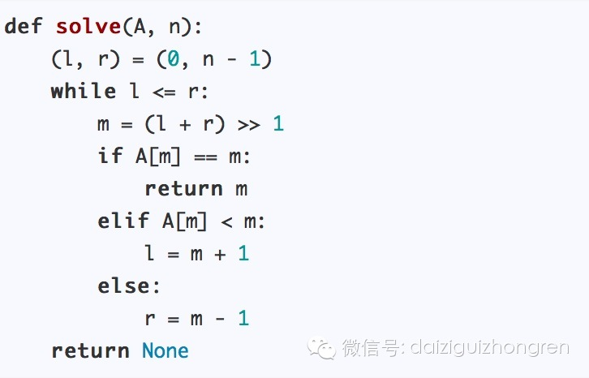

**寻找特殊数字**

**问题**

给定一个**升序**的数组A，让你在数组中找到任意下标x，使得A[x] == x。（数组下标从0开始）

例如：

[-1, 1, 2, 3, 10]中，x = 3即为所求。

  

**解答**

建议：请独立思考至少10分钟

  

最直接的方法，就是扫描整个数组，时间复杂度为O(n)。代码如下：

  

这是一个不错的方法，但是不是最优的。

假设我们有一个数列B，其中B[0] > 0，那么易得，该数组中，必然不会出现所求的“特殊数字”。

同理，如果B[n] < n，那么，在B[0...n]中，也不会有“特殊数字”。

由上面的结论，我们可以在O(1)的时间内判断一个数组是否含有“特殊数字”。

这时，最终的解法就呼之欲出了！

每次操作都可以在O(1)时间内，将问题转化为等价的子问题，且数据规模减少一半。所以一定能在O(logn)次内找到特定的数字。

代码如下：

  

此算法的时间复杂度为O(logn)，空间复杂度为O(1)。

  

分析完毕。

  

  

举报

[阅读原文](http://mp.weixin.qq.com/s?__biz=MjM5ODIzNDQ3Mw==&mid=200506171&idx=1&sn
=303ba6f2bc7a0882e378d987ce89a364&scene=0#rd)

