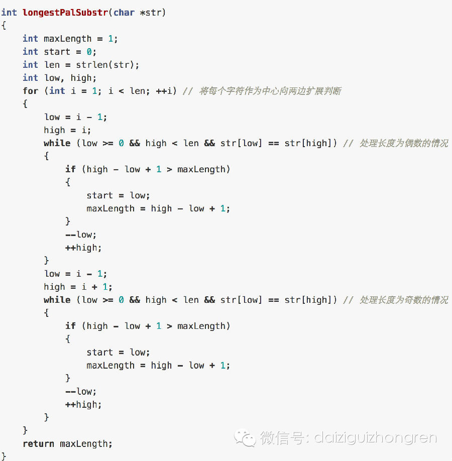
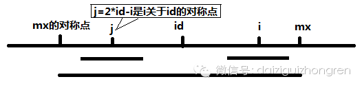
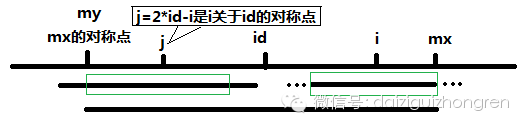

#### **原题**

给定字符串，找到它的最长回文子串，都有哪些思路呢？例如"adaiziguizhongrenenrgnohziugiziadb",回文字串很多了，但最长的是"
daiziguizhongrenenrgnohziugiziad"。

#### **分析**

这是一个十分经典的题目，方法也很多。下面我们在介绍的时候，不会每个方法都很详细的介绍，不过同学们在练习的时候需要每个方法都写一下，进而才能够举一反三。

  

第一个方法当然是暴力法，外面的两层循环找到所有子串，第三层循环判断子串是否是回文。方法的时间复杂度为O(n^3)，空间复杂度为O(1)。

  

第二个方法，采用的是动态规划的方法。开辟一个P[i][j]用来表示str[i..j]是否为回文，P[i][j]的状态转移方程如下：

  

  1. 当i==j时，P[i][j]=true

  2. 当i+1==j时，P[i][j]=str[i]==str[j]

  3. 其他，P[i][j]=P[i+1][j-1]&&(str[i]==str[j])

  

这样，这个方法的时间复杂度为O(n^2)，空间复杂度为O(n^2)。比暴力法有很大的改进。

  

第三个方法，可以从上面那个方法的状态转移方程获得启发，对于每一个回文子串可以先确定一个中心，然后向两边扩展，这样可以在时间复杂度O(n^2)，空间复杂度O(
1)的情况下完成，需要注意的是，长度为奇数和偶数的中心的情况是不同的。示例代码如下：

  

第四个方法采用后缀数组，将最长回文子串的问题转化为最长公共前缀的问题。具体的做法就是：将整个字符串翻转之后，拼接到原字符串后，注意用特殊字符分开，这样问题就
变成了新的字符串的某两个后缀的最长公共前缀的问题了。这个方法比较强大，很多字符串的问题都能够巧妙的解决。不过实现起来也相对比较难，好的实现和差的实现时间复杂
度相差很大。大家应该多多练习。

  

第五个方法叫做Manacher算法，是一种线性时间的方法，非常巧妙。首先，我们在上面的方法中个，都要考虑回文长度为奇数或者偶数的情况。这个方法，引入一个技巧
，使得奇数和偶数的情况统一处理了。具体做法如下：abba转换为#a#b#b#a#，也就是在每一个字符两边都加上一个特殊字符。

  

然后创建一个新的P[i]表示，以第i个字符为中心的回文字串的半径。例如上面的例子，对应的P如下,设S为原始字符串：

  

S

#

a

#

b

#

b

#

a

#

P

1

2

1

2

5

2

1

2

1

  

通过观察上面的表，大家可以发现P[i]-1就是实际回文字串的长度。如果知道P，遍历一次就知道最长的回文子串。可以该如何计算P呢？这是这个算法最核心的部分。

下面的讨论基本转自博客：http://www.felix021.com/blog/read.php?2040
博客中对Manacher算法介绍得也非常好，向大家推荐。

算法引入两个变量id和mx，id表示最长回文子串的中心位置，mx表示最长回文字串的边界位置，即：mx=id+P[id]。

在这里有一个非常有用而且神奇的结论：如果mx > i，那么P[i] >= MIN(P[2 * id - i], mx - i) 分开理解就是：

  

  1. 如果mx - i > P[j], 则P[i]=P[j]

  2. 否则，P[i] = mx - i.

  3.   

这两个该如何理解呢？具体的解释请看下面的两个图。

  

当 mx - i > P[j] 的时候，以S[j]为中心的回文子串包含在以S[id]为中心的回文子串中，由于 i 和 j
对称，以S[i]为中心的回文子串必然包含在以S[id]为中心的回文子串中，所以必有 P[i] = P[j]，见下图。

当 P[j] >= mx - i 的时候，以S[j]为中心的回文子串不一定完全包含于以S[id]为中心的回文子串中，但是基于对称性可知，下图中两个绿框所包围
的部分是相同的，也就是说以S[i]为中心的回文子串，其向右至少会扩张到mx的位置，也就是说 P[i] >= mx -
i。至于mx之后的部分是否对称，就只能老老实实去匹配了。

对于 mx <= i 的情况，无法对 P[i]做更多的假设，只能P[i] = 1，然后再去匹配了。

理解了上面的点，就没有问题了。

【分析完毕】

  

举报

[阅读原文](http://mp.weixin.qq.com/s?__biz=MjM5ODIzNDQ3Mw==&mid=200433301&idx=1&sn
=1a73f81b5d83e5bb8f07dac0d31acd1b&scene=0#rd)

