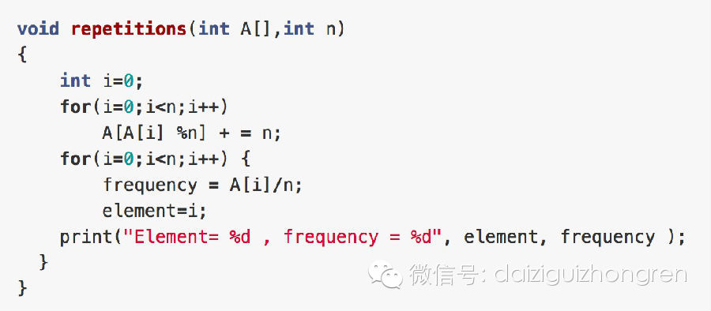

#### **原题**

给定数组A，大小为n，数组元素为1到n的数字，不过有的数字出现了多次，有的数字没有出现。请给出算法和程序，统计哪些数字没有出现，哪些数字出现了多少次。能够在
O(n)的时间复杂度，O(1)的空间复杂度要求下完成么？

#### **分析**

这个题目，是有一定技巧的。技巧是需要慢慢积累，待经验多了之后，可以灵感或者直觉，就产生了技巧。如果不知道技巧，那该怎么办呢？

在开始分析之前，说明两个问题：

  

  * 原数组是没有排序的。如果排序了，很简单的。

  * O(1)的空间含义，可以使用变量，但不能开辟数组或者map等来计数。

  *   

这个题目，很直接的解法就是两层遍历，O(n^2)的复杂度，O(1)的空间。空间满足了，但是时间没有。

  

很多类似的题目，都会用XOR的方法，大家仔细想一下，这个题目，可以么？或者这个题目和可以用XOR的题目的差异在哪儿？最直接的就是，每一个数字的重复的次数是不
同的。

  

还有就是以空间换时间的方法，例如用hash map或者数组来计数。时间满足了，但是空间没有满足。

  

那怎样才能有时间复杂度O(n)，空间复杂度O(1)的算法呢？不能开辟新的空间，那么只剩下，重复利用数组A。那么该如何利用数组A呢？

  

首先，我们介绍一种三次遍历数组的方法,我们都考虑数组从0开始：

  

  * 第一次遍历：对于每一个A[i] = A[i] * n

  * 第二次遍历：对于每一个i，A[A[i]/n]++

  * 第三次遍历：对于每一个i，A[i] % n就是出现次数

  

A[i]应该出现在A中的A[i]位置，乘以n、再除以n，很容易的来回变换；第二次遍历，对于A[i]本来所在的位置不断增1，但绝对不对超出n的，那每一个i出现
的次数，就是A[i]对n取余。

  

还有一种两次遍历的方法，也是上面的思路：题目中数组是1到n，为了方便算法考虑，以及数组存储方便，我们考虑0-n-1，结果是相同的。
考虑A[i]，现在位置是i，如果采用A来计数，它的位置应该是A[i] % n，找到计数位置，该如何处理这个位置呢？加1么？
显然不可以，这里有一个技巧，就是加n，有两个原因

  

  * 加n可以保证A[i] % n是不变的

  * A数组，最后每一个元素表示为A[i] = x + k*n，其中x<n，并且k就是我们要统计的频率。

  

这样，大家也能够明白，为什么A[i]在A中的位置，表示为A[i] % n了吧。上面第二种思路，转换为代码如下：

  

【分析完毕】

举报

[阅读原文](http://mp.weixin.qq.com/s?__biz=MjM5ODIzNDQ3Mw==&mid=200446711&idx=1&sn
=09b2db28fcfa289cfb69d60f066d1d91&scene=0#rd)

