  

大家好，我是来自硅谷的董飞，应国内朋友邀请，很高兴给大家交流美国大数据工程师面试攻略。

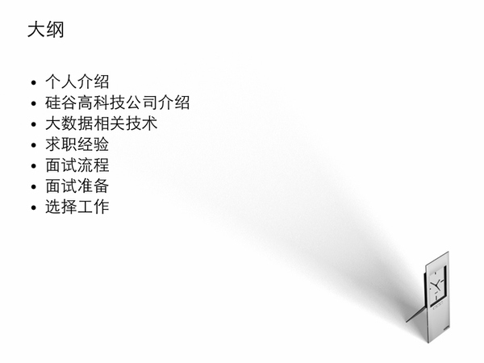  

我的公开课在 《美国大数据工程师面试攻略》美国Linkedin董飞，9月7日，上午10：30__ ,已经错过直播的，也可以免费查看录播。

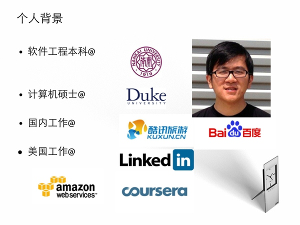  

先做一个自我介绍，本科南开后，加入了一个创业公司kuxun，做实时信息检索，后来进入百度基础架构组，搭建了Baidu App
Engine的早期版本，随后去Duke大学留学，在攻读硕士期间，做跟Hadoop大数据相关的研究项目Starfish，之后在Amazon
EC2部门实习，了解它们的内部架构，毕业后加入Linkedin，做广告组的架构，涉及Hadoop调优，Data Pipeline,
Offline/Online, 实时系统。最新是在Coursera从事数据工程师工作。在多年工作中，除了对技术的不懈追求，也积累了大量的面试经验，从国内的一
线互联网百度，阿里巴巴，奇虎，人人，到美国一线公司Facebook，Google，Linkedin，Twitter，Amazon，到热门Startup，Ub
er，Pinterest，Airbnb，Box，Dropbox，Snapchat，Houzz，拿到10+
offer，并且在Linkedin期间也面试过100+候选人，参与面试题制定，乐于分享并帮助很多人成功求职，实现目标。

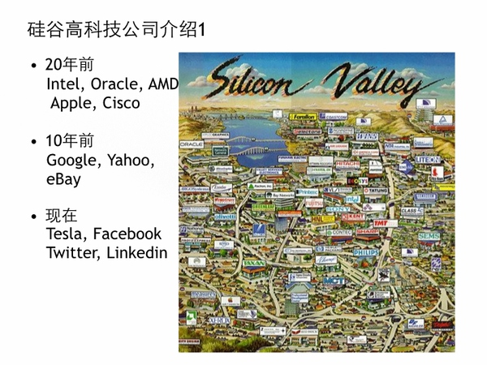  

我们看一下这张硅谷地图，它坐落于美国加州，从圣何塞到旧金山的狭长地带，中间是San francisco bay，简称湾区。它的由来是这边有计算机核心处理器中
离不开的硅，30年来，硅谷就发展成为无数技术性创业公司的摇篮。在20多年前，就有很多硬件公司的辉煌Intel，Oracle，Apple，Cisco成功上市，
10年前，互联网的兴起，造就了Yahoo，Google，Ebay的神奇，而如今Tesla，Facebook，Twitter，Linkedin正扶摇直上，成为
美股高科技股的领头羊。这些公司的市值从几十billion到几百billion，PE从负数到上千。疯狂的估值背后也改变了世界。

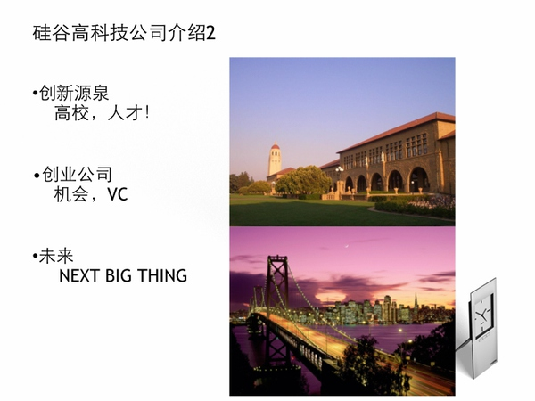  

如果说硅谷成功是有原因的，我觉得有两点。地理位置是得天独厚吸引大量人才，这里有Stanford和加州州立高校提供智力库的支持，在硅谷可以看到来自全世界的最聪
明的人，中国人，印度人，犹太人构成这些Engineer的主力。虽然国内做技术自嘲为码农，但在硅谷成为一个优秀工程师还是收获颇丰。另一方面创业是一个永恒的话题
，在Stanford有个说法空气中都飘扬中创业的味道，一些早期员工通过上市套现又积累经验成了天使投资，Y Combinator，各种技术forum，meet
up，创业导师，都很活跃。资本的力量功不可没，早年VC通过投资，收购，上市放大形成一个雪球效应。大家总喜欢问什么是next big
thing，哪一个是下一个facebook，下一个musk，根据统计10年能成就一个千亿以上的公司，目前这个进程正在缩短。

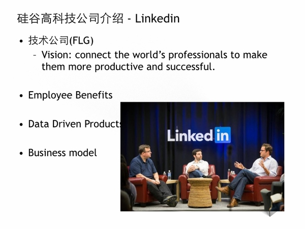  

我就拿Linkedin作为例子，介绍高科技公司（FLG）是什么样子。它是成立2003年的职业社交网站。在10年的发展中，也不是一下子爆发的，目前有3亿的全球
用户，虽然跟Facebook，Google 10亿＋用户没法比，但是它有很好的护城河，用户定位高端精准，单位价值高。这张照片中左边这位是创始人Reid
Hoffman，是Paypal黑帮成员，在硅谷也是呼风唤雨的大佬，目前是董事和投资人。中间这位是CEO Jeff，2013年被Glassdoor评为最佳CE
O，作为职业经理人，成功帮助linkedin高速成长，他最喜欢提到transformation，希望我们每个员工能挑战自我，在各自岗位上进化。Linkedi
n提供了员工很好的福利，有号称湾区最佳的免费食堂，每个月一次的in day，hack day,
帮助员工内部创业的incumbator计划。它特点是数据驱动的开发产品，比如 People you may know, Job you may be
interested, 我做过Sponroed Ads 都是需要很强数据背景和data scientist的支持。它的Biz
model也很独特，有3个line，面向公司的招聘服务，面向广告商的市场服务，面向个人的订阅服务，还有最新Sales
Solution，因为这么多可能性，成为华尔街的宠儿。

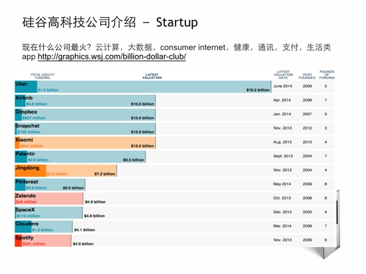  

说硅谷，除了那些已经成功的大公司，不得不说现在最新的创业动向，这些代表了未来下一个FLG。我总结了一些领域和代表公司：云计算(box, dropbox)，大
数据(cloudera)，消费互联网(pinterest)，健康(fitbit)，通讯(snapchat)，支付(square)，生活(uber)。 这里是
华尔街网站更新的最新融资规模，比如Uber就达到18Billion的估值，我当时拿到offer没去，还是觉得很疯狂，如果细看这张表，大家可以看到硅谷（蓝色）
尤其是旧金山它们的融资规模远远大于其他地区，还是地理决定论。而在国内的两家xiaomi，jingdong都是在北京，而最近大家看到一些泡沫论，说什么阿里巴巴
上市是否美股到顶，经纬VC创始人也提醒我们泡沫的风险，我无法判断。如果能参与到下一波浪潮里面去是很过瘾的。我推荐大家去看看
<浪潮之巅>，<奇点临近>，我还是很期待未来20年的技术革命。

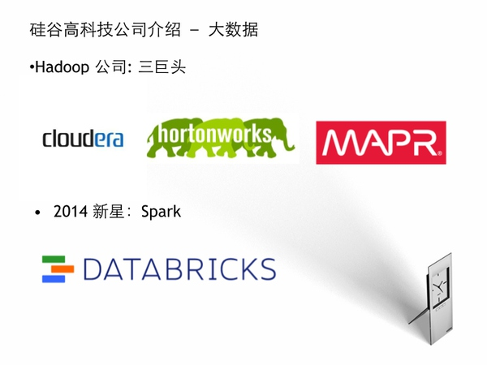  

我个人热爱大数据，在硅谷这也是大家津津乐道的，有个笑话，big data is like teenage talking about sex, nobody
know how to do it. 其实大家还是兴趣驱动就好，不要那么功利，大数据技术涉及太多，平常工作中也是慢慢积累，有无数的坑和技术细节需要克服。并不
是说那个技术最热就要用哪个，如果你用不好，你的压力很大的，举个例子，你用某个开源数据库，发现它偶尔有数据丢失怎么办，如果这是线上服务，你不断收到报警，这时候
你当时选用它的优点 scalable，容错性都没意义了。接着说大数据，这里面Hadoop作为行业标准，我面过的除了Google，微软不用，几乎所有的公司都在
用，建议大家利用这个机会。这里面有三巨头，cloudera是老牌Hadoop咨询公司，Hadoop的创始人做CTO，Hortonworks也是很多Hadoo
p的committee，MapR是提出hdfs的erasure
编码方式高效而著名，它们都是融了巨资，模式也很像，先推出社区免费版，但有个商业版提供更好的管理。
而今年出现一匹黑马，Spark，简单说就是内存级别的计算，比Hadoop框架里能节约IO，利用缓存，能适应批处理，迭代，流式计算。

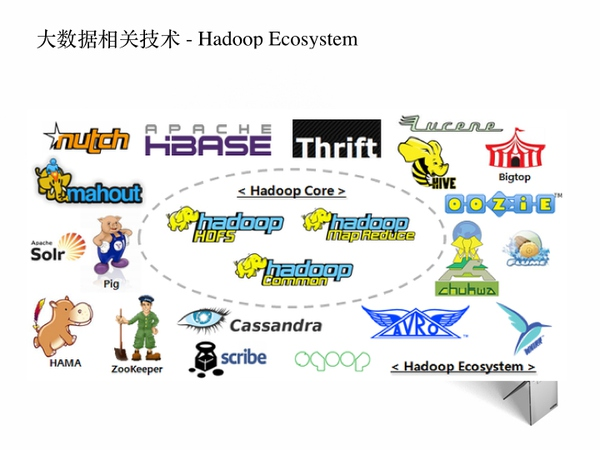  

这里看一下它的生态系统，如何学Hadoop是个循序渐进过程，先要理解学习它的core系统，HDFS, MapReduce,
Common，在外围有无数的系统工具方便开发，我个人用过的是
Avro作为数据格式，Zookeeper作为选主的高可靠性的组件，Solr作为搜索接口，Pig搭建工作流，Hive
数据仓库查询，Oozie管理工作流，HBase 作为KV 分布式存储，mahout数据挖掘的库，Cassandra nosql
数据库。我建议初学的考虑Chinahadoop的课程。

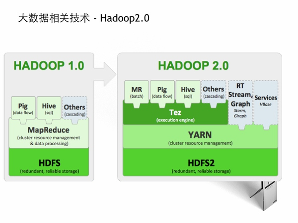  

而Hadoop本身也是个进化过程，几年前0.19版本，到0.20, 0.23分流成Yarn架构最后进化成Hadoop2.0, Hadoop1.0 和 2.0
它们的接口和组件是完全不同的，但总体上Hadoop 2.0 是趋势，因为它有Yarn这样分离的资源管理平台，可以以插件的方式开发上面的Application
，解放了生产力，而像Spark，Storm这些新型处理器也是支持Hadoop 2.0的。这里是Hortonworks它们提出来的社区版本架构，可以说标准的制
定者，一流的公司制定标准，其他的公司一般用只能用它们提供的稳定版，没有多少话语权。但从事大数据，并不见得是要去这些制定标准的公司，大量的应用也是非常考验架构
的灵活性。并且能看到实际的产品，很有成就感。

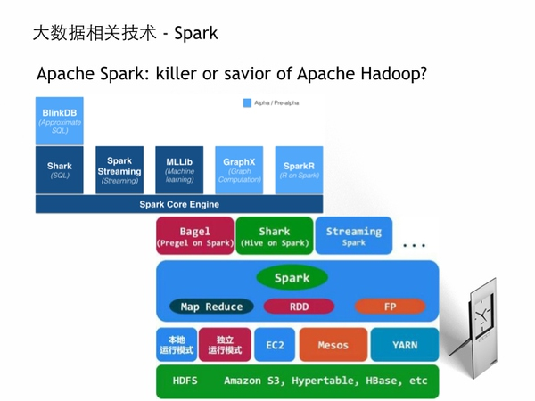  

说到今年火的，还是要看Spark。从去年至今，已经开了2届Spark大会，上千人的规模，无数人对比Hadoop
100倍的性能提升而兴奋。这里说它的背景是诞生于Berkeley的Amplab，它们有个很有名的BDAS(Berkeley Data Analytics S
tack)，目前Spark已经成为Apache的顶级项目。去年这个实验室的教授跟学生出去成立Databricks公司，拉到两轮上千万的风投，有人成Spark
是Hadoop的终结者吗？我看今年Spark大会上，所有的Hadoop大佬公司都是鼎力支持，像Cloudrea甚至放弃impala的一线支持而转变成Spar
k。如果这么发展下去，星星之火可以燎原啊。它里面用到Scala是一种函数式语言。里面的组件也很多，有Shark支持SQL类似Hive，有Spark Stre
aming，MLlib，Graphx，SparkR，BlinkDB。它的核心数据结构是RDD，可以跑在各种分布式系统上。总体上是个包容性＋侵略性的系统。我个
人也很看好它们的发展。

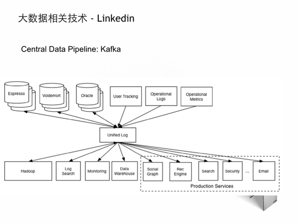  

我在Linkedin做过一些大数据的广告系统，我就简单提一些我学到的。

  1. Linkedin有特有的开源数据系统，包括Voldermort (分布式KV存储), Kafka (分布式实时消息队列），Espresso （基于mysql的海量存储），Databus（数据变化捕捉），可以查看http://data.linkedin.com__

  2. Lambda 架构，离线使用Hadoop做pipeline，near online做高效聚合，提供混合式架构，达到实时和一致性的妥协。

  3. Kafka在linkedin起到奠基作用，一方面所有实时tracking都是通过它，另一方面 data bridge，比如图中通过kafka可以实现数据的无缝衔接，否则很难想像每个数据源异构系统，它们的通信将是 n^2 级别的复杂度。

  4. 分布式并不酷，如果考虑到高可靠性，强一致性而数据量并不是想像的大，不见得要使用；否则自讨苦吃。尽量使用成熟的，可靠的，例如MySQL, Memcached

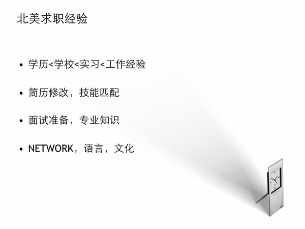  

根据我的求职经验，我给出几点重要的

  1. 如果面试的话，我先看他们的经验是不是match，对应届生看有没有实习经历，如果你在Google，Linkedin实习，绝对加分，学校当然也需要，比如我们招人UC Berkeley是要机会大一些。

  2. 我看过很多简历，不推荐用DOC，因为在不同系统中排版不一样。简历也不要写太长，不是大牛就不超过2页。尽量突出你的技能如何匹配公司的职位，比如这个公司都是用C++，你上面都没C++，是不大合适。我也很不喜欢看到精通，如果你这样写，就很容易引起麻烦，最好写多少年经验，对具体技术的掌握。

  3. 面试当然需要准备，但到底是事倍功半，还是事倍功半。我建议把你的经历精选1，2个准备熟练，包括如何团队分工，技术细节，遇到困难，如何克服。不要贪多，就把你现在用的东西准备好，没人关心你5年前干啥的。

  4. 社交很重要，最简单是去招聘会就可以跟人混个脸熟，如果你在网络多利用有些网络招聘网站，如dice，indeed，你还要巧妙利用Linkedin，加入高级账号，可以查看有些校友的资源，发站内信，refer比你网上瞎投效率要高很多。

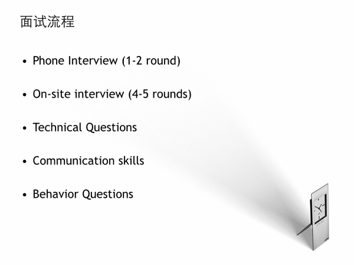  

如果你拿到面试机会，下面的流程是先电面，对于engineer，算法coding基本功是必须，还是准备好你的小白板，根据面试官的题给出思路和代码，说起来容易，
但就是那10多行的代码，80%以上的人都挂了。然后就是onsite，美国公司为了体现人才为先，都会来一次onsite，如果是远程过来，报销机票，车费，酒店，
吃饭，听起来也是免费旅游的机会，但onsite也不容易，基本上4－6轮，每轮45min到1小时，也会让你挑战极限的，经常是头痛欲裂，我最狠的一次10天面7家
onsite，连续飞，连续面，真是折磨。他们都考察什么呢，简单说是你到底聪不聪明，是否经过工程训练，是否能够合作。总体分成3块，一类是技术问题，比如算法，系
统经验，一类是交流能力，你个人经验，兴趣，一类是hr喜欢问的行为面试，比如你有没有过失败的经历，如果你老板给你不喜欢的任务怎么办，你想像中成为什么样的人。

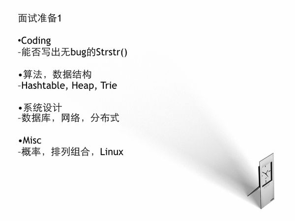  

技术面试这里面涉及面也挺广。看似简单的coding不见得能过关，不信，你写个字符串查找，我不需要你知道KMP，就是暴力解法，可是90%的人都挂在这道题上面。
算法方面，常见的hashtable，heap，trie，系统设计也是很多同学害怕的，很多人说我没设计过那些系统。如果大家算法都过关，系统设计就能继续筛选，体
现出来你的层次。还要一些很随机的问题，数学上的概率组合，Linux的常见命令都有可能触及。

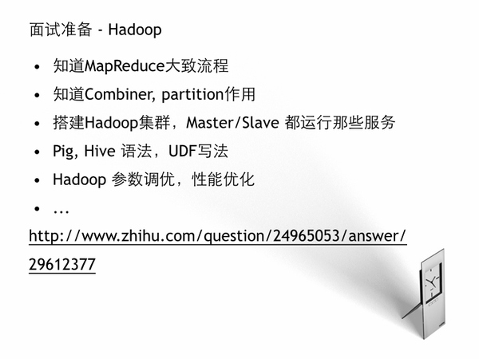  

我这里列出考察Hadoop的一些基本问题，都比较简单，大家Google一下，zhihu上也有我的详细题目。

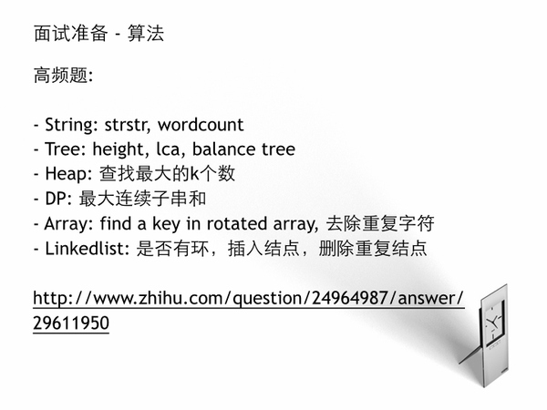  

对于算法，是考察的重中之重，我总结了一些高频题目，同样参见我的zhihu

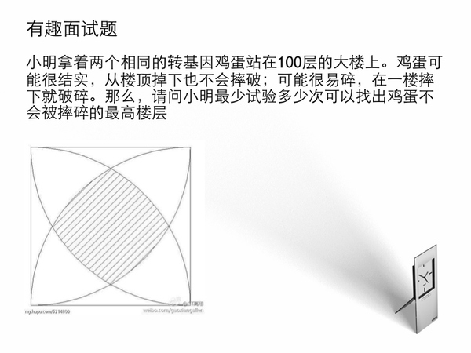  

这两道题是我真实中被问道的，虽然不是常规，大家可以思考一下。其中求面积的，是Apple当时问的，同学们如果能在15min内演算出来吗？

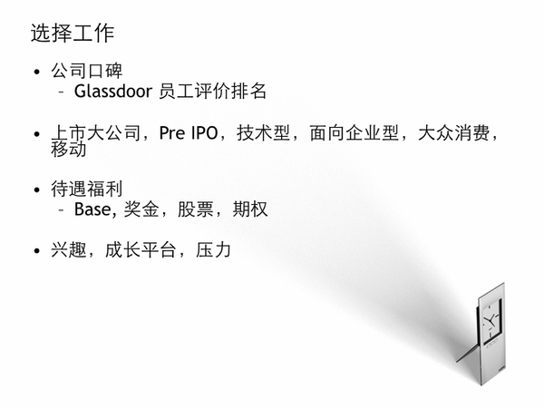  

假设你经历过面试的考验，拿到offer，如何选择的问题。在考虑offer之前，先对公司做个研究，比如这公司是什么规模，产品是什么，Glassdoor员工如何
评价的，你的职位你喜欢吗，这就跟选学校一样，如果选错了，也是需要走很多弯路。我个人的参考是首先这公司是上升期的，产品是否有爱，团队是否比较强，学到东西。对公
司分类，Hortonworks这种是纯技术性的，面向企业级的可能没多少人知道，而Uber是大众消费性，很多朋友都用过。现在的热点是移动互联网，大家也可以多考
虑这一块。大家都很关心硅谷公司的待遇福利，这边我也做个介绍，待遇分成基础工资，根据glassdoor排名，大概在每年10w刀－20w刀，硅谷目前也是水涨船高
，奖金有些大公司有（Google， FB 15% － 20%）如果上市的公司，会给限制性股票，分3－4年行使，创业公司一般给期权，不同就是限制性股票是白送的
，不需要自己掏腰包，期权需要自己买入，不同时期价格不同，但股票交的税非常高，期权是有些长期避税。最后也要考虑你的兴趣和对风险的承受能力，如果去大公司做个螺丝
钉，实现共产主义生活也无可厚非。去小公司压力大，成长快。但也要做好失败的准备，看看当年zynga教训。

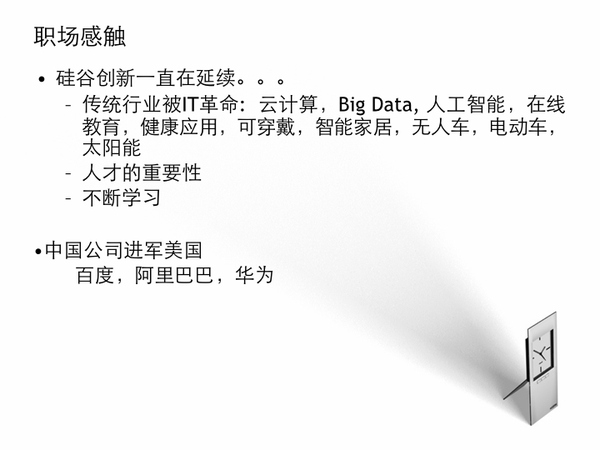  

硅谷生活这一群不在乎别人怎么看，但很疯狂的想法的人。大家在这谈创新，谈技术，谈创业，资本涌入，人才竞争，导致大家都是很高的期望值，迫不及待的去改变。这种浮躁
也许是社会进步的动力。我这上面的都是最热的话题，每个领域都是百亿甚至千亿的价值。最近阿里巴巴的成功上市创造最大IPO，让大家看到中国互联网的野蛮成长，中国的
发展速度和广阔市场让大家想像无限，而百度在硅谷设立人工智能研究院，阿里巴巴也准备在硅谷招上千人研发团队，越来越多的 人才拼抢。中国的一些互联网产品也走出国门
，微信，小米，360都在广泛布局投资未来。有时候会想当大家都是谈论技术改变世界，做个小App就值上亿，甚至上百亿，但真的世界因为你改变了吗。我们也要多些独立
性思考。

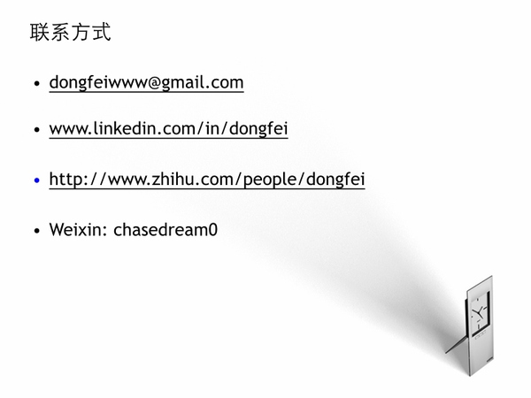  

最后感谢大家的关注，这是我的联系方式，有问题可以线下交流，谢谢。

  

阅读原文

阅读

__ 举报

[阅读原文](http://mp.weixin.qq.com/s?__biz=MjM5ODIzNDQ3Mw==&mid=200532226&idx=1&sn
=52e119caaf0305664e4da456e054a108&scene=0#rd)

