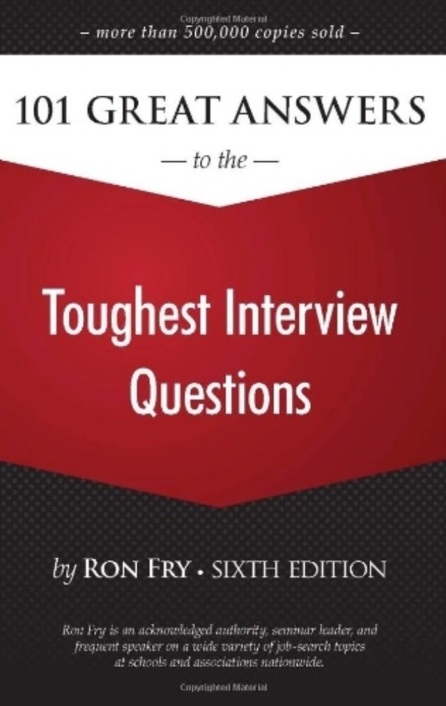

## 机器学习头条 2014-10-17（周五）

  

接地气的面试资料推荐，转给需要找工作的人看

  

 好东西传送门 2014-10-17 07:42

美帝码农面试资料 Mitbbs数据科学版主 晨钟暮鼓 推荐三本书:《101 Great Answers to the Toughest Interview
Questions》 http://t.cn/R7yHCSP "behavior问题",《Recommender Systems》(Xiavier)
http://t.cn/RhCcR9f ,《The Algorithm Design Manual》 http://t.cn/R7yHCSh
"算法:graph,hash,DP"

  

好东西传送门 转发于2014-10-17 07:55

"Introduction To Algorithms" vs "The Algorithm Design Manual" 两本算法神作的进一步讨论:
前者是算法课的常客，概念清晰偏重理论(也是门主买过的为数不多的几本原价纸书),
而后者是编程实战利器(代码随用随抄)，尤其适合准备白板面试。码农不妨看看stackoverflow的讨论 http://t.cn/R7yQ5a5

  

phunter_lau 转发于2014-10-17 08:10

我不太理解他推荐这个组合的想法是什么，Recommender Systems是一本关于推荐系统的综述，其他两个是常见码农面试书，看了也是呵呵，顺便mitbb
s居然还有这个版，去溜达了一下，和CS打pub一样，臭棋篓子太多了

  

睡眼惺忪的小叶先森 转发于2014-10-17 08:54

让大神@whiteath @_靖难_ 也推荐一下。我估计推荐leetcode和砸死代码面试[嘻嘻][嘻嘻][嘻嘻]

  

好东西传送门 转发于2014-10-17 09:12

这两个东东当然好, Leetcode 前些时候才推过 http://t.cn/R7ymOb8 "crack the coding interview"
这个PDF版行吗http://t.cn/R7ymObQ

  

小飞鱼_露 转发于2014-10-17 12:10

好资料，正在准备找工作，估计能派上用场

  

  

更多今日焦点

  * Douglas Engelbart的书Boosting Our Collective IQ @西瓜大丸子汤

  * 34种免费的数据挖掘软件 @赵家平USC

  * RecSys2014完整报告视频 @AixinSG

  * Hadoop上的轻量级语言Guinea Pig @王威廉

  

由于微信文中链接不可点击，微信版只包含一条摘要．请点击页面底端的＂阅读原文＂查看网页版本（5条）和加长版（52条）

  

  

阅读原文

阅读

举报

[阅读原文](http://mp.weixin.qq.com/s?__biz=MzAwNDAxNTg4NA==&mid=203443416&idx=1&sn
=b8bab9b7bdaca30b910cb1f1642ecc80&scene=0#rd)

