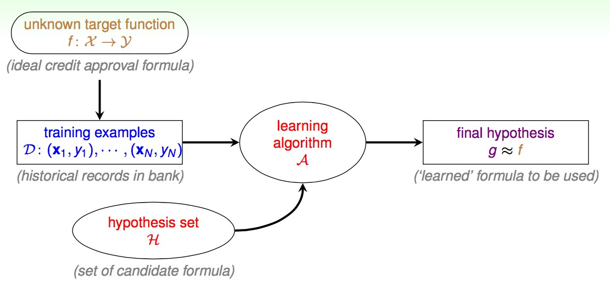
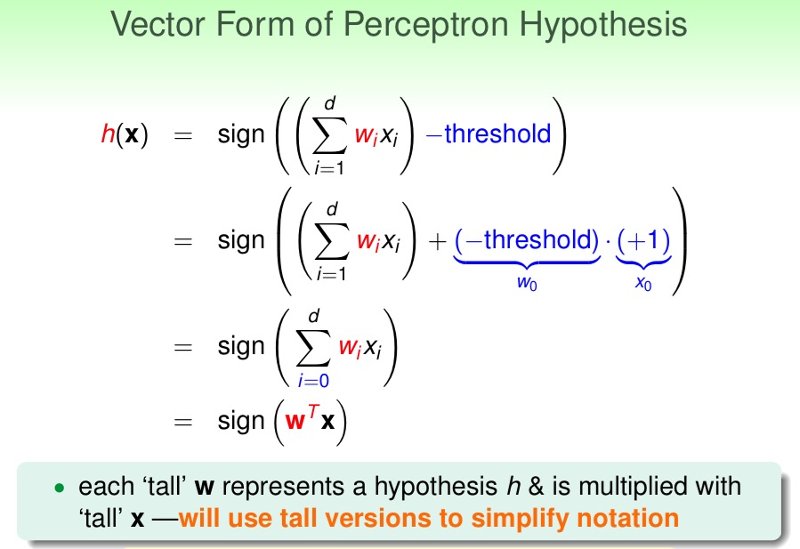

# 机器学习基石 学习笔记

Hsuan-Tien Lin htlin@csie.ntu.edu.tw

<!-- MarkdownTOC -->

- Roadmap
- Lecture 1 The Learning Problem
    - 从学习到机器学习
    - Machine Learning
        - 三个关键
    - 学习问题
- Lecture 2 Learn to Answer Yes/No
    - select g from H
    - Perceptron Learning Algorithm
    - Cyclic PLA
    - Linear Separability 线性可分
    - PLA Fact: W~t Gets More Aligned with W~f
    - PLA Fact: W~t Does Not Grow Too
    - 一个习题
    - More about PLA
    - Learning with **Noisy Data**
    - Pocket Algorithm
- Lecture 3: Types of Learning

<!-- /MarkdownTOC -->

## Roadmap

+ Lecture 1: The Learning Problem
    * _A_ takes _D_ and _H_ to get _g_
+ Lecture 2: Learning to Answer Yes/No
    * Perceptron Hypothesis Set
    * Perceptron Learning Algorithm, PLA
    * Guarantee of PLA
    * Non-Separable Data
+ Lecture 3: Types of Learning
    + Learning with Different Output Space y
    + Learning with Different Data Lable y~n
    + Learning with Different Protocol f -> (x~n~,y~n~)
    + Learning with Different Input Space X

## Lecture 1 The Learning Problem

从基础学习 what every machine learning user should know

+ When Can Machines Learn? illustrative + technical
+ Why Can Machines Learn? theoretical + illustrative
+ How Can Machines Learn? technical + practical
+ How Can Machines Learn Better? practical + theorietical

知其然也知其所以然

### 从学习到机器学习

+ 学习的过程：observations -> **learning** -> skill
+ 机器学习的过程：data -> **ML** -> skill(improved performance measure)
+ skill: improve some **performance measure**

### Machine Learning

+ improving some perormance mearsure with experience computed from data
+ an alternative route to build complicated systems

#### 三个关键

+ exists some 'underlying pattern' to be learned, so performance measure can be improved. 要有东西可学
+ but no programmable definition, so 'ML' is needed
+ somehow there is data about the pattern. 要有大量数据

### 学习问题

+ 输入 x
+ 输出 y
+ 目标函数 target function f: X->Y
+ data D={(x~1~,y~1~),(x~2~,y~2~),...,(x~n~,y~n~)}
+ 机器学习可能得到的假设 g:X->Y
+ {(x~n~, y~n~)} from f -> ML -> g

 

+ f 我们不知道
+ g 越接近 f 越好
+ A takes D and H to get g
+ related to DM, AI and Stats

## Lecture 2 Learn to Answer Yes/No

+ 每一个样本的数据可以看成一个向量，可以给每一个向量计算出一个加权得分，每一个维度有一个权重。
+ 把 threshold 收进公式中，可以得到一个统一的表达，最后的得分等于两个向量相乘
+ 
+ perceptrons <-> linear(binary) classifiers 线性分类器

### select g from H

* H = all possible perceptrons, g = ? 从这么多可能的线之中，选出一条最好的，最能区分数据的
* 先要求 g 和 f 在已有数据上结果最接近, g(x~n~) = f(x~n~) = y~n~
* 难点在于，H 很大，有无数种可能的线(分类器)
* 从第一条线 g~0 开始，不断进行修正，可以认为是一开始的权重向量 w~0

### Perceptron Learning Algorithm

* For t = 0, 1, ... 这里 t 是轮数，因为会迭代很多次
* 找到 w~t 的一个分类错误的点(x~n(t)~, y~n(t)~), 即 sign(w~t~^T^x~n(t)~) 不等于 y~n(t)~
* 试着去改正这个错误 w~t+1~ <- w~t + y~n(t)~x~n(t)~ until no more mistakes
* 返回最后得到的 w 为 g, 这个 w 称为 w~pla~

### Cyclic PLA

* For t = 0,1,...
* find the next mistake of wt called (x~n(t)~, y~n(t)~), aka sign(w~t~^T^x~n(t)~) 不等于 y~n(t)~
* correct the mistake by w~t+1~ <- w~t + y~n(t)~x~n(t)~
* until a full cycle of not encountering mistakes
* 可以采用标准的遍历，或者也可以是预先计算好的随机顺序

### Linear Separability 线性可分

* if PLA halts, (necessary condition) D allows some w(一条用来区分的线) to make no mistake
* 有一条线可以区分数据，即有解，有解的时候 PLA 算法才会停

### PLA Fact: W~t Gets More Aligned with W~f

+ 线性可分，则存在一条完美的直线 W~f(即目标函数) 使得 y~n = sign(W~f^T x~n)
+ 也就是 y~n 的符号，与 W~f^T 和 x~n 的乘积(也就是 x~n 到直线 W~f 的距离)的符号，一定是相同的
+ 
+ W~t 为当前次迭代的直线，找出一个错误的点，然后做更新
+ 通过不等式可以得到，下一次迭代得到的直线，会更加接近于完美的直线 W~f ，因为乘积越来越大了(但是乘积还需要考虑向量的长度，这里说的是角度，下面就是说长度)

### PLA Fact: W~t Does Not Grow Too

+ W~t changed only when mistake
+ 也就是只有在 sign(W~t^T x~n(t)~) 不等于 y~n(t)~ 也就是 y~n(t)~w~t^T^x~n(t)~ <= 0
+ 
+ 平方之后来看长度的公式，蓝色部分通过上面的推导可知是小于等于零的
+ y~n 是正负 1，所以下一次迭代的向量的长度的增长是有限的，最多增长 x~n~^2^ 那么多(也就是长度最大的向量)
+ 然后推导出来 w~t 确实是越来越靠近 w~f 的

### 一个习题

+ 
+ 具体怎么推导的呢，研究了半个多小时终于弄清楚了，如下
+ W~f 是理论上完美的那条线，w~t 是第 t 次迭代得到的那条线，而因为这两条线最好结果就是完全平行，所以有
    + (W~f^T / || W~f ||) * (w~t / || w~t ||) 的最大值为 1 (`eq1`)
+ 由前面 PPT 得到的两个公式：
    + W~f~^T^w~t+1~ >= W~f~^T^w~t~ + min~n~y~n~W~f~^T^x~n~ (`eq2`)
    + w~t+1~^2^ <= w~t~^2^ + max(n)x~n~^2^ (`eq3`)
+ 因为是迭代 T 次，把 `eq2` 和 `eq3` 代入到 `eq1` 中
    + W~f~^T^w~t~ / || w~f~ || 这部分就是条件里的 p，因为迭代 T 次，所以分子变成 T·p
    + 分子是 || w~t ||，根据 `eq3` 可知迭代 T 次后为 √(T·R^2^)
+ 又因为 `eq1` 的最大值为1，可以求出 T 的范围，得到答案

### More about PLA

+ Guarantee: as long as **linear separable** and **correct by mistake**
    + inner product of w~f and w~t grows fast; length of w~t grows slowly
    + PLA 'lines' are more and more align with W~f -> halts
+ Pros
    + Simple to implement, fast, works in any dimensin d
+ Cons
    + **'Assumes' linear separable D** to halt(property unknown in advance)
    + Not fully sure **how long halting takes**(p depends on W~f) -though practically fast
+ What if D not linear separable?

### Learning with **Noisy Data**

+ 
+ Line with Noise Tolerance
    + 
    + 在看到的数据中，找犯错误最少的一条(但是这是一个很难的问题)

### Pocket Algorithm

+ modify PLA algorithm (black lines) by **keeping best weights in pocket**
+ 
+ 例题时间
+ 

## Lecture 3: Types of Learning

