# Computer Systems : A Programmer's Perspective
# 深入理解计算机系统
_Notes from Da Wang, Feb.2 2015_

<!-- MarkdownTOC -->

- 前言
	- 第 1 章：计算机系统漫游
		- 1.1 信息就是位 + 上下文
		- 1.2 程序被其他程序翻译成不同的格式
		- 1.3 了解编译系统如何工作是大有益处的
		- 1.4 处理器读并解释存储在存储器中的指令
			- 1.4.1 系统的硬件组成
			- 1.4.2 运行 hello 程序
		- 1.5 高速缓存至关重要
		- 1.6 存储设备形成层次结构
		- 1.7 操作系统管理硬件
			- 1.7.1 进程
			- 1.7.2 线程
			- 1.7.3 虚拟存储器
			- 1.7.4 文件
		- 1.8 系统之间利用网络通信
		- 1.9 重要主题
			- 1.9.1 并发和并行
			- 1.9.2 计算机系统中抽象的重要性
- 第一部分：程序结构和执行
	- 第 2 章：信息的表示和处理
		- 2.1 信息存储
			- 2.1.1 十六进制表示法
			- 2.1.2 字
			- 2.1.3 数据大小
			- 2.1.4 寻址和字节顺序
			- 2.1.5 表示字符串
			- 2.1.6 表示代码
			- 2.1.7 布尔代数简介
			- 2.1.8 C 语言中的位级运算
			- 2.1.9 C 语言中的逻辑运算
			- 2.1.10 C 语言中的移位运算
		- 2.2 整数表示
			- 2.2.1 整型数据类型
			- 2.2.2 无符号数的编码
			- 2.2.3 补码(two's-complement)编码
			- 2.2.4 有符号数和无符号数之间的转换
			- 2.2.5 C 语言中的有符号数与无符号数
			- 2.2.6 扩展一个数字的位表示
			- 2.2.7 截断数字
			- 2.2.8 关于有符号树与无符号数的建议
		- 2.3 整数运算
			- 2.3.1 无符号加法
			- 2.3.2 补码加法
			- 2.3.3 补码的非
			- 2.3.4 无符号乘法
			- 2.3.5 补码乘法
			- 2.3.6 乘以常数
			- 2.3.7 除以 2 的幂
			- 2.3.8 关于整数运算的最后思考
		- 2.4 浮点数
			- 2.4.1 二进制小数
			- 2.4.2 IEEE 浮点表示
			- 2.4.3 数字示例
			- 2.4.4 舍入(rounding)
			- 2.4.5 浮点运算
			- 2.4.6 C 语言中的浮点数
		- 2.5 小结
	- 第 3 章：程序的机器级表示
		- 3.1 历史观点
		- 3.2 程序编码
			- 3.2.1 机器级代码
			- 3.2.2 代码示例
			- 3.2.3 关于格式的注释
			- 3.2.4 数据格式
		- 3.4 访问信息
			- 3.4.1 操作数指示符
			- 3.4.2 数据传送指令
		- 3.5 算术和逻辑操作
			- 3.5.1 加载有效地址
			- 3.5.2 一元操作和二元操作
			- 3.5.3 移位操作
			- 3.5.4 讨论
			- 3.5.5 特殊的算术操作
		- 3.6 控制
			- 3.6.1 条件码
			- 3.6.2 访问条件码
			- 3.6.3 跳转指令及其编码
			- 3.6.4 翻译条件分支
			- 3.6.5 循环
			- 3.6.6 条件传送指令
			- 3.6.7 switch 语句
		- 3.7 过程
			- 3.7.1 栈帧结构
			- 3.7.2 转移控制
			- 3.7.3 寄存器使用惯例
			- 3.7.4 过程示例
			- 3.7.5 递归过程
		- 3.8 数组分配和访问
			- 3.8.1 基本原则
			- 3.8.2 指针运算
			- 3.8.3 嵌套的数组
			- 3.8.4 定长数组
			- 3.8.5 变长数组
		- 3.9 异质的数据结构
			- 3.9.1 结构
			- 3.9.2 联合
			- 3.9.3 数据对齐
		- 3.10 综合：理解指针
		- 3.11 应用：使用 GDB 调试器
		- 3.12 存储器的越界引用和缓冲区溢出
		- 3.13 x86-64: 将 IA32 扩展到 64 位
		- 3.14 浮点程序的机器级表示
		- 3.15 小结
	- 第 4 章：处理器体系结构
		- 4.1 Y86 指令集体系结构
			- 4.1.1 程序员可见的状态
			- 4.1.2 Y86 指令
			- 4.1.3 指令编码
		- 4.2 逻辑设计和硬件控制语言 HCL
			- 4.2.1 逻辑门
			- 4.2.2 组合电路和 HCL 布尔表达式
			- 4.2.3 字级的组合电路和 HCL 整数表达式
		- 4.3 Y86 的顺序实现
		- 4.4 流水线的通用原理
		- 4.5 Y86 的流水线实现
		- 4.6 小结
	- 第 5 章：优化程序性能
		- 5.1 优化编译器的能力和局限性
		- 5.2 表示程序性能
		- 5.3 程序示例
		- 5.4 消除循环的低效率
		- 5.5 减少过程调用
		- 5.6 消除不必要的存储器引用
		- 5.7 理解现代处理器
			- 5.7.1 整体操作
			- 5.7.2 功能单元的特性
			- 5.7.3 处理器操作的抽象模型
		- 5.8 循环展开
		- 5.9 提高并行性
		- 5.10 优化合并代码的结果小结
		- 5.11 一些限制因素
		- 5.12 理解存储器性能
			- 5.12.1 加载的性能
			- 5.12.2 存储的性能
		- 5.13 应用：性能提高技术
		- 5.14 确定和消除性能瓶颈
		- 5.15 小结
	- 第 6 章 存储器层次结构
		- 6.1 存储技术
			- 6.1.1 随机访问存储器
			- 6.1.2 磁盘存储
			- 6.1.3 固态硬盘
			- 6.1.4 存储技术趋势
		- 6.2 局部性
		- 6.3 存储器层次结构
			- 6.3.1 存储器层次结构中的缓存
		- 6.4 高速缓存存储器
		- 6.5 编写高速缓存友好的代码
		- 6.6 综合：高速缓存对程序性能的影响
			- 6.6.1 存储器山
			- 6.6.2 重新排列循环以提高空间局部性
			- 6.6.3 在程序中利用局部性
		- 6.7 小结
- 第二部分：在系统上运行程序
	- 第七章：链接
		- 7.1 编译器驱动程序
		- 7.2 静态连接
		- 7.3 目标文件
		- 7.4 可重定位目标文件
		- 7.5 符号和符号表
		- 7.6 符号解析
		- 7.7 重定位
		- 7.8 可执行目标文件
		- 7.9 加载可执行目标文件
		- 7.10 动态链接共享库

<!-- /MarkdownTOC -->

# 前言

从程序员的角度来学习计算机系统是如何工作的会非常有趣，主要是因为你可以主动地来做这件事情。无论何时你学到一些新的东西，都可以马上试验并且直接看到运行结果。事实上，我们相信学习系统的唯一方法就是做(do)系统，即再真正的系统上解决具体的问题，或是编写和运行程序。

本书起源于1998年秋季，作者在 CMU 开设的编号为15-213的介绍性课程：计算机系统导论(Introduction to Computer Systems, ICS)，是大多数高级系统课程的先行必修课。宗旨是用一种不同的方式向学生介绍计算机，只讨论那些影响用户级 C 语言程序的性能、正确性或实用性的主题。

## 第 1 章：计算机系统漫游

我们通过跟踪 helloworld 程序的生命周期来开始对系统的学习——从它被程序员创建，到在系统上运行，输出简单的消息，然后终止。

### 1.1 信息就是位 + 上下文

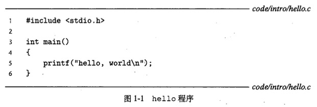

hello.c 程序以字节序列的方式存储在文件中。每个字节都有一个整数值，而该整数值对应于某个字符。

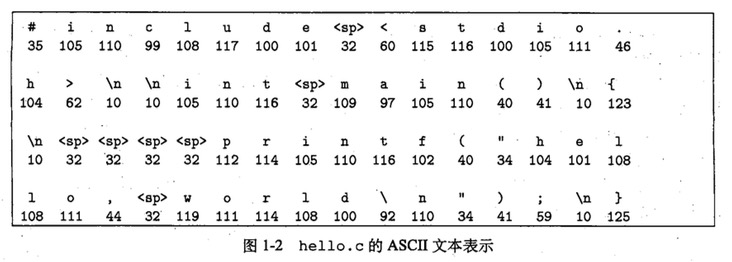

hello.c 的表示方法说明了一个基本的思想：系统中所有的信息——包括磁盘文件、存储器中的程序、存储器中存放的用户数据以及网络上传送的数据，都是由一串位表示的。区分不同数据对象的唯一方式是我们读到这些数据对象时的上下文。

**C 编程语言的起源**

+ 贝尔实验室的 Dennis Ritchie 于 1969-1973 年创建
+ C 语言与 Unix 操作系统关系密切
+ C 语言小而简单
+ C 语言是为实践目的而设计的
+ C 语言是系统级编程的首选，同时它也非常适用于应用级程序的编写。然而，它也并非适用于所有的程序员和所有的情况。C 语言的指针是造成困惑和程序错误的一个常见原因。同时，C 语言还缺乏对非常有用的抽象（类、对象和异常）的显式支持。

### 1.2 程序被其他程序翻译成不同的格式

hello 程序的生命周期是从一个高级 C 语言程序开始的，因为这种形式能够被人读懂。为了在系统上运行，每条 C 语句都必须被其他程序转化为一系列的低级**机器语言**指令。然后这些指令按照一种称为**可执行目标程序**的格式打好包，并以二进制磁盘文件的形式存放起来。目标程序也称为**可执行目标文件**。

在 Unix 系统上，从源文件到目标文件的转化是由编译器驱动程序完成的：

	unix> gcc -o hello hello.c

这个翻译过程可分为四个阶段。这行这四个阶段的程序（预处理器cpp、编译器ccl、汇编器as和链接器ld）一起构成了编译系统（compilation system）。

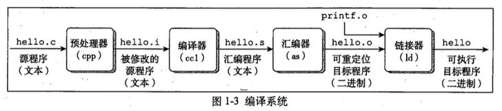

**GNU 项目**

GCC 是 GNU(GNU's Not Unix) 项目开发出来的众多有用工具之一。GNU 项目已经开发出了一个包含 Unix 操作系统的所有主要部件的环境，但内核除外，内核是由 Linux 项目独立发展而来的。GNU 环境包括 EMACS 编辑器、GCC 编译器、GDB 调试器、汇编器、链接器、处理二进制文件的工具以及其他一些部件。

### 1.3 了解编译系统如何工作是大有益处的

知道编译系统是如何工作非常重要，原因如下：

+ **优化程序性能**。了解一些机器代码以及编译器将不同的 C 语句转换为机器代码的方式。
	+ 一个 switch 语句是否总是比一系列 if-else 语句高效得多？
	+ 一个函数调用的开销有多大？
	+ while 循环比 for 循环更有效吗？
	+ 指针引用比数组索引更有效吗？
+ **理解链接时出现的错误**。一些最令人困扰的程序错误往往都与链接器操作有关，尤其是当你试图构建大型的软件系统时。
	+ 无法解析一个引用是什么意思？
	+ 静态变量和全局变量的区别是什么？
	+ 在不同 C 文件中定义的名字相同的两个全局变量会发生什么？
	+ 静态库和动态库的区别是什么？
	+ 我们在命令行上排列库的顺序有什么影响？
+ **避免安全漏洞**。学习安全变成的第一步就是理解数据和控制信息存储在程序栈上的方式会引起的后果。

### 1.4 处理器读并解释存储在存储器中的指令

要想在 Unix 系统上运行可执行目标文件 hello，将文件名输入到 shell 中：

	unix> ./hello
	hello, world
	unix>

shell 是一个命令行解释器，它输出一个提示符，等待你输入一个命令行，然后执行这个命令。如果该命令行的第一个单词不是一个内置的 shell 命令，那么 shell 就会假设这是一个可执行文件的名字，它将加载并运行这个文件。

#### 1.4.1 系统的硬件组成

下图是 Intel Pentium 系统产品系列的模型：

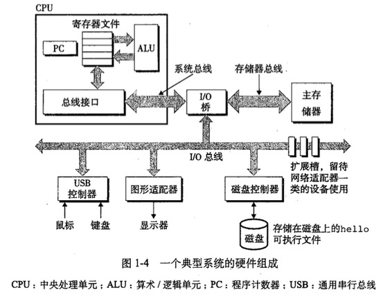

1. **总线**：贯穿整个系统的电子管道，携带信息字节并负责在各个部件间传递。通常总线呗设计成传送定长的字节块，也就是字(word)。假设字长为 4 个字节，并且总线每次只传送 1 个字。
2. **I/O 设备**：系统与外部世界的联系通道。每个 I/O 设备都通过一个**控制器**或**适配器**与 I/O 总线相连。控制器和适配器之间的区别主要在于它们的封装方式。控制器是置于 I/O 设备本身的或者系统的主板上的芯片组，而适配器则是一块插在主板插槽上的卡。
3. **主存**：临时存储设备，由一组动态随机存取存储器(DRAM)芯片组成。从逻辑上来说，存储器是一个线性的字节数组，每个字节都有其唯一地址。
4. **处理器**：解释(或执行)存储在主存中指令的引擎。核心是一个字长的存储设备(或寄存器)，称为程序计数器(PC)。在任何时刻，PC 都指向主存中的某条机器语言指令。从系统痛点开始，直到系统断电，处理器一直在不断地执行程序计数器指向的指令，在更新程序计数器，使其指向下一条指令。

#### 1.4.2 运行 hello 程序

当我们输入“./hello”后，shell 程序将字符逐一读入寄存器，再把它存放到存储器中，如下图所示：

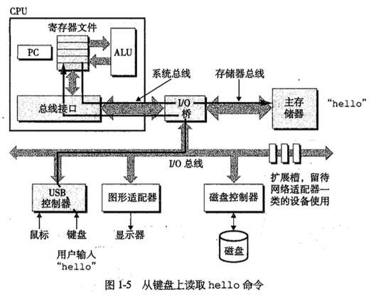

利用直接存储器存取(DMA)技术，数据可以不通过处理器而直接从磁盘到达主存

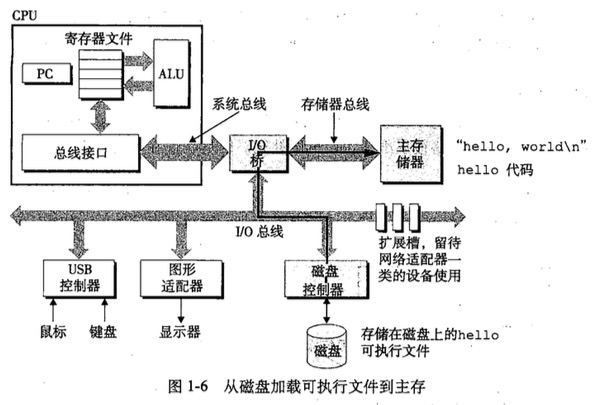

一旦目标文件中的代码和数据被加载到主存，处理器就开始执行 hello 程序的 main 程序中的机器语言指令。这些指令将“hello, world\n”字符串中的字节从主存复制到寄存器文件，再从寄存器文件中复制到显示设备，最终显示在屏幕上。

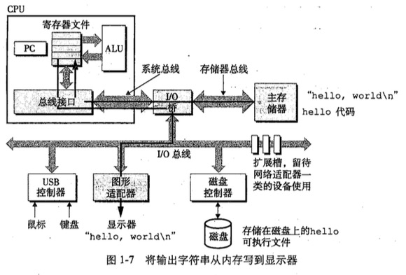

### 1.5 高速缓存至关重要

这个简单的例子揭示了一个重要的问题，即系统花费了大量的时间把信息从一个地方挪到另一个地方。因此，系统设计者的一个主要目的就是使这些复制操作尽可能快地完成。

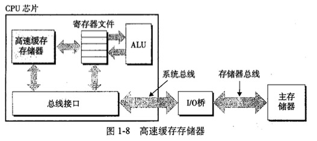

较大的存储设备要比较小的存储设备运行得慢，而快速设备的造价远高于同类的低速设备。针对这种差异，系统设计者采用了更小、更快的存储设备，即**高速缓存存储器**，作为暂时的集结区域，用一种叫**做静态随机访问存储器(SRAM)**的硬件技术实现。

### 1.6 存储设备形成层次结构

从上至下，设备的访问速度越来越慢、容量越来越大，每字节的造价也越来越便宜。

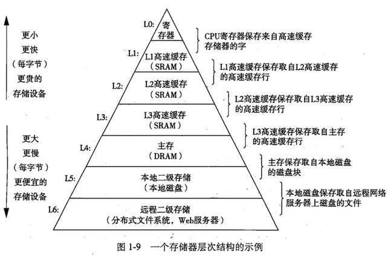

### 1.7 操作系统管理硬件

我们可以把操作系统看成是应用程序和硬件之间插入的一层软件，所有应用程序对硬件的操作尝试都必须通过操作系统。操作系统有两个基本功能：

1. 防止硬件被失控的应用程序滥用。
2. 向应用程序提供简单一致的机制来控制复杂而又通常大相径庭的低级硬件设备。

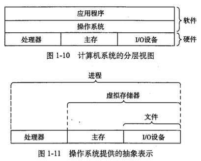

操作系统通过几个基本的抽象概念(进程、虚拟存储器和文件)来实现这两个功能。

**Unix 和 Posix**

20 世纪 60 年代是大型、复杂操作系统盛行的年代，如 IBM 的 OS/360 和 Honeywell 的 Multics 系统。贝尔实验室曾经是 Multics 项目的最初参与者，但是因为项目复杂和缺乏进展于 1969 年退出。这之后一组贝尔实验室的研究人员(Ken Thompson, Dennis Ritchie, Doug Mcllroy & Joe Ossanna)从1969年开始在 DEC PDP-7 计算机上完全用机器语言编写了一个简单得多的系统，1970 年 Brian Kernighan 命名为“Unix”。1973 年用 C 语言重新编写内核，1974年开始对外发布。

发布之后不同的 Unix 厂商加入新的、往往不兼容的特性来使它们的程序与众不同，也带来很多麻烦，为了阻止这种趋势，IEEE 开始努力标准化 Unix 的开发，后来由 Richard Stallman 命名为“Posix”，称为 Posix 标准。

#### 1.7.1 进程

**进程**是操作系统对一个正在运行的程序的一种抽象。在一个系统上可以同时运行多个进程，而每个进程都好像在独占地使用硬件。无论是在单核还是多核系统中，一个 CPU 看上去都像是在并发地执行多个进程，这是通过处理器在进程间切换来实现的，这种交错执行的机制称为**上下文切换**。

操作系统保持跟踪进程运行所需的所有状态信息。这种状态，也就是**上下文**，它包括许多信息，例如 PC 和寄存器文件的当前值，以及主存的内容。

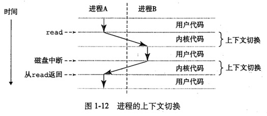

#### 1.7.2 线程

一个进程实际上可以由多个称为**线程**的执行单元组成，每个线程都运行在进程的上下文中，并共享同样的代码和全局数据。由于网络服务器对并行处理的需求，线程称为越来越重要的编程模型，因为多线程之间比多进程之间更容易共享数据，一般来说也更高效。

#### 1.7.3 虚拟存储器

**虚拟存储器**是一个抽象概念，它为每个进程提供了一个假象，即每个进程都在独占地使用主存。每个进程看到的是一致的存储器，称为**虚拟地址空间**。

在 Linux 中，地址空间最上面的区域是为操作系统中的代码和数据保留的，这对所有进程来说都是一样的。地址空间的底部区域存放用户进程定义的代码和数据，请注意，图中的地址是从下往上增大的。

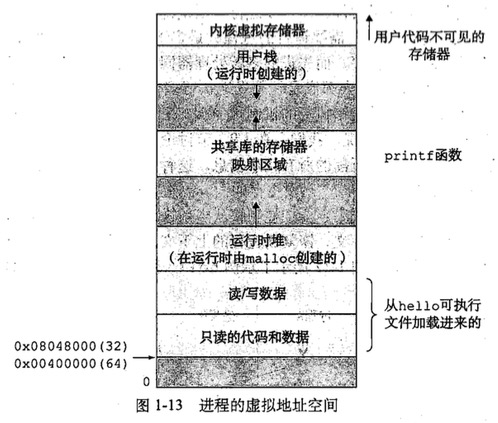

从最低的地址开始，逐步向上介绍：

+ **程序代码和数据**。对于所有的进程来说，代码是从同一固定地址开始，紧接着是和 C 全局变量相对应的数据位置。代码和数据区是直接按照可执行目标文件的内容初始化的。
+ **堆**。代码和数据区后紧随着的是运行时堆。代码和数据区是在进程一开始运行就被规定了大小，与此不同，当调用如 malloc 和 free 这样的 C 标准库函数时，对可以在运行时动态地扩展和收缩。
+ **共享库**。大约在地址空间的中间部分是一块用来存放像 C 标准库和数学库这样共享库的代码和数据的区域。共享库的概念非常强大，也相当难懂。
+ **栈**。位于用户虚拟地址空间顶部的是用户栈，编译器用它来实现函数调用。和堆一样，用户栈在程序执行期间可以动态地扩展和收缩。
+ **内核虚拟存储器**。内核总是主流在内存中，是操作系统的一部分。地址空间顶部的区域是为内核保留的，不允许应用程序读写这个区域的内容或者直接调用内核代码定义的函数。

#### 1.7.4 文件

**文件**就是字节序列，仅此而已。这个简单而精致的概念拥有极其丰富的内涵，它向应用程序提供了一个统一的视角，来看待系统中可能含有的所有 I/O 设备。

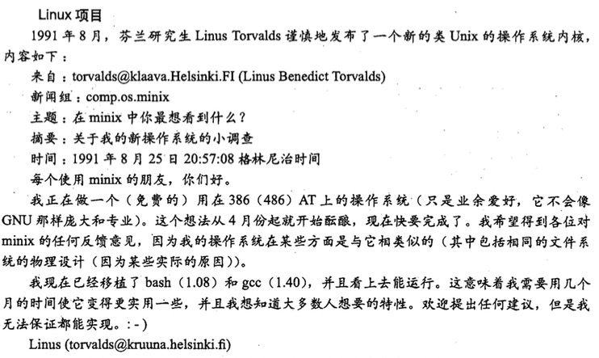

### 1.8 系统之间利用网络通信

从一个单独的系统来看，网络可视为一个 I/O 设备。当系统从主存将一串字节复制到网络适配器时，数据流经过网络到达另一台机器，而不是其他地方。相似地，系统可以读取从其他机器发送来的数据，并把数据复制到自己的主存。

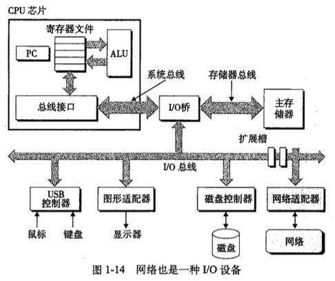

### 1.9 重要主题

系统不仅仅只是硬件，而是硬件和系统软件互相交织的集合体，它们必须共同协作以达到运行应用程序的最终目的。下面是几个贯穿计算机系统所有方面的重要概念：

#### 1.9.1 并发和并行

**并发(concurrency)**是一个通用的概念，指一个同时具有多个活动的系统；**并行(parallelism)**指的是用并发使一个系统运行得更快。并行可以在计算机系统的多个抽象层次上运用。

**1.线程级并发**

传统意义上，这种并发执行只是模拟出来的，是通过正在执行的进程间快速切换的方式实现的，这种配置称为**单处理器系统**。

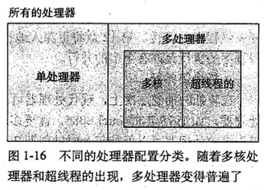

当构建一个由单操作系统内核控制的多处理器组成的系统时，就得到了一个**多处理器系统**。超线程，有时称为**同时多线程(simultaneous multi-threading)**，是一项允许一个 CPU 执行多个控制流的技术。

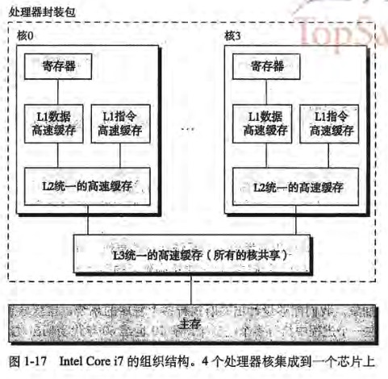

多处理器的使用可以从两个方面提高系统性能。首先，它减少了在执行多个任务时模拟并发的需要。其次，它可以使应用程序运行得更快。

**2.指令级并行**

在较低的抽象层次上，现代处理器可以同时执行多条指令的属性称为**指令级并行**。流水线(pipelining)的引入使得指令并行成为可能。如果处理器可以达到比一个周期一条指令更快的执行速率，就称之为**超标量(superscalar)**处理器。

**3.单指令、多数据并行**

在最低层次上，许多处理器拥有特殊的硬件，允许一条指令产生多个可以并行执行的操作，即 SIMD 并行。

#### 1.9.2 计算机系统中抽象的重要性

**抽象**的使用是计算机科学中最为重要的概念之一。

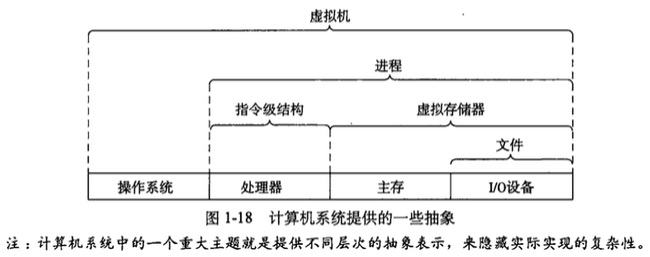

在处理器里，**指令集结构**提供了对实际处理器硬件的抽象。在操作系统中：**文件**是对 I/O 的抽象，**虚拟存储器**是对程序存储器的抽象，而**进程**是对一个正在运行的程序的抽象。虚拟机则是对整个计算机(包括操作系统、处理器和程序)的抽象。

# 第一部分：程序结构和执行

计算机由处理器和存储器子系统组成。在核心部分，我们需要方法来表示基本数据类型，比如整数和实数运算的近似值。然后，我们考虑机器级指令如何操作这样的数据，以及编译器如何将 C 程序翻译成这样的指令。这一部分将帮助你深入了解如何表示和执行应用程序。

## 第 2 章：信息的表示和处理

单个 bit 不是非常有用，然而，当把 bit 组合在一起，再加上某种解释(interpretation)，即给不同的可能位模式赋予含义，就能够表示任何有限集合的元素。计算机的表示法适用有限数量的 bit 来对一个数字编码，因此，当结果太大以至于不能表示时，某些运算就会**溢出(overflow)**。

浮点运算有完全不同的数学属性，由于精度有限，浮点运算是不可结合的。整数的表示虽然只能编码一个相对较小的数值范围，但这种表示是精确的；而浮点数虽然可以编码一个较大的数值范围，但这种表示只是近似的。

**C 编程语言的演变**

C -> ANSI C -> ISO C90 -> ISO C99

GNU 编译器套装(GNU Compiler Collection, GCC)可以基于不同的命令行选项，依照多个不同版本的 C 语言规则来编译程序。

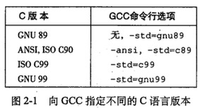

### 2.1 信息存储

大多数计算机使用8位的块，或者 byte 作为最小的可寻址的存储器单位，而不是在存储器中访问单独的 bit。机器级程序将存储器视为一个非常大的字节数组，称为**虚拟存储器(virtual memory)**。存储器的每个字节都由一个唯一的数字来标识，称为它的**地址(address)**，所有可能的地址集合称为**虚拟地址空间(virtual address space)**。

#### 2.1.1 十六进制表示法

一个 byte 由 8 个 bit 组成。在二进制表示法中，它的值域是 00000000(2) ~ 11111111(2)；如果用十进制整数表示，它的值域就是 0 ~ 255。用十六进制书写，一个字节的值域为 00(16) ~ FF(16)。

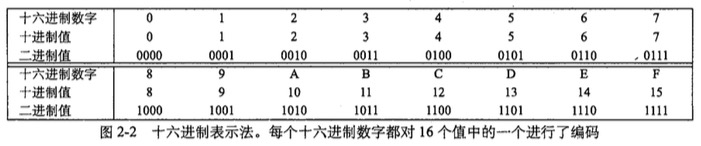

#### 2.1.2 字

每台计算机都有一个**字长(word size)**，指明整数和指针数据的**标称大小(nominal size)**。因为虚拟地址是以这样一个字来编码的，所以字长决定的最重要的系统参数就是虚拟地址空间的最大大小。也就是说，对于一个字长尾 w 位的机器而言，虚拟地址的范围为 0 ~ 2^(w-1)，程序最多访问 2^w 个字节。现在的 32 位机器指的就是字长是 32 位，就限定了虚拟地址空间为 4GB。

#### 2.1.3 数据大小

计算机和编译器支持多种不同方式编码的数字格式，如整数和浮点数，以及其他长度的数字。

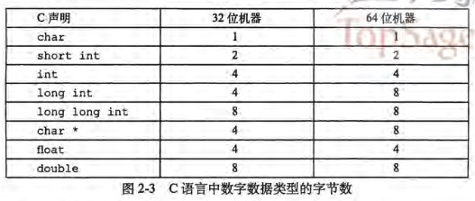

程序员应该力图使他们的程序在不同的机器和编译器上是可移植的。可移植性的一个方面就是使程序对不同数据类型的确切大小不敏感。

#### 2.1.4 寻址和字节顺序

对于跨越多字节的程序对象，我们必须建立两个规则：这个对象的地址是什么，以及在存储器中如何排列这些字节。

某些机器选择在存储器中按照从最低有效字节到最高有效字节的顺序存储对象，而另一些机器则按照从最高有效字节到最低有效字节的顺序存储。前一种规则——最低有效字节在最前面的方式，称为**小端法(little endian)**。后一种规则——最高有效字节在最前面的方式，称为**大端法(big endian)**。许多比较新的微处理器使用**双端法(bi-edian)**，也就是说可以把它们配置成作为大端或者小端的机器运行。

几种机器所使用的字节顺序会成为问题的情况：

1. 在不同类型的机器之间通过网络传送二进制数据。
2. 当阅读表示整数数据的字节序列时，字节顺序也很重要。
3. 当编写规避正常的类型的系统时。

**使用 typedef 命名数据类型**

C 语言中的 typedef 声明提供了一种给数据类型命名的方式。这能够极大地改善代码的可读性，因为深度嵌套的类型声明很难读懂。typedef 的语法与声明变量的语法十分相似，除了它使用的是类型名，而不是变量名。

#### 2.1.5 表示字符串

C 语言中字符串被编码为一个以 null(其值为 0)字符结尾的字符数组。每个字符都由某个标准编码来表示，最常见的是 ASCII 字符码。在使用 ASCII 码作为字符码的任何系统上都将得到相同的结果，与字节顺序和字大小规则无关，因此文本数据比二进制数据具有更强的平台独立性。

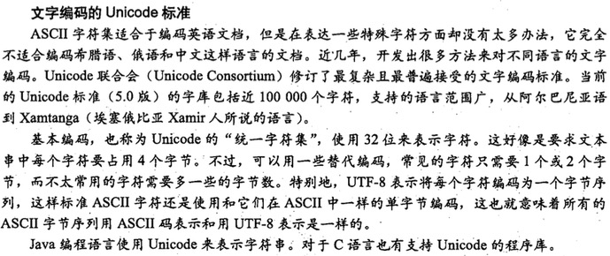

#### 2.1.6 表示代码

考虑下面的 C 函数：

	int sum(int x, int y) {
		return x + y;
	}

当我们在示例机器上编译时，生成如下字节表示的机器代码：

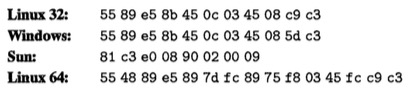

可以看到指令编码是不同的。不同的机器类型使用不同的且不兼容的指令和编码方式。因此二进制代码是不兼容的。二进制代码很少能在不同机器和操作系统组合之间移植。

#### 2.1.7 布尔代数简介

二进制是计算机编码、存储和操作信息的核心，所以围绕 0 和 1 的研究演化出了丰富的数学知识体系。

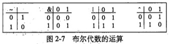

#### 2.1.8 C 语言中的位级运算

C 语言支持按位布尔运算，确定一个位级表达式的结果最好的方法，就是将十六进制的参数扩展成二进制并执行二进制运算，然后转换回十六进制。

位级运算的一个常见用法就是实现**掩码**运算，这里的掩码是一个位模式，表示从一个字中选出的位的集合。

#### 2.1.9 C 语言中的逻辑运算

C 语言还提供了一组逻辑运算符 ||、&& 和 !，分别对应于命题逻辑中的 OR、AND 和 NOT 运算。

#### 2.1.10 C 语言中的移位运算

C 语言还提供了一组移位运算，以便向左或者向右移动位模式：<<、>>。

x << k 会生成一个值，x 向左移动 k 位，丢弃最高的 k 位，并在右端补 k 个 0。

右移 x >> k 比较微妙，一般而言，机器支持两种形式的右移：逻辑右移(补 0)和算术右移(补 1)。对于无符号数据，右移必须是逻辑的。对于有符号数据，几乎所有的编译器 / 机器组合都使用算术右移。

### 2.2 整数表示

#### 2.2.1 整型数据类型

C 语言支持多种整型数据类型——表示有限范围的整数。C 语言标准定义了每种数据类型必须能够表示的最小的取值范围。

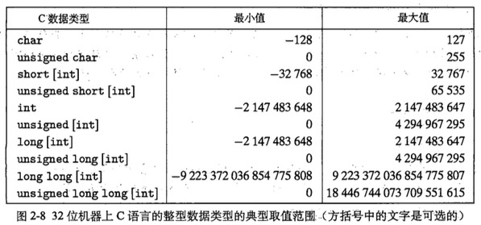

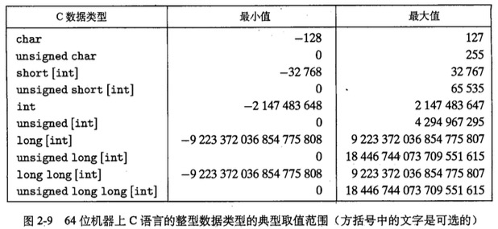

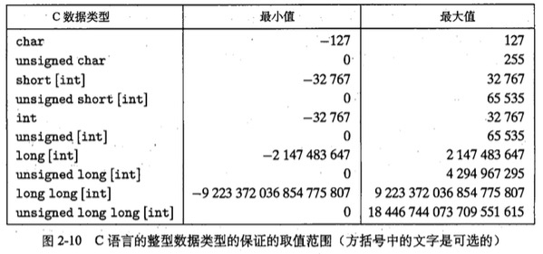

#### 2.2.2 无符号数的编码

假设一共有 w 位，每个介于 0 ~ 2^w -1 之间的数都有唯一一个 w 位的值编码，即这个函数映射是一个双射。

#### 2.2.3 补码(two's-complement)编码

字的最高有效位解释为负权(negative weight)。

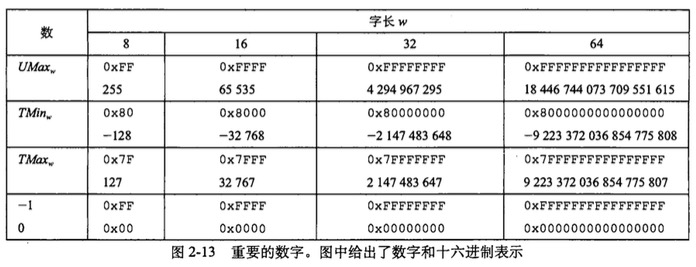

C 语言标准并没有要求用补码形式来表示有符号整数，但是几乎所有的机器都是这么做的。

其他的表示方法有**反码(ones' complement)**和**原码(sign-magnitude)**，这两种表示方法都有一个奇怪的属性，就是对于数字 0 有两种不同的编码方式。

#### 2.2.4 有符号数和无符号数之间的转换

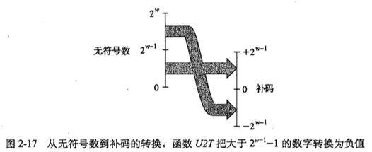

#### 2.2.5 C 语言中的有符号数与无符号数

C 语言允许无符号数和有符号数之间的转换。转换的原则是底层的位表示保持不变。

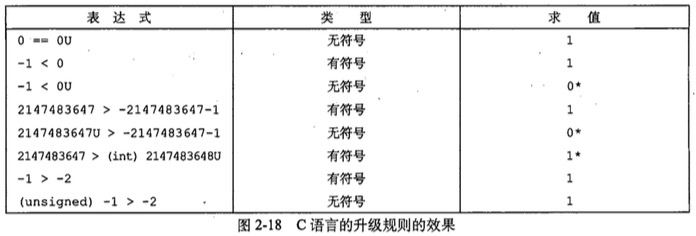

#### 2.2.6 扩展一个数字的位表示

将一个无符号数转换为一个更大的数据类型，我们只需要简单地在表示的开头添加 0，这种运算称为**零扩展(zero extension)**。将一个补码数字转换为一个更大的数据类型可以执行**符号扩展(sign extension)**，规则是在表示中添加最高有效位的值的副本。

#### 2.2.7 截断数字

截断一个数字可能会改变它的值——溢出的一种形式。

#### 2.2.8 关于有符号树与无符号数的建议

有符号数叨无符号数的隐式强制类型转换导致了某些非直观的行为。而这些非直观的特性经常导致程序错误，并且这种包含隐式强制类型转换细微差别的错误很难被发现。因为这种强制类型转换是在代码中没有明确指示的情况下发生的，程序员经常忽视了它的影响。

避免这类错误的一种方法就是绝不使用无符号数。实际上，除了 C 以外，很少有语言支持无符号整数。

### 2.3 整数运算

理解计算机运算的细微之处能够帮助程序员编写更可靠的代码。

#### 2.3.1 无符号加法

考虑两个非负整数 x 和 y，满足 0 ≤ x, y ≤ 2^w - 1。每个数都能表示为 w 位无符号数字。如果计算它们的和，我们就有一个可能的范围 0 ≤ x + y ≤ 2^(w+1) - 2，表示这个和可能需要 w + 1位。无符号运算可以被视为一种模运算形式。

#### 2.3.2 补码加法

必须确定当结果太大(为正)或者太小(为负)时，应该做些什么。

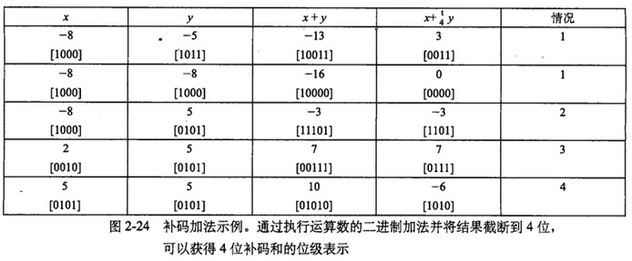

#### 2.3.3 补码的非

略

#### 2.3.4 无符号乘法

略

#### 2.3.5 补码乘法

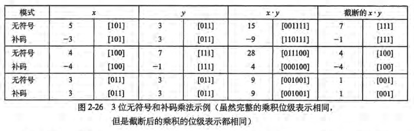

#### 2.3.6 乘以常数

在大多数机器上，整数乘法指令相当慢，需要 10 个或者更多的时钟周期，然而其他整数运算(例如加法、减法、位级运算和移位)只需要 1 个时钟周期。因此，编译器使用了一项重要的优化，试着用移位和加法运算的组合来代替乘以常数因子的乘法。

例如，假设一个程序包含表达式 x * 14。利用等式 14 = 2^3 + 2^2 + 2^1，编译器会将乘法重写为 (x << 3) + (x << 2) + (x << 1)，实现了将一个乘法替换为三个移位和两个加法。更好的方法是 14 = 2^4 - 2^1，将乘法重写为(x << 4) - (x << 1)，这时只需要两个移位和一个减法。

#### 2.3.7 除以 2 的幂

在大多数机器上，整数除法要比整数乘法更慢——需要 30 个或者更多的周期。除以 2 的幂也可以用移位运算右移来实现，无符号和补码数分别使用逻辑移位和算术移位来达到目的。

#### 2.3.8 关于整数运算的最后思考

计算机执行“整数”运算实际上是一种模运算形式。表示数字的有限字长限制了可能的值的取值范围，结果运算可能溢出。补码表示提供了一种既能表示负数也能表示正数的灵活方法，同时使用了与执行无符号算术相同的位级实现。

### 2.4 浮点数

浮点表示对形如 V = x * 2^y 的有理数进行编码，IEEE 标准 754 规定了如何表示浮点数及其运算。

#### 2.4.1 二进制小数

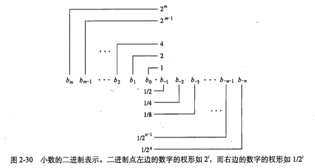

增加二进制表示的长度可以提高表示的精度。

#### 2.4.2 IEEE 浮点表示

用 V = (-1)^s * M * 2^E 的形式来表示一个数：

+ 符号(sign) s决定这个数是负数(s=1)还是正数(s=0)，对于数值 0 的符号位解释作为特殊情况处理。
+ 尾数(significand) M 是一个二进制小数，它的范围是 1 ~ 2 - ε，或者是 0 ~ 1 - ε。
+ 阶码(exponent) E 的作用是对浮点数加权，这个权重是 2 的 E 次幂(可能是负数)

将浮点数的位表示划分为三个字段，分别对这些值进行编码：

+ 一个单独的符号位 s 直接编码符号 s。
+ k 位的阶码字段 exp = e(k-1)...e(1)e(0) 编码阶码 E。
+ n 位小数字段 frac = f(n-1)...f(1)f(0) 编码尾数 M，但是编码出来的值也依赖于阶码字段的值是否等于 0。

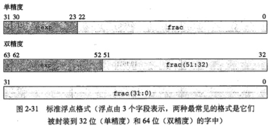

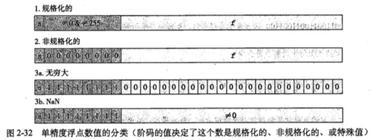

#### 2.4.3 数字示例

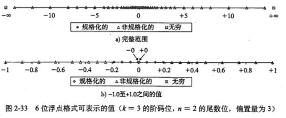

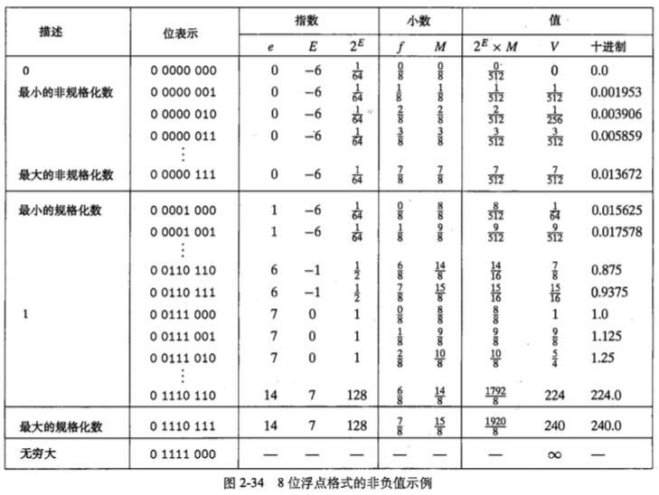

#### 2.4.4 舍入(rounding)

因为表示方法限制类浮点数的范围和精度，浮点运算只能近似地表示实数运算。因此，对于值 x，我们一般想用一种系统的方法，能够找到“最接近的”匹配值，这就是舍入运算的任务。

#### 2.4.5 浮点运算

浮点加法不具有结合性。浮点乘法在加法上不具备分配性。对于科学计算程序员和编译器编写者来说，这是很严重的问题，即使为了在三维空间中确定两条线是否交叉而写代码这样看上去很简单的任务，也可能成为一个很大的挑战。

#### 2.4.6 C 语言中的浮点数

float 和 double。在 int、float 和 double 格式之间进行强制类型转换时，程序改变数值和位模式的原则如下(假设 int 是 32 位的)：

+ 从 int 转换成 float，不会溢出，可能被舍入。
+ 从 int 或 float 转换成 double，能够保留精确的数值。
+ 从 double 转换成 float，可能溢出成为正无穷或负无穷，也可能被舍入。
+ 从 float 或者 double 转换成 int，值会向零舍入。例如 1.999 将被转换成 1。

### 2.5 小结

计算机将信息按位编码，通常组织成字节序列。用不同的编码方式表示整数、实数和字符串。不同的计算机模型在编码数字和多字节数据中的字节排序时使用不同的约定。

由于编码的长度有限，与传统整数和实数运算想必，计算机运算具有完全不同的属性。当超出表示范围时，有限长度能够引起数值溢出。当浮点数非常接近于 0.0，从而转换成零时，也会瞎溢。

必须非常小心地使用浮点运算，因为浮点运算只有有限的范围和精度，而且不遵守普遍的算术属性，比如结合性。

## 第 3 章：程序的机器级表示

计算机执行**机器代码**，用字节序列编码低级的操作，包括处理数据、管理存储器、读写存储设备上的数据，以及利用网络通信。编译器基于编程语言的原则、目标机器的指令集和操作系统遵循的规则，经过一系列的阶段产生机器代码。GCC C 语言汇编器以**汇编代码**的形式产生输出，汇编代码是机器代码的文本表示，给出程序中的每一条指令。然后 GCC 调用**汇编器**和**链接器**，从而根据汇编代码生成可执行的机器代码。

### 3.1 历史观点

Intel 处理器系列俗称 x86，经历了一个长期的、不断进化的发展过程。

### 3.2 程序编码

假设一个 C 程序，有两个文件 p1.c 和 p2.c。我们在一台 IA32 机器上，用 Unix 命令行编译这些代码如下：

	unix> gcc -O1 -o p p1.c p2.c

编译选项 -O1 告诉编译器使用第一级优化。使用更高级别的优化产生的代码会严重改变形式，以至于产生的机器代码和初始源代码之间的关系非常难以理解。实际中，从得到的程序性能方面考虑，第二级优化(-O2)被认为是较好的选择。

实际上 gcc 命令调用了一系列程序，将源代码转化成可执行代码。首先，**C 预处理器**扩展源代码，插入所有用 #include 命令指定的文件，并扩展所有用 #define 声明指定的宏。然后，**编译器**产生两个源代码的汇编代码，名字分别为 p1.s 和 p2.s。接下来，**汇编器**将汇编代码转化成二进制目标代码，文件名为 p1.o 和 p2.o。目标代码是机器代码的一种形式，它包含所有指令的二进制表示，但是还没有填入地址的全局值。最后，**链接器**将两个目标代码文件与实现库函数(例如 printf )的代码合并，并产生最终的可执行代码文件 p。

#### 3.2.1 机器级代码

对于机器级变成来说，有两种抽象非常重要。第一种是机器级程序的格式和行为，定义为指**令集体系结构(Instruction set architecture, ISA)**，它定义了处理器状态、指令的格式，以及每条指令对状态的影响。第二种抽象是，机器级程序使用的存储器地址是虚拟地址，提供的存储器模型看上去是一个非常大的字节数组。

在整个编译过程中，编译器会完成大部分的工作，将把用 C 语言提供的相对比较抽象的执行模型表示的程序转化成处理器执行的非常基本的指令。汇编代码非常接近于机器代码，与机器代码的二进制格式相比，汇编代码有一个主要特点，即它用可读性更好的文本格式来表示。能够理解汇编代码和它与原始的 C 代码的联系，是理解计算机如何执行程序的关键一步。

IA32 机器代码和原始的 C 代码差别非常大。一些通常对 C 语言程序员隐藏的处理器状态是可见的：

+ **程序计数器**(PC，用 %eip 表示)指示将要执行的下一条指令在存储器中的地址。
+ 整数**寄存器**文件包含 8 个命名的位置，分别存储 32 位的值。这些寄存器可以存储地址(对应于 C 语言的指针)或证书数据。有的寄存器被用来记录某些重要的程序状态，而其他的寄存器则用来保存临时数据。
+ 条件码寄存器保存着最近执行的算术或逻辑指令的状态信息。它们用来实现控制或数据流中的条件变化。
+ 一组浮点寄存器存放浮点数据。

汇编代码不区分有符号或无符号整数，不区分各种类型的指针，甚至不区分指针和整数。

程序存储器(program memory)包含：程序的可执行机器代码，操作系统需要的一些信息，用来管理过程调用和返回的运行时栈，以及用户分配的存储器块。

一条指令只执行一个非常基本的操作。例如，将存放在寄存器中的两个数字相加，在存储器和寄存器之间传送数据，或是条件分支转移到新的指令地址。编译器必须产生这些指令的序列，从而实现(像算术表达式求值、循环或过程调用和返回这样的)程序结构。

#### 3.2.2 代码示例

假设我们写了一个 C 语言代码文件 code.c，内容如下：

	int accum = 0;

	int sum(int x, int y){
    	int t = x + y;
    	accum += t;
    	return t;
	}

在命令行上使用 `-S` 选项，就能得到 C 语言编译器产生的汇编代码：

	unix> gcc -O1 -S code.c

GCC 会运行编译器，产生一个汇编文件 code.s，但是不做其他进一步的工作。如果我们使用 `-c` 命令行选项，GCC 会编译并汇编该代码：

	unix> gcc -O1 -c code.c

这就会产生目标代码文件 code.o，它是二进制格式，无法直接查看。机器实际执行的程序只是对一系列指令进行编码的字节序列。及其对产生这些指令的源代码几乎一无所知。

#### 3.2.3 关于格式的注释

所有以 `.` 开头的行都是指导汇编器和链接器的命令，我们通常可以忽略这些行。

#### 3.2.4 数据格式

由于是从 16 位体系结构扩展成 32 位的，Intel 用术语 word 表示 16 位数据类型。因此，称 32 位数为 double words，称 64 位数为 quad words。后面遇到的大多数指令都是对 word 或者 double words 操作的。

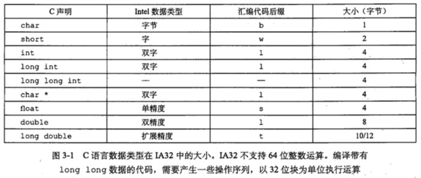

### 3.4 访问信息

一个 IA32 CPU 包含一组 8 个存储 32 位值的寄存器。这些寄存器用来存储整数数据和指针。它们的名字都以 %e 开头，不过它们都另有特殊的名字。

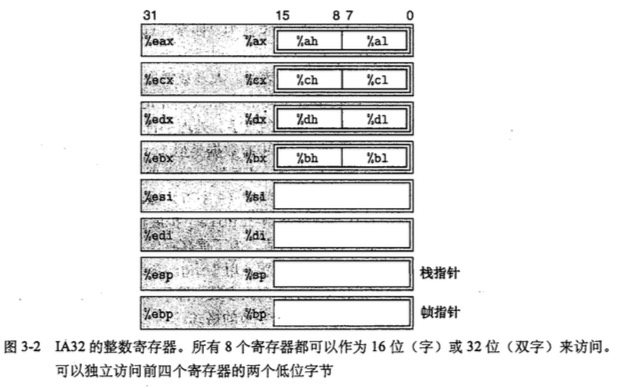

对前三个寄存器(%eax, %ecx, %edx)的保存和恢复惯例不同于接下来的三个寄存器(%ebx, %edi, %esi)。最后两个寄存器(%ebp, %esp)保存着指向程序栈中重要位置的指针。只有根据栈管理的标准惯例才能修改这两个寄存器中的值。

字节操作指令可以独立地读写前 4 个寄存器的 2 个低位字节。8086 中提供这样的特性是为了兼容 8008 和 8080。当一条字节指令更新这些单字节“寄存器元素”中的一个时，余下的 3 个字节不会改变。

#### 3.4.1 操作数指示符

大多数指令有一个或多个**操作数(operand)**，指示出执行一个操作中要引用的源数据值，以及放置结果的目标位置。操作数可能被分为三种类型：

1. 立即数(immediate)，也就是常数值
2. 寄存器(register)，表示某个寄存器的内容
3. 存储器(memory)引用，它会根据计算出来的地址访问某个存储器位置

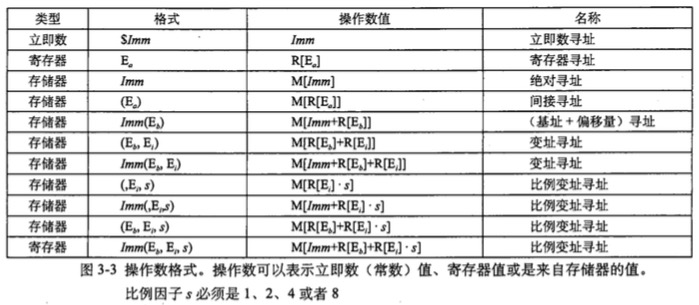

#### 3.4.2 数据传送指令

将数据从一个位置复制到另一个位置的指令是最频繁使用的指令。操作数表示的通用性使得一条简单的数据传送指令能够完成在许多机器中要好几条指令才能完成的功能。

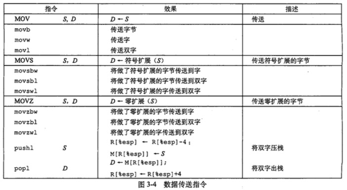

### 3.5 算术和逻辑操作

给出的每个指令类都有对字节、字和双字数据进行操作的指令。这些操作被分为四组：加载有效地址、亿元操作、二元操作和移位。

#### 3.5.1 加载有效地址

加载有效地址(load effective address)指令 leal 实际上是 movl 指令的变形。它的指令形式是从存储器读数据到寄存器，但实际上它根本就没有引用存储器。它的第一个操作数看上去是一个存储器引用，但该指令并不是从指定的位置读入数据，而是将有效地址写入到目的操作数。

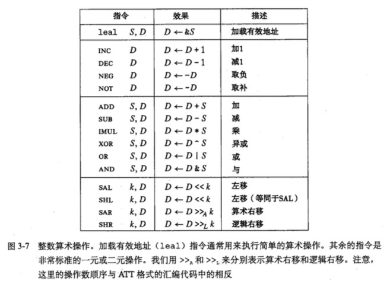

#### 3.5.2 一元操作和二元操作

一元操作：一个操作数既是源又是目的

二元操作：第二个操作数既是源又是目的

#### 3.5.3 移位操作

先给出移位量，第二项给出的是要移位的位数，可以进行算术和逻辑右移。

#### 3.5.4 讨论

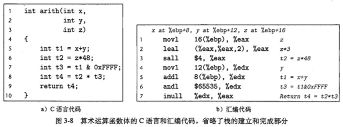

#### 3.5.5 特殊的算术操作

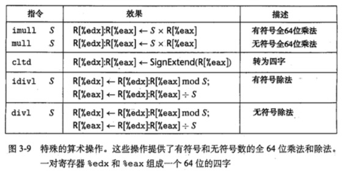

### 3.6 控制

机器代码提供两种基本的低级机制来实现有条件的行为：测试数据值，然后根据测试的结果来改变控制流或者数据流。

#### 3.6.1 条件码

除了整数寄存器，CPU 还维护着一组单个 bit 的**条件码(condition code)** 寄存器，他们描述了最近的算术或逻辑操作的属性。

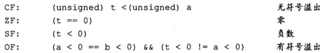

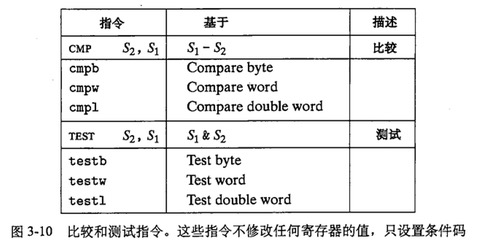

#### 3.6.2 访问条件码

条件码通常不会直接读取，常用的使用方法有三种：

1. 可以根据条件码的某个组合，将一个字节设置为 0 或者 1
2. 可以条件跳转到程序的某个其他的部分
3. 可以有条件地传送数据

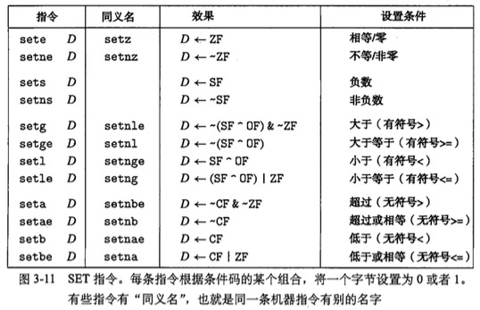

#### 3.6.3 跳转指令及其编码

跳转(jump)指令会导致执行切换到程序中的一个全新的位置。在汇编代码中，这些跳转的目的地通常用一个标号(label)指明。

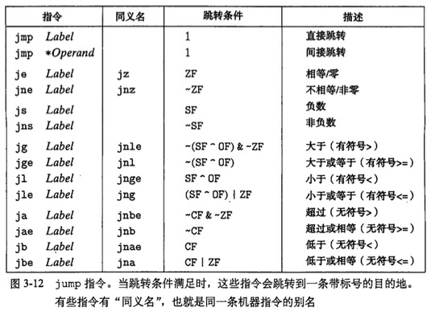

#### 3.6.4 翻译条件分支

将条件表达式和语句从 C 语言翻译成机器代码，最常用的方式是结合有条件和无条件跳转

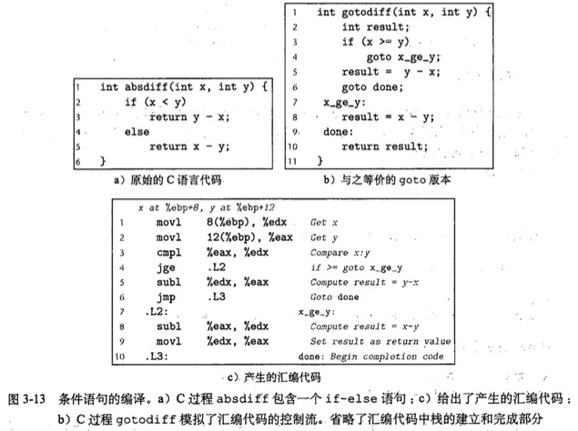

#### 3.6.5 循环

汇编中没有循环结构的指令存在，可以用条件测试和跳转组合起来实现循环的效果。大多数汇编器根据一个循环的 do-while形式来产生循环代码，即使在实际程序中这种形式用得相对较少。

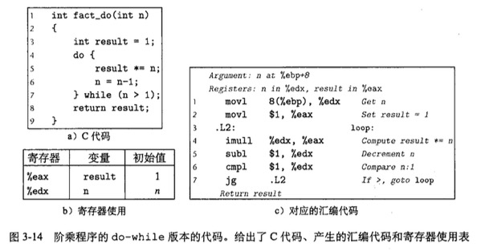

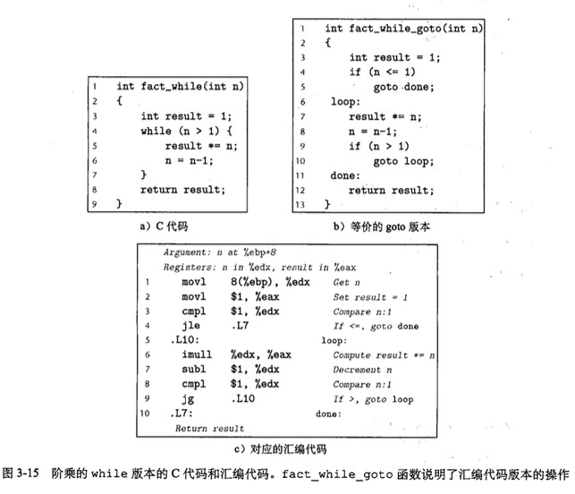

#### 3.6.6 条件传送指令

实现条件操作的传统方法是利用控制的条件转移。当条件满足时，程序沿着一条执行路径进行，反之走另一条路径。这种机制简单而通用，但是在现代处理器上，它可能会非常低效率。

数据的条件转移是一种替代的策略。这种方法先计算一个条件操作的两种结果，然后再根据条件是否满足从而选取一个。只有在一些受限制的情况下，这种策略才可行，但是如果可行，就可以用一条简单的条件传送指令来实现它。条件传送指令更好地匹配了现代处理器的性能特征。

这个机制和分支预测紧密相关。

#### 3.6.7 switch 语句

switch 语句可以根据一个整数索引值进行多重分支(multi-way branching)。不仅提高了 C 代码的可读性，而且通过使用**跳转表(jump table)**和使用一组很长的 if-else 语句相比，使用跳转表的优点是执行开关语句的时间与开关情况的数量无关。GCC 根据开关情况的数量和开关情况值的 sprsity 来翻译开关语句。

### 3.7 过程

一个过程调用包括将数据和控制从代码的一部分传递到另一部分。另外，它还必须在进入时为过程的局部变量分配空间，并在退出时释放这些空间。大多数机器，包括 IA32，只提供转移控制到过程和从过程转移出控制这种简单的指令。数据传递、局部变量的分配和释放通过操纵程序栈来实现。

#### 3.7.1 栈帧结构

IA32 程序用程序栈来支持过程调用。机器用栈来传递过程参数、存储返回信息、保存寄存器用于以后回复，以及本地存储。为单个过程分配的那部分栈称为**栈帧(stack frame)**。

假设过程 P(调用者)调用过程 Q(被调用者)，则 Q 的参数放在 P 的栈帧中。另外，当 P 调用 Q 时，P 中的**返回地址**被压入栈中，形成 P 的栈帧的末尾。返回地址就是当程序从 Q 返回时应该继续执行的地方。

#### 3.7.2 转移控制

#### 3.7.3 寄存器使用惯例

程序寄存器组是唯一能够被所有过程共享的资源。虽然在给定时刻只能有一个过程是活动的，但是我们必须保证当一个过程调用另一个过程时，被调用者不会覆盖某个调用者稍后会使用的寄存器的值。

根据惯例，寄存器 %eax、%edx、%ecx 被划分为**调用者保存**寄存器。当过程 P 调用 Q 时，Q 可以覆盖这些寄存器，而不会破坏任何 P 所需要的数据。另一方面， 寄存器 %ebx、%esi、%edi 被划分为**被调用者保存**寄存器。

#### 3.7.4 过程示例

#### 3.7.5 递归过程

### 3.8 数组分配和访问

C 语言实现数组的方式非常简单，因此很容易翻译成机器代码。C 语言一个不同寻常的特点是可以产生指向数组中元素的指针，并对这些指针进行运算。在机器代码中，这些指针会被翻译成地址计算。

优化编译器非常善于简化数组索引所使用的地址计算。不过这使得 C 代码和它机器代码的翻译之间的对应关系有些难以理解。

#### 3.8.1 基本原则

对于数据类型 T 和整型常数 N，声明如下：

	T A[N];

它有两个效果。首先，它在存储器中分配一个 L*N 字节的连续区域；这里 L 是数据类型 T 的大小(单位为字节)。可以用从 0 到 N-1 之间的整数索引来访问数组元素。数组元素 i 会被存放在地址为 xa + L * i 的地方(xa 为指向数组开头的指针)

#### 3.8.2 指针运算

C 语言允许对指针进行运算，而计算出来的值会根据该指针引用的数据类型的大小进行伸缩。也就是说，如果 p 是一个指向类型为 T 的数据的指针，p 的值为 xp，那么表达式 p+i 的值为 xp+L*i，这里 L 是数据类型 T 的大小。

#### 3.8.3 嵌套的数组

	int A[5][3];

等价于下面的声明

	typedef int row3_t[3];
	row3_t A[5];

数据类型`row3_t`被定义为一个 3 个整数的数组。数组 A 包含 5 个这样的元素，每个元素需要 12 个字节来存储 3 个整数。整个数组的大小就是 4x5x3=60 字节。

#### 3.8.4 定长数组

C 语言编译器能够优化定长多维数组上的操作代码。

#### 3.8.5 变长数组

### 3.9 异质的数据结构

C 语言提供了两种结合不同类型的对象来创建数据类型的机制：**结构(structure)**，用关键字`struct`声明，将多个对象集合到一个单位中；**联合(union)**，用关键字`union`声明，允许用几种不同的类型来引用一个对象。

#### 3.9.1 结构

创建一个数据类型，将可能不同类型的对象聚合到一个对象中。结构的各个组成部分用名字来引用。类似于数组的实现，结构的所有组成部分都存放在存储器中一段连续的区域内，而指向结构的指针就是结构第一个字节的地址。编译器维护关于每个结构类型的信息，指示每个字段(field)的字节偏移。它以这些偏移作为存储器引用指令中的位移，从而产生对结构元素的引用。

#### 3.9.2 联合

提供了一种方式，能够规避 C 语言的类型系统，允许以多种类型来引用一个对象。联合声明的语法与结构的语法一样，只不过语义相差比较大。它们是用不同的字段来引用相同的存储器块。

#### 3.9.3 数据对齐

许多计算机系统对基本数据类型合法地址做出了一些限制，要求某种类型对象的地址必须是某个值 K(通常是 2、4、8)。这种对齐限制简化了形成处理器和存储器系统之间接口的硬件设计

**强制对齐的情况**

对于大多数 IA32 指令来说，保持数据对齐能够提高效率，但是它不会影响程序的行为。另一方面，如果数据未对齐，有些实现多媒体操作的 SSE 指令就无法正确工作。

### 3.10 综合：理解指针

指针是 C 语言的一个重要特征。它们以一种统一方式，对不同数据结构中的元素产生引用。这里介绍一些指针和它们映射到机器代码的关键原则。

+ **每个指针都对应一个类型。**这个类型表明指针指向哪一类对象。
+ **每个指针都有一个值。**这个值是某个指定类型对象的地址。特殊的 NULL(0) 值表示该指针没有指向任何地方
+ **指针用 & 运算符创建。**这个运算符可以应用到任何 lvalue 类的 C 表达式上。
+ **操作符用于指针的间接引用。**其结果是一个值，它的类型与该指针的类型相关。间接引用是通过存储器引用来实现的，要么是存储到一个指定的地址，要么是从指定的地址读取。
+ **数组与指针紧密联系。**一个数组的名字可以像一个指针变量一样引用(但是不能修改)。数组引用与指针运算和间接引用有一样的效果。数组引用和指针运算都需要用对象大小对偏移量进行伸缩。
+ **将指针从一种类型强制转换成另一种类型，只改变它的类型，而不改变它的值。**强制类型转换的一个效果是改变指针运算的伸缩。来看一个例子，如果 p 是一个 char* 类型的指针，那么表达式(int*)p+7 计算为 p+28, 而(int*)(p+7)计算为 p+7。
+ 指针也可以指向函数。这提供了一个很强大的存储和向代码传递引用的功能，这些引用可以被程序的某个其他部分调用。

**函数指针**

假如我们有一个函数`int fun(int x, int *p)`，然后我们可以声明一个指针`fp`，将它赋值为这个函数：

	(int)(*fp)(int, int *);
	fp = fun;

然后用以下真真来调用这个函数

	int y = 1;
	int result = fp(3, &y);

### 3.11 应用：使用 GDB 调试器

启动 GDB:

	unix> gdb prog

### 3.12 存储器的越界引用和缓冲区溢出

C 对于数组引用不进行任何边界检查，而局部变量和状态信息，都存放在栈中。这两种情况结合到一起就可能导致严重的程序错误，对越界的数组元素的写操作会破坏存储在栈中的状态信息。当程序使用这个被破坏的状态，试图重新加载寄存器或执行 ret 指令时，就会出现很严重的错误。

缓冲区溢出的一个更加致命的使用就是让程序执行它本来不愿意执行的函数。这是一种最常见的通过计算机网络攻击系统安全的方法。通常，输入和程序一个字符串，这个字符串包含一些可执行代码的字节编码，称为**攻击代码(exploit code)，另外还有一些字节会用一个指向攻击代码的指针覆盖返回地址。那么执行 ret 指令的效果就是跳转到攻击代码。

一种攻击形式，攻击代码会使用系统调用启动一个外壳程序，给攻击者提供一组操作系统函数。另一种攻击形式是，攻击代码会执行一些未授权的任务，修复对栈的破坏，然后第二次执行 ret 指令，(表面上)正常返回给调用者。

**对抗缓冲区溢出攻击**

1.**栈随机化**

**为了在系统中插入攻击代码，攻击者不但要插入代码，还需要插入指向这段代码的指针，这个指针也是攻击字符串的一部分。产生这个指针需要知道这个字符串放置的栈地址。在过去，程序的栈地址非常容易预测。对于所有运行同样程序和操作系统版本的系统来说，在不同的机器之间，栈的位置是相当固定的。用传染病来打比方，许多系统都容易受到同一种病毒的攻击，这种现象常称作**安全单一化(security monoculture)**。

**栈随机化**的思想使得栈的位置在程序每次运行时都有变化。因此，即使许多机器都运行同样的代码，它们的栈地址都是不同的。实现的方式是：程序开始时，在栈上分配一段 0-n 字节之间的随机大小的空间。

在 Linux 系统中，栈随机化已经变成了标准行为。它是更大一类技术中的一种，这类技术称为**地址空间布局随机化(Address-Space Layout Randomization)，或者简称 ASLR。

然而一个执着的攻击者总是能够用蛮力克服随机化，他可以反复地用不同的地址进行攻击。一种常见的把戏就是在实际的攻击代码前插入很长一段的 nop 指令。执行这种指令除了对程序计数器加一，使指针指向下一条指令之外，没有任何的效果。只要攻击者能够猜中这段序列中的某个地址，程序就会经过这个序列，到达攻击代码。这个序列常用的术语是“空操作雪橇”(nop sled)。

2.**栈破坏检测**

**栈保护者(stack protector)**机制，用来检测缓冲区越界。其思想是在栈帧中任何局部缓冲区与栈状态之间存储一个特殊的__金丝雀(canary)__值，也称为__哨兵值(guard value)__，如下图所示。这个值是在程序每次运行时随机产生的，因此，攻击者没有简单的办法能够知道它是什么。在恢复寄存器状态和从函数返回之前，程序检查这个金丝雀值是否被该函数的某个操作或者该函数调用的某个函数的某个操作改变了。如果是，那么程序异常终止。

3.__限制可执行代码区域__

消除攻击者向系统中插入可执行代码的能力，只有保存编译器产生的代码的那部分妇女初期才是可执行的，其他部分可以被限制为只允许读和写

### 3.13 x86-64: 将 IA32 扩展到 64 位

IA32 的 32 位字长已经成为限制微处理器能力不断增长的主要因素。最重要的是，机器的字长定义了程序能够使用的虚拟地址范围，32 位字长就是 4GB 虚拟地址空间。现在机器很容易就可以配置 4G 以上 RAM，但是系统却不能有效利用它。

Intel 和 AMD 提供的新硬件和以这些为目标的 GCC 新版本的组合，使得 x86-64 代码与为 IA32 机器生成的代码有极大的不同。主要特性如下：

+ 指针和长整数是 64 位长。整数运算支持 8/16/32/64 位数据类型
+ 通用目的寄存器组从 8 个扩展到 16 个
+ 许多程序状态都保存在寄存器中，而不是栈上
+ 如果可能，条件操作用条件传送指令实现，会得到比传统分支代码更好的性能
+ 浮点操作用面向寄存器的指令集来实现

### 3.14 浮点程序的机器级表示

我们把存储模型、指令和传递规则的组合称为机器的__浮点体系结构__。由于 x86 处理器有很长的发展演变历史，它提供了多种浮点体系结构，目前有两种还在使用：x87 和 SSE

### 3.15 小结

机器级程序和它们的汇编代码表示，与 C 程序的差别很大。在汇编语言程序中，各种数据类型之间的差别很小。程序是以指令序列来表示的，每条指令都完成一个单独的操作。部分程序状态，如寄存器和运行时栈，对程序员来说是直接可见的。

C 语言中缺乏边界检查，使得许多程序容易出现缓冲区溢出。虽然最近的运行时系统提供了安全保护，而且编译器帮助使得程序更加安全，但是这已经使许多系统容易收到入侵者的恶意攻击。

## 第 4 章：处理器体系结构

现代微处理器可以称得上时人类创造的最复杂的系统之一。一个处理器支持的指令和指令的字节级编码称为它的__指令集体系结构(Instruction-Set Architecture, ISA)__。不同的处理器家族，有不同的 ISA。一个程序编译成在一种机器上运行。

注：这一章偏硬件实现部分将较为简略，具体参看原书。

### 4.1 Y86 指令集体系结构

定义一个指令集体系结构，包括定义各种状态元素、指令集和它们的编码、一组编程规范和异常事件处理。

#### 4.1.1 程序员可见的状态

如下图所示，Y86 程序中的每条指令都会读取或修改处理器状态的某些部分，这称为__程序员可见状态__。在处理器视线中，只要我们保证机器级程序能够访问程序员可见状态，就不需要完全按照 ISA 隐含的方式来表示和组织这个处理器状态。

Y86 处理器有 8 个程序寄存器(每个存储一个字，%esp 被入栈、出栈、调用和返回指令作为栈指针)，3 个一位的条件码(保存最近的算术或逻辑指令所造成影响的有关信息)，程序计数器 PC 存放当前正在执行指令的地址。

存储器，从概念上说就是一个很大的数组，保存这程序和数据。 Y86 程序使用__虚拟地址__来引用存储器位置。硬件和操作系统软件联合起来将虚拟地址翻译成实际或__物理地址__，指明数据实际保存在存储器中的哪个地方。

状态码 Stat 表明程序执行的总体状态，它会指示是正常运行，还是出现了某种异常。

#### 4.1.2 Y86 指令

具体说明

+ 4 个 movl 相关指令，显式指明源和目的的格式。源可以是立即数(i)、寄存器(r)或存储器(m)。指令名字的第一个字母表明了源的类型，第二个字母指明了目的类型
+ 4 个整数操作指令，即上图的 OPl，它们是 addl、subl、andl 和 xorl。它们只对寄存器数据进行操作，并设置 3 个条件码 ZF、SF 和 OF(零、符号和一处)
+ 7 个跳转指令，即上图的 jXX，它们是 jmp、jle、jl、je、jne、jge 和 jg。根据分支指令的类型和条件码的设置来选择分支
+ 6 个条件传送指令，即上图的 cmovXX：cmovle、cmovl、cmove、cmovne、cmovge 和 cmovg，只有当条件码满足所需要的约束时，才会更新目的寄存器的值
+ call 指令将返回地址入栈，然后跳到目的地址。ret 指令从这样的过程调用中返回
+ pushl 和 popl 指令实现了入栈和出栈
+ halt 指令停止指令的执行

#### 4.1.3 指令编码

每条指令需要 1~6 个字节不等，每条指令的第一个字节表明指令的类型。这个字节分为两个部分，每部分 4 位：高 4 位是__代码(code)__部分，低 4 位是__功能(function)部分__。

CISC vs RISC

### 4.2 逻辑设计和硬件控制语言 HCL

在硬件设计中，用电子电路来计算来计算对位进行运算的函数，以及在各种存储器元素中存储位。大多数现代电路技术都用信号线上的高电压或低电压来表示不同的位值。

#### 4.2.1 逻辑门

逻辑门是数字电路的基本计算元素。它们产生的输出，等于它们输入位值的某个布尔函数。

#### 4.2.2 组合电路和 HCL 布尔表达式

将很多的逻辑门组合成一个网，就能构建计算块(computational block)，称为__组合电路(combinational circuits)__。构建这些网有两条限制：

+ 两个或多个逻辑门的输出不能连接在一起。否则它们可能会使线上的信号矛盾，可能会导致一个不合法的电压或电路故障
+ 这个网必须是无环的。也就是在网中不能有路径经过一系列的门而形成一个回路，这样的回路会导致该网络计算的函数有歧义。

#### 4.2.3 字级的组合电路和 HCL 整数表达式

通过将逻辑门组合成大的网，可以构造出能计算更加复杂函数的组合电路。

### 4.3 Y86 的顺序实现

将处理组织成阶段

取指(fetch)、译码(decode)、执行(execute)、访存(memory)、写回(write back)、更新 PC(PC update)

### 4.4 流水线的通用原理

参考 Foundation of Computer Architecture，此略

### 4.5 Y86 的流水线实现

具体实现不要在意这些细节，此略

### 4.6 小结

有关处理器设计的几个重要经验：

+ 管理复杂性是首要问题。想要优化使用硬件资源，在最小的成本下获得最大的性能
+ 我们不需要直接实现 ISA
+ 硬件设计人员必须非常谨慎小心

## 第 5 章：优化程序性能

> 你能获得的对程序最大的加速比就是当你第一次让它工作起来的时候。 —— John K.Ousterhout

写程序最主要的目标就是使它在所有可能的情况下都正确工作。程序员必须写出清晰简洁的代码，这样做不仅是为了程序员能够看懂代码，也是为了在检查代码和今后需要修改代码时，其他人能够读懂和理解代码。

编写高效程序需要几类活动：第一，我们必须选择一组合适的算法和数据结构。第二，我们必须编写出编译器能够有效优化以转换成搞笑可执行代码的源代码。对于第二点，理解优化编译器的能力和局限性是很重要的。

在程序开发和优化的过程中，我们必须考虑代码使用的方式，以及影响它的关键因素。通常，程序员必须在实现和维护程序的简单性与它的运行速度之间做出权衡。

程序优化的第一步就是消除不必要的内容，让代码尽可能有效地执行它期望的工作。这包括消除不必要的函数调用、条件测试和存储器引用。这些优化不依赖于目标机器的任何具体属性。

研究程序的汇编代码表示，是理解编译器，以及产生的代码如何运行的最有效的手段之一。仔细研究内循环的代码是一个很好的开端。

### 5.1 优化编译器的能力和局限性

现代编译器运用复杂精细的算法来确定一个程序中计算的是什么值，以及它们是被如何使用的。然后它们会利用一些机会来简化表达式，在几个不同的地方使用同一个计算，以及降低一个给定的计算必须被执行的次数。

限制编译器只进行安全的优化，消除了一些造成不希望的运行时行为的可能原因，但这也意味着程序员必须花费更大的力气写出程序使编译器能够将之转换成有效机器代码。请看下面这个例子

	void twiddle1(int *xp, int *yp){
		*xp += *yp;
		*xp += *yp;
	}

	void twiddle2(int *xp, int *yp){
		*xp += 2* *yp
	}

初看这两个函数似乎有相同的行为，都是将存储在由指针 yp 指示的位置除的值两次加到指针 xp 指示的位置处的值。另一方面，函数 twiddle2 的效率更高一些，它只要求 3 次存储器引用(读 *xp，读 *yp，写 *xp)，而 twiddle1 需要 6 次。不过，当 xp 等于 yp 时，这两个函数的执行结果则会不一致，twiddle1 使 xp 的值增加 4 倍，而 twiddle2 则是 3 倍，因此，编译器不能产生 twiddle2 风格的代码作为 twiddle1 的优化版本。

这种两个指针可能指向同一个存储器位置的情况称为__存储器别名使用(memory aliasing)__。在只执行安全的优化中，编译器必须假设不同的指针可能会指向存储器中同一个位置。

第二个妨碍优化的因素是函数调用，例如：

	int f();

	int func1(){
		return f() + f() + f() + f();
	}

	int func2(){
		return 4*f();
	}

最初看上去两个过程计算都是相同的结果，但是 func2 只调用 f1 一次，比 func2 的四次要好。不过，考虑下面 f 的代码：

	int counter = 0;

	int f(){
		return counter++;
	}

这个函数有个副作用——它修改了全局程序状态的一部分。改变调用它的次数会改变程序的行为。所以，编译器会假设最早的情况，并保持所有函数调用不变。

### 5.2 表示程序性能

我们引入度量标准__每元素的周期数(Cycles Per Element, CPE)__作为一种表示性能并指导我们改进代码的方法。处理器活动的顺序是由时钟控制的，时钟提供了某个频率的规律信号，通常用__千兆赫兹(GHz)__，即十亿周期每秒来表示。CPE 越小越好。

许多过程含有在一组元素上迭代的循环。如下图中的函数 psum1 和 psum2 计算都是一个长度为 n 的向量的前置和(prefix sum)，对于向量 a={a0,a1,...,an-1}，前置和 p={p0,p1,...pn-1}定义为

	p0 = a0
	pi = pi-1 + ai, 1<= i < n

函数 psum1 每次迭代计算结果向量的一个元素，第二个函数使用__循环展开(loop unrolling)__的技术，每次迭代计算两个元素。

我们发现，psum1 和 psum2 的运行时间(以时钟周期为单位)分辨近似于等式 496+10.0n 和 500+6.5n。

### 5.3 程序示例

考虑如下图所示的简单向量数据结构，由两个存储器块表示：头部和数据数组。头部是一个声明如下的结构

这个声明用数据类型 data_t 作为基本元素的数据类型。例如 `typedef int data_t`。

对向量元素求和

	#define IDENT 0
	#define OP +

对向量元素求积

	#define IDENT 1
	#define OP *

我们会进行一组变换，发现有很多智能带来很小的性能提高，而其他的能带来更巨大的效果。确定该使用哪些变换的组合确实是编写快速代码的魔术(black art)。

未经优化的代码是从 C 语言代码到机器代码的直接翻译，通常有明显的低效率。简单地使用命令行选项 `-O1`，就会进行一些基本的优化，可以显著提高性能。

### 5.4 消除循环的低效率

可以观察到，过程 combine1 调用函数 `vec_length` 作为 for 循环的测试条件。我们其实可以只计算一次向量的长度，然后在我们的测试条件中都使用这个值。如下图所示：

这个优化是一类常见的优化的一个例子，称为__代码移动(code motion)__。这类优化包括识别要执行多次(例如在循环里)但是计算结果不会改变的计算。因而可以将计算移动到代码前面不会被多次求值的部分。

编程时一个常见的问题就是一个看上去无足轻重的代码片段有隐藏的渐进低效率(asymptotic inefficiency)

### 5.5 减少过程调用

过程调用会代码相当大的开销，而且妨碍大多数形式的程序优化。从上图可以看出，每次循环迭代都会调用 `get_vec_element` 来获取下一个向量元素。我们可以直接访问数组，而不是利用函数调用并加上边界检查：

### 5.6 消除不必要的存储器引用

累加过程中其实没有必要每次都把结果写入到 dest 中，可以使用一个临时变量，消除不必要的存储器引用：

### 5.7 理解现代处理器

要想获得充分提高的性能，需要仔细地分析程序，同时代码的生成也要针对目标处理器进行调整。由于可以将大量的晶体管继承到一块新品啊上，现代微处理器采用了复杂的硬件，试图使程序性能最大化。带来的一个后果就是处理器的实际操作与观察机器级程序锁察觉到的大相径庭。在代码级上，看上去似乎是一次执行一条指令，每条指令都包括从寄存器或存储器取值，执行一个操作，并把结果存回到一个寄存器或存储器位置。在实际的处理器中，是同时对多条指令求值，这个现象称为__指令级并行__。现代微处理器取得的了不起的功绩之一是：它们采用复杂而奇异的微处理器结构，其中，多条指令可以并行地执行，同时又呈现一种简单地顺序执行指令的表象。

两种下界描述了程序的最大性能。当一系列操作必须按照严格顺序执行时，就会遇到__延迟界限(latency bound)__，因为在下一条指令开始之前，这条指令必须结束。当代码中的数据相关限制了处理器利用指令级并行的能力时，延迟界限能够限定程序性能。__吞吐量界限(throughput bound)__刻画了处理器功能单元的原始计算能力。这个界限是程序性能的终极限制。

#### 5.7.1 整体操作

Nehalem 微体系结构是 20 世纪 90 年代以来，许多制造商生产的典型的高端处理器。在工业界称为超标量(superscalar)，意思是可以在每个时钟周期执行多个操作，而且是乱序的(out-of-order)，意思就是指令执行的顺序不一定要与它们在机器级程序中的顺序一致。整个设计有两个主要部分：指令控制单元(Instruction Control Unit, ICU)和执行单元(Execution Unit, EU)。前者负责从存储器中读出指令序列，并根据这些指令序列生成一组针对程序数据的基本操作；而后执行这些操作。

ICU 从指令高速缓存(instruction cache)中读取指令。指令高速缓存是一个特殊的高速缓存存储器，它包含最近访问的指令。通常，ICU 会在当前正在的指令很早之前取指，这样它才有足够的时间对指令译码，并把操作发送到 EU。不过，一个问题是党程序遇到分支时，程序有两个可能的前进方向。一种可能会选择分支，控制被传递到分支目标。另一种可能是，不选择分支，控制被传递到指令序列的下一条指令。现代处理器采用了一种称为__分支预测(branch prediction)__的技术__，处理区会猜测是否会选择分支，同时还预测分支的目标地址。使用__投机执行(speculative execution)__的技术，处理器会开始取出位于它预测的分支会跳到的地方的指令，并对指令译码，甚至在它确定分支预测是否正确之前就开始执行这些操作。如果过后确定分支预测错误，会将状态重新设置到分支点的状态，并开始取出和执行另一个方向上的指令。

#### 5.7.2 功能单元的特性

每个运算都是由两个周期计数值来刻画的：一个是延迟(latency)，它表示完成运算所需要的总时间；另一个是发射时间(issue time)，它表示两个连续的同类型运算之间需要的最小时钟周期数。随着字长的增加，对于更复杂的数据类型，对于更复杂的运算，延迟也会增加。

#### 5.7.3 处理器操作的抽象模型

我们会使用程序的数据流(data-flow)表示，作为分析在现代处理器上执行的机器级程序性能的一个工具，这是一种图形化的表示方法，展现了不同操作之间的数据相关是如何限制它们的执行顺序的。这种限制形成了图中的__关键路径(critical path)__，这是执行一组机器指令所需时钟周期数的一个下界。

### 5.8 循环展开

循环展开是一种程序变换，通过增加每次迭代计算的元素的数量，减少循环的迭代次数。循环展开能够从两个方面改善程序的性能。首先，它减少了不直接有助于程序结果的操作的数量，例如循环索引计算和条件分支。其次，它提供了一些方法，可以进一步变化代码，减少整个计算中关键路径上的操作数量。

### 5.9 提高并行性

对于一个可结合和可交互的合并运算来说，比如说整数加法或乘法，我们可以通过将一组合并运算分割成两个或更多的部分，并在最后合并结果来提高性能。

### 5.10 优化合并代码的结果小结

此略

### 5.11 一些限制因素

+ 寄存器溢出
+ 分支预测和预测错误处罚

通用原则：

+ 不要过分关心可预测的分支
+ 书写适合用条件传送实现的代码

### 5.12 理解存储器性能

现代处理器有专门的功能单元来执行加载和存储操作，这些单元有内部的缓冲区来保存未完成的存储器操作请求集合。

#### 5.12.1 加载的性能

一个包含加载操作的程序的性能既依赖于流水线的能力，也依赖于加载单元的延迟

#### 5.12.2 存储的性能

存储操作将一个寄存器值写到存储器。

### 5.13 应用：性能提高技术

1. 高级设计。为遇到的问题选择适当的算法和数据结构。要特别警觉，避免使用那些会渐进地产生糟糕性能的算法或编码技术。
2. 基本编码原则。避免限制优化的因素，这样编译器就能产生高效的代码。
	+ 消除连续的函数调用。在可能时，将计算移到循环外。考虑有选择地拖鞋程序的模块性以获得更大的效率
	+ 消除不必要的存储器引用。引入临时变量来保存中间结果。只有在最后的值计算出来时，才将结果存放到数组或全局变量中
3. 低级优化
	+ 展开循环，降低开销，并且使得进一步的优化成为可能
	+ 通过使用多个累积变量和重新结合等技术，找到方法提高指令级并行
	+ 用功能的风格重写条件操作，使得编译采用条件数据传送

### 5.14 确定和消除性能瓶颈

系统优化的通用原则：Amdahl's law

Unix 的程序剖析(profiling)工具 GPROF。这个程序产生两种形式的信息。首先，它确定程序中每个函数花费了多少 CPU 时间。其次，它计算每个函数被调用的次数，以执行调用的函数来分类。

运行时需要三个步骤

1. 程序必须为剖析而编译和链接，加上 `-pg`: `unix> gcc -O1 -pg prog.c -o prog`
2. 然后像往常一样执行：`unix> ./prog file.txt`，会产生额外的文件 `gmon.out`
3. 调用 GPROF 来分析 `gmon.out` 中的数据：`unix> gprof prog`

具体的用法请参考书本或者网上的例子，此略

### 5.15 小结

没有任何编译器能用一个好的算法或数据结构代替低效率的算法或数据结构，因此程序设计时的这些方面仍然应该是程序员主要关心的。

## 第 6 章 存储器层次结构

存储器系统(memory system)是一个具有不同容量、成本和访问时间的存储设备的层次结构。CPU 寄存器保存着最常用的数据。靠近 CPU 的晓得、快速的__高速缓存存储器(cache memory)__作为一部分存储在相对慢速的主存储器(main memory)中的数据和指令的缓冲区域。主存暂时存放在容量较大的、慢速磁盘上的数据，而这些磁盘常常又作为存储在通过网络连接的其他机器的磁盘或磁带上的区域的缓冲区域。

如果你理解了系统是如何将数据在存储器层次结构中上上下下移动的，那么你就可以编写你的应用程序，使得它们的数据项存储在层次结构中较高的地方，在那里 CPU 能更快地访问到它们。

这个思想围绕着计算机程序的一个称为__局部性(locality)__的基本属性。具有良好局部性的程序倾向于一次又一次地访问相同的数据项集合，或是倾向于访问临近的数据项集合。

### 6.1 存储技术

计算机技术的成功很大程度上源自于存储技术的巨大进步。

#### 6.1.1 随机访问存储器

随机访问存储器	(Random-Access Memory, RAM)分为两类：静态的和懂啊提的。SRAM 比 DRAM 更快，但也贵得多。SRAM 用来作为高速缓存存储器，既可以在 CPU 芯片上，也可以在片下。DRAM 用来作为主存以及图形系统的帧缓冲区。

#### 6.1.2 磁盘存储

这个快被淘汰了，过

#### 6.1.3 固态硬盘

固态硬盘(Solid State Disk, SSD)是一种基于闪存的存储技术。一个 SSD 包由一个或多个闪存芯片和闪存翻译层(flash translation layer)组成，闪存芯片代替传统旋转磁盘中的机械驱动器，而闪存翻译层是一个硬件/固件设备，扮演与磁盘控制器相同的角色，将对逻辑块的清酒翻译成对底层物理设备的访问。

SSD 有着与旋转磁盘不同的性能特征。顺序读和写性能相当，不过，当按照随机顺序访问逻辑块时，写比读慢一个数量级。随机读和写的性能差别是由底层闪存基本属性决定的。如上图所示，一个闪存由 B 个块的序列组成，每个块由 P 页组成。通常，页的大小是 512~4KB，块是由 32~128 页组成的，块的大小为 16~512 KB。数据是以页为单位读写的。只有在一页所属的块整个被擦除之后，才能写这一页。不过，一旦一个块被擦除了，块中的每一个页都可以不需要再进行擦除就写一次。在大约进行 100000 次重复写之后，块就会磨损坏。

#### 6.1.4 存储技术趋势

+ 不同的存储技术有不同的价格和性能折中
+ 不同的存储技术的价格和性能属性一截然不同的速率变化着
+ DRAM 和磁盘的性能滞后于 CPU 的性能

### 6.2 局部性

一个编写良好的计算机程序常常具有良好的局部性(locality)。也就是说，它们倾向于引用临近于其他最近引用过的数据项的数据项，或者最近引用过的数据项本身。这种倾向性，被称为__局部性原理(principle of locality)__，是一个持久的概念，对硬件和软件系统的设计和性能都有着极大的影响。

局部性通常有两种不同的形式：__时间局部性(temporal locality)__和__空间局部性(spatial locality)__。有良好局部性的程序比局部性差的程序运行得更快。

+ 重复引用同一个变量的程序有良好的时间局部性
+ 对于具有步长为 k 的引用模式的程序，步长越小，空间局部性越好
+ 对于取指令来说，循环有好的时间和空间局部性。循环体越小，循环迭代次数越多，局部性越好

### 6.3 存储器层次结构

存储器层次结构(memory hierarchy)如下图所示

#### 6.3.1 存储器层次结构中的缓存

一般而言，高速缓存(cache)是一个小而快速的存储设备。使用高速缓存的过程称为缓存(caching)。 

存储器层次结构的中心思想是，对于每个 k，位于 k 层的更快更小的存储设备作为位于 k+1 层的更大更慢的存储设备的缓存。换句话说，层次结构中的每一次都缓存来自较低一层的数据对象。

数据总是以块大小为__传送单元(transfer unit)__在第 k 层和第 k+1 层之间来回拷贝的。虽然在层次结构中任何一对相邻的层次之间块大小是固定的，但是其他的层次对之间可以用不同的块大小。一般而言，层次结构较低的层(离 CPU 较远)的设备访问时间较长，因此为了补偿这些较长的访问时间，倾向于使用较大的块。

__缓存命中__

当程序需要第 k+1 层的某个数据对象 d 时，它首先在当前存储的第 k 层的一个块中查找 d。如果 d 刚好缓存在第 k 层中，那么就是__缓存命中(cache hit)__。

__缓存不命中__

如果第 k 层中没有缓存数据对象 d，那么就是__缓存不命中(cache miss)__。当发生 cache miss 时，会从下一次取出包含 d 的那个块，如果第 k 层的缓存已经满了的话，可能就会覆盖现存的一个块。

覆盖一个现存的块的过程称为__替换(replacing)__或__驱逐(evicting)__。被驱逐的看这个块有时也称为__牺牲块(victim block)__。决定该替换那个块是由缓存的__替换策略(replacement policy)__来控制的。(LRU, LFU 等等替换策略在这里可以使用)

__缓存不命中的种类__

一个空的缓存有时称为__冷缓存(cold cache)__，此类不命中称为__compulsory miss__ 或 __cold miss__。

只要发生了 cache miss，第 k 层的缓存就必须执行某个__放置策略(placement policy)__，确定把它从第 k+1 层中取出的块放在哪里。一般来说是用映射来确定放在哪里，如果两个不同的块映射到同一个位置，就引起了 conflict miss。当工作集的大小超过缓存的大小时，就会有 capacity miss。

### 6.4 高速缓存存储器

早期计算机系统的存储器结构只有三层：CPU 寄存器、DRAM 主存储器和磁盘存储。不过，由于 CPU 和主存之间逐渐增大的差距，系统设计者被迫在 CPU 寄存器文件和主存之间插入了一个小的 SRAM 高速缓存存储器，称为 L1 高速缓存。之后又插入了一个更大的高速缓存，称为 L2 高速缓存，之后还有 L3 高速缓存。周期数：L1(2~4), L2(~10), L3(~30~40) 

### 6.5 编写高速缓存友好的代码

+ 让最常见的情况运行得快
+ 在每个循环内部缓存不命中数量最小

### 6.6 综合：高速缓存对程序性能的影响

#### 6.6.1 存储器山

一个程序从存储系统中读数据的速率称为__度吞吐量(read throughput)__，或者有时称为__读带宽(read bandwidth)__。

#### 6.6.2 重新排列循环以提高空间局部性

矩阵的循环优化，略

#### 6.6.3 在程序中利用局部性

+ 将你的注意力集中在内循环上，大部分计算和存储器访问都发生在这里
+ 通过按照数据对象存储在存储器中的顺序、以步长为 1 的来读数据，从而使得程序中的空间局部性最大
+ 一旦从存储器中读入了一个数据对象，就尽可能多地使用它，从而使得程序中的时间局部性最大

### 6.7 小结

程序员可以通过编写有良好空间和时间局部性的程序来显著地改进程序的运行时间。利用基于 SRAM 的高速缓存存储器特别重要。

# 第二部分：在系统上运行程序

## 第七章：链接

链接(linking)是将各种代码和数据部分收集起来并组合成为一个单一文件的过程，这个文件可被加载到存储器并执行。链接可以执行于编译时(compile time)，也可以执行于加载时(load time)，甚至执行于运行时(run time)。

链接器在软件开发中扮演着一个关键的角色，因为它们使得分离编译(separate compilation)成为可能。

### 7.1 编译器驱动程序

大多数编译系统提供__编译驱动程序(compiler driver)__，它代表用户在需要时调用语言预处理器、编译器、汇编器和链接器。

### 7.2 静态连接

静态链接器(static linker)以一组可重定位目标文件和命令行参数作为输入，生成一个完全链接的可以加载和运行的可执行目标文件作为输出。输入的可重定位目标文件由各种不同的代码和数据节(section)组成。指令在一个 section 中，初始化的全局变量在另一个 section 中，而未初始化的变量又在另一个 section 中。

为了构造可执行文件，链接器必须完成两个主要任务：

+ 符号解析(symbol resolution)。目标文件定义和引用符号。符号解析的目的是将每个符号引用刚好和一个符号定义联系起来。
+ 重定位(relocation)。编译器和汇编器生成从地址 0 开始的代码和数据节。链接器通过把每个符号定义域一个存储器位置联系起来，然后修改所有对这些符号的引用，使得它们指向这个存储器位置，从而重定位这些节。

关于链接器的一些基本事实：目标文件纯粹是字节块的集合。这些块中，有些包含程序代码，有些则包含程序数据，而其他的则包含指导链接器和加载器的数据结构。链接器将这些块连接起来，确定被连接块的运行时位置，并且修改代码和数据块中的各种位置。链接器对目标机器了解甚少。产生目标文件的编译器和汇编器已经完成了大部分工作。

### 7.3 目标文件

目标文件有三种形式：

+ 可重定位目标文件。包含二进制代码和数据，其形式可以在编译时与其他可重定位目标文件合并起来，创建一个可执行目标文件。
+ 可执行目标文件。包含二进制代码和数据，其形式可以被直接拷贝到存储器并执行。
+ 共享目标文件。一种特殊类型的可重定位目标文件，可以在加载或者运行时被动态地加载到存储器并链接。

### 7.4 可重定位目标文件

下图是一个典型的 ELF 可重定位目标文件的格式。ELF 头(ELF header)以一个 16 字节的序列开始，这个序列描述了生成该文件的系统的字的大小和字节顺序。

### 7.5 符号和符号表

每个可重定位目标模块 m 都有一个符号表，它包含 m 所定义和引用的符号的信息。在链接器的上下文中，有三种不同的符号：

+ 由 m 定义并能被其他模块引用的全局符号。全局链接器符号对应于非静态的 C 函数以及被定义为不带 C static 属性的全局变量
+ 由其他模块定义的并被模块 m 引用的全局符号。这些符号称为外部符号(external)，对应于定义在其他模块中的 C 函数和变量。
+ 只被模块 m 定义和引用的本地符号。有的本地链接器符号对应于带 static 属性的 C 函数和全局变量。

C 程序员使用 static 属性在模块内部隐藏变量和函数声明。

### 7.6 符号解析

链接器解析符号引用的方法是将每个引用与它输入的可重定位目标文件的符号表中的一个确定的符号定义联系起来。对那些和引用定义在相同模块中的本地符号的引用，符号解析是非常简单明了的。编译器只允许每个模块中每个本地符号只有一个定义。编译器还确保静态本地变量，它们也会有本地链接器符号，拥有唯一的名字。

### 7.7 重定位

一旦链接器完成了符号解析这一步，它就把代码中的每个符号引用和确定的一个符号定义联系起来。在此时，链接器就知道它的输入目标模块中的代码节和数据节的确切大小。重定位由两步组成：

+ 重定位节和符号定义
+ 重定位节中的符号引用

### 7.8 可执行目标文件

可执行目标文件的格式类似于可重定位目标文件的格式，如下图所示。ELF 头部描述文件的总体格式。它还包括程序的入口点(entry point)，也就是当程序要执行的第一条指令的地址。

### 7.9 加载可执行目标文件

要允许可执行目标文件 p，可以在 Unix 外壳的命令行中输入它的名字

	unix> ./p

因为 p 不是一个内置的外壳命令，所以外壳会认为 p 是一个可执行目标文件，通过调用某个驻留在存储器中称为加载器(loader)的操作系统代码来运行它。任何 Unix 程序都可以通过调用 execve 函数来调用加载器。加载器将可执行目标文件中的代码和数据从磁盘拷贝到存储器，然后通过跳转到程序的第一条指令或入口点(entry point)来运行该程序。这个将程序拷贝到存储器并运行的过程叫做加载(loading)。

每个 Unix 程序都有一个运行时存储器映像，如上图所示。在 32 位 Linux 系统中，代码段总是从地址 0x08048000 处开始。数据段是在接下来的下一个 4KB 对齐的地址处。运行时__堆__再读/写段之后接下来的第一个 4KB 对齐的地址处，并通过调用 malloc 库往上增长。还有一个段是为共享库保留的。用户栈总是从最大的合法用户地址开始，向下增长的(向低存储器地址方向增长)。从栈的上部开始的段是为操作系统主流存储器的部分(也就是内核)的代码和数据保留的。

### 7.10 动态链接共享库

共享库(shared library)是致力于解决静态库缺陷的一个现代穿心产物

