**五角星是最特殊的几何图案，因为它是今天世界普遍使用最多的政治识别符号，其演变成今日的用途，有两条线索：金星和马刺。**  

  

文/刘大可

  

五角星是幼儿园的小孩子都能一笔画出来的简单几何形状。

  

这种一笔画的星星在数学上称为“规则星形多边形”，五角星是边数最少的规则星形多边形，下一个能一笔画的规则星形多边形有7个尖，就已经很难将其画得匀称了。

  

**五角星、六角星和两种七角星，六角星虽然事实上也可以一笔画，但至少要拐7个弯，多于角数，不能称作一笔画的规则星形多边形**

  

**天空中的神圣轨迹**

五角星是人类最早掌握的几何形状之一。两河流域公元前36世纪的楔形文字泥板上就已有了这个符号，意思是“夹角、小空间、地窖”，后来又根据形状引申为“上天统领四方
”，成为王权象征。

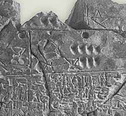

**5500年历史的楔形文字泥板，右上角是已知最古老的五角星符号，发掘于古城乌鲁克（Ur）**

  

如果五角星符号起源于两河流域，它最早的形象或许与金星有关。

**金星东经180度的照片，麦哲伦综合孔径雷达拍摄**

  

金星是距离地球最近的行星，其大气中漂浮着反光率很高的硫酸云，这让它成为天空中仅次于日月的明亮天体，夜观天象的古人很容易对它产生强烈的神圣感。

  

不少古代文明均把金星视作战争的象征：玛雅人认为金星与战争有关，用它占卜城邦大事，甚至根据金星的运动制定了584天一个周期的历法；中国人把金星称作“太白”，白
帝少昊的儿子，阴阳家解作战神；在古老的两河流域，金星是崇高的女神伊南娜（Inanna），主管丰饶、性爱和战争。

  

两河流域的先民发现，连接金星在天空中最中明亮的位置，竟然是个完美的五角星——地球围绕太阳公转8周，金星刚好公转13周，于是从地球上看去，金星就在天空中画起了
五角星。

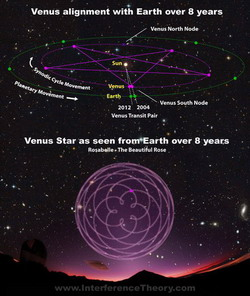

**金星五角星的图示：上图是五个近地点的连接，下图是金星在天空中运行的轨迹**

  

由于金星女神，五角星也获得神圣的地位——不过，由于在地球上观测金星的周期是8年，八角星也被视为伊南娜的标志，甚至比五角星更常见，某些时候还会画成六角星。

  

对金星女神的崇拜后来从两河流域扩散到整个地中海地区（见大象公会《女神之变：从性欲到爱与美》），金星女神在罗马神话中演变为维纳斯，金星在西方各国语言里也被广泛
称作“Venus”，五角星也随之在罗马帝国流行起来。

  

公元4世纪，基督教成为罗马帝国国教。已有的文化符号重新被赋予基督教内涵，比如波斯光明神信仰中的主神诞生日变成了圣诞节，犹太人的逾越节变成了复活节，五角星同样
被基督教化。

  

在基督教中，五角星被用来象征耶稣基督的五种感觉、受难时的五道伤口，圣母玛利亚与耶稣在一起的欢喜五端，尤其是后者，维纳斯崇拜中的祭祀植物玫瑰花、催情药桃金娘，
以及象征高贵优雅的白天鹅等文化符号，都与五角星一起联系到了圣母玛利亚身上。

  

**神秘力量的魔法符号**  

五角星的“发迹”远不止这一条线索，除了天文观测上的巧合，它在数学上的“天赋”也很重要。

  

公元前6世纪，古希腊毕达哥拉斯学派就发现五角星与黄金分割有密切联系。五角星上能找到4种长度的线段，从小到大依次排列起来，那么任意相邻两个长度的比值都刚好是黄
金比例，这实在是件美妙的事。

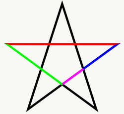

**红:绿 = 绿:洋红 = 洋红:蓝 = 黄金比例**

  

在古希腊形而上学体系中，几何学被视为超脱于物质世界，直接来自众神精神世界的高等知识（因为研究几何学几乎不需要观察任何实体），几何的美感就等价于神圣，五角星的
黄金美感很自然地让它成为完美的象征，充满神力的符号。

  

在希腊文化末期，五角星形状上的“上天统领四方”与元素学说结合起来，向上的角表示“以太”、至善、神意，它统领着象征水、火、土、气的其它四角，这与基督教上帝的意
志统领万物不谋而合，五角星在中世纪就成为一个神圣的魔法符号。

  

不过，虽然今天文学和影视中经常出现中世纪的魔法，但中世纪最初的500多年里，欧洲都没什么“魔法”。当时教会制止一切神秘行为，甚至连魔术师和杂技演员都会被驱逐
，当罗马帝国灭亡时，这种神秘主义的知识也随着失传了。

  

此时，阿拉伯帝国却迎来了黄金时代。早期伊斯兰世界开明包容，它在地中海东岸扩张的同时大量继承了古希腊文明成果，当然也包括精妙的神秘主义，又融合了波斯、印度乃至
中国的秘术，逐渐发展出一套庞大的占星术、炼金术系统。

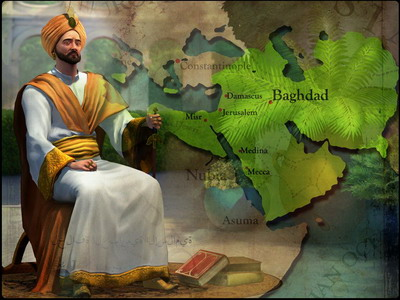

**哈伦•拉希德(Harun al-Rashid, 763-809)在游戏《文明5》中代表阿拉伯文明，他在唐明皇李隆基死后第二年出生，并重蹈了他的覆辙：年轻时将帝国推向极盛，晚年罢免了重要的宰相，将帝国推向衰退，最终分裂**

  

成书于9世纪前后的《一千零一夜》中，水手辛巴达向阿巴斯王朝五代哈里发哈伦•拉希德呈送了一个底部印有“所罗门之印”的杯子，看上去是一个六角星套在圆圈里，如下图
：

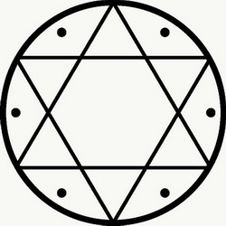

**一个简单的所罗门之印**

  

这个所罗门就是《旧约》中公元前10世纪的古以色列国王所罗门，他的父亲就是米开朗基罗的作品《大卫》，据记载所罗门是耶路撒冷第一圣殿的建造者，拥有无穷的智慧、财
富和权力。伊斯兰教同样尊奉他是伟大的先知，认为他有无穷的智慧和法力，于是将犹太教中代表所罗门的六角星当作了富有魔力的封印。

  

这个封印当然没有一直留在阿拉伯，11世纪以后，基督教世界发动了数次十字军东征，无意中引发了知识的逆向输入——阿拉伯世界中的古希腊典籍重新回到欧洲，当然也包括
炼金术、占星术等神秘主义知识。例如五角星顶角象征的“以太”最早出自亚里士多德，此时已成了点金石和长生不老药，《哈利波特》系列第一本的“魔法石”说的就是它。

  

没错，中世纪炼金术、占星术等种种魔法，大都是与阿拉伯世界接触的结果，它们绝大部分甚至是文艺复兴乃至近代的产物，其中就有一个戏份十足的五角星——欧洲版的“所罗
门之印”：

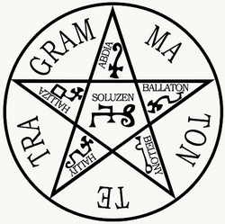

**五角星形式的“所罗门之印”（Seal of Solomon），周围的字母是“Tetragrammaton”（四字神名），耶和华名字的代称，5个单词是魔法力量的声明**

  

这个五角星版的所罗门之印出自一本14到15世纪的神秘学著作《所罗门之钥》，该书假托所罗门王之名，融合了犹太教卡巴拉神秘主义、阿拉伯炼金术和占星术，记录了大量
的魔法、咒语、封印，是文艺复兴时期魔法传说的扛鼎之作，后世欧洲的魔法传说都多多少少都以它为蓝本，五角星作为强大的魔法印记也获得了承认。

  

但对现代人来说，中世纪的五角星印似乎总是和黑魔法、恶魔、撒旦这样的关键字联系在一起登陆荧屏，这就不得不提到另外一个附会了。

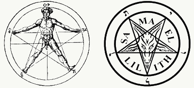

**文艺复兴神哲学家阿格里帕•冯•内特斯海姆（Agrippa von Nettesheim，1486－1535）1501年在魔法论文《神秘哲学三书》里的插图（左）和法国神秘学家伊莱•利维（Eliphas Levi）1897年在《黑魔法谱录》（La Clef de la Magie Noire）里的插图**

  

上面两个插图是这种对比变化的直观说明：文艺复兴时期作为白魔法，与人体和精神联系在一起的五角星符号，到了19世纪末却颠倒过来变成了黑魔法的符号——事实上，右边
那个图案正是第一个与山羊头组合在一起的倒置五角星。

  

这种从没有过的用法，要归功于图案的设计者法国人伊莱•利维，这位神秘学家对撒旦教影响深远的，正是他发明了五角星头朝下代表恶魔的说辞。

  

它的逻辑倒也很清晰：既然正置的五角星与基督、神圣、美感、智慧联系在一起，那么将它倒过来自然就汇集了一切相反的含义。图案中的黑山羊头除了被看作恶魔的象征，它本
身也很像一个倒置的五角星——以至于它成了现代撒旦教的官方标志。

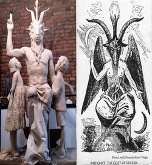

**2012年，撒旦教徒准备在俄克拉荷马州议会大厦外面树立一座撒旦教纪念碑（左），它也源自伊莱•利维的作品《安息日之羊》（右）**

  

伊莱•利维的黑魔法研究在西方世界掀起了一轮黑魔法复兴热，除了恶魔五角星，他塑造的大恶魔“巴风特”形象也大获成功，成了撒旦教的“吉祥物”——这原本是一个十字军
东征带回来的魔法形象，在伊莱•利维笔下，大恶魔“巴风特”额头上赫然是一枚五角星。

  

这次黑魔法复兴恰逢欧美一战前的黄金时代，正是幻想艺术蓬勃发展的时机，五角星与恶魔的联系很快传播开来，进而出现在今日各种电影、游戏、亚文化产品中——这是五角星
的另一条发迹线索。

  

**鞋跟的倒刺与星星的光芒**

五角星被大量用作个人和团体标志符号，直接源自中世纪的骑士纹章。

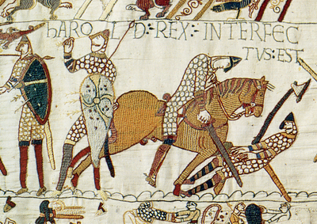

**描绘1066年的黑斯廷斯战役的“贝叶挂毯”，盎格鲁萨克逊战士和诺曼战士盾牌上的图案就是最早的纹章——注意骑士鞋跟上的马刺**

  

10世纪后，欧洲封建领主间的战争以及战争期间骑士的武术比赛，催化了骑士纹章的诞生——从头到脚武装得严严实实的骑士，只能通过盾牌上的图案来辨认身份，简单粗糙的
色块不断向复杂精细的几何图案演进。

  

到13世纪，即便最低等的骑士也有了自己的纹章，那些有声望的骑士，当然会把纹章装饰在自家的庄园产业上，最终成了家族标志。而组成纹章的符号图案也形成了一套约定俗
成的规则。

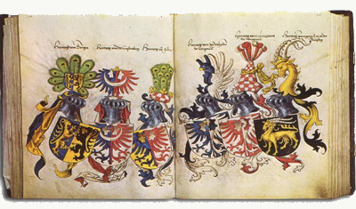

**一本德国中世纪纹章的图谱，上面是最高规格的骑士纹章**

  

它当然包括了各种星形符号——但需要注意的是，汉语里我们将它们称作“星”，正式的纹章学里却并不这样笼统地称呼，所以有必要了解一对源自法语的术语：Mullet（
齿轮）和Estoile（星）。

**从左到右：五角齿轮、六角有孔齿轮、八角齿轮、六角星**

  

上面这四种符号，前三种直边的都被称为齿轮，只有最后一种曲边的才是星。齿轮的角数不固定，但在英国和法国默认5个，日耳曼诸国默认6个，中央常常有孔。星的角数同样
也不固定，但多数是6个，从来不穿孔。

  

这也是为什么今天看上去最像星星的符号却被称作“齿轮”？以及为什么提示读者注意本节第一张图中骑士鞋跟上的马刺的原因。

  

1302年7月11日，在位于弗兰德的科尔特赖克（Kortrijk，今属比利时），弗兰德步兵大败法国贵族骑兵，这场重要的战役推动了弗兰德（今天的荷兰、比利时）
的政治独立，这场战役称为“金马刺战役”，因为千余法国贵族骑士战死，他们的金马刺都被弗兰德人缴获了。

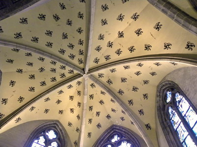

**金马刺战役中缴获的金马刺至今仍悬挂在科尔特赖克圣母教堂的穹顶上，就是那些隐约可见的斑痕**

  

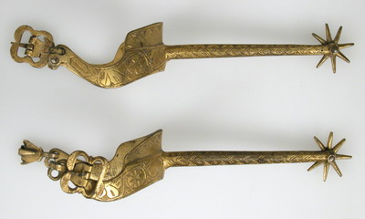

**一副15世纪的铜镀金法国骑士马刺，现藏纽约大都会博物馆**

  

马刺（Spur）是凯尔特人的发明，最初只是鞋跟上一根钉状的倒刺，用来刺激马腹协助驾驭，13世纪后演变成可旋转的齿轮，以避免刺伤马匹。它在中世纪的法国成了贵族
身份象征，骑士的马刺要镀金，马上侍从的马刺则镀银。

  

中世纪有句谚语叫“Earned his Spurs”即赢得荣誉之意，当骑士身份被剥夺后，马刺就要被砍掉——弗兰德人缴获法国骑士的马刺，就有羞辱的含义。中世纪
晚期，象征骑士身份马刺越做越夸张，终于成了一种华丽装饰品。

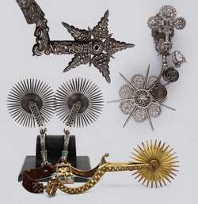

**一些中世纪晚期到早近代的大型马刺（相互之间非真实比例）**

  

上图马刺中被夸张放大的结构，英语称作“Rowel”，法语则称作“Mullet”——纹章上看似星星的符号，其实是马刺上的大齿轮，中央往往还有一个圆孔，那是给齿
轮穿轴的地方——至于齿轮有多少个角，恐怕是要沾沾五角星、六角星、八角星这类传统魔法符号的灵气了。

  

然而在不列颠地区，或者说至少在不列颠地区，最晚到了18世纪，“Mullet”这个称呼就与“Star”混同起来，不过仍然是前者更为正式。

  

这种混同倒是可以与前面提到的“星”一并解释——星星其实并没有尖锐的凸起，但根据生活经验，人们总觉得暗处发光的东西会有光芒射出来，希腊人就由此相信太阳神阿波罗
和月亮神阿尔忒弥斯（罗马称戴安娜）都是射箭的好手。

  

这种错觉有很多种成因，比如人眼的晶状体并非浑然均匀的整体，而是由横截面呈六边形的蜂巢状纤维紧密凑成，光线穿过它可能会衍射出辐射状的光芒——类似夜晚看路灯时长
长的光芒，更极端的情况是光源太明亮，人眼不自觉眯起来，入射光直接与睫毛发生衍射。

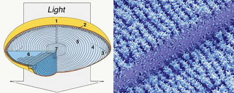

**人眼晶状体纤维的空间分布示意图（左）及扫描显微镜照片（右），该结构可因衍射而产生光芒感**

  

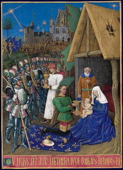

**15世纪的抄本插图《麦琪献礼》，天空中的伯利恒之星正在发出睫毛造成的衍射光芒**

  

由于这些生理原因，人总是觉得明亮的物体围着一些尖锐的凸起，如果要表现星星的亮度，通常把它画成带角的形状。

  

为什么纹章上的星型符号只有曲边的才是星？因为纹章学上真正的星“Estoile”——这个单词与“Star”都源自拉丁语的星星“Stella”——而欧洲传统上会
把强烈的光芒画成波浪形的火焰。

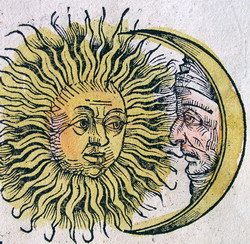

**《纽伦堡编年史》（Nuremberg Chronicle）中的日月插图，绘于15世纪，可见传统的火焰状光芒**

  

这个张冠李戴的意外，或许却是五角星在现代获得大流行最主要的原因。

我们不妨先仔细看一下这个华盛顿家族的纹章：

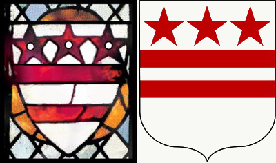

**华盛顿家族纹章，左边是15世纪英格兰塞尔比修道院花窗玻璃的图案，右边是现代绘图，上面有三个齿轮**

  

美国国父华盛顿出自一个古老的英格兰贵族，该家族肇始于12世纪末诺曼底骑士William de Hertburn（1165-1194）以英格兰地名“Washi
ngton”为姓。上图左方是这个家族现存最早版本的纹章，“白色背景上两条红杠，上方三颗齿轮”——你联想起什么标识了吗？

  

其中，红杠象征战士、力量；白带象征荣誉、公义；至于那要命的齿轮/五角星，除了表示贵族身份和来自上天的美德（这恐怕是五角星最古老的诠释），还在英国纹章里特别用
来表示三儿子。

  

这个家族的分支16世纪移民北美，最终培养出了乔治•华盛顿这样的伟人。如今一般认为，美国独立时那面星条旗的设计就与华盛顿的家族纹章有着扯不断的联系——这当然很
难考证，但可以确定，如今美国国徽、国旗、陆军纹章等处的“星星”，其实都是齿轮。

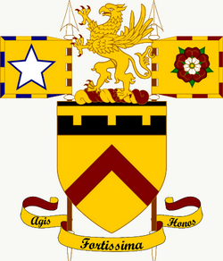

**美国陆军纹章学会（United States Army Institute of Heraldry, TIOH）的纹章：盾上的V形代表军人的臂章；带有三个垂的标签代表行政、立法、司法，同时在英国纹章里代表大儿子，暗指隶属美国陆军；狮鹫象征智慧和灵感；五角齿轮象征美国各州；都铎玫瑰象征源于英国殖民地；格言“荣誉是最坚固的盾牌”**

  

美国陆军纹章学会是专门负责管理美国军队和政府的徽章、旗帜、勋章、标记等等视觉符号的机构，根据它的官方解释，美国各种政府标志上的星形图案都是“Mullet”，
但正如前面提过的，齿轮后来与星星混同，今天美国政府已几乎在所有场合都把它们叫做“Star”了。

  

另外，欧洲在19世纪前，大都习惯把繁星画成6个角而非5个，所以我们可以认为，设计美国国旗时，那个五角星并非夜空中的星辰。

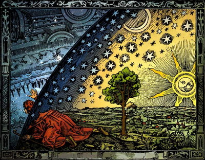

**1888年法国版画《宇宙》（Universum），作者Camille Flammarion**

  

美国是近代历史上最早独立的殖民地国家，它的国旗设计无疑成为其它年轻政权的榜样，尤其是后来独立的英属殖民地，用一定数量的星星代表国家行政划分成了一种常见做法。

  

那么，五角星又怎样在今天逐渐成为共产主义视觉系统中最普遍的符号呢？请留意**《五角星是怎么红起来的》**为您分解。

  

**版权声明**

****大象公会所有文章均为原创，****  

****版权归大象公会所有。如希望转载，****

****请事前联系我们：****

bd@idaxiang.org

****知识 | 见识 | 见闻****

阅读

__ 举报

[阅读原文](http://mp.weixin.qq.com/s?__biz=MjM5NzQwNjcyMQ==&mid=207814925&idx=1&sn
=ce2af8724f241f3ea82f0c0beea4b72d&scene=0#rd)

