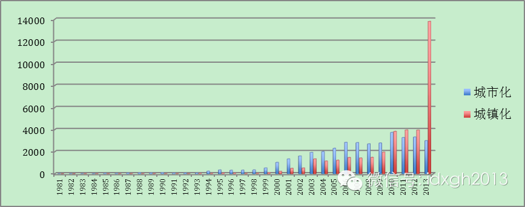
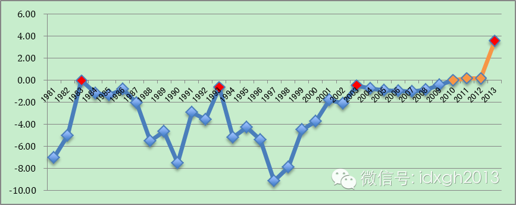

**“城镇化”一词是真正的中国制造。时至今日，在全国科学技术名词审定委员会公布名词的科学术语中，依然只有城市化，但这并不影响“城镇化”一词的热度不断升温，为何如此？**

  

文/杜之杕

  

官方的各级报告通常会催生一批新词，比如“新四化”。2012年11月，十八大报告提出“坚持走中国特色新型工业化、信息化、城镇化、农业现代化道路”，被普遍称为“
新四化”。

  

工业化、信息化和现代化都由西方舶来，唯有城镇化是名副其实的中国特色——从应用已久的城市化（Urbanization）改造而来。

  

许多人并没有在意这一变化，认为不过是翻译的误差。但官方的报告向来字斟句酌，而现代汉语的外来词，无论是意译还是借音，一旦被接受很少改变。

  

实际上，城市化与城镇化的背后，是观念的变迁，也是政策制定与实施标准的重要转变。

  

**【何来一字之差】**

  

城镇化第一次被正式提出，是在1982年12月的中国城镇化道路问题学术讨论会。在此之前，城市化一直是汉译的主流。

  

会上，多数代表认为“城市化”、“城镇化”都译自外语，可以通用，但最终使用了“城镇化”——因其更确切，更符合中国国情。

  

什么是国情？

  

1978年3月，中共中央批准了《关于加强城市建设工作的意见》，提出了“控制大城市规模，多搞小城镇”的方针。1980年，国务院文件提出“控制大城市规模，合理发
展中等城市，积极发展小城市，是我国城市发展的基本方针。”

  

总之，就是当时的中央更偏好小城镇发展。这是“城镇化”一词出现的关键背景。虽然学术上向来对优先发展大城市或者小城镇有争议，但政治的基调更为关键。

  

随后，1984年1月的《城市规划条例》确认了方向：优先发展小城镇。这是中国第一次以行政法规形式确认的城市发展方针。

  

但现实的结果往往与规划相悖，而词汇的使用也和实际需求有关，这让城镇化、城市化提法不断反复。1985年，中共中央对“七五”的建议中，仍然使用了“城市化”一词。

  

1990年初，对大城市的抑制达到顶峰，同年生效的《城市规划法》明文写道：“国家实行严格控制大城市规模、合理发展中等城市和小城市的方针，促进生产力和人口的合理
布局”，中小城市的发展也受到限制。

  

1998年，城镇化进入了十五届三中全会《关于农业和农村工作若干重大问题的决定》，这是“城镇化”第一次进入最高级别的文件，对于字斟句酌的制定者来说，此举无疑是
重要的肯定。

  

但是，中国大城市的发展速度极快，农业人口不断流出，民工潮等现象让政策制定者开始反思。

  

2001年3月，“十五”纲要转变了说法：“推进城镇化要遵循客观规律……走符合我国国情、大中小城市和小城镇协调发展的多样化城镇化道路”。

  

此时的重点，由抑制中心城市变为强调“城市群”，此后，大城市的带动作用被重视，区域中心城市等提法逐渐走红。

  

如果仍然按照政策的影响，此时的城镇化应淡出现实语境，但为何城镇化的热度不降反升？曾进入到高层词汇确实让“城镇化”保留了有力惯性，但更加注重城市发展首先影响的
肯定不是词汇，而是政策评定的标准。

  

实际操作的诸多困难，让“城镇化”有了新的作用。

  

**【“统计学之谜”】**

  

衡量城市化发展，需要一个准确的标尺，但这一点恰恰是城市化概念所不能提供的。

  

城市形态具有无标度性（scaling invariance），就是说，无法提供客观的特征尺度。操作上，无论是卫星传感、人口测量，都很难精准的区分城、乡分界，
更关键的是概念上，城、乡特性的划定，极大地决定着测量结果。

  

因此，“城市”通常是一个主观性很强的标准，各国有很大差别。以欧美为例，他们将城市区分为三个核心概念：城区（City
Proper）、城市化地区（Urbanized Area）、都市区（Metropolitan Area），其定义建立在严格的人口学统计之上。

  

中国的城镇化评价也主要以人口统计。但相比之下，城市边界标准的模糊，让精确度打了折扣。

  

不过，即使中国至今没有统一、规范的城市边界的定义，也没有城市规模的门槛，城镇化率评定一直没有中断。2000年后，城镇化率被纳入到地方政绩考核，诸多官员将目光
对准了城镇化数据。

  

如果只有市、县人口被纳为“城市化”评定，那么增加城市化率的难度会非常大，但是，“城镇化”统计如果包含了乡、镇，那么工作开展的顺利程度便快速提高。这也是200
0年后“合乡并镇”运动广泛开展的原因。

  

中国的官方统计中，如果地方政府通过行政手段进行“村改居”，大量的居民即可立即实现城镇化。同时，居住期限超过6个月的群体都属于城镇人口。这让可以做工作的地方十
分丰富。

  

十八大后，“新型城镇化战略”提出，各地加快城镇化速度。到2017年，广西力争由2012年的43.53%提高到53%，湖北省要由53.5%提高到58%，城镇化
率较低的河南省雄心壮志，许诺每年增加1.8百分点，由42.4%增加到52%以上。

  

上个月，发改委、中编办等11部委印发的《关于开展国家新型城镇化综合试点工作的通知》中，提及“建立行政创新和行政成本降低的设市模式，选择镇区人口10万以上的建
制镇开展新型设市模式试点工作”，镇级市也呼之欲出。

  

如此的规划，底气自然不同寻常。

  

而数据本身也值得商榷。中国政府提供的城市人口统计数据常常出人意料、前后矛盾，海外学者专门起了一个称呼：“统计学之谜（enigma）”

  

模糊统计让中国提前进入城市时代。2012年1月，国家统计局发布数据：中国城镇人口达6.9亿，城镇化率已到51.27%。

  

这是中国五千年历史上城镇人口首次超过农村，意味着城镇化达到了一个全新高度。不过，这条消息并没有引起太大的反响。

  

**【晋升之道】**

  

中文的改造往往反作用于英文，如long time no see，niubility，buzheteng等。

  

城镇化很多时候被译为urbanization（城市化），但也有学者发挥创新，译为townization，只不过没有得到广泛的认同。英文学术中，towniza
tion一般都由中国学者使用，或者在描述中国现象时，当作知识点介绍。

  

但在中国学术中，城镇化与城市化的势头正相反：知网中，以城镇化为主题的文献3万8千余篇，略高于城市化的3万7千余篇。

  

2009年以前，以城镇化为主题的文献数量均未超过于城市化，从2010年开始，城镇化主题第一次反超，三年后，以城镇化为主题的文献发生了井喷般的增长，一举抵消前
三年的劣势。2013年，正是“新四化”提出后的第一年。

  

1981年—2013年以城镇化和城市化为主题的文献数量（来源：中国知网）

  

如果计算出城镇化与城市化文献之差，再与两者中较小者相比，得出相差的倍数，就会发现一个具有周期性的规律——每10年就有一次明显的“城镇化”逆袭。

  

1981年—2013年城镇化、城市化主题论文相差倍数（来源：中国知网）

  

1983年、1993年、2003年、2013年，皆与各级党政领导的执政周期相吻合。

  

政治的话语一旦形成，就难以被轻易打破。而对政治术语的把握，既是官员们的晋升必备之道，也是幕僚们的安身立命之本。这些年份密集的人事变动，给知识界提供了十年一次
的兜售理论与观点的机会。曾被高层认可的城镇化是一个相当安全的选择。

  

政绩带来的统计压力，也更需要理论支持。

  

时至今日，在全国科学技术名词审定委员会公布名词的科学术语中，依然只有城市化，而没有城镇化，但这并不影响城镇化在人们口中和笔下出现。本来，这场争论和知识界就不
应该密切相关。

  

> 版权声明：  

> 大象公会所有文章均为原创，版权归大象公会所有。如希望转载，请事前联系我们： bd@idaxiang.org

大象公会：知识、见识、见闻

微信：idxgh2013

微博：@大象公会

投稿：letters@idaxiang.org

商务合作：bd@idaxiang.org

举报

[阅读原文](http://mp.weixin.qq.com/s?__biz=MjM5NzQwNjcyMQ==&mid=204652085&idx=1&sn
=afc62cc50c85f3d4eaac2526aa104e55&scene=0#rd)

