**历史上，中国往往在东亚地区占据优势地位，通过朝贡体系，不断确认“天朝上国”地位。为此，中原王朝承担着巨大开销，效果却有限，甚至有小国将朝贡当做牟利的来源。出乎意料的是，朝贡体系在汉、唐两朝并不兴盛，却在国力偏弱的明代达到巅峰。**  

  

**文/戴伯安**

  

公元1448年，四川杂谷安抚司的几位入贡僧人做了一件令明王朝十分头痛的事情：拒绝赏赐。

  

起因并不复杂。年初，“番僧”入京，进贡刀剑、铁甲若干，照惯例等待朝廷厚赏，完成一次稀疏平常的暴利买卖。但这次礼部突然发难，以其贡物薄而赐予厚，上奏稍减回赐。

  

站在明王朝角度，这个决定很容易理解。来者不过是折边的“番僧”，又不识好歹，只带了如此少的贡品，减少回赐非常正常。

  

但已经习惯了旧例的番僧非常不满，又做出惊人之举：不肯拜赐。这惹恼了明英宗朱祁镇，愤怒之中，朱祁镇失去了风度，罢去给番僧的赏赐及下程，将他们软禁于会同馆，不久
又投入锦衣卫狱。

  

对于双方来说，这个结果都非常丢脸。明英宗很快收回了命令，将他们放出，发放减量版的赏赐，令其返程。

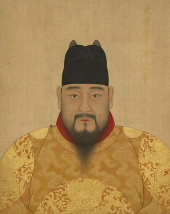

**明英宗朱祁镇**

  

番僧南哥藏等人其实没理由抱怨，他们已经足够幸运——明朝是历史上赏赐最为丰厚的朝代，一直坚持“薄来厚往”原则，即使它的国力可能是中原王朝中最薄弱的。

  

如果是在汉朝，南哥藏等人根本都没有资格朝贡。少数被承认的地区首领，进京后也只有少量馈赠，主要是册封封号为主；至于盛世唐朝，“羁縻”是对外政策的核心，手段多是
颁发封号。

  

严格意义上，明朝才第一次建立了完备的中华朝贡体系，它是独特的政治、军事、文化传统影响下的产物，尤以赏赐丰厚，蔑视平等交易原则著称。

  

**【什么是朝贡？】**

  

宽泛意义上，许多地区都出现过朝贡关系。

  

古波斯帝国的周边国家周期性对其进贡，雅典也从提洛同盟中纳贡，古罗马帝国、阿兹特克帝国都有过类似的纳贡现象。

  

这种朝贡形式比较简单：一方向另一方支付财物或表示尊崇，以结盟或避免交战。

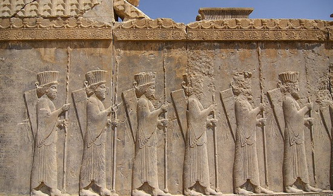

**伊朗波斯波利斯遗址上精美的浮雕人物，他们描绘的是前来波斯朝贡的使节**

  

但没有任何朝贡行为比中国的更久远，更复杂。事实上，只有中国才有如此制度化的朝贡体系，与之相比，欧洲、美洲等地区的朝贡行为不过是体系的雏形。

  

不过，中国也并不是一开始就建立了完备的制度。虽然东亚、东南亚国家很早就与中原王朝发生关系，但并不是产生政治关联就可以看做产生朝贡体系。既不是条约关系，也不是
平等的贸易，更不是征服、殖民，朝贡体系是另一种国际关系模式——强烈“天下”观念下的等级制政治秩序。

  

事实上，真正制度化的朝贡体系在唐后期、宋朝才形成。

  

宋代以前，与中原王朝对峙的他族政权一直存在，如匈奴、吐蕃。中原王朝的文化性格、群体心态远没有之后的轻松、膨胀，周边政权对中原王朝的心态也并非敬仰膜拜。

  

这一时段里，中原王朝的性格更近似于扩张与征伐，商周的畿服、汉朝的册封、唐朝之前的羁縻多属于战争的善后配套措施。远不如后世的制度完备、稳定，也没有那么强烈的“
天下中心”观念。

**《职贡图》描绘了唐太宗时期的来朝使者。唐，阎立德**

  

到了宋代，中原文化趋于稳定和内敛，文化和经济优势已然确立，朝贡体系开始制度化。不过，军事上常常处于劣势，影响了宋朝的野心，回赐金额远不如明朝、清朝。

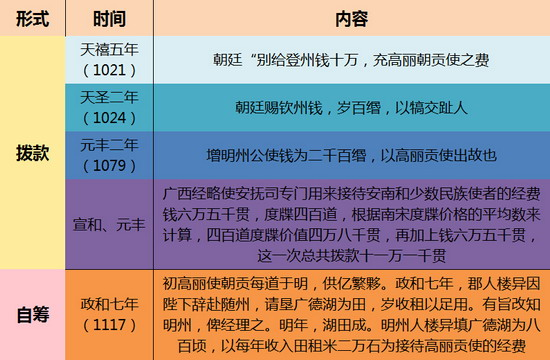

**部分宋朝回赐的财物**

  

宋代开始的制度化，包括规定朝贡国家的等级、礼仪规范、朝贡间隔、人数、入境流程。并动员从中央到地方的官员，保证入境接待、境内陪同、出境护送。

  

根据威胁的强弱、利害关系、地域的远近等，宋朝将朝贡国划分为几个不同等级，制定不同的接待规格，希望以此实现部分政治、军事贸易。名列最高等级的，在北宋是最大的敌
国契丹（辽）、金，最后是注辇、蒲端等强国的属国。

  

北宋政府将丰厚的回赐作为重要的政治和经济手段，拉拢回鹘、吐蕃等部族，与之结成军事联盟，分化、瓦解和抵御敌对势力，但效果有限。

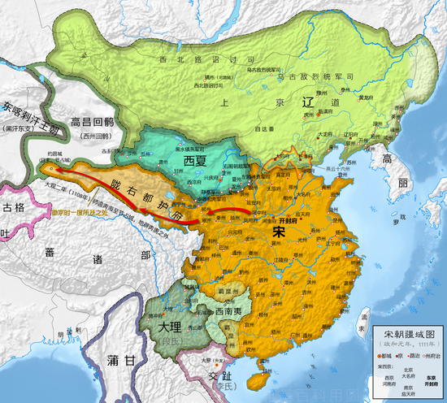

**北宋疆域图**

  

对于朝贡国，宋朝的赠与形式包括回赐、别赐、特赐和加赐四种形式。以回赐为主——由朝廷指定的商人对贡品估定价值后，按价值高低做出的赏赐。一般来说，折后回赐价格均
略高于贡品实际价值。

  

贡品的估值因此十分关键。为此，宋朝专门出台规定，保障朝贡国的利益：禁止以孝敬官员的名义压低贡品估价；发现估值偏低很快重估；回赠物品不得以次充好。

  

那么，宋朝为这些回赐究竟花了多少钱呢？

  

具体数额很难统计，但总体上支出高于收入。利用朝贡机会赚取回赐，开始成为小国稳定的创收机会。

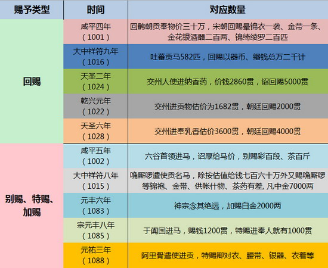

**宋朝部分朝贡贡品与回赐对应表**

  

**【“天朝”的巅峰】**

  

明朝建立，是中国朝贡体系的重要节点——施行闭关锁国政策，压抑的贸易需求开始从朝贡体系找缺口；文化自尊心前所未有的强烈，形成了“天朝上国”的心态。

  

从朱元璋开始，赏赐政策就非常畸形：“来者辄授官”、“薄来厚往”。一批使臣因此受封，带走大量财物。

  

同时，宗教人士朝贡开始增多。明成祖朱棣先后分封了三大法王、五大教王等宗教首领，又三次派遣河湟、洮岷卫所官员为朵甘、乌思藏帕木竹巴阐化王等修整驿道，为朝贡者无
偿提供食宿、车辆、护送人员，僧俗首领朝贡往返前所未有的便捷安全。

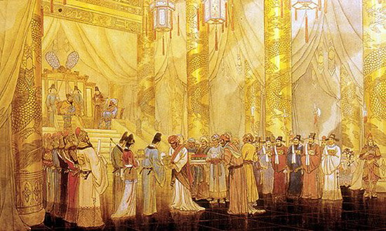

**明朝永乐帝朱棣，在北京接见外地重臣**

  

一般来说，藏区所带贡物多是舍利、佛像、氆氇、铁哩麻、酥油，朝廷回赠则为茶叶、绸缎、麻棉织品，另有金、银、纸钞等，对僧人还赐给袈裟、帽靴——赏物的数量和质量都
远远超贡品数倍，这给了朝贡者非常大的刺激。

  

表一：进贡物品在天朝的折后价

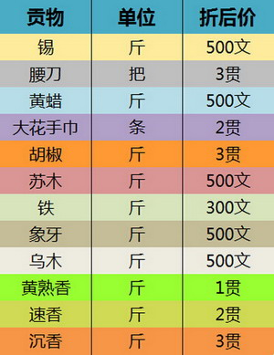

  

表二：天朝回赐物品的折后价  

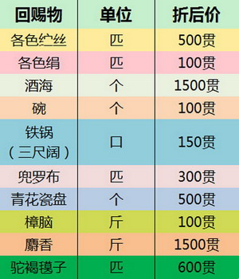

**弘治年间进贡物品和回赐物品之间的“汇率”**

  

从上表可以看出，回赐的物品远比贡品值钱。

  

宣德、正统（1426—1449）年间，藏区使团每年不过30、40人；景泰（1450—1456）年间增至数百人；到天顺（1457—1464）年间直线上升到20
00—3000人。

  

明朝皇帝当然会算经济账。宪宗就做过规定：凡朝贡者，必须三年才能来一次；根据级别限定人数，最多不得超过150人；统一降低赏赐额度，每次都要钤印标记时间。

  

但根本策略没有变化：“薄来厚往”，限定措施也就无法达到省钱的效果。

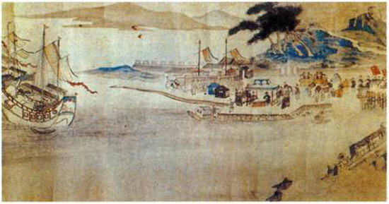

**明洪武五年琉球帆船抵福州港前来朝贡贸易情景图**

  

甚至还有骗赏者。汉藏交界处，会番话的汉人也会装扮成藏区僧人，去京城“朝贡”，往往所得不菲。不得已，朝廷只得在四川、陕西等地设立官员拦截，劝阻无法分辨的朝贡者
回家：名额有限，明年再来吧！

  

即使在这种情况下，成化八年（1472）仅川、甘藏区朝贡人数还是达到了4200人，赏彩缎8542表里，生绢8524匹，钞298300锭。因为番邦进贡，中原前后
收藏了十万多斤佛骨，八千多颗佛牙，舍利子无数。

  

除了对蒙古、藏区的赏赐，明王朝还要应对东亚、东南亚、南亚的朝贡者。最为独特的当属日本，与朝鲜、越南、缅甸等朝贡并册封的宗主关系不同，中日朝贡更像是畸形的贸易
，一旦贸易不畅便动用武力——“倭寇”有很大一部分来源于此。

  

甚至还因为争贡发生了战争。

  

嘉靖二年（1523年）六月，由于对两拨日本贡使的招待不公，被怠慢的一方愤怒的将另一个日本使臣杀害，并进攻浙江，明朝一名都指挥战死，史称“争贡之役”。从此明朝
裁撤浙江、福建管理海上贸易的市舶司，仅留广州一处。

  

此后，日本与中国的朝贡关系结束。

  

**【朝贡体系的式微】**

  

清朝大体沿用了明朝的朝贡体系，并用理藩院和礼部分别管理对内、外的朝贡关系。

  

与慷慨但含混的明朝制度相比，清朝的入贡规则非常明确。如朝鲜须一年一贡, 琉球二年一贡,安南三年一贡, 此为正贡,
也称常贡。所纳贡物的种类、数量皆有具体规定。

  

所以，清朝初期对朝贡支出控制的较好。但随着国力强盛，以及天朝心态占据上风，前代“厚往薄来”的传统被继承。虽然从绝对数量来看，赏赐逊于明朝，但逐渐形成了一个较
为稳定的朝贡经济圈。

  

康熙二十四年(1685),下令:“观所赐琉球等外国恩赍之物甚薄,于厚往薄来之道尚未允协。著内阁会同礼部, 察颁赐外国之例, 酌量增益所赏仪物, 确议具奏。”

  

此后，主要是通过“加赐”和“特赐”两个渠道，对朝贡者的赏赐增多。

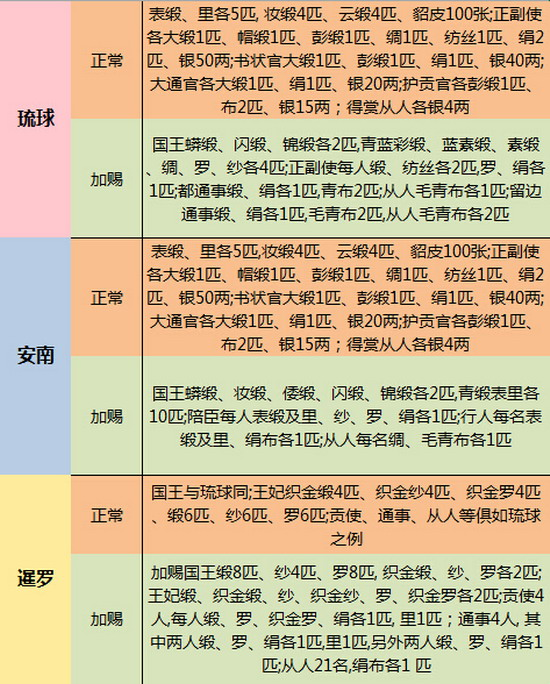

**清朝对部分的朝贡者的赏赐与加赐**

  

这是雍正、乾隆年间朝贡国数量及朝贡次数有所增加的一个重要原因。

但是，朝贡制度并非受到所有人的欢迎，一些务实的官员很早就发表过对它的批评。

  

南宋马端临就只直言不讳的批评过朝鲜使臣：“按高丽之臣事中朝也，盖欲慕华风而利岁赐耳”；胡舜陟也认为“高丽人贪利，唯欲数至”。

  

《明史》中也提到了朝贡者的巨额开销：“其徒（西番使节）交措于道，外扰于邮传，内耗大官，公私骚然，帝不恤也。然至者尤即遣还。乃宣宗时则久留京师，耗费益甚”。

  

余继登《典故纪闻》中更加直白的记录道：“西域史客，多是贾胡，假进贡之名，藉有司之力，以营其私……以次胡人慕利，往来道路，贡无虚月”。

  

但这些内部的批评并不能影响天朝旧制。

  

1793年，英使乔治•马戛尔尼使团到访，提出互派使节、签订通商条约等要求，第一次让中国接触到条约体系。

  

乾隆帝拒绝了所有请求，仅仅按旧制赏赐财物，准其回国。但半个世纪后，清朝不得不签订一个又一个条约，中国被迫纳入以条约为基础的世界外交体系。朝贡体系成为历史。

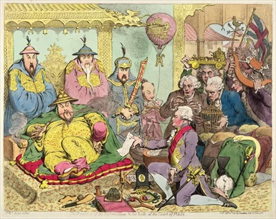

**乾隆会见乔治**马戛尔尼，詹姆斯**吉尔雷绘。图中，马戛尔尼单膝下跪呈送国书，而不是行三跪九叩之礼**

  

不过，随着中国日渐成为强盛大国，不少人又开始盼望中国重现“万邦来贺”上国气象，譬如屠洪刚的《精忠报国》结尾以“我愿守土复开疆，堂堂中国要让四方来贺”拉响了最
强音。

  

2014年APEC会议期间，有善于联想的外媒将中国举办的大会形容为“万邦来朝”，眼睛雪亮的《环球时报》立即表现出一贯的清醒，以《“万邦来朝”的滑稽比喻是黑中
国》为题的社评回击了西方的伎俩：

  

“中国虽是历史上朝贡体系的创造者，但它如今早已是现代国际舞台上‘等级观念’以及相关潜规则最坚定、也最强有力的反对者。把今天的北京比喻成‘万邦来朝’地，是件很
滑稽的事。它就像要把一条长辫子重新戴到中国男人的头上。”

  

**附录：**

  

**_宋以后中央王朝朝贡制度的__主管机构与职能变迁_**

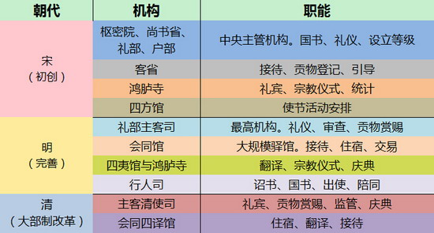

**  
**

**版权声明**

****大象公会所有文章均为原创，****  

****版权归大象公会所有。如希望转载，****

****请事前联系我们：****

bd@idaxiang.org

****知识 | 见识 | 见闻****

阅读

__ 举报

[阅读原文](http://mp.weixin.qq.com/s?__biz=MjM5NzQwNjcyMQ==&mid=208615548&idx=1&sn
=bbcb503b9956aaae2673dbc99526c91d&scene=1#rd)

