**中国男性形象的阴柔趋向，可以在欧洲最娘炮的国家——意大利身上找到共鸣。历史上，他们都缺乏欧美、日本的硬汉类型，只不过，中国找到了另一种男子汉形象的替代品。**

**  
**

**请看此篇《最适合演毛泽东的是姜文》（中）之《骑士、武士和强盗》。**

  

**文/黄章晋**

  

哪个欧洲国家的男人最“娘炮”、最没有尚武精神？相信绝大多数人会脱口而出：意大利。

  

上一篇《最适合演毛泽东的是姜文》（上）中，已提到古代中国男性形象整体偏阴柔，意大利的例子和中国有相似之处，它能从一个侧面解释前者的原因。

  

这个原因可以概括为三个词：骑士、武士、强盗。前两者是中国和意大利缺乏的，后者则是历史上中国男子气的救命稻草。

  

**【尚武与崇文】**

  

中世纪的欧洲是骑士的世界，但意大利却是例外，它遍布着大大小小的城邦国家，这些由城市工商业者建立的政权，迥异于以封建领主制为主要特征的欧洲其他地区。骑士盛行的
年代，意大利盛产优秀的骑士铠甲，但却不出产骑士。

  

虽然，意大利城邦国家中的威尼斯、热那亚都曾强盛一时，但无论是这些城邦国家还是教皇国，打仗主要靠操德语的雇佣兵。意大利人的尚武精神自罗马帝国后期开始雇佣蛮族人
当兵打仗就消失殆尽。

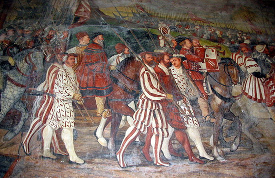

**在中世纪晚期的意大利，雇佣兵完全取代了城邦的常备军。在战争中，他们比常备军更加可靠。图为意大利雇佣兵condottiero**

  

当然，工商业社会虽然没有骑士或武士社会的重荣誉、敢牺牲、有担当，但崇尚进取、冒险、开拓，和迂阔的儒生相比，还是要刚健勇武得多。

  

而欧洲、日本古代社会的尚武与中国的崇文，很大程度上是因为前者是分封制社会，统治精英是世袭职业军人阶层，而后者则是大一统的中央王权，统治精英是科举选拔的非世袭
职业文官。

  

分封制很容易形成崇尚职业军人的文化，如欧洲的骑士文化和日本的武士文化，而科举制度则很容易形成崇尚儒生的文化——崇尚温良恭俭让的美德必然使得男性审美偏向阴柔。

  

中央集权制下的文官选拔制可算中国伟大的创举，虽然这种制度可算当时的异数，但并非孤例，以“小中华”自称的朝鲜完整地拷贝了中国的科举制，国家理所当然地安定大治，
但也同样变得柔弱不振。

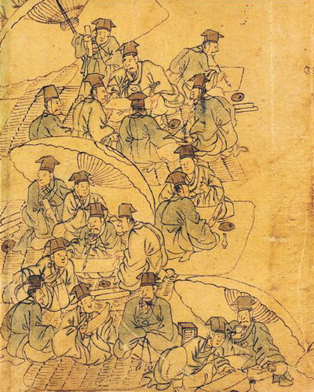

**朝鲜王朝时的科举考生，来自《平生图》，作者金弘道**

  

日本社会的尚武稍晚于中国转向崇文。十二世纪前的日本，权力掌握在公卿贵族手中，是为“公家社会”。当时上层社会尚文轻武，追求风雅、审美风尚极度阴柔，遗风所及，甚
至战国时代（一般指1467-1615年）的大名还有脸上抹白粉的习惯；但自源氏1189年建立幕府后，转入由下层以军功博取地位的“武家社会”，社会风气很快转向尚
武刚健。

  

或许可以这么说，今天每个社会典型的男性形象，多少都受其历史传统中主流精英文化的影响。欧洲和日本是骑士和武士的衍生物——好莱坞塑造的无论是西部牛仔、警察、军人
还是特工，其实都有过去骑士某一面特征的影子，而日剧中每个坚毅、隐忍的普通角色中，都栖息着一个武士的灵魂。

  

相对而言，崇尚温良恭俭让的儒生不算特别另类，最特殊的大约是西藏，崇敬尊重的是僧侣。

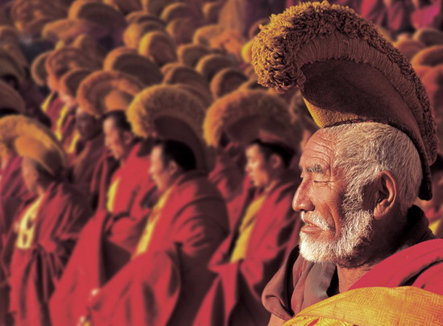

**藏传佛教僧侣**

  

**【骑士精神与武士道】**

  

不过，十世纪前的欧洲骑士并无后来的美名，他们和武装强盗差不多，直到开始逐渐接受基督教信条约束后，才逐渐变身为欧洲古代社会正能量的形象代表。

  

日本明治维新后成为唯一非西方的文明国家，为什么日本会成功？当时在美国求学的新渡户稻造及时写出《武士道》一书，让西方顿时解惑，原来，武士道就是骑士精神，日本武
士是高尚的骑士、绅士、知识分子最完美结合。

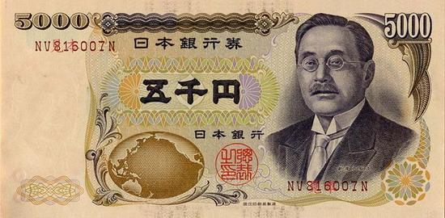

**1984年到2004年5,000日元日本银行券的新渡户稻造**

  

武士道与骑士精神看上去很像，武士的信条是：义、勇、仁、礼、诚、名誉、忠义、克己；欧洲骑士的八大信条是：谦卑（Hamility）、荣誉（Honor）、牺牲（S
acrifice）、英勇（Valor）、怜悯、信仰（Spirituality）、诚实（Honesty）、公正（Justice）。

  

不过，武士与骑士有着很大不同（这里将中下级封建领主都统称为骑士或武士）。

  

首先是宗教因素。欧洲骑士制度是基督教文化的产物，虔诚是首要准则，骑士不得对平民和弱者滥施暴力，乃至安贫、禁欲之类的行为规范都来自教会。骑士的装备本身也是教义
的体现：剑是十字架，盾象征保护教会的职责。

  

骑士既要效忠自己的领主，同时又有捍卫上帝（即教会）之责。故骑士被解释为专为保护信徒、商人、农夫而存在。而封建时代的日本则只有世俗政权，并无来自宗教的行为规范
。武士相对骑士缺少自我克制，更为残暴凶狠，很大程度即源于此。

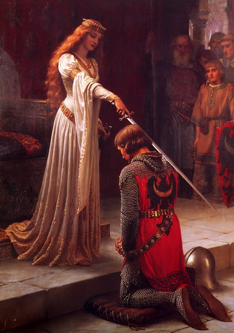

**封主把剑放平，封一名青年为骑士。作者Edmund Leighton**

  

其次，骑士与武士的独立性有很大差别。欧洲的分封制分国王、公侯伯爵、子爵男爵和下层骑士四个层级。建立上下级附庸关系时，奉行权利与义务对等原则，或对圣物宣誓或订
书面契约。

  

日本武士相对欧洲骑士有着极强的人身依附性。由于下层武士多生活贫苦，与领主之间多是简单的供养和效命，不存在欧洲式的对等契约关系，一旦丧失主人，则会沦为生计无着
的“浪人”。

  

日本武士的窘困或许来自其人口比例，明治维新时期统计全国武士约42万人，比欧洲骑士的比例要高出一个数量级。通常一个能置办全套装备的骑士，总需要有三五百农夫的村
庄才能供养。

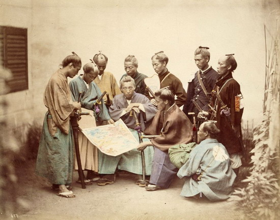

**戊辰战争中的日本武士，摄于1860年代末**

  

一个领主若拥有坚固城堡或巨大的庄园，他就有足够与人讨价还价的资本，由此保有行动和意志上高度的独立性。城堡林立的欧洲和只有不多城堡的日本，其实颇能证明两个社会
封建领主的独立性之别。

  

由于强烈的人身依附性，武士道真正最强调其实是对主人的忠诚和勇于牺牲，它远比骑士更强调服从，更缺少独立和自由的意志。其内涵和精神较骑士精神要窄得多。

  

日本大河剧《坂上之云》第一集中，有一幕是正冈子规等人感慕地背诵英国绅士精神：“英国绅士富有博爱精神，锄强扶弱，依法办事，憎恨犯罪，贯彻正义。”

**日剧《坂上之云》截图**

  

而英国绅士精神则脱胎自骑士精神：“我发誓善待弱者，我发誓勇敢地对抗强暴，我发誓抗击一切错误，我发誓为手无寸铁的人战斗，我发誓帮助任何向我求助的人，我发誓不伤
害任何妇人，我发誓帮助我的兄弟骑士，我发誓真诚地对待我的朋友，我发誓将对所爱至死不渝。”（《骑士宣言》）

  

**【独立与依附】**

  

英国绅士精神成为骑士精神或贵族精神的唯一近代发扬者，或许并不单是英国国力强盛，更来自其相对王权的独立性，恰好处于某种相对的平衡——既别于法国贵族依附于王室的
以宫廷享乐闻名，又别于普鲁士贵族依附于王室的以穷兵黩武的粗暴狭隘闻名。

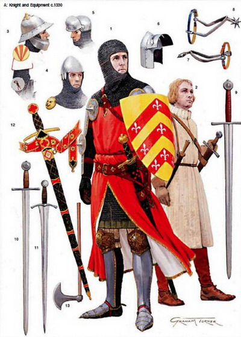

**14世纪的英国骑士**  

  

欧洲分封制在不同地区附庸程度强弱有别，整体上，英国的附庸结构是最松散的，不但有“我的附庸的附庸不是我的附庸”，而且还有限制王权的《大宪章》。

  

缺少独立性的封建主不可产生更丰厚的精神资源。俄国就是一个反例。

  

很晚才摆脱蒙古人独立的俄罗斯，并无西欧意义上的分封制。俄国贵族也不像西欧贵族能对国王能保持较大的独立性，甚至他们本身就是王权奴化对象，贵族必须无期限为沙皇服
役，犯错会像奴隶一样遭皮鞭抽打。

  

从第一个获得“全俄沙皇和大公”称号的伊凡四世开始，俄国的王权就远比欧洲更集中。不但世俗权力集中在沙皇手中，彼得大帝1721年废除东正教的牧首制，代之以东正教
事务管理局，由沙皇任命局长，教权也被划归皇权之下。

  

在俄国充任重要精神源头的角色是哥萨克。不过，哥萨克虽然世代以征战为业，但与西欧的骑士，日本的武士有本质区别。骑士和武士是支撑其分封制社会的基础，而哥萨克只是
被沙皇收编的自治流民集团。

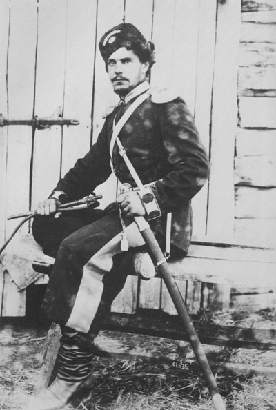

**20世纪初奥伦堡的哥萨克军官，他左手所持的便是哥萨克军刀shashka**

  

虽然哥萨克部落首领享有与骑士和武士类似的俸禄、分封土地的待遇，但哥萨克部落内部实行的是民主选举制，头领战时领军，平时负责行政管理，哥萨克自由民自治与沙俄的官
僚体系和农奴制并不兼容。

  

哥萨克当然最具独立性，不过他们没有骑士和武士的阶层特权，自然也谈不上什么身份信条和行为约束，以无法无天著称，除了彪悍勇武，哥萨克人全无节操可言，甚至作战技能
也乏善可陈，他们最擅长的便是烧杀劫掠。

  

**【强盗与帝王】**

  

中国古代并非所有地方所有人都只尊崇儒生文化。中国总有地方是“圣人布道此处偏遗漏”，普遍阴柔化的中国遂留有阳刚的种子在江湖的角落里生生不息。

  

自秦始皇时代开始，因“侠以武犯禁”被定性为社会不安定因素，恃强好勇、行侠仗义的另类强者便只能在江湖和绿林寄身，并赢得一些社会底层的敬意。

  

不过，先秦的英雄身上多带有“士”的影子，谨守其遵循的特定信条和行为规则，这是他们寄身主流社会并受敬重的原因，他们多少扮演着类似骑士或武士这种建构社会主流价值
的角色。而后世为主流社会不容的好汉们，英雄气概多半则来自对规则的藐视践踏。

  

《水浒传》喜欢不厌其烦地描述好汉们大口吃牛肉，这倒不是作者不知当时法律禁止屠宰和食用牛肉，而是这样更能体现好汉对法律和民间禁忌的无所顾忌。他们是无所持无所守
的强者。

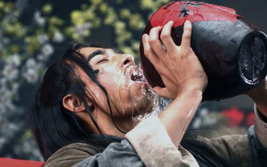

**电视剧《水浒传》截图**

  

虽然好汉们会强调“替天行道”或“除暴安良”，但从来没有、也不可能有被上升总结为职业信条或行为规范的东西，因为
“大口吃肉、大秤分金”的“快活日子”只是物质生活标准，而不是人生定位。如果有吃肉喝酒的正当机会，好汉们还是愿意被招安的。

  

机会主义的江湖道义很大程度上具有极强的随意性，本质上只要不背叛大哥、不欺负朋友妻，好汉其实没有什么信条。这种肆无忌惮的快意人生，其实是最具原始生命魅力的活法
。

  

江湖和绿林的存在，无意中为中国保留了男子气形象的种子。今天，中国屏幕上真实可信而颇具男性魅力的形象，大多数都是带有几分土匪气的。最典型的是1980年代的电视
连续剧《乌龙山剿匪记》，申军谊扮演的钻山豹是如此深入人心，以至于很多人忘了他其实是配角，对主角更是全无印象。

  

这多少是个悲剧，历史传统的匮乏，使中国很难像国外电影一样塑造个性丰满、真实可信、受人喜欢的正面英雄形象——通常桀骜不驯、一身痞气的角色更适合用在二号人物身上
。

  

于是，我们看到《亮剑》中李幼斌扮演的李云龙，只能靠土匪气演绎一个有个性的军人，或许是由于中国实在太缺少男性魅力十足的形象，以至于李云龙这种浓浓生大蒜味的男子
气，甚至征服了不少白领女青年。

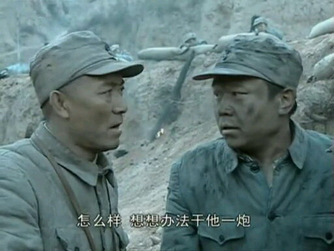

**《亮剑》截图**

  

还好，除了强盗土匪，中国还有一个能保有男子气的职业——皇帝，虽然仅仅是少数。毕竟“一夫为刚万夫柔”，群臣百官在帝王面前的雌伏，很容易承托出帝王的大丈夫气概。

  

这个道理很简单，我们不用拿在奏章上忍不住朱批“朕就是这样汉子，就是这样秉性，就是这样皇帝”的雍正举例，就算是金正恩同志，一个圆乎乎白胖胖的年轻人，往那一站，
旁边簇拥着一堆抵着头记笔记的人，他自然就有了一股堂堂的男子气。

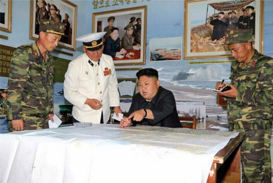

**金正恩视察朝陆海军联合演习**

  

中国男演员唯一比西方演员更在行的，就是扮演帝王的霸气。

  

连续两篇都没谈到姜文，请见（下）文分解。

  

**版权声明**

****大象公会所有文章均为原创，****  

****版权归大象公会所有。如希望转载，****

****请事前联系我们：****

bd@idaxiang.org

****知识 | 见识 | 见闻****

阅读

__ 举报

[阅读原文](http://mp.weixin.qq.com/s?__biz=MjM5NzQwNjcyMQ==&mid=208650481&idx=1&sn
=9ab50e25400e20a78233ceaf35b9e302&scene=1#rd)

