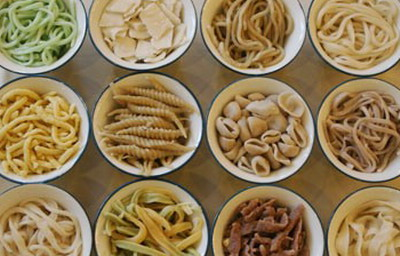
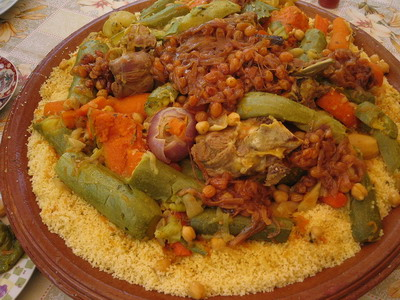
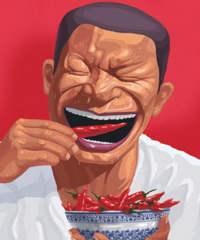
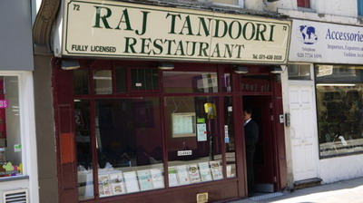
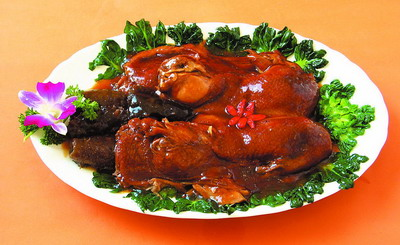

**为什么中国人越来越嗜辣？因为只要人口可以大规模流动，大众饮食的口味，总是贫穷地区更容易向富裕地区传播。  
**

  

**文/黄章晋 I_Isaak**

  

为什么湘、川、云、贵及江西部分地区偏好辣味，为何近年这些以辣为特征的地方菜会盛行全国？**《壹读》**不久前刊发了一篇**《重口味胜利的逻辑》**，用相当长
的篇幅进行归纳梳理。

  

为什么西南和中南内陆地区会嗜辣，文章提出一个非常新颖的解释：

## **按照西南师范大学历史地理研究所蓝勇先生的发现，如果将重辣口味的版图与《中国年太阳总辐射量图》进行对照，重辣版图背后的秘密就水落石出了。四川、湖南、
湖北以及江西部分地域，换言之，长江中上流的大部分地区恰好与太阳辐射年总量低于110千卡的热量区相重合。那里的人之所以重口吃辣，是因为晒不到太阳。**

  

为什么辣会在全国流行？文章的解释是“吃辣比甜、鲜的成本低，时间成本也更低”：

**1、**因为鲜是高成本的，而辣是低成本的。麻辣可以掩盖食材的新鲜度。

**2、**品出鲜味，更需要食客分分钟钟都有一种悠然从容的心境，这在当下显然是一种相当奢侈的要求。

**3、**依然居于全国第二口味的甜，其实更多的是正餐之外的甜，是餐后甜点，是街头巷尾的各种台式甜品。甜被从正式餐桌的主要环节中剥离了出来，而成为一种单独的点缀。

**为什么辣可以席卷全国？**

  

这些分析是否靠谱，或许应当先从其归纳的两个现象是否准确完备来分析。

  

**【人口流动与口味流行】**

其实，这篇文章试图解释的两个现象，并非中国独有，而是世界性现象：

**  
**

**一、地区性嗜辣的现象**

中国嗜辣地区远非前述川、贵、湘、赣地区，陕西、宁夏和甘肃部分地区同样嗜辣，甚至新疆亦是如此，只是这些地区以面食为主，不但未发展出复杂菜式，甚至很多地方炒菜都
很少，与西南和华南内陆地区相比，它们不易给人留下嗜辣的强烈印象。

**以面食为主的省份不易给人留下嗜辣的印象**

**  
**

谈到嗜辣，全球著名的当属墨西哥，此外，印度（巴基斯坦）、东南亚、韩国等地区的人均有强烈的嗜辣偏好。**南亚、东南亚和墨西哥均属日照强度很高的地区。如果西南和
华南内陆嗜辣是因为日照强度不足，那么日照强度最低的北欧应该是世界上最嗜辣的地区。**

**墨西哥人嗜辣让人印象深刻**

  

日照强度假说给人的荒谬感，或许来自对地区嗜辣现象本身归纳梳理不足。

  

**二、为什么中国人越来越流行嗜辣**

这同样不是一个正确的好归纳。中国人越来越嗜辣其实等价于为什么中国人会越来越流行吃兰州拉面、吃新疆烤串、吃沙县小吃、吃东北饺子。

  

因为，全国范围内大规模流行的并不只是前述嗜辣地区的饮食，还有兰州拉面、新疆饮食、沙县小吃、东北饺子，还有一些虽然不那么引人注目，却同样占据了大片江山，譬如安
徽人开的小笼包子店。

  

中国人越来越嗜辣，同样还等价于为什么美国人越来越爱吃中餐、墨西哥餐、意大利皮萨，等价于德国人为什么越来越爱吃土耳其烤肉，英国为什么越来越流行吃印度咖喱，法国
人越来越流行阿拉伯人的“古斯古斯”……

**法国流行的“古斯古斯”源于北非地区**

  

——这些现象其实也可以概括为，为什么穷地方的口味会如此流行？

  

没错，中国人越来越流行嗜辣，本质上只是大众饮食文化传播普遍现象中的一个子现象，而非全貌，它其实可以这样概括：**大众饮食文化的传播和流行方向，总是劳务输出地
区向劳务输入地区，而劳务输入地区的饮食却很难在劳务输出地区大面积流行。**

  

无论是中国还是全世界范围，以中低端餐饮为特征的流行饮食文化，总是来自劳动力大规模输出的地区，它的强度取决于移民的人口比例。

  

这种人口流动传播饮食文化有很多典型历史案例，譬如山东移民对东北饮食风味的影响，山西移民对内蒙饮食偏好的影响，陕甘回族移民对新疆饮食的影响。

**饮食文化流行的强度取决于移民的人口比例**

  

贫穷地区向富裕地区输送的劳动力，最容易找到的就业机会是服务业，而餐饮业又是服务业中最能吸收劳动力，而新移民最擅长的不是适合本地人口味的饮食，而是家乡的饮食。

  

2010年第六次人口普查的数据或许非常容易给我们直观印象，中国户籍人口流出比例超过10%的省份一共有6个，按比例高低依次排列如下：安徽、江西、重庆、贵州、四
川、湖南。

  

而属于嗜辣地区的四川、湖南、湖北、重庆、江西、贵州、云南七省市，向外输人口3684.2万人，占全国向外输出人口总数的43%，他们覆盖了中国所有地区，所以我们
能非常容易感觉到全国都在嗜辣。

**我们能非常容易感受到全国都在嗜辣**

  

安徽虽以962.3万人占据中国人口输出第一省份，但他们主要集中在以上海为中心的长三角地区，由于多数安徽人经营的餐饮集中在不易显露菜系特色的早餐，以及它与长三
角饮食相对接近，所以远不像嗜辣地区的餐饮那么引人注目。与之相似的还有人口流出总数高达862.2万的河南。

  

而新疆维吾尔人虽然绝对流出数并不高，但他们除了卖烤串、干果和切糕，几乎无法进入内地任何服务业，所以，这个极少数的人群也深刻改变了中国人的饮食习惯。

  

值得特别强调的是兰州拉面和沙县小吃，两者在全国的流行范围之广，覆盖程度之高，与人口输出规模完全不成比例，它并不完全是当地劳动力就业路径依赖的结果，更有地方政
府以小额贷款、技术培训甚至统一供货渠道等手段强力推动的原因。

**沙县小吃在全国范围内流行，有赖于地方政府扶持**

**  
**

据统计，2009年上海就有近万家兰州拉面馆，经营者中青海化隆人占70%、河南人占20%，兰州人则凤毛麟角——相对富裕的兰州人缺少在异乡开店的冲动，所以兰州人
只能抱怨外地人败坏了兰州拉面的名声。

  

为什么经济发达地区的饮食文化只能占据较高端市场在小范围内流行？答案非常直观：吸收了大量外来劳动力的广东、上海、北京人、浙江、山东等地，少有本地人愿意跑到外地
去开餐馆——开在外地的粤菜、沪菜、北京烤鸭乃至山东菜馆，几乎都是定位在中高端的。

**全国各地兰州拉面餐馆的拥有者多是青海化隆籍**

  

而发达国家流行穷国饮食，是因为在美国，是华人、墨西哥人、意大利人、印巴人、越南人到处开餐馆，在德国，是土耳其人遍地开餐馆，在法国是北非阿拉伯人，在英国则是印
度和巴基斯坦人——但你同样不会看到美国人在中国到处开餐馆，德国人到土耳其开餐馆、法国人跑到北非开餐馆，英国人到印度巴基斯坦开餐馆。

**英国街头随处可见的印度餐馆**

  

人口总是从经济落后地区向经济发达地区流动，因为越是经济发达地区，就业机会更多。但不是不存在特殊的相反例子，西藏就是这样的典型，像拉萨这样的城市已经完全四川化
和西北化。

  

移民深刻改变本地原有口味最好的例子，其实是上海。上海原处于口味清淡的淮扬菜和浙江菜势力范围，但我们熟悉的上海菜却以浓油赤酱、口味较重著称。崇尚口味清淡的浙江
人未必看得起今天已获得高端地位的上海菜。

**我们熟悉的上海菜以浓油赤酱、口味较重著称**

  

上海菜明显比周围邻居口味更重，答案或许应当从它曾是中国外来移民比例最高的城市中找，即来自重口味地区的大量底层移民——譬如苏北菜和安徽菜相对淮扬和浙江菜，明显
要更为重油重色，它改变了苏南和浙江移民口味相对清淡的底色。

  

那么，人为什么会嗜辣，不同地区为什么会有重口味和清淡口味之别？饮食口味果真存在贫富之别或地域之别吗？

请见下篇：

**《穷口味富口味（下）：穷人重口味，富人淡口味？》**

**  
**

****

**版权声明**

****大象公会所有文章均为原创，****  

****版权归大象公会所有。如希望转载，****

****请事前联系我们：****

bd@idaxiang.org

****知识 | 见识 | 见闻****

  

阅读

__ 举报

[阅读原文](http://mp.weixin.qq.com/s?__biz=MjM5NzQwNjcyMQ==&mid=207074596&idx=1&sn
=e0b74b72b18a56f03ffb16e37fd3dec9&scene=0#rd)

