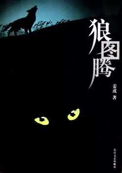
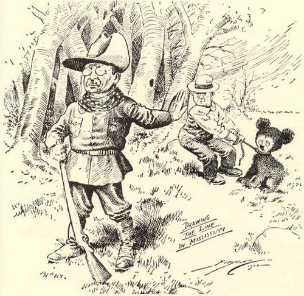

##  中国人为何以狼为师  | 大象公会

_2015-03-16_ 大象公会 大象公会

**大象公会** 

idxgh2013

知识，见识，见闻。最好的饭桌谈资。知道分子的进修基地。

__ __

**华为、百度、格力等著名企业为什么会推崇狼性文化，为什么狼会成为今天中国人的精神导师？**

  

**文/黄章晋**

  

中国的狼文化热中，《狼图腾》“孤篇压倒全唐”，姜戎的成功不服不行。

  

首先是标题。献给狼的颂歌，需要最顶级最崇高的标题，虽然《狼图腾》中的狼在中国作家笔下的狼中远算不上夸张，但相比一般人能想出的狼道、狼性、狼赞、狼颂之类标题，
“狼图腾”三个字完全是石破天惊。

  
**《狼图腾》是一部以狼为叙述主体的小说，讲述了上个世纪六七十年代一位知青在内蒙古草原插队时与草原狼、游牧民族相依相存的故事**

  

其次是建立了一套价值和解释系统，将民族创世神话、环保主义、传统文化的存亡、生存法则、人类历史动力等宏大主题结合在一起。为了将如此之多的主题压缩进一部小说，作
者不但蹲在主人公陈阵的胸膛里时刻思考各种终极问题，而且还蹲在蒙古族老大爷毕利格胸膛里，让他也忙着思考各种终极问题。

  

更重要的是，这套价值体系和解释体系非常符合今天中国社会的需求，它降生的不早不晚，正好便于广大中国人民将它的普遍真理活学活用在任何一个具体问题的指导上。

  

而其他中国作家关于狼的作品，无论狼有多完美多高贵，文章写的有多长，都只是一种“《读者》体”的简单加长版，没有高屋建瓴地提供价值体系和解释体系。

  

《狼图腾》当然引发了蒙古文化界不少人的愤怒和抗议，甚至曾以写狼著名的蒙古族作家郭雪波上书中宣部，要求管一管《狼图腾》，因为：“历史史料证明，蒙古人最早是信仰
万物有灵的萨满教，后来信仰喇嘛佛教，从来没有信仰崇拜过狼这一动物。”

  

蒙古人到底有没有过图腾？

  

**【狼图腾与龙图腾】**

  

当然没有。郭雪波的说法是正确的，典型意义上的图腾，其实只存在于原始部落社会时期，它是体现氏族血缘关系、被当作神祗崇拜的人格化的动物或植物。通常，经过部落联盟
再到统一王权，图腾早就让位给了宗教。而且蒙古人还经历了由萨满教改宗喇嘛教的历程。

  

至多可以这样说，不排除蒙古人的祖先，在还处于原始氏族部落时有过包括狼在内的图腾。但说蒙古人历史上一直存在狼图腾，就纯粹是为蒙古人找祖先了。

  

不过，《狼图腾》作者姜戎知青时期待过的西乌珠穆沁，相比其他地区的蒙古人，狼在民俗中更为常见，或许与该旗来自明清时游牧于新疆北部的卫拉特蒙古有关（“乌珠穆”在
蒙古语是“葡萄”的意思，而“沁”则有“的人”之意）——狼在突厥语民族中，民俗地位明显要比蒙古民族更高——它或许是受突厥语民族的影响。

  

一直有说法称，突厥语民族存在狼图腾，这也不是事实。如果一定要说有什么动植物崇拜，哈萨克人崇拜的是天鹅，维吾尔人崇拜的是树，他们认为老树是他们的祖先。在一个信
仰伊斯兰教的社会，这只是一种浅浅的观念残留，如果真存在所谓的狼图腾，那置阿訇毛拉于何地？

  
**哈萨克民族歌舞《阿嘎加依》片段，天鹅在哈萨克族人们心目中是爱情与青春的象征**

  

  

维吾尔社会确实有用狼牙、狼的脚踝骨作为辟邪配物的民俗，但在今天已极为稀少。如果将某种动物在民俗文化中的地位附会成图腾，完全可以认为老虎是汉族的图腾，虎不但是
古代中原最常用最重要的军事符号，在日常生活中，老虎也是使用最多的动物形象，譬如小孩的玩具是布老虎，穿虎头鞋、戴虎头帽，中堂挂画最常见的动物是老虎。对虎皮、虎
骨、虎鞭的神圣痴迷就更不用说了。

  

而且，就今天狼在流行文化的地位来说，哈萨克斯坦恐怕才是最热的，几乎每个流行摇滚歌手的MV都恨不得像当年的齐秦一样，牵一条染成灰色的德国黑背做彪悍生猛状——它
也是最近一二十年才火起来的。

  

然而，事情正在起变化，按照新传统和新常态，狼却极有可能真的成为蒙古人的图腾。

  

蒙古人过去吃羊肉从来都是清水煮——最新鲜的食材才有资格这么烹饪，但清水煮肉显然并不符合内地游客的想象——羊肉应该是架在熊熊篝火上才有草原的浪漫呀——“蒙古烤
肉”就这么被发明了出来，现在你到草原蒙古包做客，真的会遇见“正宗”蒙古烤肉。

  
**比起烤全羊，手把羊肉可能更算得上是内蒙著名的民族传统菜**

  

狼图腾的道理差不多。

  

并不是所有的蒙古人都像蒙古文化界的那些人一样认为狼图腾是伪文化——今天多数蒙古人在城市长大，狼图腾的说法整体上是相当受用的——它能让那么多汉族读者热血沸腾，
对蒙古年轻一代可想而知。蒙古传统民俗是怎么回事，父母和家庭的影响远远没有流行文化来得更大。

  

汉族龙图腾的例子，使我们更有理由相信，将来蒙古人会有狼图腾。——汉族是龙的传人，是今天被广泛接受的观念，但它只是一个形成很晚的人造观念（参见**大象公会《中
国制造：我们都是龙的传人》**，作者施爱东）。尤其值得强调的是，龙是中国的象征或“中华民族的图腾”，首先是欧洲人的发明，然后才输出到中国。

  

**【泰迪熊的启示】**

  

熊在美国的形象转变，或许可以说明狼为什么在中国突然开始改变形象的。

  

在美国人的观念里，熊曾长期是凶残、危险、可怕的动物，但到了二十世纪初，熊和其他野生动物几乎已经在美国很少看到了。以至于1902年美国总泰迪•罗斯福受密西西比
州长之邀打猎时，罗斯福总统竟然一无所获，为了不让总统扫兴，手下悄悄将一头小熊绑在树上，谁想罗斯福看到楚楚可怜的小熊拒绝开枪，命令手下将受伤的小熊放生。

  

《华盛顿邮报》的漫画家据此绘制了一幅漫画，并将只命名为“泰迪熊”（Teddy’s Bear）,意为泰迪•罗斯福总统的熊。这大概是熊第一次以可怜、萌宠，而不是
凶残形象出现在美国。谁也没有想到，泰迪熊的形象竟然风靡一个世纪，它成为儿童枕边的布绒、每个孩子必看的连环画主角。

  
**描述罗斯福猎熊场景的漫画**

  

如果当时熊在美国不是处于濒临灭绝的边缘，不会出现这样戏剧性的转折。当凶猛的野生动物不但不再能威胁人类时，它最能成为勾起人们警示自然环境已被人类活动深刻改变的
象征——就像老虎而不是别的食草动物在中国一样。

  

狼是人类最熟悉的食肉动物，最容易被唤起野性自然的想象，当人们都住进远离山林的城市，而且山林中不再有狼的踪迹时，狼自然会由残忍、贪婪的象征，转而附丽成环保主义
色彩浓重的自然、自由和生命力的象征。

  

但是，熊在西方世界与狼在中国的形象再造，走的是完全不同的道路——当然，尖嘴猴腮的狼与胖乎乎的熊相比，相貌上吃了大亏，在哪个地方都很难萌宠起来。

  

上世纪六七十年代西方环保主义兴起，萌宠可爱的食肉动物成为唤起人们爱心，投身环保的吉祥物，随着全球升温成为西方环保主义的新议题，人们开始关注南北极的冰盖消融问
题，沿海城市被淹没很遥远，但泰迪熊的表亲北极熊宝宝生存堪忧却迫在眉睫，快快行动起来吧。

  
**索契冬奥会吉祥物之一——北极熊**

  

环保主义在中国从来没有形成气候，而且熊猫宝宝已占据形象大使很多年，所以，狼只在环保主义的死胡同上迟疑地停留了一瞬，被贾平凹等人怀念了一下，就毅然掉头，奔向成
为中国人民精神导师的康庄大道。

  

**【中国需要什么样的狼】**

  

所有的动物故事都是借物喻人的。

  

比起国外作家笔下的狼，国产作家笔下的狼，明显在血性、顽强、凶狠程度上要更胜一筹，而且比起国外的狼，它们一方面更注重集体主义，同时又更信奉弱肉强食的丛林法则。

  

国产狼又会因蒙古族作家和汉族作家而有明显不同。汉族作家笔下的狼更看重事业，很少注重爱情、友情和家庭，甚至它们最突出的优点就是刚毅、果决，绝不儿女情长；而蒙古
族作家笔下的狼，更接近西顿和杰克•伦敦，注重友情、爱情甚至恩情，好像没有什么事业心。

  

如果要仔细归纳梳理，汉族作家笔下的狼，还有注重集体主义、纪律严明、用于牺牲的优秀品格，而蒙古族作家笔下的狼，相对有更追求自由、挣脱束缚、以家庭为重甚至回归传
统的倾向——它们不太容易像汉族作家笔下的狼那样，更容易总结出一套可以概括为狼道、狼性、狼法则之类值得大力弘扬的价值体系。

  

——您完全应该知道今天的中国读者更喜欢看到什么样的狼。中国企业家们鼓吹的“狼性文化”肯定指的不是蒙古族作家笔下的那种狼。

  

中国人身上最缺什么？一二十年前，缺少血性可谓最大的社会共识，今天，不同的人会给出截然不同的答案。“公知”会认为中国缺少诚信、敬畏、信仰，而“私知”则认为中国
人缺少亮剑精神、缺少攻击性、缺少集体主义。

  
**一部《亮剑》，使得中国大街小巷纷纷传扬亮剑精神**

  

这个问题竟然被狼图腾完美地解决了。中国人一下找到了新的精神导师。

  

它兼顾了“公知”的敬畏、信仰和“私知”的亮剑精神和集体主义，更让人叫绝的，是它还照顾到了文艺青年对边疆民族地区的浪漫想象。当然，有得必有失，对“公知”而言，
它公然宣扬弱肉强食的丛林法则，对“私知”而言，它宣扬汉族劣等，伤害了中国人民的感情。

  

固然难免各方都有所得罪，但狼几乎满足了绝大多数中国人对某种精神和价值投射的心灵需求。除了中国作家，没有任何一种动物能做到这一点。

  

“狼性”在中国能理直气壮地被企业家们用于灌输手下的员工，并不是因为原本依附于官方意识形态的集体主义，在新时代找不到合适的名目，而是中国近世以来，公共话语中从
来没有人性、人道主义的位置，当党性之类的词从企业退出时，大家一点不觉得由“狼性”来填补它有什么羞耻的。

  
**相当畅销的“狼性系列”企管丛书**

  

**版权声明**

****大象公会所有文章均为原创，****  

****版权归大象公会所有。如希望转载，****

****请事前联系我们：****

bd@idaxiang.org

****知识 | 见识 | 见闻****

阅读

__ 举报

[阅读原文](http://mp.weixin.qq.com/s?__biz=MjM5NzQwNjcyMQ==&mid=211501411&idx=1&sn
=2fc523ea27e7f1fea7ce17b3964278dc&scene=1#rd)

