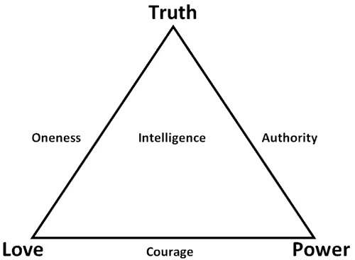

##  刺激感

_2015-01-20_ _史蒂夫**帕弗利纳_ 聪明人的个人发展 聪明人的个人发展

**聪明人的个人发展**

stevepavlinachina

个人成长，与你同行

__ __

为自己的工作和感情关系找到正确水平的刺激感，是人生关键挑战之一。有时我们拖延完成各种任务，还有退出各种感情关系，都是因其整体刺激水平未能很好地匹配个人偏好。
有些情形刺激感不足，会使人感到无聊厌烦和没精打采。另有一些情形则过于刺激，让人觉得压力重重或焦虑不安。两者的中间状态就是我们更喜欢的刺激水平，此时我们会有全
情投入的感觉，但这种刺激水平对每个人又各不相同。

幸运的是，我们无需接受迎面而来的每种情形。人们可以逐步修正相应的刺激水平，使之更好地匹配自己。这让我们对生活有了更多的清醒控制和灵活性。

**当刺激水平过低时…**

当一种生活状态过于无聊或乏味时，你可以放大相应的刺激水平。试着站起身走动走动，而非一直坐在那里。选择更明亮，偏蓝一些的灯光。而非昏暗或偏黄的灯光。放些更有刺
激感的音乐。来一小杯意大利浓缩咖啡。燃起一支香烛或某样香熏，切些新鲜柠檬放在屋里，从而给你的嗅觉带来刺激。

面对刺激不足的工作任务，可以选择使用定时器，挑战自己更快完成任务。或者将其变成团队项目。换个公开场所去工作。向他人承诺自己一定会在某个时间前完成。

这种把简单任务搞得更复杂的做法，看起来可能有点违背直觉，但它的确是把一份枯燥任务变得更有趣的极佳解决方案。

许多人发现，在锻炼时听音乐或有声书，能更容易坚持每天锻炼的习惯。这种做法让本来重复无味的身体运动变成了更具参与感的事情。由于每年因此能多读几十本书，它也使你
的生活在整体上更有刺激感。另一些人则更喜欢应对极有挑战的锻炼形式，让自己保持全力参与的状态。

**当刺激水平过高时…**

若一种生活状态的刺激水平过高，可以反其道而行。把刺激感降下来，使之更加放松和压力更小。听听舒缓音乐或自然界的声音，特别是水声（下雨、流水、海浪等），或者干脆
保持完全安静。选择更柔和、暗淡的黄色灯光。单独工作或身处令你感到放松的地方，使自己远离打扰。开始工作前，先冲个热水澡，或进行冥想，让自己平静下来。

一些人能在像繁忙咖啡店这样的社会场所非常高效地工作。另有些人则喜爱周围有人闲聊的开放办公环境，工作时只离同事一臂距离。但很多人在这种开放环境中都有效率大降的
体验；他们在独自安静状态下工作效果最好，喜欢有可以关门的私人办公室，不受干扰地完成工作。对这些人而言，有他人在场会过于刺激和分神。

通过不断试验找到个人刺激水平的甜美地带，是种明智做法。你也可能发现自己在某些任务上更喜欢刺激水平高的环境，另一些任务上则更喜欢相反情形。

**适应自己不断变化的偏好**

我们所渴望的刺激水平不是一成不变的；它们会随着时间发生改变。这些变化包括每天发生的波动，还有基于个人成长轨迹产生的长期转变。今天适合你的最佳刺激水平，可能几
年后就需要调整。

若你不喜欢某种特定环境或情形，请小心别误判个人偏好，推断自己处于刺激水平的某一端上，而事实可能恰恰相反。例如，一些人发现夜店环境过于刺激和压力重重。另一些人
则认为这种地方不够刺激而且无聊。

对个人刺激偏好有着清醒认识的好处，就是当你渴望拥有最佳刺激水平时，能让自己更好地保持在刺激感的甜美地带。良好的刺激感，可通过使工作更有参与感，增进个人效率；
通过吸引到更兼容的伴侣，改善个人感情关系；通过创造更强烈的积极回忆，提升个人对生活的整体享受。

**身体上的刺激**

什么水平的身体接触，对你来说感觉合适？你希望每天能有多少触摸体验？

面对情人、家人和偶遇之人，你肯定有不同的触摸偏好。而且你的偏好肯定会随着时间发生波动。但总体而言，你认为自己对不同人群的偏好如何？

你跟自己最亲近的人分享过个人偏好的事实吗？他们尊重你的个人偏好吗？

我还是个孩子时，几乎没什么触摸体验。当人们接触自己时，我常会感到畏缩。甚至偶然的碰触也常使我感到不舒服。被人触摸对我来说刺激水平过高。除了在体育活动这类特定
情形下发生的身体接触，整天下来都没有，或仅有很少触摸体验，才是我当时的偏好。

如今我却更爱每天都有大量触摸体验。我喜欢在第一次遇见人们时就以拥抱问好；和一个友善的温暖拥抱相比，握手会令我感觉刺激不足，而且有点奇怪。当然最棒的情形，就是
我能遇上一位志趣相投的拥抱爱好者。但是，即便来自某位对拥抱不太舒服的人士的半拥半抱，也比一次乏味的握手让我感觉更好…
除非我当时正感到刺激过度，希望减少些刺激水平。

身处一份感情关系中时，你和伴侣在对待触摸的方式与频率上共享类似偏好，这种兼容性至关重要。否则一方会感到刺激过度，另一方则觉得刺激不足… 或双方都有过度或不足
的感受。这种状态经常导致怨愤心理，以致你的伴侣看起来好像过于冷淡和疏远，或是太爱索求和依赖。你甚至可能把这些标签贴到自己身上，搞不清为何对人如此冷漠或依赖。
而现实情况，只是你跟伴侣之间有着不太相同的刺激水平偏好。

没有什么可以替代真诚无欺的兼容性。假如你和伴侣相互间不匹配，就请帮自己个忙，承认双方明摆着的不兼容现实。各自继续向前，寻找与渴望刺激水平更接近的匹配对象。你
们都会感到更幸福快乐。

我喜欢开玩笑说，自己不得不一路寻到加拿大，才找到一位在此领域和我兼容的女人。因为我现在的理想刺激水平包含大量触摸体验，能与一位跟我一样也热爱触摸的女人，共享
一份快有5年的感情关系，使我感到无比美好。通过分享丰富的触摸体验，我们得以让彼此感情关系保持新鲜和热烈，同时不会令一方感到厌烦，或使另一方感到压力重重。

不过，若你与此相反，发现大部分触摸都让自己觉得刺激过度，这种做法同样有效。你在和志趣相投，对触摸需求不多的伴侣那里，感觉可能更舒服。

我们的大脑在神经构造上真的各不相同。对某个人来说，一次轻微触摸就可以产生大量神经活动，另一个人则可能需要多得多的身体刺激才能产生同样水平的大脑活动。这种特质
在我们出生时就已大致确定。

一些有趣证据表明，那些反应程度高的婴儿（对刺激非常敏感），在日后更有可能成为内向性格者，而反应程度低的婴儿，更有可能成为外向性格者。你对外界刺激越敏感，就越
不需要产生强烈的内在反应。让内向者感到刺激的事物有可能令一个外向者感到厌烦，而让外向者感到刺激的事物则可能使内向者压力过大。但每个人只是对自己天然形成的参与
度更为喜爱。

**思维上的刺激**

你每天喜欢经历多少思维体验？你喜欢挑战性的问题吗，还是更喜欢轻松的思维活动？

你发现什么类型的思维工作最有参与感？哪些任务令你厌烦？哪些又使你感到紧张或焦虑？

你曾置身于思维领域的甜美地带吗？那种感觉如何？你现在想怎样重新创造那种体验？

我的大脑似乎对各种刺激非常上瘾。它更喜欢每天都有大量新鲜输入信息和挑战性任务。对我来说，令人愉悦的一天包括1-2个小时的阅读，一些智性交谈，还有像写作之类的
创造性工作。我确实讨厌有太多世俗事务要做，因此当这种情形出现，我就得提醒自己去创造更多刺激感。例如，我可能会用计时器，敦促自己把本可2小时完成的工作在90分
钟内完成。

假如我有很多天不给自己头脑喂养新鲜想法和新挑战，就会开始感到思维上的焦躁不安、缺乏专注、慵懒疲惫，甚至轻微沮丧。相对于它目前所接受的，我的头脑渴望更高水平的
刺激和活动。没了高水平的思维刺激，我的生活便无法良好运转。

我非常热爱学习新的技能。我的大脑似乎在有机会成为初学者时，感觉最有参与性，因为那就是我学习最快的时刻。有时我会随意挑个新技能学上一段时间，这样能让我保持在人
生刺激感的甜美地带。今年早些时候我就买了套Final Cut Pro软件，连续几周自学怎样进行视频剪辑。通过这种挑战，我会觉得充满参与感和活力。

收听有声书时，我一般会以2-3倍的速率播放，并经常同时进行身体锻炼。否则我会感觉收听的素材过于缓慢，难以让个人思维全然投入。

你的工作常使自己处于刺激水平的甜美地带吗？还是让你感到过于无聊，或有太大压力？

若你经常在社交媒体、邮件或网页浏览上过度分神，可能就是因为所做任务没有很好地匹配个人最佳刺激水平。你可能是在回避过大的压力，或是通过其他活动刺激自己，从而避
免无聊乏味。我已经注意到，当自己未能主动在日常生活中融入足够思维刺激时，便发现忍不住要浏览网上新闻或在网上冲浪，只为找些个人思维可以参与其中的新鲜内容。

如果你一直在思维高峰状态的理想地带外频繁运转，就请做些清醒自主的改变。若你的思维缺乏刺激，就把更多时间投入高参与度的活动里。学些音乐课程。挑战自己每周至少听
完一本有声书，尤其是那些能激发你思考的新话题。

若你感到刺激过度，焦虑不安，或因压力过大而精疲力竭，就采取相反做法。花更多时间放松思维。早点终止工作。每周至少有一天完全休息，不做任何挑战思维的工作；甚至不
要查看邮件。脱离某些日常活动。在个人生活里创造更多安静空间。

**情感上的刺激**

你情感刺激水平的最佳范围是什么？什么事情能让你身处情感状态的甜美地带？什么事情能使你感到兴致盎然，而非无聊乏味或过于兴奋？

许多人都问我是如何应对批评指责的。他们惊讶于我似乎不受批评指责的冲击影响。一个原因就是我并不像某些人那样，发现批评指责对个人情感有太大刺激。比如，若收到一封
指责邮件，它对我可能就不会像对其他人那样，造成强烈影响。我的神经系统一般不会为此产生强烈情感反应。这给我提供了有利条件，能够诚实开放地写作会将自己暴露在批评
指责中的话题。但不利方面是，由于自己不像某些人那样敏感，我也可能在写作过程中犯下过于苛刻或感觉迟钝的风险。

情感刺激水平是感情兼容性中的一个主要因素。如果你和伴侣在一起时感到无聊，可能就是对方需要的刺激水平较低。当伴侣的行为让你感到压力重重或焦虑不安，事实就可能恰
恰相反。

在新认识某人时，我常喜欢先探探深浅，看其偏好的刺激范围如何。当短期接触，如见面喝咖啡时，我会尽力配合对方的刺激舒适区。

我的女友Rachelle和我在保持双方情感刺激度方面，配合得非常默契。我们会通过幽默、疯闹、情欲、性事、即兴活动等途径获得刺激。其中的挑战，就在于把刺激水平
保持在对方渴望范围内或者附近地带。例如，若你试图表现的幽默软弱无力，也许就会让伴侣感到无聊。假如你做过了头，就有可能激怒对方或令其困惑，而非得到积极的互动参
与感。共同分享大量真诚欢笑，是创造强大情感联系的一种美妙方式。

如果你发现某些情形的情感刺激过大，也可训练自己降低对刺激的反应程度。

对很多人来说，公开演讲都在其情感刺激的理想范围外，它使人感到紧张、僵硬、焦虑，或恐惧。这种体验的整体刺激水平过高，以致会激起人们不是抗争就是逃跑的情感反应。

我发现Toastmasters演讲俱乐部，是建立个人对公开演讲舒适感的极佳方式 — 我从2004到2010年都是其活跃成员 — 因为它能随着个人经验的增长和
提升，提供相应机会让你始终处于渴望的刺激水平内。第一次和其他成员见面时，你可能只用从座位上站起来向众人自我介绍几秒钟，那就是你要做的全部演讲。当你准备自己的
第一次演讲题目（所谓的破冰体验），只需4-6分钟；只要你想，甚至可以逐字写下来再当众念出，随后可能不管怎样你都能获得慷慨的掌声鼓励。演讲者社群会通过积极和友
好的社交支持，让自己的成员轻松保持进步。随着不断现身俱乐部组织的聚会，你将和其他成员成为朋友，所以你会开始觉得自己是向一群乐于相助的朋友，而非颇具威胁的陌生
人进行演讲。你还会对演讲环境越来越熟悉，从而逐步帮你降低感受到的刺激水平。

起初，我和大多数人一样发现公开演讲刺激水平过大。但经过多年积极参与，我逐渐适应了这种体验。如今我甚至发现它有点刺激不足，会主动保持参与性，不让自己感到太过常
规。我会在演讲时四处走动，以保持身体的参与感。我会拥抱听众来向他们问好。我用提问、社交活动、游戏和现场练习等方式让听众也能参与其中。这些做法可以让我保持在刺
激感的甜美地带，使自己不致太过舒适而失去激情。

在情感上推进自己是种混合体验。直面并克服自身恐惧可为你提供更多发展机会，但你也可能在此过程中冒着失去一些敏感性的风险。请从容掌握进度，若你发现自己必须做出越
来越疯狂的事情，才能感到充分的生活参与感，对身边的日常体验却麻木无感，就别怕暂时后退一段时间，重获情感上的敏感性。

**财务上的刺激**

你能应对的财务刺激水平有多大？什么水平的冒险会让你感觉良好？什么类型的财务收入流能给你鲜活愉悦的刺激感？

稳定和可预测的薪水会使你无聊厌烦吗，或者提前知道所赚数目能让你感到更舒服？你能应对作为创业者时，实际收入无法连续甚至可能经常为负的情形吗？假如你被解雇，会感
到压力重重吗？还是觉得这种事情只会有轻微不便？

你感觉最有生活参与感时，是在个人收入稳定？增长？减少？还是不存在时？

我身为企业家已有20多年，很享受不会提前知晓自己每年能赚多少的那种感觉。收入的激增或大降都不会让我感到太多刺激。假如我是靠每月固定薪水生活，很可能会觉得缺少
刺激和无聊乏味，可能还有点沮丧。我更喜欢企业家式收入的正常摆动。它能使我保持警觉，并让个人工作更有参与感。

我甚至注意到当个人收入开始下降时，比起收入稳定或增长时，自己更有积极的参与感。看到收入下降常会刺激我创造些新的收入流。这种情形并不会令我压力重重，因为我觉得
完全有能力和经验，利用个人创造力，在自己渴望时随时创造更多收入。我从前经历过破产，所以变得破产没什么让我害怕的；要是它再次发生，我肯定自己可以从容应对。

有些人在丢掉工作或看见个人收入大降时，会陷入极大的压力或绝望中；即便是可能让这种事情发生的威胁，都能使其受到过度刺激。自然而然地，比起获得成长和新体验，他们
更爱安全和熟悉感。

不过，相对于自己的收入，我在花钱时显得倾向于保守。我喜欢让个人开销良好保持在收入水平之下。我也没有任何信用卡欠账。我喜欢在付清所有账单后还有一笔不错的额外现
金。我喜欢拥有的钱财比个人实际所需更多的感觉。这种感觉本身有点缺乏刺激，但它能让我在追求创意想法时不必担心财务上的后果，从而令我享受到更多刺激感。我写出新文
章，是因那些话题使我感兴趣并可能给他人提供价值，而非为网站流量或获得收入而写。这类刺激能让我感觉恰到好处。但其实很多人在处于财务压力下时才显得生龙活虎；他们
需要面对破产的威胁才能积极行动。

维护个人财务账户和处理报税单给你的感觉又如何？我曾发现这些事务极其无聊，有段时间在两年半里都没法结算自己的活期账户。我逐渐努力使其更有参与感，现在已经有了很
好的常规做法，让所有财务事宜按照每月结算的方式保持实时更新，而且这种做法毫不费时。最初我以为自己回避这些任务是因为感觉它们太有压力，并试着让自己更放松。但实
际上我需要让其更有刺激感，这样才不会觉得无聊乏味。当播放最喜欢的音乐，站着处理大部分工作，并利用定时器迫使自己更快完成时，我便能更轻松舒适地处理这类任务。另
一种有助于此的方法，是在锻炼后马上着手这类任务，这时自身的新陈代谢已经为其做好了充分准备。

**使用刺激感克服拖延问题**

若你一直在某类任务上拖延，有无可能是一直在用错误的策略驱动自己？也许你总认为这份任务太有压力，而实际上是你觉得它过于无聊。

许多学生都在最后一分钟才完成布置的任务，尤其是像写论文或完成课堂项目这种大任务。一些人推想自己拖延的原因是项目本身太有压力，所以就试图放松下来专注于它。但这
种做法并不管用。过早处理任务其实没有太大压力；它更有可能让人觉得过于无聊，尤其当任务本身并非太有趣。

然而当最后期限来临，或许就是到期的前一天晚上，这些学生最终进入了行动模式，快速高效地刻苦完成了大量工作。这种最后期限所附加的压力，让任务变得更加有趣和富于参
与感，使之不再如此无聊乏味。

若你注意到自己能在压力更大时完成工作，就可利用这种优势避免拖延，更早完成任务。不必试图放松自己来专注于任务，而是放大任务本身的刺激水平。在繁忙环境中处理任务
。收听自己最喜欢的音乐。站着工作并多多走动。

在设计一个新三日工作坊时，我觉得工作本身有点刺激感，但为了达到个人的理想刺激水平，我需要放大其能量。在纸上进行设计过于无聊，会让我昏昏欲睡。

因此下面就是我设计工作坊的途径：我会选定需要拓展的一个分支主题，想象自己站到台上，在没有任何准备的情形下即兴向听众呈现内容的场景。然后花15-30分钟活力十
足地在房间中走动，模拟演说脑中的素材，就像自己正在现场演讲一般。当觉得灵感想法喷薄而出，好像自己已锁定在某种想传达的正确能量上时，我便奔向笔记本电脑，快速打
下贯穿脑中的所有想法。之后我再编辑这些内容，添加更多表达形式和结构。

采用这种具备高度参与感的创作途径，我可在大约一周内，为一个三日工作坊设计完成所有内容。使用刺激感较少的笔纸创作途径时，这种工作曾经要花上整整一月的时间。

其他人也许会通过恰好相反的途径获得更佳结果。若你发现某件工作太有压力或令人沮丧，或是挑战太大，可以试着把刺激水平调低，看看这种做法对你有何影响。

解决问题的黄金法则就是不断试验。如果降低刺激水平毫不管用，便尝试提升它。尝试在升高某些类型刺激的同时调低其他刺激；你可能对某些形式的刺激更为敏感。尤其别忘了
试验声响、光线，还有自己身体参与任务的具体方式。

Steve Pavlina

2014.12.25

阅读原文

阅读

__ 举报

[阅读原文](http://mp.weixin.qq.com/s?__biz=MzA3NzIyNTQ3NA==&mid=204414362&idx=1&sn
=bb421ce3ad2e5a1c0f97e7527f6d7c2c&scene=1#rd)

