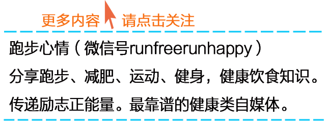

**** ****

  

  

人生没有彩排，不会让你重头再来。

  

我们真正要做的，就是牢牢地抓住今天，让今天的自己胜过昨天的自己，让今天的自己塑造明天的自己。集中精力看好眼前的路，才不会跌跤，才不会走岔道。给自己一个机会，
重新开始。有苦有乐的人生是充实的；有成有败的人生是合理的；有得有失的人生是公平的；人生坎坷不平才有价值。

  

当你成为一个瘦子之后，一个健康的瘦子之后，你觉得世界变得无比美好。生活也越来越积极。你穿的每一件衣服，都有不少姑娘说好看，你做的每一个娇嗔的动作，都不会有人
骂你恶心。没有油腻腻的皮肤，没有人背后骂你死胖子。

  

认真不一定赢，但是如果不认真，就一定不会赢！人生哲理，健身也一样~

  

坚持和坚强，不是摆给别人看的，而是为了对得起自己对梦想的痴心。站在高点时谦恭谨慎，落入低谷才不会自暴自弃，才知道更多思省、蓄着力量厚积薄发。人生有了这样的精
神高度，何以惧怕世事的无常。

  

人生一定要努力，努力是人生的一种精神状态。与其要求自己一定要成为一个什么样的人物，获得什么样的成就，不如磨练自己做一个努力的人。只有努力了才可能拥有，就算最
终没能实现梦想也不会有太多的遗憾。往往最美的不是成功的那一刻，而是那段努力奋斗的过程。

  

你每天的积累都不会白费，哪怕只比昨天进步一点点，放宽时间后，你会成为别人惊讶的对象！

  

> 任何建议、想法、供稿

>

> 都可添加个人微信号：fanfanrunner

>

> \- - - - - - - - - - - - - - - - - - - - - - - - - - -  

>

> 欢迎关注更多健康联盟微信自媒体

>

>  

>

> 微信公众号runfreerunhappy

>

> 跑步心情：跑步减肥健身，励志正能量

>

>  

>

> 微信公众号keep-fit001

>

> 镁女罩我去战斗：女性健身，励志

  

**↓↓点击阅读原文 查看更多内容**

阅读原文

阅读

__ 举报

[阅读原文](http://mp.weixin.qq.com/s?__biz=MjM5MzI0NTk2MA==&mid=202880392&idx=1&sn
=5bc3e5145d00d72a89858741b6d197af&scene=1#rd)

