##  十万个亚洲最大广场  | 大象公会

_2015-02-11_ 大象公会 大象公会

**大象公会**

idxgh2013

__ __

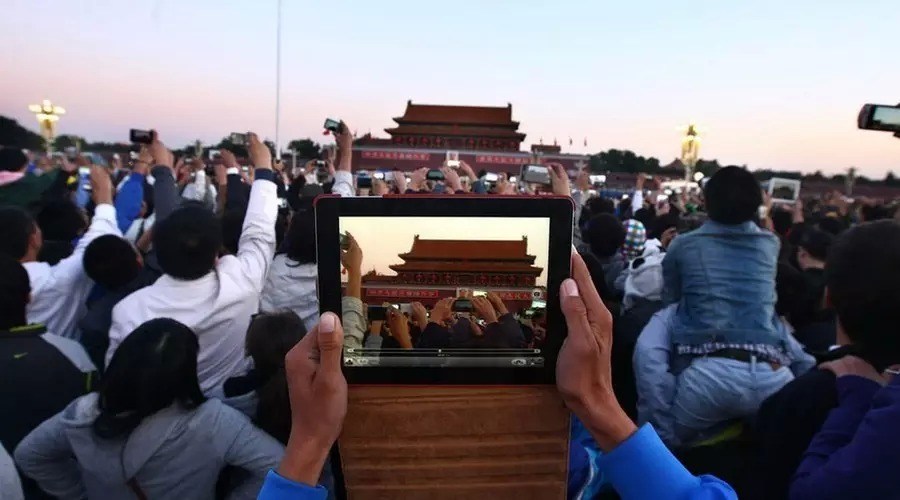

**天安门广场是世界最大广场？别低估中国城市的建造能力。今天，中国最大的广场已经是天安门广场面积的三倍。为什么中国城市喜欢修建大型广场？**  

  

**文/郭子健 杜修琪**

  

中国的广场设计者最应该感谢广场舞阿姨们。

  

她们克服了路途遥远、交通不便等困难，以非凡的智慧，创造性的舞蹈形式，将设施匮乏、形态单一、空旷的大型空地变得富有生机，挽救了可能沦为水泥荒地的广场，根本没有
计较处处不友好的设计。

  

当然会觉察出设计不友好——很长一段时间里，广场根本就不是为了市民建造的。

  

**【真正拥有广场的人】**

  

谁是真正拥有广场的人？

  

中国大型广场共同的鼻祖：天安门广场，或许能给出答案。

  

1949年之前，天安门前已有条状空地，但东西侧有许多民居、古建筑夹杂其中，很难符合中国人对广场的定义。

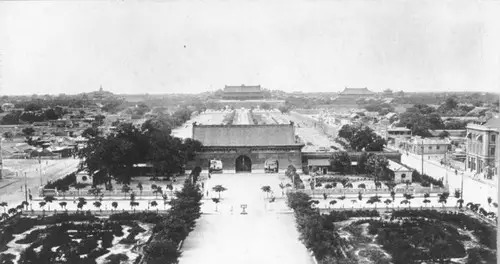  
**20世纪初期，从正阳门（前门）看到的天安门，下方的城门为中华门，1976年拆除**

  

为准备开国典礼，中共简单清理了天安门附近建筑，但真正让其成为“世界最大广场”的，是之后的四次扩建。

  

扩建有着非常强烈的苏联印迹——大面积花岗岩铺装，无树荫和休息设施，拆除周围建筑，广场从公共活动的空间变成孤立的政治符号单元。

  

1953年10月，《人民日报》发表社论《为确立正确的设计思想而斗争》。特别指出“向苏联专家学习，向苏联帮助我国所作的设计文件学习，从检查我们设计的错误、总结
我们设计的经验中学习”。

  

之后的几年，苏联专家主持设计的一系列标志性的广场成为了各级人民政府真正的教科书。

  

1950年代初的北京展览馆广场就是苏式封闭结构的代表：没有环形道路，绿化区与广场地面完全隔离，中央树立碑像或大型喷泉，却仅供观赏，禁止在喷泉、草坪游玩：

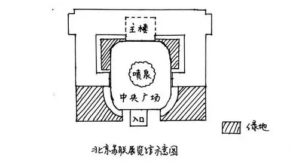  
**苏联专家设计的北京苏联展览馆广场（作者手绘）**

  

这时，广场最重要的功能是军事检阅、政治集会、历史纪念。

  

1950年代，在苏联专家的协助下，天安门广场几经扩建，成为一个以中轴线和检阅台为基本框架的封闭广场，喷泉、绿地等等广场景观，作为宏大广场布局的一部分，不再供
人休闲。

  

然而，中国并非完全照搬苏联模式，至少在面积上坚持了主见——没有接受苏联专家修建小广场的建议，而是大量拆除附近建筑，把天安门广场扩建到44万平方米。

  

苏联人非常震惊。44万平方米，意味着面积达到莫斯科红场的9倍。如此量级的广场，几乎丧失了集会以外的所有功能，连苏联专家都认为像是“练兵场”。

  

没多久，中苏交恶，“大跃进”开始，44万的骄傲指标顺利实现。五六十年代一并兴建的国内各地人民广场，宛如天安门广场的缩小版（但仍然比多数世界级广场要大），紧紧
跟随中央模式，政治功能也成为其标配。

  

按照名称，拥有广场的人非常明显：人民。

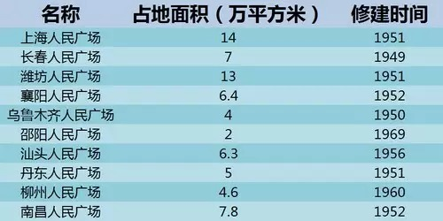  

**部分建国初期修建的人民广场**

  

**【Bigger than bigger】**

  

44万平方米的标准悬在所有城市的头上，强大的计划体制下，没有任何人可能挑战这一“世界最大广场”。

  

改革开放后，城市规划、设计拥有了部分自主性，但限于财力以及书记市长的魄力，超越天安门广场的壮举直到1997年才发生。

  

是谁这么有魄力？

  

1997年，薄熙来主政的大连，面积达110余万平方米的星海广场建成，成为当时的世界最大广场。相比之下，曾令苏联专家瞠目结舌的数字只是小儿科罢了。

  

如此大面积的开阔地，除了航拍，没有任何方式能看到全貌。其完整的广场图案，也只有在大连星海会展中心最高层才能正面欣赏。对于行人和车辆来说，庞大、单一的广场就是
交通的噩梦。

  

和喷泉一样，大型广场也迅速被各个城市接纳，它满足了市长们对城市名片的想象——高端、壮丽、雄伟，各级城市纷纷修建上档次的广场，顺手多次打破了天安门广场的纪录。

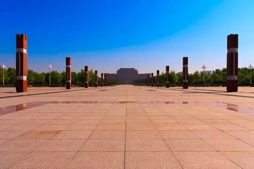  
**大庆时代广场，画面正中为大庆市政府**

  

2000年，黑龙江大庆市，在市政府门前，建成了面积144万平方米的“亚洲最大广场”（大庆市自称），不仅超越星海广场，还真正的将天安门广场变为了零头。

  

大庆时代广场最佳观测视角出现在市政府大楼的顶层，行人会陷入其中难以读懂的图案，在同样壮丽的大楼上，尽收眼底。同样正对广场的还有中级法院、政协、交通局。

  

2009年，一座面积达338万平方米的广场在辽宁营口落成，其中形似太极的人工湖面积223万平方米，陆地面积达110多万平方米，悄然成为世界上最大的广场。

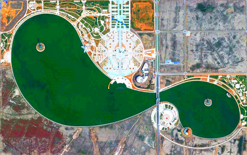  
**营口明湖广场俯视图**

  

据营口市财政局的公开信息显示，2008年营口市财政总收入95亿元，建设明湖广场就花费了4亿元。

  

并非所有城市都有营口的魄力，但至少他们能修建一个较小的大型广场过一过瘾。典型配置是：坐落于市政府大楼前方，大片的绿地和喷泉景观，讲究方正和对称。

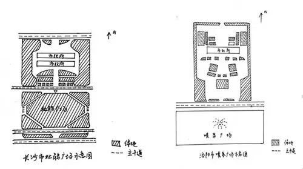  
**洛阳市和长沙市政府门前的广场（作者手绘）**

  

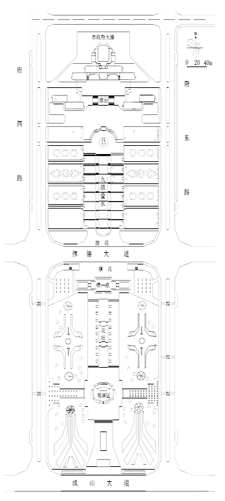  
**山东荣成市（县级市）市政广场,标准的市政府大楼门前广场**

  

这种市政府广场在2000年以后非常流行。有顺口溜总结道：

“低头是铺装，平视见喷泉，仰脸看雕塑，台阶加旗杆，中轴对称式，终点是机关。”

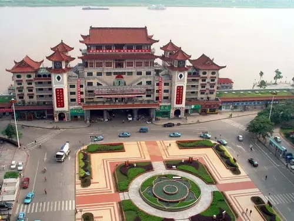  
**位于常德的武陵阁广场，广场周围被宽阔的机动车道包围，行人很难轻易穿过**

  

**【洋广场的寒酸】**

  

中国半个多世纪的广场修建，早已碾压了无论姓资姓社的国家，让“广场”一词具备特殊含义，只能在中文语境下理解。

  

实际上，中国并没有广场传统。和喷泉一样（**参见大象公会《十万个亚洲最大喷泉》**），广场也是由西方传入的近代城市设计，尤其是欧洲的广场，有着源远的发展脉络
，广场的形态深深扎根于社会、文化、政治环境中。

  

最早的广场起源于公元前五世纪的古希腊，一直是西方城市的核心功能区之一，占欧洲城市比例较大的放射状城市中，几何中心多为广场。通常，城市广场规模并不大，除了核心
广场，众多小规模广场分布在各社区中。

  

作为重要的公共空间，广场的政治、经济、文化、社会功能非常关键，人们在此交往，讨论，买卖商品，表演节目，街道都附属于此，堪称城市的心脏。

  

当然，历史时期不同，地域不同，广场的空间形态也有所差异。政治体制的演变，对广场形式也有相当大的影响。巴洛克时期之后的广场，人的重要性被淡化，建筑的雄伟更为设
计者重视，这就是专制色彩渐浓在规划、建筑上的反映。

  

一般来说，中国传统城市的核心是宫殿或府衙。街道是主要的外部性社交空间，而不是府衙的前庭等公共空地——后者不对公众开放，主要功能是体现皇家、官府的权威。

  

当然，中国的传统城市形态多样，斯波义信等学者从社会、经济角度考察，分析了宁波、上海、佛山等都市，认为其空间结构受商业等力量塑造，并不同于长安、北京等行政力量
主导的城市。

  

不过，总体来说，中国城市虽然也有寺庙、祠堂、瓦子、会馆等公共空间，但重要性完全不如欧洲的广场，街道空间仍然是外部社交空间的主流。

  

中国最早的近代城市广场，出现在鸦片战争后的租界中。

  

当时的租界广场打破了沉闷的空间形态——市政建筑和商店取代了封闭的宫门和围墙，开放性的广场也便利了人的流动。

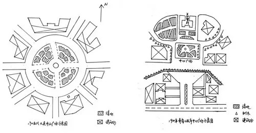  
**1900年代的大连中山广场和青岛中心广场（作者手绘）**

  

租界广场继承了当时的欧洲风格——呈规则的几何形状，与步行街、汽车道互相连接，广场为区域公共中心，剧院、市场、居住区等环绕四周；总体面积适中（多数在两万平方米
以下，且是由多个小广场组成的广场群），可达性高；中心有雕塑或喷泉，周围为有限空地，单块绿地闭合面积很小，分布均匀，便于游人休息。

  

这也是被现代广场承袭的设计原则。今天，西方的现代广场都镶嵌在区域中，休闲、社交功能明确。只不过规模有限，与中国广场相比非常寒酸。

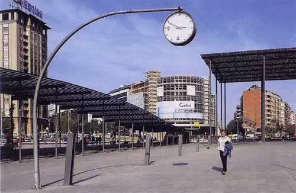  
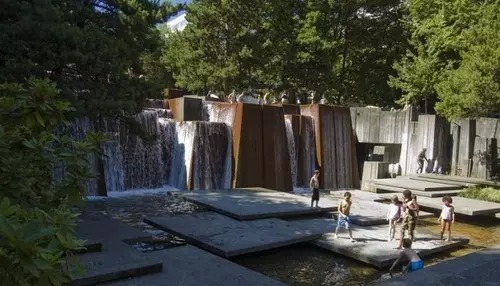  
**现代西方广场延续了对社交功能的重视，规模小，穿行便利。图为位于巴塞罗那的巴索斯**卡塔卢尼亚广场（上）与位于波特兰的伊拉凯勒水景广场（下）**

  

**【中国特色建筑风格】**

  

1949年后，租界广场的传统被割断。改革开放后，新兴的城市广场嫁接了西方的几何设计，似乎又接续上了半世纪前的传统，但是比例放大数倍，失去了功能和布局意义。

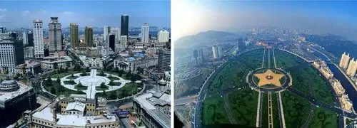  
**与大连中山广场（左）布局类似的大连星海广场（右），面积却放大了50倍**

  

实际上，这是一种全新的广场形态，与欧美甚至苏联的传统都不相同。无论是英文、法语、西班牙语中，都没有对应中文“广场”的翻译，其宏大、壮丽的含义，只有中国人才能
领会。

  

它还有着自我改进的趋势。经历了粗糙放大的阶段后，中国的广场设计者开始将本土地域文化元素植入广场建设之中，规划出“中国特色”地标。

  

然而，文化元素融入过程中难免有粗制滥造之嫌。例如呼和浩特市的如意广场，广场中心矗立着一个巨型如意，并以四大美女作为四季的象征。可能是设计者觉得四大美女对四季
的隐喻犹嫌不及，还在她们身上刻上了“春夏秋冬”四个大字。

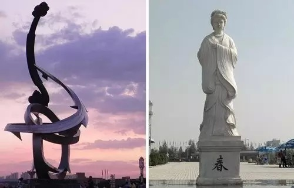  
**四季广场图片**

  

尺寸也被广泛的赋予了含义。星海广场的数字游戏就是精妙的典型：广场中央华表高19.97米，直径1.997米，超过天安门华表；底座饰面雕有8条龙，柱身雕有1条巨
龙，暗示中国的“九州”。

  

星海广场也从未忘记自己作为大连市地标的使命感：广场内圆直径199.9米，寓意公元1999年大连市建市100周年﹔外圆直径239.9米，指2399年时大连将迎
来建市500周年。

  

这些漂亮的数字显然与人性化的功能布局设计理念毫无关系——星海广场的华表高度已经超过了天安门广场，但置身于巨大的广场直径之中，瞬间失去了合理的建筑尺度。

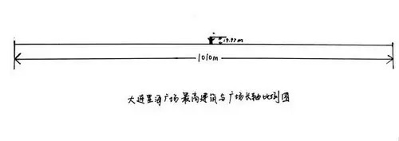  
**大连星海广场最高建筑华表（19.97米）与广场长轴（1010米）比例严重失调，达到1:50**

  

**版权声明**

****大象公会所有文章均为原创，****  

****版权归大象公会所有。如希望转载，****

****请事前联系我们：****

bd@idaxiang.org

****知识 | 见识 | 见闻****

阅读

__ 举报

[阅读原文](http://mp.weixin.qq.com/s?__biz=MjM5NzQwNjcyMQ==&mid=210688204&idx=1&sn
=9d5546d5217babecead208c6043a1e59&scene=1#rd)

