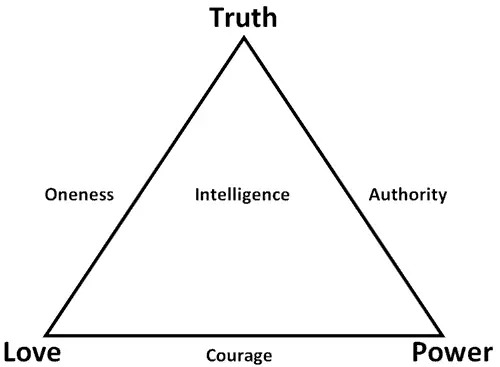

##  颠覆式创新

_2015-02-20_ _史蒂夫**帕弗利纳_ 聪明人的个人发展 聪明人的个人发展

**聪明人的个人发展**

stevepavlinachina

个人成长，与你同行

__ __

  

我必须承认，自己很享受看到互联网对传统商业模式造成的颠覆式影响。

  

旧模式在尽其最大努力进行抗争，以求生存。例如，新泽西最近就禁止特斯拉在州内销售电动车，于是本州低效的汽车经销商们便不必跟特斯拉的直销模式竞争。

  

到目前为止，新泽西是禁止特斯拉电动车销售的第五个州。另有两州也对特斯拉的销售有严格限制，至少还有两个州正在核定相似法律程序。看来特斯拉确实捅到这些抵抗力量的
马蜂窝了。

  

记得不久前走进一家Borders书店时，我就在想... 这个地方不会存在太久了。现在它已消失，直接被更智能、快捷和庞大的互联网模式干掉。

  

  

**你正保护什么？**

  

嘲笑这些贸易保护法规得以通过，还有这类反潮流思维的愚蠢，是很容易的事情。但请后退一步，留意这种事何以激起你内心波澜。它令你心烦，是否可能因为你也正阻止邀请更
多颠覆式创新进入自己生活？

  

你有哪些地方显得过于守旧？你在生活哪些领域做得墨守成规？你正在哪些方面保护自己现有事物，对过时心态紧抓不放？

  

五年后你将在哪里？为何不现在就实现？干嘛不一年后就做到？为何要如此缓慢？你仍在抵制哪些可更快实现目标的创新？

  

你能完全在生活中提早创新吗？你正以机敏反应和冒险精神驾驭颠覆式创新的浪潮吗？你在对明日机会进行卓有有效的资本化吗？

  

或者，就像那些焦虑的汽车经销商们一样，你正对要到来的现实怀着抵抗？你是否感到改变发生得太快？你是否想让事情放慢下来？

  

也许你已知道旧模式正在消亡，最终除了向前看，没有其他选择，正如那些汽车经销商们已知的这样。但与此同时，暂时留在原处不是感觉更安全一点吗？改变总是可怕和无把握
的事，难道不是吗？

  

  

**在充满变化的世界里感到安全**

  

与创新一起流动变化，而非抵制它的关键，就是确定自己未将个人安全感维系于创新可以颠覆的领地。

  

例如，假如你把金钱看作一种力量来源，那么任何威胁财务状况的事物就能打乱你生活的平衡。假如你把首要感情关系变成个人力量来源，那么任何威胁这份关系的事物也将威胁
你感受安全的能力。这些情形会自然而然引发你对所觉察威胁的抵制。

  

在充满变化的世界里，将个人安全感根植于没那么容易被颠覆的事物中，会有用得多。你无法对自身财务状况感到确定。但你能对那些更为永久和无法改变的事物感到确定。

  

我对个人成长抱有的激情，还有自己生活的原则（真实、爱、力量、一体、权威、勇气、智慧），都不受时间影响。它们永远不会改变。

  

无论个人生活发生多少曲折变化，我都能感到稳定安全。当然有时我会被现实问题打破平衡。我会感到惊讶。我要花一段时间来适应。但我似乎总能站稳双脚。无论生活中发生什
么，我都能泰然处之。

  

这是因为我没将自身安全感，根植于任何会受到威胁的事物中。我把人生根基更深地扎入坚不可摧的事物里。

  

  

**坚不可摧的根基**

  

金钱是脆弱的。好奇心则坚不可摧。

  

感情是脆弱的。爱则坚不可摧。

  

工作是脆弱的。幽默则坚不可摧。

  

假如在生活中变得对脆弱事物过于依赖，我就会感到更有压力和更加焦虑。我会担心潜在威胁。我可能在遭受某种损失后会变得抑郁沮丧。

  

我尽着最大努力，提醒自己牢记生活中那些脆弱事物都只能暂时存在，对它们过于依赖绝非明智之举。我可以暂时享受和感激它们，但终有一天它们都将逝去。我并不拥有生命中
一切事物。眼前所有东西都只是暂时景象。

  

奇妙的是，我对脆弱事物的依赖感越少，就越容易将它们召唤进现实生活，尽情享受它们。

  

例如，当我把金钱看作一种力量来源时，便无法吸引它的出现。我甚至没法留住已有钱财。我曾陷入债务之中 —
长达数年。那时赚钱很难。存钱也很难。享受金钱甚至都不在我的思考范围内；金钱太宝贵和稀少了，以致我无法好好享受它。金钱对我来说更像是付房租和买食物的必需品。

  

当采纳金钱只是用于成长的工具、一种学习帮手、一件玩耍之物的态度时，我就更能享受它在个人生活中的存在。当收入发生波动，我也不会感觉受到威胁。这种心态使我能以更
喜乐和试验性的态度做出各种决定，比如2008年放弃网站上的谷歌广告收入，即便这一广告方式能为自己每年带来超过10万美元的被动收入。我当时想尝试以不同方式赚取
金钱，而非过于依赖广告，这种收入方式已变得太过容易。不依附于金钱也让我感觉幸福得多。

  

  

**自我颠覆**

  

与其等着世界在你身上造成颠覆性影响，何不领先一步，主动出击？

  

若将个人安全感根植于不会被颠覆性改变破坏的观念和想法中（因为它们可无限适应变化），你就能以全新境界与生活共同嬉戏。你还可以只是为了乐趣和体验，来创造自我的颠
覆式改变。

  

我在自己身上施加的一次颠覆性改变，就是放弃了个人网站内容（包括文章、音频、视频和社交媒体更新内容）所有版权，在2010年将其捐献给公共领域。这些内容的数量大
概相当于30本书，是我许多年来创作而出。我写下的每篇新文章，包括这篇，都会自动捐献给公共领域。我不再拥有它的所属权。假如我把个人安全感，或是自己生意的成功，
依附于对知识产权的占有，我就不会做出这种举动。我并未因这种行为感觉受到威胁。你可以将它看作我感到有多安全的正面展示。

  

版权所有制已是临时存在的事物。在美国，一位作家作品的默认版权归属期，是这位作家全部在世时间，另加70年时长。我们干嘛要等这么长时间？如果它反正要发生，看看自
己死后70年作品可能产生的影响，并在今天就与之互动，不是更为有趣吗？让咱们按下快进键，瞧瞧最后结果如何。

  

当我体验同一件事太长时间，就喜欢向其注入一些颠覆性创新内容，搅动一下现状。把各种事物混合起来，给自己生活餐盘摆上一道新挑战。甩出新的色子。重洗一遍牌桌。

  

当我们慢下脚步，常是因为恐惧作怪。我们恐惧自己无法很好适应另一边的生活。但另一边的世界，就是所有乐趣和冒险 — 以及成长 —
得以给你享受之地。而且对任何事情来说，对另一边世界的恐惧会完全毁掉我们转变前这一边的生活，制造出压力、担忧和抵制状态。

  

体验转变要比恐惧转变好得多。想象在一家迎面接受特斯拉直销模式挑战，将团队马上融入创意革新的汽车经销商那里工作，会有多少乐趣。去培训销售人员为客户真正创造价值
，而非耍用手段策略压榨额外钱财，这种做法怎么样？在体验驾驶中提供更多服务，而非只是转四个弯就草草了事，这种做法又怎么样？把Folger’s咖啡换成一些更上乘
的免费咖啡呢？还有，当走进车店大门时，我要的拥抱又在哪儿???

  

那些汽车经销商们正剥夺自己绝佳的成长体验。他们本可赋予雇员极佳礼物，让其享受工作在一个令人兴奋、忠于变化、充满创新之地的好处。在顾客服务方面，这一领域显然还
有很大创新空间。

  

抵制改变会令人压力重重。主动拥抱改变，则充满乐趣。

  

恐惧改变时，我们便放慢了成长。特斯拉在其行业领域内，拥有颠覆性产品和颠覆性商业模式。它并非第一家颠覆性公司，也绝非最后一家。这种改变长远看来于我们有益。它会
给陈腐停滞的行业注入新鲜力量。应对挑战才是令我们每日工作充满乐趣和活力的地方。

  

我们干嘛还使用内燃引擎？让我们不断前进。大家其实都知道怎样做才更明智。

  

  

**拥抱你的道路**

  

我们不用痛打那些好像在给改变设置路障的人。这无法解决任何问题。我们不如审视自己，看看自身还有哪些障碍。

  

你正抵制哪些地方的改变？你在哪些领域前进得过于缓慢？你正依附于哪些过时规则和行为？你又推离了哪些创新之处？

  

你可以提速吗？你可以停止抵制吗？你能更快沿着自己终将踏上的道路前进吗？干嘛要用五年时间？你今年完全就能做到。你知道这一点。更快前进会好玩有趣得多，难道不是吗
？

  

请先审视自己。将个人存在感与那些坚不可摧的观念保持一致，让自己更易欢迎颠覆性创新的到来，而且你会把这种欢迎态度更彻底注入整个世界。如此，你很快就能开上一辆非
内燃引擎汽车… 不过你实际上并没开车。汽车会自动将你载向四方。:-)

  

  

Steve Pavlina

2014.03.15

  

  

阅读原文

阅读

__ 举报

[阅读原文](http://mp.weixin.qq.com/s?__biz=MzA3NzIyNTQ3NA==&mid=205671751&idx=1&sn
=d455f365a35dad2a8c94b223343ba0b6&scene=1#rd)

