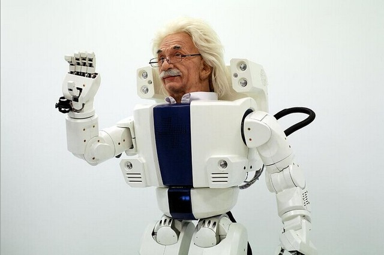

_题图来自：Hubo Labs_

  

**环球科学微信号：huanqiukexue**

  

2014年6月，在著名的英国皇家学会举办的图灵测试竞赛中，由俄罗斯工程师弗拉基米尔**韦谢洛夫（Vladimir
Veselov）等人编写的计算机软件尤金**古茨曼（Eugene Goostman），成为了65年以来首次通过了该测试的"选手"。这个计算机程序成功地冒充了
一个13岁的乌克兰男孩，骗过30%的人工智能专家。这样的结果使许多媒体惊呼：人工智能时代已经到来。  

  

人工智能时代真的到来了吗？为此，《环球科学》专访了韦谢洛夫，以及剑桥大学人类未来研究所教授安德斯**桑贝格（Anders Sandberg）。

  

本刊记者 **易疏序**

  

**人物****  
**   
**姓名**  
弗拉基米尔**韦谢洛夫  
  
**职务**  
亚马逊公司软件开发工程师  
  
**地点**  
美国华盛顿特区  
  
**概述**  
2014年6月，韦谢洛夫编写的程序尤金**古斯特曼（Eugene Goostman）成为了65年以来首次通过英国皇家学会举办的图灵测试竞赛的“选手”。  
  
  

**姓名**  
安德斯**桑贝格  
  
**职务**  
剑桥大学人类未来研究所教授  
  
**地点**  
英国剑桥  
  
**概述**  
计算神经生物学博士、未来学家和超人类主义者，他除了从事研究工作之外，还活跃地参与科学评论。  

  
**《环球科学》**：在公众心中，一个机器通过图灵测试就等价于它可以像人类般思考。而我以为这两个事情的等价性是建立在功能主义的意义上的。我想请问桑贝格教授，这两个概念有什么区别？  
  
**桑贝格**：图灵敏锐地察觉到，虽然定义“思考”很困难，我们可以换而考察一些可观察的行为，然后判断这些行为是否看起来“智能”。在哲学意义上，这比定义什么是思考更加容易。不过，他并没有说看起来“智能”就能证明真正智能。有一些系统，它的行为上表现得很智能，但实际上毫无智能。美国哲学家内德**布洛克（Ned Block）对此有一个很好的思维例证：他说我们可以制作一个表格，对于图灵测试里的每一个问题，表格上都有一个完美的答案。计算机程序只需要根据上一个问题去查阅这个表格就可以了。在这个过程里，没有任何思考。当然，制作这个表格需要超级智能才可以。  
  
所谓功能主义，是指思想由它所表现的功能所定义。举例来说，如果听到一个词就唤起了一段记忆，那么无所谓这个过程是由大脑完成，还是由计算机完成，这就是一个记忆功能
的表现而已。对一个功能主义者而言，一个智能机器和人类具有同样水平的思维功能。  
  
我还想提到另一个哲学概念：行为主义。这个主义说，只有可观察的行为才有意义。对于一个行为主义者而言，里面发生了什么并不重要，重要的是：“机器的行为看起来聪明吗
？”如果答案是肯定的话，就可以说机器是聪明的。  
  
**《环球科学》**：从1966年以来，不断人声称通过了图灵测试。比如1966年的程序“ELIZA”，1972年的程序“PARRY”，还有聊天机器人病毒“Cyberlove”。那么这次的“尤金”有什么与众不同，能让人们称它为“第一次通过图灵测试”？  
  
**韦谢洛夫**：老实说我不觉得尤金是真正的“第一个”。我能说的只是，尤金能够在5分钟的交谈中把30位评委中的10位愚弄到。我不知道ELIZA，PARRY或者Cyberlove是否能够表现更好，或者不如尤金，因为他们没有参加这次比赛。我们给尤金加入了很多模块，如果：拼写检查，语法纠正，模式识别，把握上下文，用户个性化配置，对话控制，百科全书，知识库，等等。它能做简单的数学运算，他知道不同国家的首都、货币、人口。他知道那些重要的发明。不过最重要的是，他有很强的人类特的点。也就是说，大部分尤金的回答都能支持它的身份。他会反复地提及，他的故乡是敖德萨(Odessa），他的父母亲戚和他的爱好。  
  
**桑贝格**：我觉得部分原因是，这次测试是由人工智能领域的专家严格进行的。另一部分原因，我认为是一个市场化噱头：今年恰逢图灵逝世60周年，在图灵自己的文章里，他曾经预言说计算机软件发展到今天应该能够骗过30%的人类。  
  
**《环球科学》**：谢谢您提到30%这个数字，我正想提到这个问题。在这次图灵测试中，尤金因为让33%的人认为它是人类而被宣布通过图灵测试。而会议主办方说通过图灵测试的标准是30%。我想请问这个30%的标准是否就来自于图灵的论文里的一段话：“等到2000年，一台拥有100MB存储空间的计算机能够在5分钟的测试中欺骗30%的人。”这个30%在统计学意义上有多大的显著性？  
  
**桑贝格**：我才你是在维基百科上看到这段话的。事实上维基百科上的引述并不完全准确。图灵真正说的是：“我相信在未来50年，一个存储能力有10^9的计算机可以和人玩“模仿游戏”。平均来说，它会有足够的能力使提问者在五分钟的游戏里看出它不是人类的可能性不超过70%”不过他也承认，这是他个人的观点，也许并非那么有分量。其实图灵自己也说过，用一种类似于民意调查的方式定义一台机器是否能够思考有点荒谬。他文章里的重点是，计算机可以做一些事，而这些事我们一般认为只有会思考的人类才能完成。图灵并非想提出一种证明智能的测试。  
  
**韦谢洛夫**：你说的没错，这次比赛就是按照图灵的文章“计算机器和智能”这篇文章里的话来的。刚刚桑贝格已经正确地引述了。我认为70%的正确识别率，或者说30%的错误识别率已经足够证明这不是一个裁判的失误或者是巧合。想想看随便乱猜的正确率是50%，那么30%已经是想到高的标准了。另一个问题是，样本大小（裁判的人数）应该是多大？Loebner竞赛里有四个裁判，这次有30个。  
  
**《环球科学》**：这次测试中，我注意到这个尤金程序是模仿一个13岁的非英语母语的乌克兰小男孩。这种设定对于它通过图灵测试有多重要？  
  
**韦谢洛夫**：我不觉得这有多重要。我们也可以做成一个英语很流利的成年人。Eugene在英语上犯些错误可以支持它的乌克兰背景。因为我们的团队都是以英语为第二语言。如果我们要模仿一个英国人，那看起来会很奇怪。你得懂得那些生活方式，传统，文化，现代语言（流行语），俚语，新闻，新鲜事等等。最重要的是，我们人物个性的完整性。  
  
**桑贝格**：不，这很重要。当我们和一个外国人说话的时候，我们会忽略他的语法错误，并且对他的一些误解表示理解。程序也会有时候犯类似的语法错误和误解。通过假装是外国人，程序可以掩盖这些错误，使人们不会怀疑它是程序。类似的，和一个小孩子说话时，他可能有很多事情不知道。小孩子也会拒绝回答很多问题，我们对此习以为常。不过一个聊天机器人则需要隐藏它所不能会的，所以它通过模仿一个十来岁的小孩，来巧妙避开那些不会回答的问题。  
  
**《环球科学》**：如此说来，通过图灵测试的关键就是表现得像个人类。而人类的很多行为其实是非智能的，换句话说，如果表现得太智能就不像人类了。那么如此说来，追求通过图灵测试是否会造成人工智能界偏离了主要目标?  
  
**桑贝格**：实际上图灵在他那篇1950年的论文里就提到了这个问题。他给了一个例子，计算机在被问及一个计算时，故意算错。一个真正具有智能的机器人会自己悟出：如果回答得太快或者太正确，会证明自己是机器。然后计算机自己决定故意犯几个错误。现在的聊天机器人不是这样的，程序员设计好了让他们这样表现而已。  
  
能够理解别人期望你如何表现，这是智能的更高境界。这也是一个有用机器的更高境界。解决这个问题对人工智能领域很有用。至于有时候正确的回答反而让别人不满意，这是个
次要的问题。  
  
**韦谢洛夫**：没错，图灵测试并非智能的试金石，也不能证明计算机可以解决棘手的问题。它只是证明计算机可以模仿人类谈话，仅此而已。图灵测试在64年前被提出，现在人工智能是一门科学，它有很多不同的方向。也许，学术界应该考虑提出一个新的测试了。  
  
**《环球科学》**：那么，在你们看来，人工智能的主要目标是什么？我们离这个目标还有多远？  
  
**韦谢洛夫**：人工智能的最大目标是让我们的生活更美好。举例而言，google正在致力于打造自动汽车。或许5到10年内我们就都换开自动驾驶的汽车了。我不喜欢“人工智能”这个词，因为它让人想起有生命有感觉的机器，它们可能会揭竿而起反抗人类。我觉得“自动解决复杂问题”是个更好的表述方法。  
  
**桑贝格**：真正的人工智能是实现广义智能。就是可以在任何环境下或者任何领域内解决问题。现在的人工智能太过狭隘：下象棋或者整理信息。一个下象棋超级棒的计算机对解决其他问题毫无帮助。真正广义上的智能是能够在环境中学习规则，然后找到解决问题的方法。  
  
我乐观地以为，广义智能是可以实现的。不过我们离这个目标还有很远。我还有充分的理由说，我们没法预测我们到底离这个目标有多远。因为我们还没有一个人工智能的很好的
标准（图灵测试是一个标准，不过他与广义的智能无关）。以前也有专家进行了预言，不过现在看来都是错误的。这就意味着着人工智能终极目标的实现可能就在不远的将来，也
可能在几十年甚至上百年。我们不知道。  
  
**《环球科学》**：如果这次的尤金在真正意义上通过了图灵测试，它能够给人工智能领域带来什么影响呢？  
  
**桑贝格**：不会有太多影响。人工智能旨在在许多领域上重现那些智慧的行为。最理想的情况是，机器拥有广义的智能，就像我刚刚提到的，它可以通过自行学习解决放在它面前的任何问题。而即使是再完美的聊天机器人，它也只能专注于社交聊天，而不能解决更多的问题。  
  
不过，一个机器人如果有能力让人以为它是人类，这也是有用的。比如我们可以制造出更好的客服机器人，做出更好的用户界面，还有我么可以研究人类是如何揣测别人心思的。  
  
**韦谢洛夫**：或多或少是会对科学界产生一些影响的。我想这件事会激起科学家对此类问题的兴趣。它证明了，是的，计算机像人类一样对话是可能的。也许，那些适用自动应答系统的呼叫中心可以考虑用同样的办法来评估他们的服务质量。

  

**环球科学招聘**

国际教育项目经理

高级销售经理

科学编辑

社交媒体编辑

网站开发  

  

详情点击“阅读原文”

  

[阅读原文](http://mp.weixin.qq.com/s?__biz=MjM5NDA1Njg2MA==&mid=200884340&idx=1&sn
=8fbddceabc1901b550d981eb41d7c5c0&scene=0#rd)

