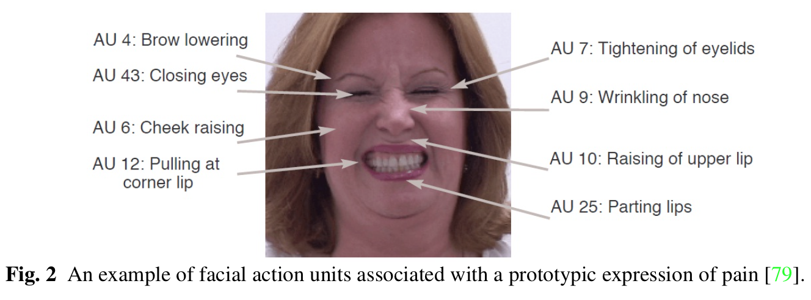
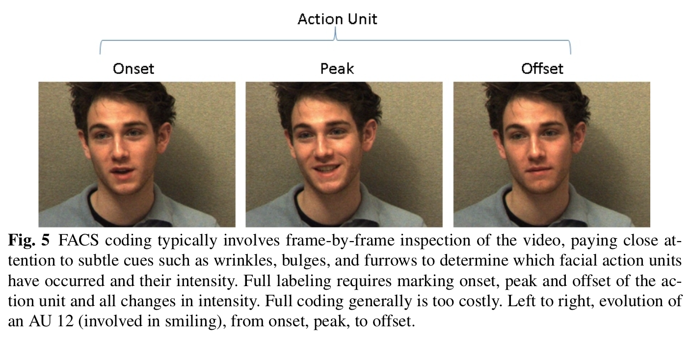
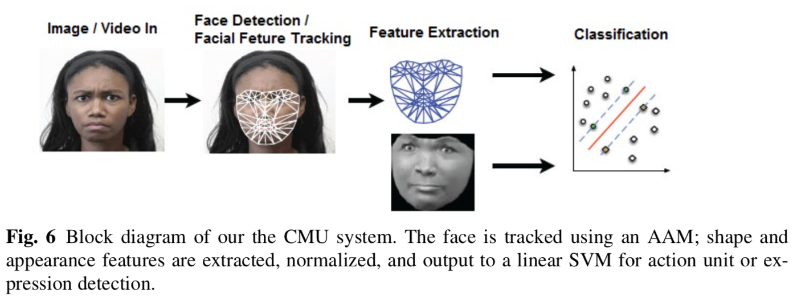
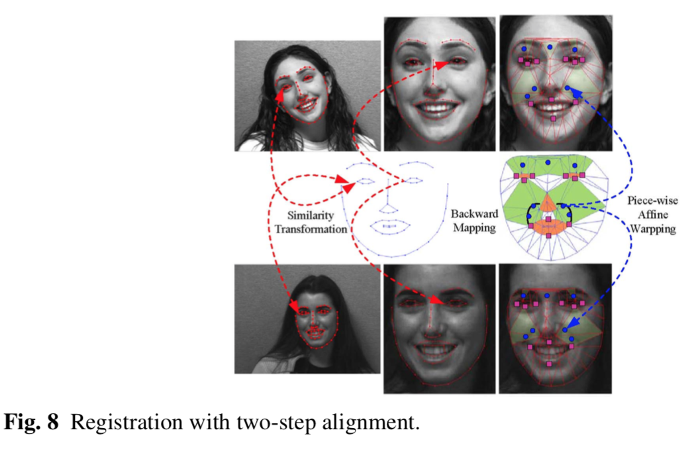

+ Facial expression -> cues about emotion, intention, alertness, pain, personality...
+ fundamental approaches to facial measurement
+ AAM Active Appearance Models
+ Automated facial expression analysis is critical as well to the emerging fields of Computational Behavior Science and Social Signal Processing.
+ challenges
    + detected in video
    + extract shape or appearance information
    + normalized features
+ supervised learning
+ unsupervised learning
+ annotation of facial expression
    + message-judgment(label)
    + 
    + holistic(combine information from multiple regions of the face) may include taking account of context
    + 这里的大部分表情在人们日常生活中出现较少，人们通常做几个常用表情。特定的训练集训练出来的模型的通用性不是很好
    + sign-based
    + 
    + physical changes in face shape or texture are the descriptors
    + action units
    + each action unit is related to one or more facial muscles.
    + FACS(Facial Action Coding System) uses 44 unique action units(AUs)
    + 
    + 每个面部事件可以被分解为不同的 AU
    + FACS 已经成为现在自动脸部图像分析的标准
    + facial actions can vary in intensity
    + 一开始(1978) FACS 有三个 intensity 等级(X,Y, Z)，2002年增加为5个等级(A, B, C, D, E)

### Database

大部分表情数据库的数据采集是让参与人做特定的表情，这种和人们自发的表情还是有一定差距

我们现在用的是以下两个

+ Cohn-Kanade(Posed, Video, Frontal, FACS AU)
+ Cohn-Kanade+(Posed, Video, Frontal, FACS AU)(Conversation 15 to the side, Emotion)

还有两个数据库可以考虑

+ BU-3DFE(Posed, Static, 3D, Emotion)
+ BU-4DFE(Posed, Dynamic, 3D, Emotion)

With the agreement of the technology transfer office of the SUNY at Binghamton, the database is available for use by external parties. Due to agreements signed by the volunteer models, a written agreement must first be signed by the recipient and the research administration office director of your institution before the data can be provided. Furthermore, the data will be provided to parties who are pursuing research for non-profit use. To make a request for the data, please contact Dr. Lijun Yin at lijun@cs.binghamton.edu. For any profit/commercial use of such data, please also contact both Dr. Lijun Yin and Mr. Scott Hancock in the Office of Technology Licensing and Innovation Partnerships at shancock@binghamton.edu.

Note: (1) Students are not eligible to be a recipient. If you are a student, please have your supervisor to make a request. (2) Once the agreement form is signed, we will give access to download the data.

### Facial feature tracking, registration and feature extraction

non-frontal pose and moderate to large head motion make facial image registration difficult

classifiers can suffer from over-fitting when trained with relatively few examples for each AU

many facial actions are inherently subtle making them difficult to be model;

individual differences among faces in shape and appearance make the classification task difficult to generalize across subjects

Most facial expression analysis systems are composed of three main modules:

1. face detection, facial feature tracking and registration
2. feature extraction
3. supervised or unsupervised learning.

#### Facial feature detection and tracking

initial step

Viola and Jones face detector(frontal face detection)- most commonly employed algorithm

检测到脸之后，两种 registration 方法比较常用
coarse registration: detecting a sparse set of facial features (e.g., eyes) in each frame.

fine registration: detecting detailed features(i.e. dense points around the eyes and other facial landmarks) in the video sequence.

这里介绍第二种 Parameterized Appearance Models (PAMs)

包括 Lucas-Kanade method, Eigentracking, Active Appearance Models and Morphable Models.

PAMs for faces build an appearance and/or shape represen- tation from the principal components of labeled training data.

具体的细节不看了

### Registration and feature extraction

The main goal of registration is to normalize the image to remove 3D rigid head motion, so features can be geometrically normalized.

Geometric features: contain infor- mation about shape and the locations of permanent facial features (e.g., eyes, brows, nose)

Approaches that use only geometric features (or their derivatives) mostly rely on detecting sets of fiducial facial points, a connected face mesh or ac- tive shape model, or face component shape parametrization.

Appearance features: Represent the appearance (skin texture) changes and tex- ture of the face, such as wrinkles and furrows.

Gabor wavelet coefficients are a popular approach

the combination of shape and appearance achieved better results than either shape or appearance alone.

### Supervised Learning

Early work in supervised learning sought to detect the six universal expressions of joy, surprise, anger, fear, disgust, and sadness

Whether the focus is expression or AU, two main approaches have been pursued for supervised learning.

1. static modeling—typically posed as a dis- criminative classification problem in which each video frame is evaluated independently
2. temporal modeling— in which frames are segmented into sequences and typically modeled with a variant of dynamic Bayesian networks (e.g., Hidden Markov Models, Conditional Random Fields).

### Classifiers

+ Neural Network classifiers
+ Gabor filters with AdaBoost feature selection followed by a Support Vector Machine(SVM) classifier
+ multi-linear models
+ AAM+SVM
+ A popular strategy is to use HMMs to temporally segment expressions by establishing a cor- respondence between the action’s onset, peak, and offset and an underlying latent state.
+ SVM+HMM
+ GentleBoost classifiers
+ Dynamic Bayesian Networks with appearance features
+ Gaussian Tree-Augmented Naive Bayes (TAN) classifiers
+ Selection of positive and negative samples during training

这一部分比较复杂，而且我们也应该用不上，故略

### Unsupervised learning

这个我就更不懂了，大概记一下用的方法

+ multilevel Bayesian network
+ AAM
+ structure-from-motion factorization
+ geometric-invariant clustering algorithm
+ Aligned Cluster Analysis(ACA)
+ Facial event discovery for one subject

这个主要也是介绍ACA 的

基本就是这些内容
