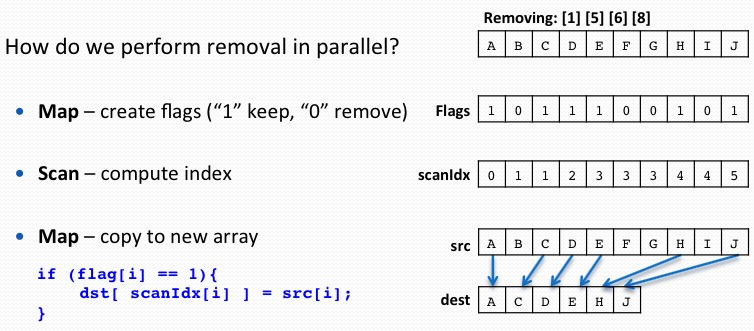
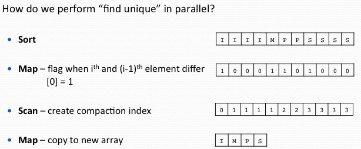
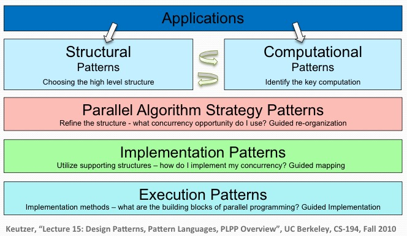
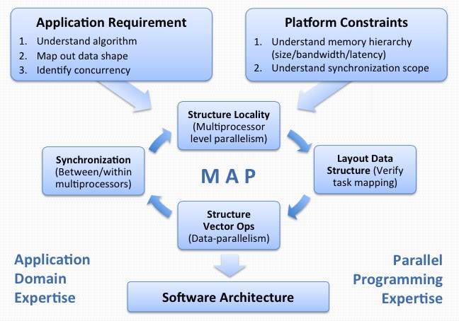

Teachers

+ Jike Chong, `jike.chong@sv.cmu.edu`, skype: chong.18645
+ Ian Lane, `lane@cs.cmu.edu`, Skype: lane.18645

+ Fast Platforms (Multicore platforms, Manycore platforms, Cloud platform) + Good Techniques (Data structure, Algorithm, Software Architecture)
+ Need is driven by the applications, NOT by the availability of the platform.
+ Background -> Multicore(openmp) -> Manycore(CUDA) -> cluster(Hadoop) -> Special Topics

## Multicore vs Manycore

+ Multicore: yoke of oxen. Each core optimized for executing a single thread.
+ Manycore: flock of chickens. Cores optimized for aggregate throughput, deemphasizing individual performance.

## Instruction Level Parallelism (ILP)

Instructions in a sequence that can be computed at the same time.

+ Advantages
    * No changes in sequential software necessary
+ Disadvantages
    * Significantly more complex processor architecture
    * Longer to design the processor
    * Longer to verify the correctness of the processor design
    * Consumes more energy than simple in-order processor

## Out-of-order Pipelines

Allows instruction re-ordering, register-renaming

## SIMD

+ can be area and power efficient
+ parallelism exposed to programmer & compiler

Locality, Temporal Locality, Spatial Locality

Compulsory misses, Capacity misses, Conflict misses

+ Advantages
    * Power-efficient wya to improve instruction throughput
    * Exploitable in many compute-intensive applications
+ Disadvantages
    * Explicit representation in vector instructions
    * Software requires re-compilation to take advantage of new SIMD capabilites.
    * May require hand-tuning to expoit full benefit

## Simultaneous multithreading

Capturing the opportunity to run faster when more than one thread of instructions are available.

+ Advantages
    * Gain power-efficiency by increase processor pipeline utilization
+ Disadvantages
    * Requires multiple threads available
    * May trigger confilicts in shared cache during execution
    * Does not improve latency of each thread

## Concurrency vs Parallelism

+ Concurrency: We expose concurrency in our application
+ Parallelism: We exploit parallelism in our platform

## The process of problem solving:

+ Understand the current state
    + Running on a platform
    + Using a specific set of resources
    + Achieving a specific performance
    + Meeting a specific criteria/requirement
+ Observe the internal representation
    + Application structure
    + Implementation concerns
        + Task considerations
        + Data representations
        + concurrency opportunities
+ Search among alternatives
+ Select from a set of choices

## Kmeans Problem

+ Find K cluster centers that minimize the distance from each data point to a cluster center (centroid)
+ Important algorithm in machine learning
+ NP-hard for arbitrary input
+ Issues
    + Worst case running time is super-polynomial
    + Approximation can be arbitrarily bad

## How to write fast code

+ **Expose** concurrencies in applications and algorithms
+ **Exploit** parallelisms on application platform
+ **Explore** mapping between concurrency and parallelism

## The phases(kmeans)

+ Initialization: Randomly select k cluster centers
    + Select k samples from data as initial centers [Forgy Partition]
+ Expectation: Assign each data point go closest center
    + Compare each data point (N) to each cluster center (K)
    + Distance Metric: Euclidean distance (D dimensions)
+ Maximization: Update centers based on assignments
+ Evaluate: Re-iterate steps 2-3 until convergence or stopping criteria.

## Performance Analysis: Roofline Model

+ Observe the phases of execution
+ Characterize the execution time break downs
+ Reason about why a piece of code is slow
+ Identify performance bottleneck

## How to evaluate a mapping

+ Efficiency: Runs quickly, makes good use of computational resources
+ Simplicity: Easy to understand code is easier to develop, debug, verify and modify
+ Portability: Should run on widest range of parallel computers
+ Scalability: Should be effective on a wide range of processing elements

## Exploiting Different Levels of Parallelism

+ SIMD-Level: using vectorizing compiler and hand-code intrinsics
+ SMT-Level: OS abstract it to core-level parallelism
+ Core-Level: Using threads to describe work done on different cores

## Roofline Model

Attainable Performance(ij) = min(FLOP/s with Optimization(1-i), AI*Bandwidth with Optimization(1-j)

## Optimization Categorization

+ Maximizing In-core Performance
    + Exploit in-core parallelism (reorder, unroll, SIMD, eliminate branch)
+ Maximizing Memory Bandwidth
    + Exploit NUMA, Hide memory latency (unit-stride streams, memory affinity, sw prefetch, DMA Lists, TLB Blocking)
+ Minimizing Memory Traffic
    + Eliminate Capacity/Conflict/Compulsory misses (cache blocking, array padding, compress data, streaming stores)

## Measuring Arithmetic Intensity

Arithmetic Intensity = (# of FP Operations to run the program) / (# of Bytes Accessed in the Main Memory)

## GPU is an Accelerator

+ Host System (CPU) <—> Device System (GPU)
+ When Does Using GPU Make Sense?
    + Application with a lot of concurrency (1000-way, fine-grained concurrency)
    + Some memory intensive applications (Aggregate memory bandwidth is higher)
    + Advantage diminishes when task granularity becomes too large to fit in shared memory

## CUDA: Compute Unified Device Architecture

+ Integrated host + device app C program
+ Serial or modestly parallel parts in host C code
+ Highly Parallel parts in device SPMP kernel C code

## Why Warps

+ Software abstract info hid an extra level of architecture complexity
+ A 128KB register file is a large memory (takes more than one cycle)
+ Hardware provide 160wide physical SIMD units, half-pump register files
+ To simplify the programming model

## How to Deal with GPUs of Different Sizes?

+ CUDA provides an abstract infor concurrency to be fully exposed
+ HW/Runtime provides capability to schedule the computation

## Thread Blocks

+ Computation is grouped into blocks of independent concurrently execrable work
+ Fully exposed the concurrency in the application
+ The HW/Runtime makes the decision to selectively sequentialize the execution as necessary

## Threads

+ Threads are the computation performed in each SIMD lane in a core
    + CUDA provides a SIMT programming abstraction to assist users
+ SIMT: Single Instruction Multiple Threads
    + A single instruction multiple processing elements
    + Different from SIMD
    + SIMT abstract the # threads in a thread block as a user-specified parameter
+ SIMT enables programmers to write thread-level parallel code for
    + Independent, Scalar threads
    + Data-parallel code fro coordinated threads
+ For function correctness, programmers can ignore SIMT behavior
+ For performance, programmer can tune applications with SIMT in mind

## About Data

+ SIMD style programming can be very restrictive for communication between SIMD lanes.
+ On the same chip, in the same core, computations in SMD lanes (physically) takes places very close to each other

## Shared Memory/L1 cache

+ Manycore processors provide memory local to each core
+ Computations in SIMD-lanes in the same core can communicate via memory read / write
+ Two types of memory:
    + Programmer-managed scratch pad memory
    + HW-managed L1 cache
+ For NVIDIA Fermi architecture, you get 64KB per core with 2 configurations:
    + 48KB scratch pad (Shared Memory), 16KB L1 cache
    + 16KB scratch pad (Shared Memory), 48KB L1 cache
+ How many Threads per Thread Block
    + In Fermi, 48 warps of context are maintained per core
    + In Fermi, each thread block can have up to 1024 threads

## Compilation

+ Any source file containing CUDA language extensions must be compiled with NVCC
    + NVCC is a compiler driver
    + Works by invoking all the necessary tools and compilers like cudacc, g++, …
+ NVCC outputs
    + C code (host CPU code)
        + Must be compiled with the rest of the application using another tool
    + PTX
        + object code directly
        + or, PTX source, interpreted at runtime

## SOA vs AOS

Struct of Arrays

    typedef struct
    {
        float* x;
        float* y;
        float* z;
    } Constraints;

x | x | x | y | y | y | z | z | z

Array of Struct

    typedef struct __align__(16)
    {
        float3 position;
    } Constraint;

x | y | z | x | y | z | x | y | z

It depends on the usage of the data.

## Memory Coalescing

+ Hardware Constraint: DRAM is accessed in 'segments' of 32B/64B/128B
+ Goal: combine multiple memory accesses generated from multiple threads into a single physical transaction
+ Rules for maximizing DRAM memory bandwidth:
    + Possible bus transaction sizes: 32B, 64B, or 128B
    + Memory segment must be aligned: First address = multiple of segment
    + Hardware coalescing fro each half-warp: 16-word wide

Threads can access any words in any order, including the same words, and a single memory transaction for each segment addressed by a half-warp.

核心想法就是一次载入，尽量多次使用，减少访问次数。

## Use of Shared Memory

+ Process:
    + Load from DRAM to shared memory
    + Synchronize
    + Perform work on data in shared memory
    + Synchronize
    + Write out results to DRAM

Trick: Double Buffering

先载入到 global memory 再折腾到 shared memory

### Using Shared Memory

Declared a fixed sized variable at compile time

    __shared__ float As[BLOCK_SIZE][BLOCK_SIZE];

Define a size to be used at run time

    mykernel <<<nBloks, nThds, shmemByteSize>>>(a, objects);
    在 kernel 函数中也需要进一步处理

## Memory Bank Conflicts

+ Shared memory has 32 banks
    + Organized such that successive 32-bit words are assigned to successive banks
    + Each bank has a bandwidth of 32 bits per two clock cycles (2 cycle latency)

A bank conflict occurs if two or more threads access any bytes within different 32-bit words belonging to the same bank.

如果访问的是同一个 bank 的同一个数据，那么多少个线程一起访问也不 conflict

## Padding Technique

矩阵的那个如果不是整数可以考虑 padding

## Branch divergence

Optimization: Factor out decision variables to have shorter sequence of divergent code

Branch divergence occurs only within a warp

## Optimizing Instruction Mix

+ Compiler Assisted Loop Unrolling
    + Provides more instruction level parallelism for the compiler to use
    + Improves the ability for the compiler to find the instruction mix that instructions executed per cycle(IPC)
+ By default, the compiler unrolls small loops with a know trip count
+ In CUDA, `#pragma unroll` directive can control unrolling of any given loop
    + Must be placed immediately before the loop and only applies to that loop
    + Optionally followed by a number

### Device-only CUDA intrinsic function

常用的数学计算有 gpu 版本替代

## Data Parallel Algorithms - Map

Map: A fucntion that applies a given function to each element of a list , and returning a list of results

Two important properties:

+ Side-effect free: Only returning a value, no modifications of state with the rest of the application
+ Independent: Has an independent piece of work, where its input does not depend on another function

## Data Parallel Algorithm - Reduce

Reduce: A function that takes in a list of objects and builds up a return value.

Important properties for parallel reduction:

+ Associativity: a+(b+c) == (a+b)+c
+ Allows elements to be reduced in prarallel in a 'tree'

## Data Parallel Algorithms - Scan

Scan(prefix-sum): Takes a binary associative operator ⊕ with identity I, and an array of n elements [a0, a1, ..., an-1] and returns the ordered set [I, a0, (a0⊕a1),..., (a0⊕a1⊕...⊕an-2)]

Example:

if ⊕ is addition, than scan on the set [3 1 7 0 4 1 6 3 ] returns the set [0 3 4 11 11 15 16 22]

Scan Algorithm in CUDA 4.0

## Data Parallel Algorithms - Compact

Compaction: Removing elements from an array - take in an array and produce an shorter array.

How do we perform removal in parallel?

+ Map - create flags (1 keep, 0 remove)
+ Scan - compute index
+ Map - copy to new array

## Data Parallel Algorithms - FindUniq

FindUniq: Removing duplicates from an array - take in an set, produces an equal or smaller set of unique values

在某些特殊情况可以利用 hash insertion 去掉 sort 的步骤, hash table 已经是有序的，就是打表的方法。

## Parallel Software Patterns

A parallel software pattern is a generalizable solution to a class of recurring problems that occurs in the design of parallel software.

Attaches names to well-analyzed solutions that encapsulate the way an expert in the field solves problems.

Aims to achieve three goals:

+ Define a set of vocabularies to communicate
+ Present a set of expert techniques for beginners to learn
+ Allows experts to more quickly design complex systems

[Our Pattern Language](http://parlab.eecs.berkely.edu/wiki/patterns/patterns)

OPL: The Organization

Structural Patterns:

+ !Pipe-and-Filter
+ Agent-and-Repository
+ Event-based
+ Layered Systems
+ Model-view-constroller
+ Arbitrary Task Graphs
+ Puppeteer
+ Iterator/BSP
+ !MapReduce

Monte Carlo Methods

### Applications to Your Term Projects

