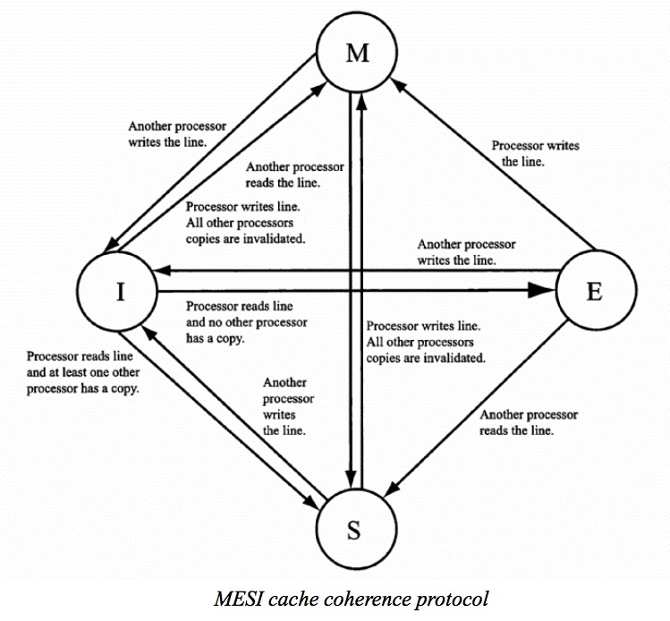
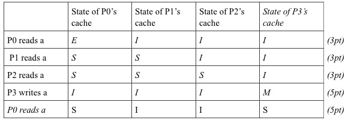
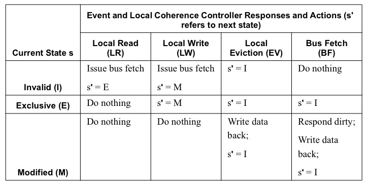
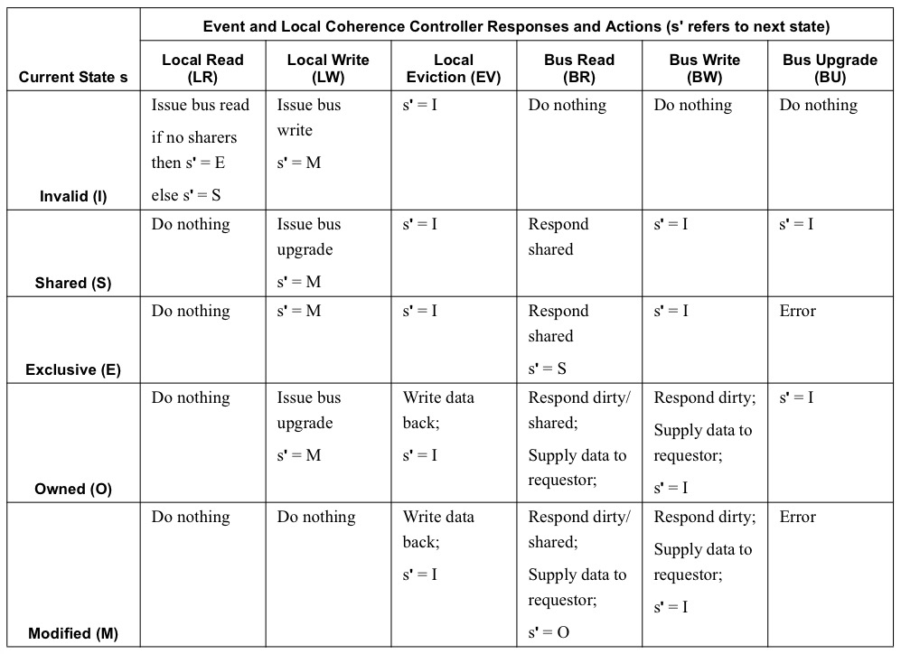

#FCA Final Problem Set

##Question from Web

**Q1. What are the size of the task and the frequency of communication in the system with fine-grained parallelism?**

Size of the task is small and communication is frequent.

---

**Q2. What is the difference between soft, firm and hard processors?**

A soft-core processor is a microprocessor fully described in software, usually in an HDL, which can be synthesized in programmable hardware, such as FPGAs. Firm processor has already been partially synthesized for the particular hardware platform. Hard processor is implemented in ASIC.

---

**Q3. What is the degree of parallelism? What degree of parallelism is assumed in the derivation of Amhdal’s law?**

For each time period, the number of processors used to execute a program is defined as the degree of parallelism (DOP).  DOP for Amdahl’s law is 1 and N (the number of processors)

---

**Q4. Why does increasing the capacity of the cache tend to increase its hit rate?**

Because more data can be found in the cache.

---

**Q5. We have to perform parallel addition of M=128 integer numbers on N=4 processors. Assume that the interconnection network is built in a way that processors 1 and 2;  1 and 3; and 3 and 4 can communicate directly.**

**a) Explain how the program for parallel addition would work.**

+ M=128 would be divided by 4, so that 32 numbers will be processed by each processos. After that, four partial sums (S1 to S4) are formed. 
+ Processor 4 sends S4 to processor 3, and processor 2 send S2 to processor 1 at the same time
+ S1=S1+S2 and S3=S3+S4 can be done at the same time
+ Processor 3 sends S3 to processor 1
+ S1=S1+S3 – final result is stored at processor 1

**b1) Assuming that computation takes 1 time unit and communication between processors 0 time units, draw the parallelism profile.**

Note P32

**b2) What is the average parallelism? Will average parallelism increase if we increase the problem size M?**

+ (1x1+2x1+4x32)/34=3.85
+ Yes, it will increase with the problem size

**c1) Assume that computation takes 1 time unit and time to send and receive one integer number takes 2 time units. What is the speed-up and efficiency of this parallel system?**

+ Total time is 38=34 for computation and 4 for communication.
+ S=128/38=3.36
+ E=3.36/4=0.84

**c2) Derive the expression for speedup when M numbers are added on N processors. Addition takes T1 time units and communication takes T2 time units.**

S=MxT1/((M/N)xT1+(T1+T2)xlog2N) 

---

**Q6. Two processors require access to the same line of data from data memory. Processors have a cache and use the write-back write invalidated (MSI) protocol. Is it possible for two processors that share the same bus to repeatedly invalidate each other’s data even though they do not share any variable?**

It is possible if processors write to the different addresses in the main memory which belong to the same cache line.

---

**Q7. Does efficiency of a program running on a parallel machine depend on the problem size (in the parallel addition problem, the problem size is the number of elements to add in parallel)? Why?**

Yes, since speed-up depend on the problem size. Better speed-up can be achieved if we increase the problem size because less relative time will be used for overhead.

---

**Q8. What is the difference between the lock and the barrier?**

Barrier is used for global synchronization. Barriers ensure that n processes will come to the same point defined by barrier. Locks are used for mutual exclusion when the shared variable is accessed. 

---

**Q9. Explain the difference among the full-map, limited and chained directories in the directory protocols.**

Full-map and limited directory are centralized directories while chained is a distributed directory. Difference between full-mapped and limited is that in full-mapped there are one bit per each cache. In order to decrease the size of directories, the directories with fixed number of pointers are used (limited directories).

---

**Q10.Consider a multiprocessor system with 3 processors P1, P2 and P3. Assume that they are connected either using a shared bus, linear array or a ring. At time instant 1, all three processors would like to send a message: P1 should send to P2, P2 to P3, and P3 to P1. Assume every link of every interconnect is the same speed. How long does this communication take and why?**

1. Bus. 3 time units – data has to be sent sequentially
2. Ring. 1 time unit  – data can be sent simultaneously through each link
3. Linear array - 3 time units – data is sent at the same time from P1->P2 and P2->P3. After this, 2 time units are needed to send a message from P3 to P2.

---

**Q11.A four-processor shared-memory system implements the MESI protocol for the cache coherence. For the following sequence of memory references, show the state of the line containing the variable a in each processor’s cache after each reference is resolved. Each processors start out with the line containing a invalid in their cache.**

---

## Chapter 11

**P11.3 A processor such as the PowerPC G3, widely deployed in Apple Macintosh systems, is primarily intended for use in uniprocessor systems, and hence has a very simple MEI cache coherence protocol. Identify and discuss one reason why even a uniprocessor design should support cache coherence. Is the MEI protocol of the G3 adequate for this purpose? Why or why not?**

High-performance I/O subsystems use DMA to access memory. Without hardware cache coherence, the OS must manually flush all I/O buffers to/from caches before/after I/O operations where those buffers are read or written by DMA agents. Simple hardware MEI coherence is adequate to handle this case (there is no need for a shared state), since the reads and writes issued by the DMA agent are snooped by the processor’s MEI protocol handler, and dirty blocks are flushed on DMA reads and writes while shared blocks are invalidated on DMA writes

---

**P11.4 Apple marketed a G3-based dual processor system that was mostly used for running asymmetric workloads. In other words, the second processor was only used to execute parts of specific applications, such as Adobe Photoshop, rather than being used in a symmetric manner by the operating system to execute any ready thread or process. Assuming a multiprocessor-capable operating system (which the MacOS, at the time, was not), explain why symmetric use of a G3-based dual processor system might result in very poor performance. Propose a software solution implemented by the operating system that would mitigate this problem, and explain why it would help.**

The G3 only supports MEI cache coherence. Without a shared state, read-only blocks can only exist in a single processor’s cache at the same time. This would have a dramatic effect on instruction cache performance, since instructions are generally read-only, and in a time-shared system, multiple processors often share instruction working set. A software solution to this problem would be to replicate program text in different places of the address space for each processor. This would use more physical memory, and would complicate process migration (since every time a process migrated, it’s virtual->real address mappings for program text would have to change).

---

**P11.5 Given the MESI protocol described in Figure , create a similar specification (state table and diagram) for the much simpler MEI protocol. Comment on how much easier it would be to implement this protocol.**

Lack of a shared state eliminates quite a bit of complexity, particularly since bus reads no longer need to observe the shared line to determine whether the block should go into E or S (it always goes into E). Bus reads become equivalent to bus writes, in effect. Also, no upgrades are needed.

---

**P11.6 Many modern systems use a MOESI cache coherence protocol, where the semantics of the additional O state are that the line is shared-dirty: i.e., multiple copies may exist, but the other copies are in S state, and the cache that has the line in O state is responsible for writing the line back if it is evicted. Modify the table and state diagram shown in Figure to include the O state.**

**P11.7 Explain what benefit accrues from the addition of O state to the MESI protocol.**

There are two benefits: migratory blocks (blocks written by multiple processors over time) need not be written back at every transfer, reducing memory bandwidth and potentially request latency. Also, “shared interventions” now become easy to implement, since the O state owner of a block can easily supply requested data (without O, multiple caches could have the block in S state, and separate arbitration is needed to decide who will supply the data; or, oftentimes, the memory controller will supply it. This can have longer latency and higher power consumption).

---

**P11.10 Assuming a processor frequency of 1GHz, a target CPI of 2, a per-instruction level-2 cache miss rate of 1% per instruction, a snoop-based cache coherent system with 32 processors, and 8-byte address messages (including command and snoop addresses), compute the inbound and outbound snoop bandwidth required at each processor node.**

Outbound snoop rate = .01 miss/inst x 1 inst/2 cyc x 1 cyc/ns x 8 bytes/miss = .04b/ns = 40 million bytes per second
Inbound snoop rate = 31 x 40 = 1240 million bytes per second = 1182 MB/sec.

**P11.11 Given the assumptions of Problem 10, assume you are planning an enhanced system with 64 processors. The current level-two cache design has a single-ported tag array with a lookup latency of 3 ns. Will the 64-processor system have adequate snoop bandwidth? If not, describe an alternative design that will.**

A single port with latency 3ns provides 333 million lookups per second peak bandwidth. The rate in Problem 10 is 1280 million bytes per second @ 8 bytes per request, resulting in 160 million lookups per second. Doubling this for a 64-processor system results in 320 million lookups per second. Hence, on average, there is adequate snoop bandwidth. However, this does not account for the number of local lookups, which depends on the (unspecified) L1 miss rate. Further, since misses can be clustered and peak bandwidth demand can be much higher, providing higher snoop bandwidth would be a good idea. One alternative is to provide multiple ports into the tag array, either through true multiporting or address interleaving (banking) the tag array.

---

**P11.20 Figure 11-8 explains read-set tracking as used in high-performance implementations of sequentially consistent multiprocessors. As shown, a potential ordering violation is detected by snooping the load queue, and refetching a marked load when it attempts to commit. Explain why the processor should not refetch right away, as soon as the violation is detected, instead of waiting for the load to commit.**

The refetch is expensive, and should be delayed until it is known that the load won’t replay for some other reason or get squashed due to a branch misprediction. Waiting till commit is a sufficient condition for knowing that the load must replay.

**P11.21 Given the mechanism referenced in Problem 20, false sharing(where a remote processor writes the lower half of a cache line, but the local processor reads the upper half) can cause additional pipeline refetches. Propose a hardware scheme that would eliminate such refetches. Quantify the hardware cost of such a scheme.**

One could increase the snoop granularity by adding 1 or more bits to the snoop to indicate which half, quartile, etc. of the block was written. However, the writing processor would then have to send additional snoops out of it wanted to write additional sections of the block. An alternative scheme would be to replay a load that is hit by a remote snoop, and check to see if the new value matches the original value. If the values match, no refetch is needed; if they don’t a refetch is triggered. A scheme that builds on this is described in [Cain & Lipasti, ISCA 2004].

**P11.22 Given Problem 21,describe a software approach that would derive the same benefit.**

Most performance-sensitive commercial applications (e.g. relational databases) are heavily optimized to avoid any kind of false sharing. This usually means that shared data objects are padded to make sure that two objects can’t coexist in the same cache line.

---

**P11.26 Existing coarse-grained multithreaded processors such as the IBM Northstar and Pulsar processors only provide in-order execution in the core. Explain why or why not coarse-grained multi- threading would be effective with a processor that supports out-of-order execution.**

Coarse-grained multithreading is not a good match for OOO processors, since it would require draining the OOO core of one thread on a cache miss and refilling it with instructions from the other thread. In modern deeply-pipelined processors, draining and refilling the core can take many cycles; this cost would eat into and perhaps subsume the benefit obtained from coarse- grained multithreading.

---

**P11.27 Existing simultaneous multithreaded processors such as the Intel Pentium 4 also support out-of-order execution of instructions. Explain why or why not simultaneous multithreading would be effective with an in-order processor.**

SMT could be made to work with in-order processors, but the dispatch logic would be quite com- plicated, since it would need to merge instructions from multiple fetch streams. Also, the processor would likely end up behaving very much like a coarse-grained mt processor, since any stall condition (e.g. cache miss) would stall one thread and let the other thread take over the entire dis- patch width. Hence, the only benefit of SMT over CGMT would be in cases where both threads are able to run. This is a fairly marginal benefit given the complexity added to the dispatch and fetch stages.
