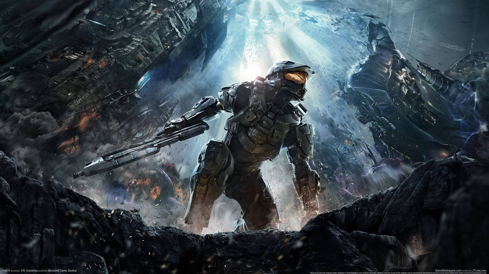
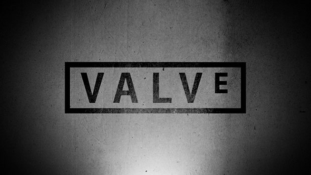
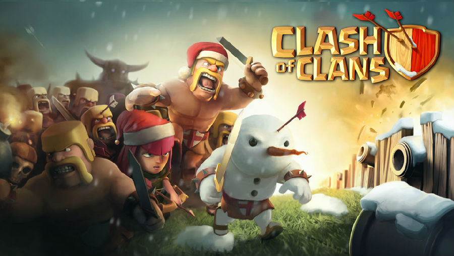
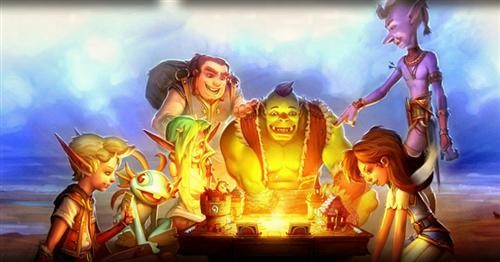
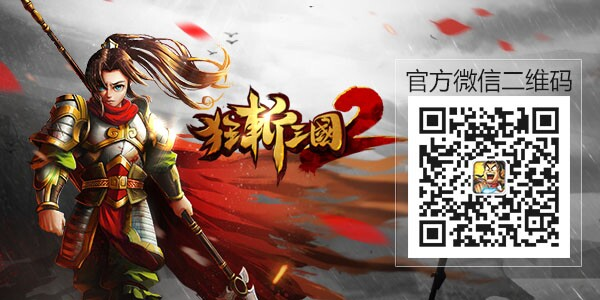

  

Valve、暴雪、Supercell等国内外游戏公司，开始尝试由精兵强将组成的特种部队，试图用更灵活、更快速的开发节奏来减少开发的风险。

  

曾几何时，端游和主机游戏的研发团队动辄大几十人甚至上百人，居高不下的人力和资金成本成为游戏公司沉重的负担。一个游戏产品可能要投入数年以及千万美元，一旦产品没
有取得预想中的成功，轻则收不回成本，重则拖垮整个公司。这样的例子不胜枚举，最近刚刚解体的《战锤》系列游戏开发商THQ就是血淋淋的教训。

  

在这样的背景下，游戏公司们也开始各自寻找出路。一部分游戏公司选择只保留核心团队，把大量的重复劳动外包出去，比如最近风生水起的育碧；而另一部分则开始尝试由精兵
强将组成的特种部队，试图用更灵活、更快速的开发节奏来减少开发的风险。

  

在现代战争中，特种部队是不可或缺的突击力量。他们人员精干、装备精良、编制灵活，专门负责最艰难、最危险的任务。那么游戏行业里有哪些公司拥有这样的“特种部队”呢
？让我们来简单看一看。

  

**Valve：我们要的是比我们更强的人**

**  
**

** **

  

掌握Steam平台的Valve几乎掌握了所有PC游戏的命运——但他们的卓越之处远不止如此，从《半条命（Half-Life，半衰期）》到《军团要塞（Team
Fortress）》到《求生无路（Left 4
Dead》，再到《传送门（Portal）》，每款游戏都是既叫好又叫座的上乘之作。那么他们是如何做到能够持续产出优质的游戏的呢？

  

最重要的一点其实就在Valve公开的员工手册中。员工手册中有一部分提到了他们招聘人才的标准，其中有一句话原文如下： “这种人有涉猎范围极广的能力，并且都有价
值（就像T字的横线），同时也尤其擅长某一特殊领域（T字的垂线）。这一标准对想在Valve成功至关重要，我们通常会淘汰那些仅有‘全才’或是‘专长’的人。一个局
限在自己专精范围内的人是很难与之协作的，而一个无所不知的全能者却很难在某一方面有突出表现，这样的话作为一个个体，他的贡献就不会很高。我们要的是比我们更强的人
。”

  

Valve现在一共有不到一千名员工（具体数目不详），但每一个人都是通过举荐和严格的筛选而招聘进来的。由于Valve采用平行结构，没有上下级之分，因此很多曾经
是VP级的人进入Valve以后也成为了第一线的员工。这样的精悍程度，说是特种部队毫不为过。

  

**SuperCell：创新就是要勇于承担风险**

  

作为移动游戏的顶级公司,Supercell的名字就传达了他们对“特种部队”理念的青睐。Supercell的创始人Ilkka Paananen在接受采访的时候
就说道：到现在我们还保持着属于自己独特的文化。我们已经将其融入到这些小型且独立的团队中，也就是我们所谓的“细胞”。这也是“Supercell”这个名字的由来
。我们还为此推崇“小型”这一理念。小型团队能够更快速地发展。这里存在较少的管理，官僚主义以及处理过程。最终便能让开发者们变得更加轻松并因此创造出更出色的游戏
。”

  

这就是他们之所以出色的原因之一。他们的招牌游戏《部落冲突（Clash of
Clans）》在2013年狂揽8.92亿美元，而这款游戏的最初几个版本的开发团队竟然只有6个人！这使得他们能够在很小的范围内进行沟通。

  

  

但更重要的是另外两个原因。首先就是丰富的制作经验，Supercell的创始团队中的成员都在游戏行业中浸淫了十几年，个个都是顶尖的游戏开发好手；其次，Supe
rcell对项目的失败抱有非常乐观的态度，有过游戏研发经验的人都知道这有多么艰难——通常来说放弃一个项目以后，团队内部会出现很多质疑的声音，有质疑他人的，也
有自我怀疑的；但Supercell却做出了完全不同的选择：

  

“当一个游戏失败以后，我们也会举行庆祝活动。因为团队会在这时走上台，告诉大家这个游戏哪些方面做得好，哪些做得不好，他们学会了什么。我们会为他们颁奖，庆祝他们
从中学到东西。对于游戏公司而言，失败的次数要远高于成功。但如果我们没有承担失败的风险，那我们就不会成功。创新就是要勇于承担风险。”

  

**暴雪娱乐的Team5：只创作他们自己想玩的游戏**

  

暴雪是一个庞大的公司。它有着丰富的PC游戏经验，很擅长驾驭大型的团队，每个游戏都有大笔的预算和漫长的开发周期。但他们的最新游戏《炉石传说》则完全不同。这是一
款跨PC和移动平台的免费游戏，由暴雪内部的一支15人左右的团队开发。按照暴雪的标准来看，这只能算是一支小团队。更夸张的是，这个游戏的全功能原型由两个人开发而
来——这两个人完成了概念设计、游戏设计和原型开发的全部工作。

  

在组建团队的时候，暴雪就是以更小、更快为目标的。暴雪从内部募集对集换式卡牌游戏最有热情、同时经验也非常丰富的开发者来进行这项尝试。这就是暴雪的工作原理：团队
成员倾向于为他们感兴趣的项目效力。按照《炉石传说》执行制作人Hamilton的说法，暴雪的开发者只创作他们自己想玩的游戏。依照这一标准，《炉石传说》显得合情
合理。在新成立的Team 5中，绝大部分成员都曾长期沉迷于各种卡牌游戏，平均卡牌游龄超过十年之久。他们的任务很简单：探索那些笨重的团队无法顾及的机遇。

  

  

事实上他们也做到了。《炉石传说》大幅度降低了集换式卡牌游戏的上手门槛，这个由十五人小队制作的游戏在一个季度内就带来了将近一亿美元的收入和数百万的战网新增用户
。

  

游戏行业中的特种部队远不止以上三支，在北京就有两支团队堪称特种部队——创造了《雨血》系列的Soulframe工作室的和在Kickstarter上为他们的游戏
《水晶战争》募到了将近十万美元的傲逆工作室。前者的团队只有十人左右，后者更是只有五名全职成员。

  

简单归纳一下不难发现，这些特种部队都有一些共同的特点，如果你想打造一支游戏研发的特种部队，也许可以参考一下：

  

**1\. 身经百战的开发经验和强大的职业能力**

  

他们都有很丰富的开发经验和项目经历，遇到并解决过许多游戏开发过程中的问题和危机；有很强的职业技能，每个人都能独当一面甚至多面。

  

**2\. 强大的自我驱动力**

  

缩小团队规模的原因之一就是为了减少沟通成本。在这样的情况下，每个人都身兼数职，指望别人给你分配任务显然是不现实的，内在的自我驱动力就成为了推动项目前进的动力
。

  

**3\. 对于游戏的高度热爱和投入**

  

游戏开发是高难度、高强度的工作，开发周期也比较漫长，有的游戏产品甚至在发布以后还需要大量更新才能够获得成功，期间的压力无疑是巨大的。如果没有对游戏的高度热爱
和投入，半途而废也不奇怪。

  

**4**.** 敢于创新，不惧怕挫折**

  

**————————————————**

**今日推荐：**

**  
**

****

  

由咸鱼游戏发行、KooGame研发的《狂斩三国2》是一款融合了策略、养成、塔防等多种玩法的动作RPG单机手游。以三国人气武将赵云为故事主角，配合海量剧情关卡
，展现乱世的烽火画卷。游戏既有“划屏狂斩”带来的无脑爽快，又有兵种和技能搭配的智力角逐，简单粗暴中不乏谨慎细腻。华丽的画面、复古的音效，《狂斩三国2》力求给
玩家最激爽的掌上游戏体验！实为诚意之作，堪为业界表率！ 6元付费下载，优先领取30元专属大礼包！

  

《狂斩三国2》官方微信账号：kzsg02。

  

**点击左下角“阅读原文”可下载游戏。**

**  
**

阅读原文 举报

[阅读原文](http://mp.weixin.qq.com/s?__biz=MjM5OTc2ODUxMw==&mid=200433539&idx=1&sn
=cdfe44c858825d117aa649147d537623&scene=0#rd)

