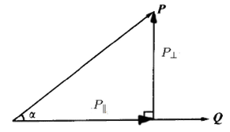

#1.6 向量的投影

##1.6.1 定义
已知两个向量P和Q。将P分解成垂直Q的分量（也记作：）；以及平行Q的分量（也记作：）。

如图所示：

根据向量加法公式可知：

我们一般称平行Q的分量为P在Q上的投影。

##1.6.2 向量的投影公式

已知向量P和Q，则P在Q上的投影为：

而垂直Q的分量：

##1.6.2.1 投影公式的推导

由向量的数量积公式和余弦公式，可知平行Q的分量的模为：

那么我们把向量Q单位化，再乘以这个模即可得到平行Q的分量：

根据向量减法，可得：

证毕！

*G注：投影定理是一个非常常用的公式，在矩阵推导中被大量使用*

##1.6.3 投影公式的矩阵形式

因为投影计算是个线性变换过程。所以在三维空间中，投影计算也可以用矩阵乘法来表示：

======================
 本作品采用<a rel="license" href="http://creativecommons.org/licenses/by-nc-sa/3.0/cn/">知识共享署名-非商业性使用-相同方式共享 3.0 中国大陆许可协议</a>进行许可。