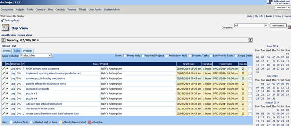
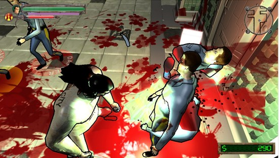
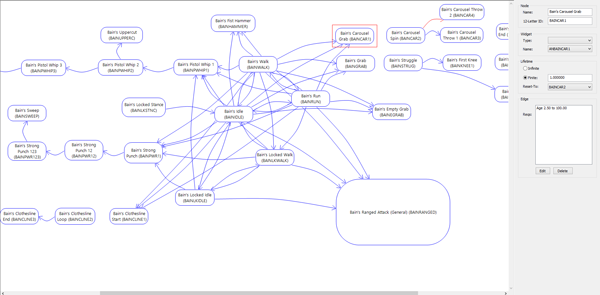

****点击**************上面蓝色字**** 可****免费**订阅**！******

**介绍**

在创造《Bain’s Redemption》时，我是作为一名程序员加入这个项目。最终我却发现自己做了射击、业务、市场营销以及一些美术等工作。以下是我从中学到
的6件事，并希望它们能给其他游戏开发者带去帮助。

**1.使用一个项目管理解决方案**

我父亲告诉我，他曾经了解过的每一个成功的项目都是由具有较高组织能力的人所领导的。游戏开发也是如此。你需要让你自己和你的团队拥有一些有组织的项目管理包。这似乎
听起来很昂贵？但事实却非如此。你只需要支付每个月不到10美元的虚拟主机费用，然后安装它们所提供的一个免费项目管理包便可。

Bugzilla怎样？

从问题追踪角度来看的话，Bugzilla很棒（也就是你可以在玩游戏的时候找到问题）。这并非事先计划好的。事先计划要求一个项目管理解决方法，除非你想要通过执行
功能去修改漏洞，那么你便可以使用Bugzilla。我更愿意将其区分开来。不管你决定做什么，你最好能够确保你拥有某些内容，并且这些内容能够保证团队集中注意力。

当安装了PM解决方法后，我们注意到这推动了制作的发展。理想情况下，你想要提供给你的团队他们喜欢做的任务，这也是我所尝试着去做的事。

我们的项目管理解决方法

**2.不要害怕承认更大的公司能够更好地完成某些事**

对于《Bain’s Redemption》，我创造了一个完整的布娃娃系统，并伴随着一个GJK+EPA碰撞算法，即关于Bullet，Havok和PhysX有能
力做某事（我认为对于后面两者，你能够选择使用GJK+EPA）。我最终学到的便是这一算式更适合不同相撞的物理模拟插件程序，但一些形状组合会要求特定的算式。

  

假设我已经完成了这一算法的执行，因为它将作用于任何凸形组合。不幸的是，箱子堆叠是衡量你的物理引擎能否发挥作用以及我花了太多CPU功耗去确保一个10个箱型柱足
够稳定的方法。为什么？因为你使用了所谓的盒子剪裁工具去进行箱子堆叠。此外，你也需要速度和位置解决方法。我并不想赶走任何人，但这的确是我所学到的。

所以关于这一算式到底发生了什么？因为我们决定使用NVIDIA的PhysX，所以它最终被无视了。从性能上看，PhysX更加出色（任何物理包都需要一个重叠的宽阶
段测试，这也是我的物理元素所缺少的内容），并且能够免费用于PC上。

  

20多名程序员在自己还是孩子的时候便一直致力于创造一个物理包。我仍然从中学到了许多关于解决方法和物理碰撞的内容。并且知道使用任何物理包都是小意思。根据物理引
擎设置参数对于获得预期的行为真的非常重要。这并不是什么微不足道的内容，我很高兴自己所做的所有事，但我是否拥有额外的6个多月开发时间去接受我不能独立完成的工作
的事实？

**3.了解你的用户**

我们都知道这一点。谁是你的目标用户？当然是玩家。但是是怎样的玩家呢？我想做的是想象其它获得成功的游戏并说道，‘如果他们喜欢游戏X，他们就会喜欢《Bain’s
Redemption》。’这是一个很好的市场营销参数，并且你需要尽早明确这一点。当我们决定创造《Bain’s Redemption》时，我们想要执行一些像漫
画之类的内容，但却是针对于成人。同时，因为我们喜欢《恶魔猎人》的机制，所以我们创造了一些能够同时结合这两个理念的内容。现在谁会喜欢我们的游戏呢？那些喜欢漫画
书的人将会喜欢它。

  

那些喜欢砍砍杀杀游戏的人将会喜欢它。同时，我们游戏中的模型还比今天所看到的内容更加简单。这是因为我们早前便决定好每个模型应该是能够使用锋利的武器进行切割。我
们现在谈论的是被切割的完整的模型，而不只是一支腿或一支胳膊。这意味着你可以使用武士刀去剥下某个人的皮。这听起来很酷，但图像将会受到影响。这也会将我们的产品局
限于某个立基市场中。

《Bain’s Redemption》中切割模型

**4.定制引擎需要大量工作**

许多独立开发者将Unity作为他们的引擎，或者随着Unreal的全新定价系统的出现，他们转向了Unreal 4 Enigne。不过我们最终为了不浪费钱而决定
使用自己的引擎。我们的编辑器完成了工作，但它还需要完成更多工作，只是为了完成游戏，我们暂时将其搁置了。所以我并不确定定制引擎开发是否适用于所有人，但如果你选
择了这条路，你就需要万分小心。

  

例如，我们花费了一周半的时间在我们的引擎上执行god rays。但是如果使用之前提到的两款引擎的话，我们便能立刻进行使用。HDR Bloom又花了我们两周的
时间去执行，同时如果是基于另外两款引擎的话，我们也能够立即使用。每个引擎/编辑器组合都有其怪癖，但除非你真的具有上进心并想要从头了解某些内容，否则你便可以直
接选择Unity或Unreal。

**5.切忌在数据驱动的开发方面做得太过分**

所以在游戏中（游戏邦注：或者任何其它计算机应用中），你总是拥有两件元素，即数据和代码。大多数游戏拥有一个美术文件包，即数据，还有一个可执行文件，即代码。这也
是为何这被称为游戏引擎的原因，因为代码是循环运行着，它会抓取数据并在你的屏幕上分解出很棒的颜色。我们都知道受数据驱动的应用是很容易进行调试的。

  

你觉得什么更好？是你能够往里面加载特殊的FX，进行预览然后将其保存为FX美术文件并通过代码在游戏中呈现你的特殊效果的特殊FX编辑器？还是为你拥有的每一个效果
创造定制代码？后者已经有人做了，这真的是件难办之事。还要进行许多复制和黏贴，并且这并不是很有组织性。如果是受数据驱动的话会更好。

  

此外，当你与设计师共事时，受数据驱动的开发是必要的，设计师想要看到的是参数而非代码。参数也是数据。我们的游戏拥有一个状态机编辑器。结果便是它能够有效作用于B
ain的攻击和动画。我想要使用状态机编辑器在我们的游戏中创造带有状态的每个对象。

  

我很快便意识到这是过度的受数据驱动的开发。为什么？因为没有一个设计师将着眼于一个复杂的AI状态机，相反地他们会说：“敌人一直射击我，要缓和这种情况。”此外，
我们为了在行为树中使用Selector/Sequence/Parallal结构而修改了AI，我认为这对于大多数设计师来说都太过复杂了（似乎在Unreal的引
擎中还存在一个行为树编辑器）。我仍然觉得大多数设计师会觉得它很难使用并会请求程序员的帮助。所以简而言之，如果设计师需要访问某些内容的话，那就将其变成是受数据
驱动的开发，而如果条件允许的话，你也可以将其作为受代码驱动的开发。

MEH引擎的状态机编辑器

**6.不要忘了尽早开始进行市场营销**

我们对于《Bain’s Redemption》的Kickstarter活动将在8月末展开。因为这款游戏不管是看起来还是玩起来都很棒，所以我觉得我们只需要展开
Kickstarter活动便能够获得成功。这是在我与好友Andre’ Lamothe聊天前的想法。Andre’已经写过了好几本关于游戏开发的著作，并了解里里
外外的这些过程。他告诉我最好能在进行Kickstarter之前2个月便开始推广游戏。就像你所看到的那样，很多人都认为只要做出一款游戏便能够获得成功。如果没人
了解自己的游戏，它便不可能被卖出去。所以请谦逊一点，接受没人知道或在乎你的游戏的事实，并想办法得到他们的关心。这并不困难。

**结论**

尽管在这6件事中并不包含一款优秀游戏的开发的综合窍门或者说这只是我在制作《Bain’s Redemption》中所学到的内容，但这对于任何人来说都会是一个很
不错的开始。你们必须记住事先进行计划，保持谦逊态度，愿意接受改变，接受你不可能比大公司做得更好的事实（大多数情况下）并希望能够做到最棒。如此最佳方法便会降临
你身边。

****

阅读原文 举报

[阅读原文](http://mp.weixin.qq.com/s?__biz=MjM5OTM0MzIwMQ==&mid=201004007&idx=3&sn
=abc22ef5df7f8da0851b44fe1d912145&scene=0#rd)

