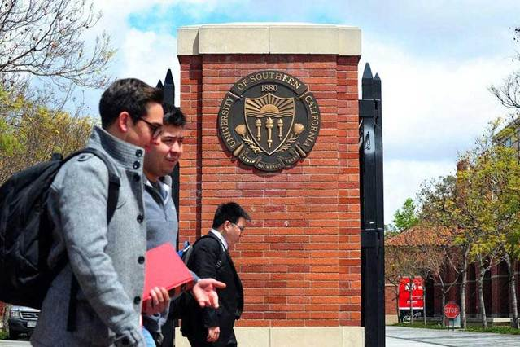

  

上周，《美国游戏名校一览》一文引起了很大的反响。读者们纷纷向葡萄君询问，如何申请去美国读书。恰好一年一度的申请季将要来临，葡萄君就在此为诸位怀梦学子细细解答
。（点击左下角“阅读原文”，可查看《美国游戏名校一览》）

  

**1\. 去美国读书我能获得什么？**  

  

优秀的游戏设计专业都开设了非常系统的游戏设计课程，2至3年的学习过程中可以学习到完整的游戏设计理论，能够少走很多弯路。另一方面，伴随理论课程的是许多游戏开发
实践的机会，学生们往往需要自行寻找队员、组队并在教授的指导下制作游戏。这类专业的教授多有业界背景，往往是制作过大作的牛人，在他们的指点下进行学习，能收获多少
不用多说。

  

另外，美国高校和业界的联系非常紧密，常常会进行各种合作。例如纽约大学的游戏设计专业近期就会邀请《英雄联盟》的游戏设计师去讲授为期两天的游戏设计课程，而南加州
大学的游戏设计专业则设有暴雪娱乐赞助的奖学金，用于奖励表现突出的学生。这一些合作都有利于学生在就读的时候就做好进入业界的准备。

  

**2\. 去美国读书我要付出什么代价？**

  

首先是时间。攻读一个游戏设计类的硕士学位通常需要2年，少数专业需要3年时间。考虑到国内游戏行业的发展速度，这2到3年时间如果在国内的游戏行业工作，可能会积累
一些人脉、一些商业作品的制作经验，如果运气好跟对了项目也许能赚到一些奖金；这些都是出国读书的机会成本。

  

其次是金钱。除了损失2到3年的收入以外，游戏设计硕士项目的学费十分昂贵，每年的开销高达30到40万人民币，这样的投入让很多人望而却步。

  

**3\. 如何申请？**

  

申请美国的研究生和中国的方法是完全不同的。没有统一的考试，取而代之的是申请制的录取机制。每年的申请开放以后（通常是在每年8月到9月），申请人可以按照学校的要
求准备不同的材料，在学校提供的网站上进行网上申请。好学校的申请的截止日期通常是年底（12月到次年1月），部分学校会延长到次年的3月。

  

申请材料交给学校以后，学校会有专门的招生委员会对申请人的学校进行审核。委员会的成员是该专业的教授和导师，他们会评估哪些学生最适合自己的专业。在这个阶段有可能
会进行面试，以考察英语能力和性格等材料很难反映的问题。在确定录取以后，会以邮件的形式给申请人发送录取通知书。如果一个申请人幸运地收到了多份录取通知书的话，只
能选择其中之一进行确认。确认以后，申请工作就彻底结束了。

  

**4\. 我需要准备什么材料？**

  

每个学校要求的材料各有不同，需要列好表格进行准备。虽然要求高低各有不同，但只要是学校要求的材料都必须出具，否则可能无法进入审核流程。

  

必备材料：

  

1） 学士（本科）学位（或同等学历证明）

  

申请美国高校研究生必须有学士学位，以证明你有资格接受下一阶段的教育。需要注意的是，学位的专业并没有限制——相反，美国高校很鼓励、欣赏申请人跨专业，因为这样可
以为专业带来更丰富、更多样化的背景。比如卡内基梅隆大学的娱乐技术中心的学生中就有很多数字媒体和工业设计背景的学生。

  

2） 本科成绩单

  

本科成绩单需要在自己学校的教务处开出双语成绩单，封在专用信封内并加盖章。如果学校不提供双语成绩单，需要自己翻译再盖公章，和中文成绩单一起封入信封内。

  

高校对GPA（绩点，通过公式换算而来，衡量学生在大学期间的成绩高低）都有最低的要求，一般不能低于3.0（满分4.0，3.0约等于75分）。但由于游戏设计专业
属于艺术类专业，这类专业对GPA会放宽要求，每年都有GPA不高的申请人获得很好的录取的情况出现，因此本科成绩不好也不用过于担心。

  

3） 托福（TOFEL）

  

相信这是大部分人最头痛的部分。游戏设计专业对托福要求和理工科、文科相比并不算高，一般来说90分就足够了，但在艺术类专业中90分已属高分。但是实际上托福对申请
人的竞争力并不构成非常重要的影响，录取历史上都有别的条件不错而托福被降分录取的情况出现。因此哪怕托福的分数达不到学校的要求也不用慌张，个人的综合素质才是最关
键的。

  

4） 个人陈述（Personal Statement/Statement of Purpose）

  

个人陈述是一篇申请人阐述自己为什么要申请该专业的文章，类似求职信。虽然被放在了第四项，但个人陈述是申请美国高校中最重要的部分。申请人需要通过个人陈述来展现自
己的英文写作能力、对游戏和自身的了解和认识、对职业生涯的规划，以及对进入该专业学习的渴望。

  

申请和录取并不是单向的，申请人需要在专业中学习来获得知识和技能，而专业也需要出色的学生来提升自己的影响力，带来更好的作品。对学校而言，一个有着清晰的职业规划
、对游戏也有充分理解和认识的学生，显然比一个完全没有概念、没有规划的学生来得更有价值。这就是个人陈述的意义：说服素未谋面的委员会，你是一个出色的学生，比起别
人来你更能给这个专业带来价值。

  

5） 简历（Resume）

  

简历是对个人陈述的辅助文件，展示你的经历和闪光点。需要注意的是，由于美国高校很看重行业经验，有工作经经验一定要写上，会获得很大的加分。

  

6） 作品集（Portfolio）

  

除了个人陈述以外，作品集是另一件非常重要的材料。委员会和教授要通过作品集来评价申请人对游戏的热爱、了解、技术水平和从业经历。除此之外，作品集中还可以展示除了
游戏以外的成果，例如乐器演奏。摄影作品、视频制作、交互设计等等，以展示申请人多样化的技能和艺术修养。由于游戏设计是综合性很强的技能，展示的越多、质量越高，越
能给自己的申请加分。

  

不同于其它艺术类专业的作品集，游戏设计专业的作品集通常都是线上作品集。页面简单、清晰即可，重点在于展示自己的作品——当然如果有能力也可以自己制作一个个人网站
，让作品集网站本身也成为一个作品。但是对于大部分没有时间去制作网站的申请人来说，用诸如Cargo、Weebly这样的作品集定制网站也可以很好地满足自己的需求
。

  

7） 推荐信

  

美国的大学申请需要和申请人有工作/研究/学习上直接相关的推荐人来撰写推荐信，一般需要三封，来自三个不同的候选人。推荐信的提交流程比较复杂：申请人提交三个推荐
人的职业信息和联系方式，申请系统会发送邮件到推荐人的邮箱中，推荐人点击链接以后进入提交推荐信的界面，在这个界面里填写对申请人的调查问卷并提交推荐信。

  

这样的流程理论上避免了申请人接触推荐信的内容，本可以最大限度地保证推荐信的公正和客观性；但实际操作起来有太多的空子可以钻，比如推荐人可以把这封邮件转发给申请
人，让申请人自己提交；或是写好推荐信以后让申请人来进行修改。因此推荐信内容的真实性完全取决于申请人的自律。很遗憾的是，由于来自中国大陆的推荐信造假的成分太多
，因此大陆的推荐人的推荐可信度也越来越低，委员会甚至可能根本不采用这样的推荐人发来的材料。

  

尽管如此，推荐信还是必须好好准备。对于游戏设计专业的申请来说，如果工作过，那么推荐人最好是自己的同事或者上司，他们和申请人一起工作过，最了解申请人的情况；如
果没有工作过，那么推荐人最好是和游戏有关联的专业的教授。如果能够争取到在游戏业界有一定名气的人的推荐（例如陈星汉），那就会大大加分。

  

8） 其它材料

  

有时候某些专业还会要求一些额外的材料，例如纽约大学游戏中心会要求申请人撰写一篇自己喜欢的游戏的批判性分析（当然，必须用英文），而南加州大学互动媒体专业则要求
申请人写一篇文章描述某个最难以忘怀的时刻，或是某个自己喜欢的角色（当然，还是要用英文）；还有像南卫理公会大学这样，需要申请人根据命题用制定的引擎做一个关卡。

  

如果是要求写文章（大多数情况），那么可以先自行撰写，然后找英语母语的人帮助修改；如果需要进行更复杂的制作，就需要申请人自己衡量时间成本了。

  

**5\. 面试**

  

材料经过委员会的审核以后，会淘汰掉大部分的人，剩下一小撮进入面试阶段。面试通常通过Skype这样的软件进行，由该专业的教授甚至系主任进行五分钟到一小时不等的
面谈。能进入面试说明你的材料已经大大优于平均水平，面试是为了检验你的口语水平和材料的真实性，同时看看你的性格能否和该专业的其他人相容。

  

面试是申请的最后一关。由于大部分人并无全英文交谈的经历，在面试之前必须进行模拟面试的练习，一方面可以减少面试的紧张感，另一方面可以提前适应英文的对白。特别需
要注意的是，面试前需要把自己所有的材料都熟悉一遍，尤其是个人陈述和作品集，有很大概率被问到。

  

**6\. 申请策略**

  

这一点其实应该考虑在最前面。我强烈建议准备申请的同学从现在就开始好好想想，你希望自己呈现在招生委员会面前的是一个怎样的形象？

  

游戏设计和计算机的申请不太一样，不是靠纯粹的堆高分就可以解决问题的。游戏是a perfect combination of arts,
technologies and interaction，你需要让委员会相信，你对游戏这有一定的理解，对艺术、技术和设计也都有涉猎。因为游戏设计涉及的工具和
知识非常庞杂，往往要现学现卖，所以也要展现很强的自我驱动力和快速学习的能力。这些需要呈现给委员会的亮点都需要通过文书和作品集来塑造，是最值得花时间和心思的地
方。

  

总体来说，在文书中你需要体现对游戏的理解。在你眼里，游戏是什么？为什么要做游戏？游戏会给你带来什么？你会给游戏带来什么？你会通过游戏给学校和专业带来什么？这
都是需要非常认真地思考的问题，不光是和申请有关，也和你的职业生涯有关。

  

作品集上要和文书呼应。你觉得游戏是一种艺术，那就做你心目中的艺术游戏；如果你觉得游戏是一种传达信息的媒介，那么就传达出来；如果你觉得游戏可以帮助某些人，那就
做一个能帮助这些人的游戏。总而言之，你的作品应该体现你的理念和思想。

  

游戏葡萄现在推出美国游戏设计专业申请咨询服务（有偿），有兴趣的读者可以发邮件到charlie@youxiputao.com询问。

  

………………………………………………  

**今日推荐：**

  

《魔力宝贝》是完美世界2014年重磅推出的2D回合制RPG手游大作，坐拥史克威尔艾尼克斯正版授权。《魔力宝贝》手游中原汁原味的剧情和背景音乐、精美绝伦的场景
、自由职业酷炫技能，顶级特效华丽战斗，神秘个性的佣兵助战，可爱到Hold不住的萌宠，将带给勇士们前所未有的游戏体验!
在熟悉的剧情和背景音乐中，超精美的画质，超可爱的人物，将给你前所未有的视觉冲击和情感召唤。

  

在激烈华丽的战斗中，你将拥有数种炫目酷帅的技能，天赋加点系统给你无限自由，PK竞技场你的精彩无人可挡。在《魔力宝贝》手游的世界里，数百位神秘强大、个性独特的
人物将陪你共同战斗，更有史上最萌强宠加盟助战，你的战斗力与日俱增。多家媒体渠道力荐2014最受欢迎手游《魔力宝贝》，7月18日荣耀公测，为你开启魔法世界的大
门，不可思议的冒险就此开始！

  

  

  

[阅读原文](http://mp.weixin.qq.com/s?__biz=MjM5OTc2ODUxMw==&mid=200349070&idx=1&sn
=15528ec8442d4065bec87e2e962b8f0c&scene=0#rd)

