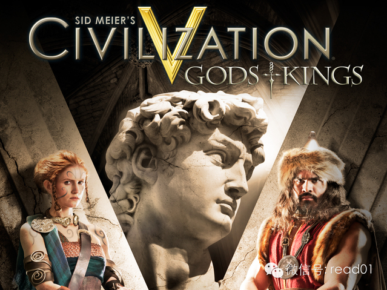
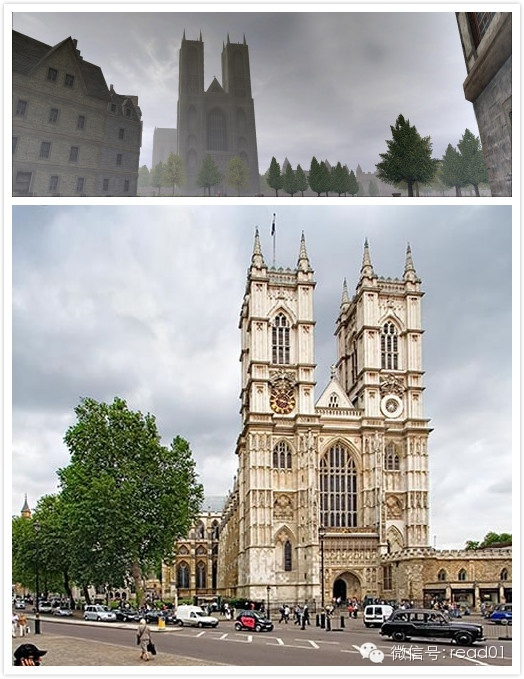
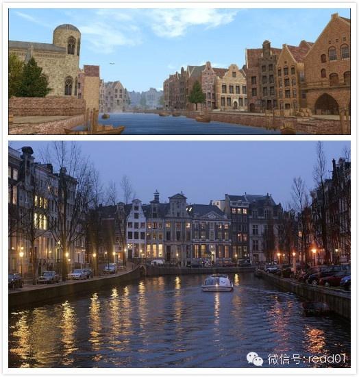
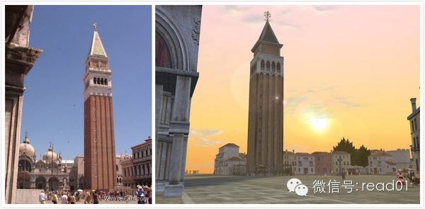
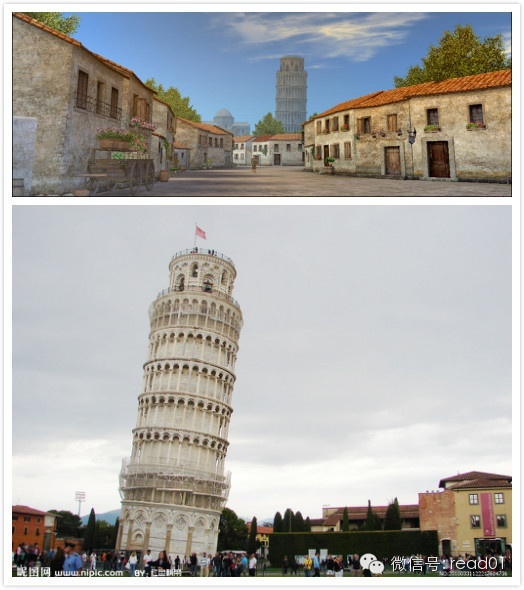
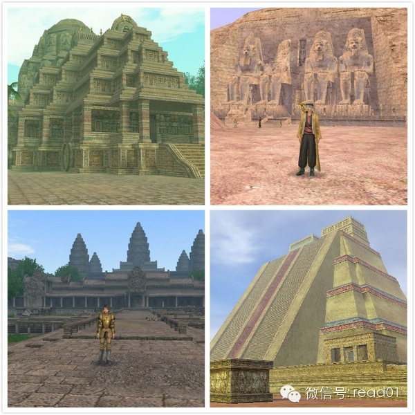
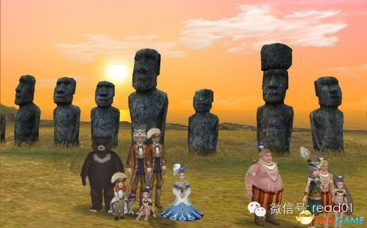

感谢大家的关心，昨晚小区的宽带出问题了，无法上网就暂停更新一天。  

去年的时候我写过一篇文章叫：“从零起步在脑中建立一套完善的世界历史时间线，应该如何入手？”输入：「20130723」 查看 ，在里面就提过可以通过文明、帝国
时代、全面战争、三国志和大航海时代这几款游戏来了解历史，前段时间在知乎上看文章时发现有个帖子里也有很多人提到过通过游戏进行学习的例子。

如果你也有类似的经验可以跟我分享一下，你在游戏中学到过什么技巧和知识？

  

出处：知乎

## 第一个答案

**作者：@weizhi pan**  
原始地址：http://www.zhihu.com/question/22025355/answer/20064532

关于游戏，真的是有太多想说的话。  
大航海时代对地理的教育，大家都说了，不赘述。这里只说一下文明（以Civ5为蓝本）。  
文明系列，其实是一个包罗万象的百科全书，就如这个游戏的 Help 文件叫做 Civilopedia 一样。  
文明，是一个伟大的游戏！  
虽然这个游戏门槛非常高，特别是在玩英文原版的时候，当初，我就是用学英语词汇作为玩这个游戏的借口的（此处应该有
233）。到现在，即使我已经能够在国外留学，跟外国人无障碍交谈并被人误认为不是中国人，却仍不能在不靠字典和 wiki 的情况下完全看懂
Civilopedia 里面的伟人、奇迹、古代兵种和技能的介绍。但是我仍然用着 wiki 一点一点的去查那些在与妹纸交流时基本无用的知识。为啥呢？因为这个游
戏可以让你真正对历史、地理、政治、文艺产生浓厚的兴趣。对的，文明的含义，就是所有这些的综合体。  
在文明里面，有种种可能性：  
你可以作为一国之君，穷兵黩武，率性而为。可以用匈奴这种早期拥有压倒性科技优势的文明纵横欧亚大陆。而且仅仅因为电脑 AI
碍眼而直接挥师灭国。但是，在后来，你也许会因为在某一个遥远的地方的电脑领先你一个科技时代而头疼不已。  
你也可以醉心发展，狂攀科技树，靠航天阿波罗计划飞向 Alpha Centauri，或者用强大的军事科技，用隐形轰炸机去碾压敌人的毛瑟枪兵，踏平全球。  
你也可以专攻文化艺术，在家里敲世界奇观，四处挖遗迹，把你的帕特农神庙、圆形剧场、卢浮宫、百老汇全部都堆满小说、绘画、音乐类世界名作，然后举办狂欢节（恩，我是
用巴西的），在其他国家开演唱会，进行文化输出。  
你也可以搞外交，用间谍操纵城邦的选举，拉拢甚至直接颠覆一个城邦，让城邦成为你的傀儡，在联大上面投你的赞成票，让你控制联大，制裁和禁运你看不惯的任何一个国家。

文明，是第一个让我仔细思考极权、专制和民主之间关系的游戏，是让我能够没日没夜翻字典查wiki了解世界奇观和伟人的游戏，也是让我看见 Lan Ling
Xiao Xiao Sheng 之后会心的笑的游戏。  
第一次，历史，不是标准答案和背后的意义；政治，是你去思考而不是被摆布，文化，是你去发现而不是名词解释。

自说自话了这许多，希望能让那些没有接触过这个游戏的人，能够不被那些生僻的英文单词吓到，能够真正去体会这个游戏的精巧。

## 第二个答案

作者：珵cici  
原始地址：http://www.zhihu.com/question/22025355/answer/20080036

在大航海时代Online的地理美术考古财宝鉴定文化宗教生物学到了超级多知识！  
在之后人肉遍历港口的途中，发现光荣把很多城市和遗迹的还原度做的特别高。细节特别棒。远胜于第4代。大概唯一缺点却又是最大的硬伤就是：开船时间实在太长了...  
开船的时候会有昼夜的变化，开去不同的地区有四季的变化，比如斯德哥尔摩附近会有暴风雪之类。

伦敦， 威斯敏斯特大教堂。

阿姆斯特丹的运河

  

VNS 威尼斯圣马可广场。

比萨斜塔

后来的资料片里开的牛津大学。

  

游戏超级棒是因为有三条职业路线，并且可以轻松地互相转。

好战分子可以练战士，还可以做海盗专门抢玩家。商人倒买倒卖。冒险家全世界挖宝。

公测刚开始的时候小商人们多，法罗交易所买鸡买 猪立刻摆摊卖都会被练厨艺的人们瞬间抢光。  
铸造有几级了就可以去热那亚卖火炮，军人们爱死你。  
后来渐渐流行去东地中海采集玛瑙，拖到附近港口卖掉。  
如果不小心因为一船倾倒太多，导致玛瑙太多价格大跌的话，就等着挨骂吧。  
于是当时的商会还组织了很多人护港（因为几个小时内每个港口只会暴跌一种产品，所以可以先暴跌其他产品，比如火枪or贝紫）。  
而后海盗这种职业也因此而蓬勃发展，公会又招了雇佣军来保护商人。

促使我由商人去转冒险家的原因是有一天在论坛上看到了一个类似下面这条新闻的帖子：  
史上最牛玩家 数学+密码学破译隐藏任务--北方网  
永远的矢车菊任务，当年难倒了无数人，引发了大讨论。  
然后我觉得我才玩到了大航海时代的精髓。

左上：卡利卡特寺庙。 右上：阿布辛巴耶神庙。左下：吴哥窟。右下：黄金城奇琴伊察。

复活节岛，摩艾。

每到一处，所需要的语言是不同的。当然可以学个肢体语言，可解决大部分的问题。  
事实证明在亲身遍历港口的时候，与不会英语的人沟通，肢体语言非常简单粗暴有效。

在牛津认识的小伙伴忽然想起这个游戏，当时国服已经关闭，大家就说一起去台服玩。  
这次反正有商人可以抱大腿，我直接就选了冒险家。挖出来的东西全部贡献给我们自己的战士。  
3个月之后各项冒险技能全部毕业。每天就是全世界跑着找发现物，大约有1300-1400左右。  
除了我打不过的战斗任务会喊人帮忙以外，基本和单机区别不太大。  
每次发现了不起的东西之后都会超级骄傲。

每个发现物之后的故事及任务说明我都认真读了。仔细读的话都是些小故事。  
比如南十字星环游世界主线任务里，讲的是麦哲伦的女儿爱莲娜，环游世界一周之后揭开了身世之谜，放弃了麦哲伦家族的继承权，只要求皇室恢复她父亲的名誉。具体剧情可以
见-> 南十字星中的环游世界任务大航海时代OL――17173网络游戏专区  
比如达芬奇这个很（事）有（儿）才（逼）的家伙，他的任务都要在欧洲跑来跑去。  
比如为了钓一条稀有的鱼收集生物发现物，我把船停在亚马逊河里钓了一晚上才钓到。  
还有比如说让人觉得蛮无语蛮搞笑的任务：大航海時代 Online 攻略百科：奸雄的廬山真面目  
任务委托：歐洲的作家又發來委託。「《三國志演義》中將人物分為善惡兩極，但是，被稱為奸雄的曹操真的是 " 惡 "
嗎？有沒有東西能表現他人性的一面呢？」....就是說要我們找個描寫曹操人格魅力的東西吧。」

  

光荣与梦想扬帆起航。  
冒险，是男人的浪漫。  
帅哭了好么。

  

内什么，我有冲动再次去下载游戏把我台服的号捡起来。  
以及英文服也开了，Uncharted waters.

### 学到第二多东西的游戏是文明5。

读文明5里内置的wiki非常有收获。包括各文明的简要历史，各兵种相关，各个遗迹、艺术著作。而后结合wikipedia会有很多收获，以及学会了很多生！僻！单！
词！  
随便见到哪个外国人找不到话题的时候也可以找找他们国家对应的文明谈一谈，以「我之前玩过一个游戏叫文明，里面有贵国的伟大的XX，超级好用怎么怎么怎么」。已经成功
地用苏莱曼愉悦过土哥，凯瑟琳大帝愉悦过俄哥，俾斯麦愉悦过德国银。

目前正在steam上刷成就ing。只刷到了122/287...
正统的打法（精确计算控制人口控制烧瓶锤子建城速度什么的）没怎么学会，犯贱打法学会了不少……比如大军事家拍脸，抢别国工人当盾……

  

## 100天行动读者反馈

@Cynthia

战隼老师您好，关注您已经有三四个月了，开始我也有跟进您的100天计划，但是不知道为什么，写下来的东西，板上钉钉每天都必须要做的事情我真的没有办法坚持，开始都
开始不了。我定计划啊从来没有执行过，反而我不去强求非要坚持多少天，养成一个习惯的事情我可以坚持很久，比如每天面膜，我已经坚持快两个月了，跑步也坚持了三个星期
。不知道这个是什么怪癖啊。。。

@铭容

我也参加了100天计划，我每天坚持做plank，现在已经坚持了第四天了，我相信能坚持下去，因为有好多人都在坚持。

@邝嘉荣Ray  
100天行动…其实做了很久了。从2011年5月开始看《搞定1》和《奇特的一年》直到现在，算是一直坚持实践。

  

[阅读原文](http://mp.weixin.qq.com/s?__biz=MjM5NjA3OTM0MA==&mid=200915540&idx=1&sn
=a153f84844984b9dfd6fe5a8a135c497&scene=0#rd)

  

  

  

感谢大家的关心，昨晚小区的宽带出问题了，无法上网就暂停更新一天。  

去年的时候我写过一篇文章叫：“从零起步在脑中建立一套完善的世界历史时间线，应该如何入手？”输入：「20130723」 查看 ，在里面就提过可以通过文明、帝国
时代、全面战争、三国志和大航海时代这几款游戏来了解历史，前段时间在知乎上看文章时发现有个帖子里也有很多人提到过通过游戏进行学习的例子。

如果你也有类似的经验可以跟我分享一下，你在游戏中学到过什么技巧和知识？

  

出处：知乎

## 第一个答案

**作者：@weizhi pan**  
原始地址：http://www.zhihu.com/question/22025355/answer/20064532

关于游戏，真的是有太多想说的话。  
大航海时代对地理的教育，大家都说了，不赘述。这里只说一下文明（以Civ5为蓝本）。  
文明系列，其实是一个包罗万象的百科全书，就如这个游戏的 Help 文件叫做 Civilopedia 一样。  
文明，是一个伟大的游戏！  
虽然这个游戏门槛非常高，特别是在玩英文原版的时候，当初，我就是用学英语词汇作为玩这个游戏的借口的（此处应该有
233）。到现在，即使我已经能够在国外留学，跟外国人无障碍交谈并被人误认为不是中国人，却仍不能在不靠字典和 wiki 的情况下完全看懂
Civilopedia 里面的伟人、奇迹、古代兵种和技能的介绍。但是我仍然用着 wiki 一点一点的去查那些在与妹纸交流时基本无用的知识。为啥呢？因为这个游
戏可以让你真正对历史、地理、政治、文艺产生浓厚的兴趣。对的，文明的含义，就是所有这些的综合体。  
在文明里面，有种种可能性：  
你可以作为一国之君，穷兵黩武，率性而为。可以用匈奴这种早期拥有压倒性科技优势的文明纵横欧亚大陆。而且仅仅因为电脑 AI
碍眼而直接挥师灭国。但是，在后来，你也许会因为在某一个遥远的地方的电脑领先你一个科技时代而头疼不已。  
你也可以醉心发展，狂攀科技树，靠航天阿波罗计划飞向 Alpha Centauri，或者用强大的军事科技，用隐形轰炸机去碾压敌人的毛瑟枪兵，踏平全球。  
你也可以专攻文化艺术，在家里敲世界奇观，四处挖遗迹，把你的帕特农神庙、圆形剧场、卢浮宫、百老汇全部都堆满小说、绘画、音乐类世界名作，然后举办狂欢节（恩，我是
用巴西的），在其他国家开演唱会，进行文化输出。  
你也可以搞外交，用间谍操纵城邦的选举，拉拢甚至直接颠覆一个城邦，让城邦成为你的傀儡，在联大上面投你的赞成票，让你控制联大，制裁和禁运你看不惯的任何一个国家。

文明，是第一个让我仔细思考极权、专制和民主之间关系的游戏，是让我能够没日没夜翻字典查wiki了解世界奇观和伟人的游戏，也是让我看见 Lan Ling
Xiao Xiao Sheng 之后会心的笑的游戏。  
第一次，历史，不是标准答案和背后的意义；政治，是你去思考而不是被摆布，文化，是你去发现而不是名词解释。

自说自话了这许多，希望能让那些没有接触过这个游戏的人，能够不被那些生僻的英文单词吓到，能够真正去体会这个游戏的精巧。

## 第二个答案

作者：珵cici  
原始地址：http://www.zhihu.com/question/22025355/answer/20080036

在大航海时代Online的地理美术考古财宝鉴定文化宗教生物学到了超级多知识！  
在之后人肉遍历港口的途中，发现光荣把很多城市和遗迹的还原度做的特别高。细节特别棒。远胜于第4代。大概唯一缺点却又是最大的硬伤就是：开船时间实在太长了...  
开船的时候会有昼夜的变化，开去不同的地区有四季的变化，比如斯德哥尔摩附近会有暴风雪之类。

伦敦， 威斯敏斯特大教堂。

阿姆斯特丹的运河

  

VNS 威尼斯圣马可广场。

比萨斜塔

后来的资料片里开的牛津大学。

  

游戏超级棒是因为有三条职业路线，并且可以轻松地互相转。

好战分子可以练战士，还可以做海盗专门抢玩家。商人倒买倒卖。冒险家全世界挖宝。

公测刚开始的时候小商人们多，法罗交易所买鸡买 猪立刻摆摊卖都会被练厨艺的人们瞬间抢光。  
铸造有几级了就可以去热那亚卖火炮，军人们爱死你。  
后来渐渐流行去东地中海采集玛瑙，拖到附近港口卖掉。  
如果不小心因为一船倾倒太多，导致玛瑙太多价格大跌的话，就等着挨骂吧。  
于是当时的商会还组织了很多人护港（因为几个小时内每个港口只会暴跌一种产品，所以可以先暴跌其他产品，比如火枪or贝紫）。  
而后海盗这种职业也因此而蓬勃发展，公会又招了雇佣军来保护商人。

促使我由商人去转冒险家的原因是有一天在论坛上看到了一个类似下面这条新闻的帖子：  
史上最牛玩家 数学+密码学破译隐藏任务--北方网  
永远的矢车菊任务，当年难倒了无数人，引发了大讨论。  
然后我觉得我才玩到了大航海时代的精髓。

左上：卡利卡特寺庙。 右上：阿布辛巴耶神庙。左下：吴哥窟。右下：黄金城奇琴伊察。

复活节岛，摩艾。

每到一处，所需要的语言是不同的。当然可以学个肢体语言，可解决大部分的问题。  
事实证明在亲身遍历港口的时候，与不会英语的人沟通，肢体语言非常简单粗暴有效。

在牛津认识的小伙伴忽然想起这个游戏，当时国服已经关闭，大家就说一起去台服玩。  
这次反正有商人可以抱大腿，我直接就选了冒险家。挖出来的东西全部贡献给我们自己的战士。  
3个月之后各项冒险技能全部毕业。每天就是全世界跑着找发现物，大约有1300-1400左右。  
除了我打不过的战斗任务会喊人帮忙以外，基本和单机区别不太大。  
每次发现了不起的东西之后都会超级骄傲。

每个发现物之后的故事及任务说明我都认真读了。仔细读的话都是些小故事。  
比如南十字星环游世界主线任务里，讲的是麦哲伦的女儿爱莲娜，环游世界一周之后揭开了身世之谜，放弃了麦哲伦家族的继承权，只要求皇室恢复她父亲的名誉。具体剧情可以
见-> 南十字星中的环游世界任务大航海时代OL――17173网络游戏专区  
比如达芬奇这个很（事）有（儿）才（逼）的家伙，他的任务都要在欧洲跑来跑去。  
比如为了钓一条稀有的鱼收集生物发现物，我把船停在亚马逊河里钓了一晚上才钓到。  
还有比如说让人觉得蛮无语蛮搞笑的任务：大航海時代 Online 攻略百科：奸雄的廬山真面目  
任务委托：歐洲的作家又發來委託。「《三國志演義》中將人物分為善惡兩極，但是，被稱為奸雄的曹操真的是 " 惡 "
嗎？有沒有東西能表現他人性的一面呢？」....就是說要我們找個描寫曹操人格魅力的東西吧。」

  

光荣与梦想扬帆起航。  
冒险，是男人的浪漫。  
帅哭了好么。

  

内什么，我有冲动再次去下载游戏把我台服的号捡起来。  
以及英文服也开了，Uncharted waters.

### 学到第二多东西的游戏是文明5。

读文明5里内置的wiki非常有收获。包括各文明的简要历史，各兵种相关，各个遗迹、艺术著作。而后结合wikipedia会有很多收获，以及学会了很多生！僻！单！
词！  
随便见到哪个外国人找不到话题的时候也可以找找他们国家对应的文明谈一谈，以「我之前玩过一个游戏叫文明，里面有贵国的伟大的XX，超级好用怎么怎么怎么」。已经成功
地用苏莱曼愉悦过土哥，凯瑟琳大帝愉悦过俄哥，俾斯麦愉悦过德国银。

目前正在steam上刷成就ing。只刷到了122/287...
正统的打法（精确计算控制人口控制烧瓶锤子建城速度什么的）没怎么学会，犯贱打法学会了不少……比如大军事家拍脸，抢别国工人当盾……

  

## 100天行动读者反馈

@Cynthia

战隼老师您好，关注您已经有三四个月了，开始我也有跟进您的100天计划，但是不知道为什么，写下来的东西，板上钉钉每天都必须要做的事情我真的没有办法坚持，开始都
开始不了。我定计划啊从来没有执行过，反而我不去强求非要坚持多少天，养成一个习惯的事情我可以坚持很久，比如每天面膜，我已经坚持快两个月了，跑步也坚持了三个星期
。不知道这个是什么怪癖啊。。。

@铭容

我也参加了100天计划，我每天坚持做plank，现在已经坚持了第四天了，我相信能坚持下去，因为有好多人都在坚持。

@邝嘉荣Ray  
100天行动…其实做了很久了。从2011年5月开始看《搞定1》和《奇特的一年》直到现在，算是一直坚持实践。

  

[阅读原文](http://mp.weixin.qq.com/s?__biz=MjM5NjA3OTM0MA==&mid=200915540&idx=1&sn
=a153f84844984b9dfd6fe5a8a135c497&scene=0#rd)

