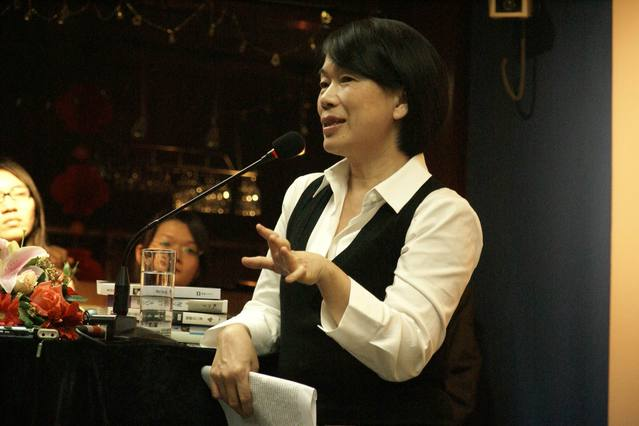

跟朋友聊天，发现有些人很少或基本不读文史哲一类的书籍，记得龙应台以前写过一篇很经典的文章，重新分享一下。

  

　在台湾，我大概一年只做一次演讲。今天之所以愿意来跟法学院的同学谈谈人文素养的必要，主要是由于看到台湾解严以来变成政治淹盖一切的一个社会，而我又当然不能不注
意到，要领导台湾进入二十一世纪的政治人物里有相当高的比例来自这个法学院。总统候选人也好，中央民意代表也好，不知道有多少是来自台大政治系、法律系，再不然就是农
经系，李登辉是农经系，是不是？

　　但是今天的题目不是“政治人物”，而是“政治人”要有什么样的人文素养。为什么不是“政治人物”呢？因为对今天已经是四十岁以上的人要求他们有人文素养，是太晚了
一点，今天面对的你们大概二十岁；在二十五年之后，你们之中今天在座的，也许就有四个人要变成总统候选人。那么，我来的原因很明白：你们将来很可能影响社会。但是昨天
我听到另一个说法。我的一个好朋友说，“你确实应该去台大法学院讲人文素养，因为这个地方出产最多危害社会的人。”二十五年之后，当你们之中的诸君变成社会的领导人时
，我才七十二岁，我还要被你们领导，受你们影响。所以“先下手为强”，今天先来影响你们。

　　我们为什么要关心今天的政治人，明天的政治人物？因为他们掌有权力，他将决定一个社会的走向，所以我们这些可能被他决定大半命运的人，最殷切的期望就是，你这个权
力在手的人，拜托，请务必培养价值判断的能力。你必须知道什么叫做“价值”，你必须知道如何做“判断”。

　　我今天完全不想涉及任何的现实政治，让我们远离政治一天。今天所要跟你们共同思索的是：我们如何对一个现象形成判断，尤其是在一个众说纷纭、真假不分的时代里。二
十五年之后，你们之中的某个人也许必须决定：你是不是应该强迫像钱穆这样的国学大师搬出他住了很久的素书楼；你也许要决定，在“五四”一○五周年的那一天，你要做什么
样的谈话来回顾历史？二十五年之后，你也许要决定，到底日本跟中国跟台湾的关系，战争的罪责和现代化的矛盾，应该怎么样去看？二十五年后的今天，也许你们也要决定到底
台湾和中国应该是什么样的关系？中国文化在世界的历史发展上，又处在什么地位？甚至于，西方跟东方的文明，他们之间全新的交错点应该在哪里？二十五年之后，你们要面对
这些我们没有解决的旧问题，加上我们现在也许无能设想的新的问题，而且你们要带着这个社会走向新的方向。我希望我们今天的共同思索是一个走向未来的小小预备。

　　人文是什么呢？我们可以暂时接受一个非常粗略的分法，就是“文”“史”“哲”，叁个大方向。先谈谈文学，指的是最广义的文学，包括文学、艺术、美学，广义的美学。

　　文学——白杨树的湖中倒影

　　为什么需要文学？了解文学、接近文学，对我们形成价值判断有什么关系？如果说，文学有一百种所谓“功能”而我必须选择一种最重要的，我的答案是：德文有一个很精确
的说法，machtsichtbar，意思是“使看不见的东西被看见”。在我自己的体认中，这就是文学跟艺术的最重要、最实质、最核心的一个作用。我不知道你们这一代
人熟不熟悉鲁迅的小说？他的作品对我们这一代人是禁书。没有读过鲁迅的请举一下手？（约有一半人举手）鲁迅的短篇《药》写的是一户人家的孩子生了痨病。民间的迷信是，
馒头沾了鲜血给孩子吃，他的病就会好。或者说《祝福》里的祥林嫂；祥林嫂是一个唠唠叨叨的近乎疯狂的女人，她的孩子给狼叼走了。

　　让我们假想，如果你我是生活在鲁迅所描写的那个村子里头的人，那么我们看见的，理解的，会是什么呢？祥林嫂，不过就是一个让我们视而不见或者绕道而行的疯子。而在
《药》里，我们本身可能就是那一大早去买馒头，等看人砍头的父亲或母亲，就等着要把那个馒头泡在血里，来养自己的孩子。再不然，我们就是那小村子里头最大的知识份仔，
一个口齿不清的秀才，大不了对农民的迷信表达一点不满。但是透过作家的眼光，我们和村子里的人生就有了艺术的距离。在《药》里头，你不仅只看见愚昧，你同时也看见愚昧
后面人的生存状态，看见人的生存状态中不可动摇的无可奈何与悲伤。在《祝福》里头，你不仅只看见贫穷粗鄙，你同时看见贫穷下面“人”作为一种原型最值得尊敬的痛苦。文
学，使你“看见”。

　　我想作家也分成三种吧！坏的作家暴露自己的愚昧，好的作家使你看见愚昧，伟大的作家使你看见愚昧的同时认出自己的原型而涌出最深刻的悲悯。这是叁个不同层次。

　　学与艺术使我们看见现实背面更贴近生存本质的一种现实，在这种现实里，除了理性的深刻以外，还有直觉的对“美”的顿悟。美，也是更贴近生存本质的一种现实。

　　假想有一个湖，湖里当然有水，湖岸上有一排白杨树，这一排白杨树当然是实体的世界，你可以用手去摸，感觉到它树干的凹凸的质地。这就是我们平常理性的现实的世界，
但事实上有另外一个世界，我们不称它为“实”，甚至不注意到它的存在。水边的白杨树，不可能没有倒影，只要白杨树长在水边就有倒影。而这个倒影，你摸不到它的树干，而
且它那么虚幻无常：风吹起的时候，或者今天有云，下小雨，或者满月的月光浮动，或者水波如镜面，而使得白杨树的倒影永远以不同的形状，不同的深浅，不同的质感出现，它
是破碎的，它是回旋的，它是若有若无的。但是你说，到底岸上的白杨树才是唯一的现实，还是水里的白杨树，才是唯一的现实。然而在生活里，我们通常只活在一个现实里头，
就是岸上的白杨树那个层面，手可以摸到、眼睛可以看到的层面，而往往忽略了水里头那个“空”的，那个随时千变万化的，那个与我们的心灵直接观照的倒影的层面。

　　文学，只不过就是提醒我们：除了岸上的白杨树外，有另外一个世界可能更真实存在，就是湖水里头那白杨树的倒影。

　　哲学——迷宫中望见星空

　　哲学是什么？我们为什么需要哲学？

　　欧洲有一种迷宫，是用树篱围成的，非常复杂。你进去了就走不出来。不久前，我还带着我的两个孩子在巴黎迪士尼乐园里走那么一个迷宫；进去之后，足足有半个小时出不
来，但是两个孩子倒是有一种奇怪的动物本能，不知怎么的就出去了，站在高处看着妈妈在里头转，就是转不出去。

　　我们每个人的人生处境，当然是一个迷宫，充满了迷惘和□徨，没有人可以告诉你出路何在。我们所处的社会，尤其是“解严”后的台湾，价值颠倒混乱，何尝不是处在一个
历史的迷宫里，每一条路都不知最后通向哪里。

　　就我个人体认而言，哲学就是，我在绿色的迷宫里找不到出路的时候，晚上降临，星星出来了，我从迷宫里抬头望上看，可以看到满天的星斗；哲学，就是对于星斗的认识，
如果你认识了星座，你就有可能走出迷宫，不为眼前障碍所惑，哲学就是你望着星空所发出来的天问。

　　掌有权力的人，和我们一样在迷宫里头行走，但是权力很容易使他以为自己有能力选择自己的路，而且还要带领群众往前走，而事实上，他可能既不知道他站在什么方位，也
不知道这个方位在大格局里有什么意义；他既不清楚来的走的是哪条路，也搞不明白前面的路往哪里去；他既未发觉自己深处迷宫中，更没发觉，头上就有纵横的星图。这样的人
，要来领导我们的社会，实在令人害怕。其实，所谓走出思想的迷宫，走出历史的迷宫，在西方的的历史里头，已经有特定的名词，譬如说，“启蒙”，十八世纪的启蒙。所谓启
蒙，不过就是在绿色的迷宫里头，发觉星空的存在，发出天问，思索出路、走出去。对于我，这就是启蒙。

　　所以，如果说文学使我们看见水里白杨树倒影，那么哲学，使我们能藉着星光的照亮，摸索的走出迷宫。

　　史学——沙漠玫瑰的开放

　　我把史学放在最后。历史对于价值判断的影响，好像非常清楚。鉴往知来，认识过去才能以测未来，这话都已经说烂了。我不太用成语，所以试试另外一个说法。

　　一个朋友从以色列来，给我带了一朵沙漠玫瑰。沙漠里没有玻瑰，但是这个植物的名字叫做沙漠玫瑰。拿在手里，是一蓬乾草，真正的枯萎，干的，死掉的草，这样一把，很
难看。但是他要我看说明书；说明书告诉我，这个沙漠玫瑰其实是一种地衣，针叶型，有点像松枝的形状。你把它整个泡在水里，第八天它会完全复活；把水拿掉的话，它又会渐
渐乾掉，枯乾如沙。把它再藏个一年两年，然后哪一天再泡在水里，它又会复活。这就是沙漠玫瑰。

　　好，我就把这个团枯干的草，用一个大玻璃碗盛着，注满了清水，放在那儿。从那一天开始，我跟我两个宝贝儿子，就每天去探看沙漠玫瑰怎么样了？第一天去看它，没有动
静，还是一把枯草浸在水里头，第二天去看的时候发现，它有一个中心，这个中心已经从里头往外头，稍稍舒展松了，而且有一点绿的感觉，还不是颜色。第叁天再去看，那个绿
的模糊的感觉已经实实在在是一种绿的颜色，松枝的绿色，散发出潮湿青苔的气味，虽然边缘还是乾死的。它把自己张开，已经让我们看出了它真有玫瑰形的图案。每一天，它核
心的绿意就往外扩展一寸。我们每天给它加清水，到了有一天，那个绿色已经渐渐延伸到它所有的手指，层层舒展开来。

　　第八天，当我们去看沙漠玫瑰的时候，刚好我们邻居也在，他就跟着我们一起到厨房里去看。这一天，展现在我们眼前的是完整的、丰润饱满、复活了的沙漠玫瑰！我们叁个
疯狂大叫出声，因为太快乐了，我们看到一朵尽情开放的浓绿的沙漠玫瑰。

　　这个邻居在旁边很奇怪的说，这一把杂草，你们干嘛呀？我楞住了。

　　是啊，在他的眼中，它不是玫瑰，它是地衣啊！你说，地衣再美，美到哪里去呢？他看到的就是一把挺难看、气味潮湿的低等植物，搁在一个大碗里；也就是说，他看到的是
现象的本身定在那一个时刻，是孤立的，而我们所看到的是现象和现象背后一点一滴的线索，辗转曲折、千丝万缕的来历。

　　于是，这个东西在我们的价值判断里，它的美是惊天动地的，它的复活过程就是宇宙洪荒初始的惊骇演出。我们能够对它欣赏，只有一个原因；我们知道它的起点在哪里。知
不知道这个起点，就形成我们和邻居之间价值判断的南辕北辙。

　　不必说鉴往知来，我只想告诉你沙漠玫瑰的故事罢了。对于任何东西、现象、目题、人、事件、如果不认识它的过去，你如何理解它的现在到底代表什么意义？不理解它的现
在，又何从判断它的未来？不认识过去，不理解现在，不能判断未来，你又有什么资格来做我们的“国家领导人”？

　　对于历史我是一个非常愚笨的、非常晚熟的学生。四十岁之后，才发觉自己的不足。写“野火”的时候我只看孤立的现象，就是说，沙漠玫瑰放在这里，很丑，我要改变你，
因为我要一朵真正芬芳的玫瑰。四十岁之后，发现了历史，知道了沙漠玫瑰一路是怎么过来的，我的兴趣不再是直接的批评，而在于：你给我一个东西、一个事件、一个现象，我
希望知道这个事件在更大的座标里头，横的跟纵的，它到底是在哪一个位置上？在我不知道这个横的跟纵的座标之前，对不起，我不敢对这个事情批判。

　　了解这一点之后，对于这个社会的教育系统和传播媒体所给你的许许多多所谓的知识，你发现，恐怕有百分之六十都是半真半假的的东西。比如说，我们从小就认为所谓西方
文化就是开放的、民主的、讲究个人价值反抗权威的文化，都说西方是自由主义的文化。用自己的脑子去研究一下欧洲史以后，你就大吃一惊：哪有这回事啊？西方文艺复兴之前
是一回事，文艺复兴之后是一回事；启蒙主义之前是一回事，启蒙主义之后又是一回事。然后你也相信过，什么叫中国，什么叫中国国情，就是专制，两千年的专制。你用自己的
脑子研究一下中国历史就发现，咦，这也是一个半真半假的陈述。中国是专制的吗？朱元璋之前的中国跟朱元璋之后的中国不是一回事的；雍正乾隆之前的中国，跟雍正乾隆之后
的中国又不是一回事的，那么你说“中国两千年专制”指的是那一段呢？这样的一个斩钉截铁的陈述有什么意义呢？自己进入历史之后，你纳闷：为什么这个社会给了你那么多半
真半假的“真理”，而且不告诉你他们是半真半假的东西？

对历史的探索势必要迫使你回头去重读原典，用你现在比较成熟的、参考系比较广阔的眼光。重读原典使我对自己变得苛刻起来。有一个大陆作家在欧洲哪一个国家的餐厅吃饭，
一群朋友高高兴兴地吃饭，喝了酒，拍拍屁股就走了。离开餐馆很远了，服务生追出来说：“对不起，你们忘了付帐。”作家就写了一篇文章大大地赞美欧洲人民族性多么的淳厚
，没有人怀疑他们是故意白吃的。要是在咱们中国的话，吃饭忘了付钱人家可能要拿着菜刀出来追你的。

　　我写了篇文章带点反驳的意思，就是说，对不起，这可不是民族性、道德水平或文差异的问题。这恐怕根本还是一个经济问题。比如说如果作家去的欧洲正好是二次大战后粮
食严重不足的德国，德国待者恐怕也要拿着菜刀追出来的。这不是一个道德的问题，而是一个发展阶段的问题，或者说，是一个体制结构的问题。

　　写了那篇文章之后，我洋洋得意觉得自己很有见解。好了，有一天重读原典的时候，翻到一个畅销作家两千多年前写的文章，让我差点从椅子上一跤摔下来。我发现，我的“
了不起”的见解，人家两千年前就写过了，而且写得比我还好。这个人是谁呢？（投影打出《五蠹篇》）

　　韩非子要解释的是：我们中国人老是赞美尧舜禅让是一个多么道德高尚的一个事情，但是尧舜“王天下”的时候，他们住的是茅屋，他们穿的是粗布衣服，他们吃的东西也很
差，也就是说，他们的享受跟最低级的人的享受是差不多的。然后禹当国王的时候他的劳苦跟“臣虏之劳”也差不多。所以尧舜禹做政治领导人的时候，他们的待遇跟享受和最底
层的老百姓差别不大，“以是言之”，那个时候他们很容易禅让，只不过是因为他们能享受的东西很少，放弃了也没有什么了不起。（笑声）但是“今之县令”，在今天的体制里
，仅只是一个县令，跟老百姓比起来，他享受的权力非常大。用二十世纪的语言来说，他有种种“官本位”所赋以的特权，他有终身俸、住房优惠、出国考察金、医疗保险……因
为权力带来的利益太大了，而且整个家族都要享受这个好处，谁肯让呢？“轻辞古之天子，难去今之县令者也”，原因不是道德，不是文化，不是民族性，是什么呢？“薄厚之实
异也”，实际利益，经济问题，体制结构，造成今天完全不一样的行为。

　　看了韩非子的《五蠹篇》之后，我在想，算了，两千年之后你还在写一样的东西，而且自以为见解独到。你，太可笑，太不懂自己的位置了。

　　这种衡量自己的“苛刻”，我认为其实应该是一个基本条件。我们不可能知道所有前人走过的路，但是对于过去的路有所认识，至少是一个追求。讲到这里我想起艾略特很有
名的一篇文学评论，谈个人才气与传统，强调的也是：每一个个人创作成就必须放在文学谱系里去评断才有意义。谱系，就是历史。然而这个标准对二十世纪的中国人毋宁是困难
的，因为长期政治动汤与分裂造成文化的严重断层，我们离我们的原典，我们的谱系，我们的历史，非常、非常遥远。

　　文学、哲学跟史学。文学让你看见水里白杨树的倒影，哲学使你成思想的迷宫里认识星星，从而有了走出迷宫的可能；那么历史就是让你知道，沙漠玫瑰有它的特定起点，没
有一个现象是孤立存在的。

　　会弹钢琴的刽子手

　　素养跟知识有没有差别？当然有，而且有着极其关键的差别。我们不要忘记，毛泽东会写迷人的诗词、纳粹头子很多会弹钢琴、有哲学博士学位。这些政治人物难道不是很有
人文素养吗？我认为，他们所拥有的是人文知识，不是人文素养。知识是外在于你的东西，是材料、是工具、是可以量化的知道；必须让知识进入人的认知本体，渗透他的生活与
行为，才能称之为素养。人文素养是在涉猎了文、史、哲学之后，更进一步认识到，这些人文“学”到最后都有一个终极的关怀，对“人”的关怀。脱离了对“人”的关怀，你只
能有人文知识，不能有人文素养。

　　素养和知识的差别，容许我窃取王阳明的语言来解释。学生问他为什么许多人知道孝悌的道理，却做出邪恶的事情，王阳明说：“此已被私欲隔断，不是知行的本体了。未有
知而不行者；知而不行，只是未知。”在我个人的解读里，王阳明所指知而不行的“未知”就是“知识”的层次，而素养，就是“知行的本体”。王阳明用来解释“知行的本体”
的四个字很能表达我对“人文素养”的认识：真诚恻怛。

　　对人文素养最可怕的讽刺莫过于：在集中营里，纳粹要犹太音乐家们拉着小提琴送他们的同胞进入毒气房。一个会写诗、懂古典音乐、有哲学博士学位的人，不见得不会妄自
尊大、草菅人命。但是一个真正认识人文价值而“真诚恻怛”的人，也就是一个真正有人文素养的人，我相信，他不会违背以人为本的终极关怀。

　　在我们的历史里，不论是过去还是眼前，不以人为本的政治人物可太多了啊。

　　一切价值的重估

　　我们今天所碰到的好像是一个“什么都可以”的时代。从一元价值的时代，进入一个价值多元的时代。但是，事实上，什么都可以，很可能也就意味着什么都不可以：你有知
道的权利我就失去了隐密的权利；你有掠夺的自由我就失去了不被掠夺的自由。解放不一定意味着真正的自由，而是一种变相的捆绑。而价值的多元是不是代表因此不需要固守价
值？我想当然不是的。

　　我们所面临的绝对不是一个价值放弃的问题，而是一个“一切价值都必须重估”的巨大考验；一切价值的重估，正好是尼采的一个书名，表示在他的时代有他的困惑。重估价
值是多么艰难的任务，必须是一个成熟的社会，或者说，社会里头的人有能力思考、有能力做成熟的价值判断，才有可能担负这个任务。

　　于是又回到今天谈话的起点。你如果看不见白杨树水中的倒影，不知道星空在哪里，同时没看过沙漠玫瑰，而你是政治系毕业的；二十五年之后，你不知道文学是什么，哲学
是什么，史学是什么，或者说，更糟的，你会写诗、会弹钢琴、有哲学博士学位同时却又迷信自已、崇拜权力，那么拜托，你不要从政吧！我想我们这个社会，需要的是“真诚恻
怛”的政治家，但是它却充满了利欲薰心和粗暴恶俗的政客。政治家跟政客之间有一个非常非常重大的差别，这个差别，我个人认为，就是人文素养的有与无。

　　二十五年之后，我们再来这里见面吧。那个时候我坐在台下，视茫茫发苍苍、齿牙动摇；意兴风发的总统候选人坐在台上。我希望听到的是你们尽其所能读了原典之后对世界
有什么自己的心得，希望看见你们如何气魄开阔、眼光远大地把我们这个社会带出历史的迷宫----虽然我们永远在一个更大的迷宫里----
并且认出下一个世纪星空的位置。

　　这是一场非常“前现代”的谈话，但是我想，在我们还没有属于自己的“现代”之前，暂时还不必赶凑别人的热闹谈“后现代”吧！自己的道路，自己走，一步一个脚印。

　　（根据龙应台在台湾大学的演讲整理）

  

\------------------------------------------------  \--------

我是warfalcon  ，这个微信（read01）的目标**是让你成为行动者而不是阅读者**，不定期分享一些五花八门的读书笔记和书评，每天更新。

  

想了解更多：可以在新浪微博、腾迅微博、豆瓣、知乎搜索 warfalcon 或访问  www.read.org.cn  www.write.org.cn

觉得文章对你有帮助，可以打赏一杯咖啡支持一下，支付宝帐户:  warfalcon@gmail.com  或点击查看原文

  

  

[阅读原文](http://mp.weixin.qq.com/mp/appmsg/show?__biz=MjM5NjA3OTM0MA%3D%3D&appms
gid=10001763&itemidx=1&sign=df054296b4c50ceadcd6f652ba5c0cb9&scene=1#wechat_re
direct)

