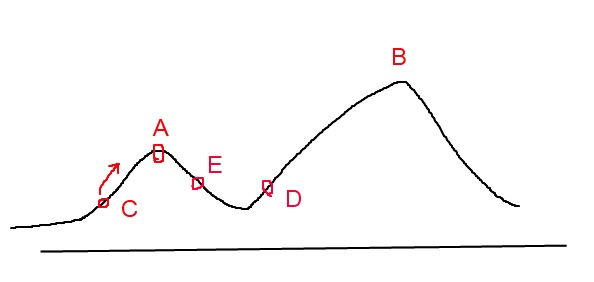

# 集体智慧编程 笔记

### 列表推导式 list comprehension

一种方便简洁的语法形式

    [表达式 for 变量 in 列表]
    or
    [表达式 for 变量 in 列表 if 条件]

    l=[1,2,3,4,5,6,7,8,9]
    print [v*10 for v in l if v>4]
    timesten=dict([(v,v*10) for v in l])

## 导言

+ 利用开放的 API 搜集数据 + 机器学习算法和统计方法 = 借助集体智慧的相关方法
+ 所有机器算法都有过度归纳的可能性

## 提供推荐 Making Recommendations

+ 如何根据群体偏好来为人们提供推荐
+ 两条相似度评判体系：欧几里得距离和皮尔逊相关度
+ 皮尔逊方法修正了“夸大分值(grade inflation)”的情况。如果某人总是倾向于给出比另一个人更高的分值，而二者的分值之差又始终保持一致，则他们依然可能会存在很好的相关性。
    * 首先找出两位评论者都曾评价过的物品，然后计算两者的评分总和与平方和，并求得评分的乘积之和，最后利用这些计算出皮尔逊相关系数
+ 如何找到商品之间的近似关系
+ 与前面类似，不过人与物品的关系对调
+ 以上都是基于用户的协作型过滤(user-based collabonative filtering)

另一种是基于物品的协作型过滤(item-based collaborative filtering)，总体思路是为每件物品预先计算好最为相近的其他物品。然后，当我们想为某位用户提供推荐时，就可以查看他曾经评过分的物品，并从中选出排位靠前者，再构造出一个加权列表，其中包含了与这些选中物品最为相近的其他物品。尽管第一步要求我们检查所有的数据，但是物品间的比较不会像用户间的比较那么频繁变化。

[MovieLens 数据集](http://grouplens.org/datasets/movielens/)

### 基于用户进行过滤还是基于物品进行过滤

在针对大数据集生成推荐列表时，基于物品进行过滤的方式明显要比基于用户的过滤更快，不过有维护物品相似度表的额外开销。而对于稀疏数据集，基于物品的过滤方法通常要优于基于用户的过滤方法，而对于密集数据集而言，两者的效率几乎是一样的。

尽管如此，基于用户的过滤方法更加易于实现，而且无需额外步骤，因此更加适用于规模较小的变化非常频繁的内存数据集。

## 发现群组 Discovering Groups

数据聚类(data clustering) 用以寻找紧密相关的事、人或观点，并将其可视化的方法。

### 监督学习和无监督学习

+ 利用样本输入和期望输入来学习如何预测的技术被称为监督学习法(supervised learning methods)，例如神经网络、决策树、向量支持机和贝叶斯过滤。
+ 聚类是无监督学习(unsupervised learning)的一个例子。还有非负矩阵因式分解(non-negative matrix factorization)和自组织映射(self-organizing maps)

### 单词向量 Word Vectors

为聚类算法准备数据的常见做法是定义一组公共的数值型属性，然后利用这些属性对数据项进行比较。例如可以根据内容对博客用户进行分类

### 分级聚类

通过连续不断地将最为相似的群组两两合并，来构造出一个群组的层级结构。其中的每个群组都是从单一元素开始的。通常，待分级聚类完成之后，我们可以利用树状图(dendrogram)来展现所得到的结果。

但是这种聚类的计算量惊人，很多时候 Kmeans 是一个更好的方法。

+ 先对笔记进行分词，然后聚类找到风格，又或者是自动提取出关键字
+ Beautiful Soup 用来处理网页
+ 多维缩放技术(multidimensional scaling) 缩放的过程中一些信息可能会丢失掉，但缩放后的结果会更加有助于我们理解算法的原理

## 搜索与排名 Searching and Ranking

全文搜索算法是最重要的集体智慧算法之一。

### 搜索引擎的组成

首要步骤是找到一种搜集文档的方法，然后建立索引，最后一步是通过查询返回一个经过排序的文档列表。

### PageRank 算法

为每个网页都赋予了一个指示网页重要程度的评价值。网页的重要性是依据指向该网页的所有其他网页的重要性，以及这些网页中所包含的链接数求得的。

理论上，PageRank 计算的是某个人在任意次链接点击之后到达某一网页的可能性。如果某个网页拥有来自其他热门网页的外部回指链接越多，人们无意间到达该网页的可能性也就越大。当然，如果用户始终不停地点击，那么他们终将到达每一个网页，但是大多数人在浏览一段时间之后就会停止点击。为了反映这一情况，PageRank 还使用了一个值为 0.85 的阻尼因子，用以指示用户持续点击每个网页中链接的概率为 85%。

计算时为所有的 PageRank 都设置一个任意的初始值，经过反复迭代，会越来越接近真实值。

### 从点击行为中学习

构造一个人工神经网络，以一组节点(神经元)构成，并且彼此相连，称为多层感知机(multilayer perceptron, MLP) 网络。此类网络由多层神经元构造而成，其中第一层神经元接受输入，最后一层给予输出。神经网络可以有多个中间层，称为隐藏层，其职责是对输入进行组合

## 优化 Optimization

随机优化(stochastic optimization)的技术来解决协作类问题，擅长处理受多种变量影响，存在许多可能解的问题，以及结果因这些变量的组合而产生很大变化的问题。

成本函数是用优化算法解决问题的关键，它通常是最难确定的。任何优化算法的目标，就是要寻找一组能够使成本函数的返回结果达到最小化的输入。对于好坏程度并没有特定的衡量尺度，唯一的要求就是函数返回的值越大，表示该方案越差。

爬山法以一个随机解开始，然后在其临近的解集中寻找更好的题解(拥有更低的成本)，最后的解是一个局部范围内的最小值，但却不一定是全局最优解。解决这一难题的一种方法是随机重复爬山法(random-restart hill climbing)

退火是指将合金加热后再慢慢冷却的过程。大量的原子因为受到激发而向周围跳跃，然后又逐渐稳定到一个低能阶的状态，所以这些原子能够找到一个低能阶的配置(configuration)。退火算法以一个问题的随机解开始，用一个变量来表示温度，这一温度开始非常高，而后逐渐变低。每一次迭代期间，算法会随机选中题解中的某个数字，然后朝某个方向变化。退火过程开始阶段会接受表现比较差的解。随着退火过程的不断进行，算法越来越不可能接受较差的解，直到最后，它将只会接受更优的解。

介绍模拟退火前，先介绍爬山算法。爬山算法是一种简单的贪心搜索算法，该算法每次从当前解的临近解空间中选择一个最优解作为当前解，直到达到一个局部最优解。爬山算法实现很简单，其主要缺点是会陷入局部最优解，而不一定能搜索到全局最优解。如下图所示：假设C点为当前解，爬山算法搜索到A点这个局部最优解就会停止搜索，因为在A点无论向那个方向小幅度移动都不能得到更优的解。

爬山法是完完全全的贪心法，每次都鼠目寸光的选择一个当前最优解，因此只能搜索到局部的最优值。模拟退火其实也是一种贪心算法，但是它的搜索过程引入了随机因素。模拟退火算法以一定的概率来接受一个比当前解要差的解，因此有可能会跳出这个局部的最优解，达到全局的最优解。以图1为例，模拟退火算法在搜索到局部最优解A后，会以一定的概率接受到E的移动。也许经过几次这样的不是局部最优的移动后会到达D点，于是就跳出了局部最大值A。

模拟退火算法描述：

+ 若J( Y(i+1) )>= J( Y(i) )  (即移动后得到更优解)，则总是接受该移动
+ 若J( Y(i+1) )< J( Y(i) )  (即移动后的解比当前解要差)，则以一定的概率接受移动，而且这个概率随着时间推移逐渐降低（逐渐降低才能趋向稳定）
+ 这里的“一定的概率”的计算参考了金属冶炼的退火过程，这也是模拟退火算法名称的由来。

爬山算法：兔子朝着比现在高的地方跳去。它找到了不远处的最高山峰。但是这座山不一定是珠穆朗玛峰。这就是爬山算法，它不能保证局部最优值就是全局最优值。

模拟退火：兔子喝醉了。它随机地跳了很长时间。这期间，它可能走向高处，也可能踏入平地。但是，它渐渐清醒了并朝最高方向跳去。这就是模拟退火。

遗传算法 Genetic Algorithm

先随机生成一组解，称之为种群(population)，在优化过程中的每一步，算法会计算整个种群的成本函数，从而得到一个有关题解的有序列表。在对题解进行排序之后，一个新的种群，也就是下一代，被创建出来了。首先，我们将当前种群中位于最顶端的题解加入其所在的新种群中(精英选拔法elitism)。新种群中的余下部分是由修改最优解后形成的全新解所组成。

有两种修改题解的方法，一种是变异(mutation)，通常的做法是对一个既有解进行微小的简单的随机的改变。另一种方法称之为交叉(crossover)或配对(breeding)。这种方法是选取最优解中的两个解，然后将它们按照某种方式进行结合。

作为遗传算法生物背景的介绍，下面内容了解即可：
+ 种群(Population)：生物的进化以群体的形式进行，这样的一个群体称为种群。
+ 个体：组成种群的单个生物。
+ 基因 ( Gene ) ：一个遗传因子。 
+ 染色体 ( Chromosome ) ：包含一组的基因。
+ 生存竞争，适者生存：对环境适应度高的、牛B的个体参与繁殖的机会比较多，后代就会越来越多。适应度低的个体参与繁殖的机会比较少，后代就会越来越少。
+ 遗传与变异：新个体会遗传父母双方各一部分的基因，同时有一定的概率发生基因变异。

简单说来就是：繁殖过程，会发生基因交叉( Crossover ) ，基因突变 ( Mutation ) ，适应度( Fitness )低的个体会被逐步淘汰，而适应度高的个体会越来越多。那么经过N代的自然选择后，保存下来的个体都是适应度很高的，其中很可能包含史上产生的适应度最高的那个个体。

## 文档过滤

