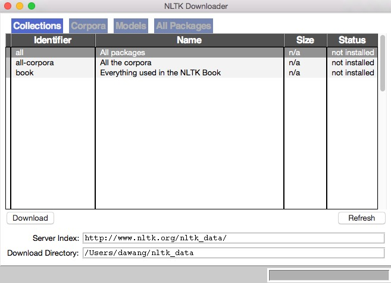
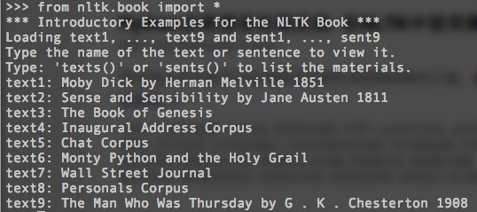
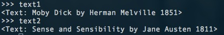
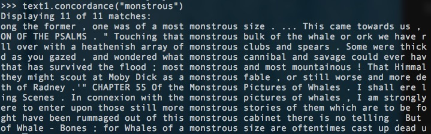
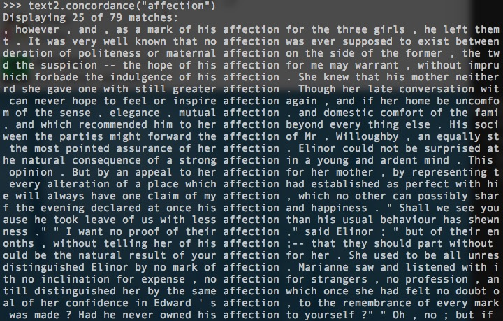
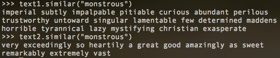
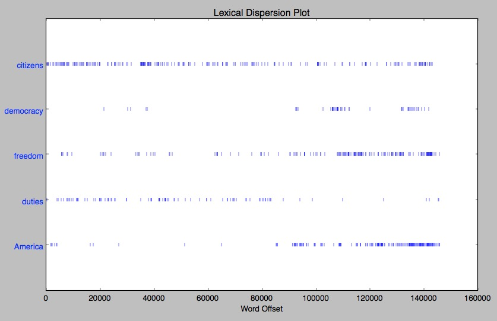
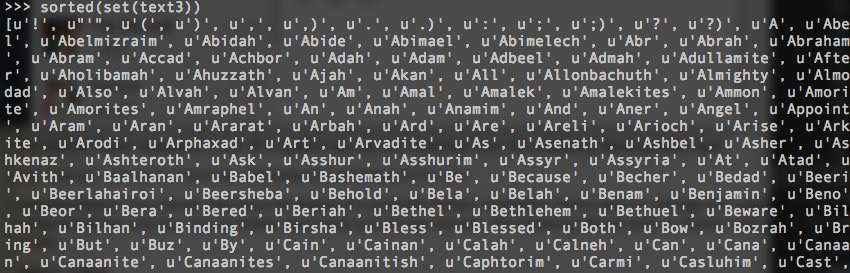
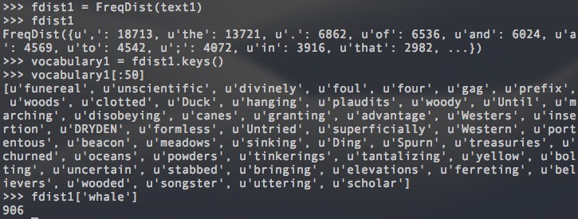
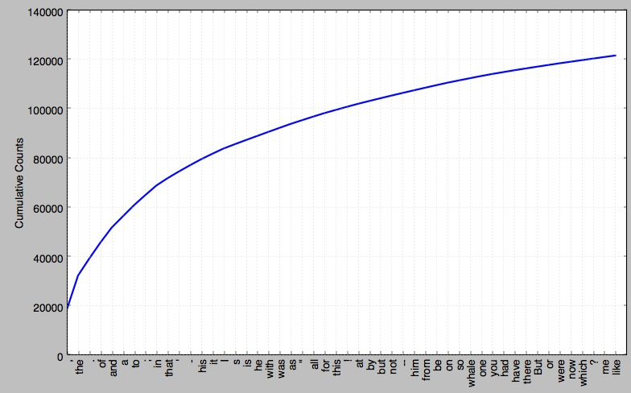

# Python 自然语言处理

学习如何处理大量非结构化文本的 Python 程序，学到分析书面文档内容和结构的主要算法。Python + NLTK。

<!-- MarkdownTOC -->

- NLTK 概览
- 第一章 语言处理与 Python
    - NTLK 入门
    - 1.1 语言计算：文本和单词
        - 搜索文本
        - 计数词汇
    - 1.2 近观 Python：将文本当作词链表
    - 1.3 计算语言：简单的统计
        - 频率分布
        - 细粒度的选择词

<!-- /MarkdownTOC -->

## NLTK 概览

语言处理任务 | NTLK 模块 | 功能描述
--- | --- | ---
获取和处理语料库 | nltk.corpus | 语料库和词典的标准化接口
字符串处理 | nltk.tokenize, nltk.stem | 分词，句子分解提取主干
搭配发现 | nltk.collocations | t-检验，卡方，点互信息 PMI
词性标识符 | nltk.tag | n-gram, backoff, Brill, HMM, TnT
分类 | nltk.classify, nltk.cluster | 决策树，最大熵，贝叶斯，EM，Kmeans
分块 | nltk.chunk | 正则表达式，n-gram，命名实体
解析 | nltk.parser | 图表，基于特征，一致性，概率，一来
语义解释 | nltk.sem, nltk.inference | λ演算，一阶逻辑，模型检验
指标评测 | nltk.metrics | 精度，召回率，协议系数
概率与估计 | nltk.probability | 频率分布，平滑概率分布
应用 | nltk.app, nltk.chat | 图形化的关键词排序，分析器，WordNet查看器，聊天机器人
语言学领域的工作 | nltk.toolbox | 处理 SIL 工具箱格式的数据

## 第一章 语言处理与 Python

#### NTLK 入门

先去[nltk](www.nltk.org)上下载安装 NTLK。然后安装所需要的数据

    >>> import nltk
    >>> nltk.download()

然后会出现下面的下载器，选择 `book` 进行下载。

下载完之后就可以使用了，具体示例如下

    >>> from nltk.book import *

需要引用时直接输入名字即可

### 1.1 语言计算：文本和单词

#### 搜索文本

词语索引视图显示一个指定单词在文本中每一次出现的情况，并连同一些上下文。利用 `concordance` 函数来完成这个操作，下面是几个示例：

**《白鲸记》中的 monstrous**

    >>> text1.concordance("monstrous")

**《理智与情感》中的 affection**

    >>> text2.concordance("affection")

我们不仅可以搜索指定词，还可以看到针对某个指定词，有哪些词出现在指定词的上下文中。利用 `similar` 函数可以找到某个指定单词的相关词：

    >>> text1.similar("monstrous")
    >>> text2.similar("monstrous")

通过比较同一个单词的相关词，我们可以看到这两本书的作家对于 monstrous 这个单词的使用有着非常不同的倾向。

我们还可以研究两个或两个以上的词的共同上下文，比如 monstrous 和 very，我们可以使用 `common_contexts` 函数来进行操作：

    >>> text2.common_contexts(["monstrous", "very"])
    a_pretty is_pretty a_lucky am_glad be_glad

我们还可以判断词在文本中的位置，并用离散图表示。每一个竖线代表一个单词，每一行代表整个文本，使用 `dispersion_plot` 函数来完成这个操作(需要安装matplotlib)：

    >>> text4.dispersion_plot(["citizens", "democracy", "freedom", "duties", "America"])

#### 计数词汇

使用函数 `len` 可以获取文本的长度：

    >>> len(text3)
    44764

也就是说 text3 有 44764 个词(标识符)。我们可以用 `set` 来获取 text3 的词汇表

    >>> sorted(set(text3))
    >>> len(set(text3))
    2789

也就是在这 44764 个标识符中，只有 2789 个不同的词汇。同样，可以利用 `count` 函数来找到一个次出现的次数：

    >>> text3.count("smote")
    5

### 1.2 近观 Python：将文本当作词链表

+ 链表 List: 方括号 ['Call', 'me', 'Da', '.']
+ 支持 `count`, `sorted` 以及链表相加操作(连接)
+ 追加一个元素用 `append`
+ 索引取出链表元素 `text4[911]`, 也可以找出第一次出现的索引 `text4.index('happy')`
+ 可以利用`切片`来获取子链表：`text5[16715:16735]`
+ 排序表中，大写字母出现在小写字母之前
+ 对于字符串来说，很多链表的方法都可以用，例如乘法和加法
+ 利用 `join` 函数来连接链表组成单个字符串 `''.join(['Monty','Python'])`
+ 利用 `split` 函数来把字符串分割成链表 `'Monty Python'.split()`

### 1.3 计算语言：简单的统计

可以应用到 wkk 中

#### 频率分布

如何能自动识别文本中最能体现文本主题和风格的词？统计每个词出现的次数是一个最容易想到的方法，也被称为**频率分布**，NLTK 内置了这个功能，使用 `FreqDist` 即可：

    >>> fdist1 = FreqDist(text1)

如果把前五十个的累计词频显示出来，可以看到这 50 个词占到这本书的将近一半

而我们也可以发现这些词除了 whale 之外其他基本都没啥意义。既然高频词汇对我们来说没有意义，那么那些只出现了一次的词(hapaxes)又如何呢？使用下面的命令来查看

    >>> fdist1.hapaxes()

一共有 9000 多个！低频词太多，看来高频词和低频词都没有帮助。

#### 细粒度的选择词

