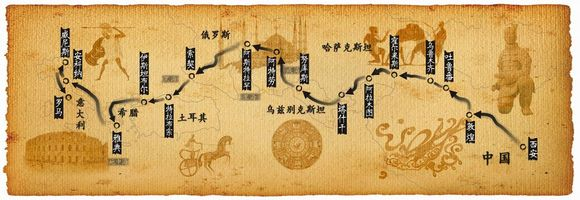

# 把货卖给全世界——国际贸易篇

## 知商而知史——古代贸易

中国是一个悠久的国家，是一个以农业立国的国家。中国曾经有一位大家都耳熟能详的皇帝，乾隆说过一句非常著名的话：”天朝物产丰富,无所不有,原不籍外夷货物以通有无“这句话几乎说尽了中国大部分皇帝的心态。

我们的国家物产极其丰富，要啥有啥，咱不需要和那些蛮夷们的破烂，所以不需要来往。当我们看历史书的时候，大多数人都会对乾隆的行为戳之以鼻，骂其为短视行为。

当然，还有个皇帝比如明英宗，曾经中国和蒙古草原部落的贸易在朱元璋开辟的互市之时，双方的贸易规模较小。但是随着和平的岁月推移，蒙古高原部落的人口开始恢复后，对贸易的需求量也逐步的增加，但是因为祖宗制度，所以互市这个和蒙古打交道的这个规矩一直都是没有破的。

熟悉明代史的人一定制度，在卖国狗贼大太监王振得势之后，他欺骗了英明的英宗陛下，居然去把蒙古和中国贸易的通道给关闭了。蒙古高原啥都缺啊……没手工业，要买盐都没地方去，逼的人家去抢劫。因为这些原因，所以导致了后来的土木堡之变。史书对王振的行为简直是骂了个狗血淋头，说王振关闭互市，鼓动英宗亲征等脑残行为，应该拉出去被枪毙一百发子弹。

据说当时的明朝官员们在听说了土木堡惨败后，肯不得啃了那早就死在战场上的王太监的骨头，吃了丫的肉。各种悔不该当初。

历史部分我们少说，涉及古代政治……呵呵，当然我绝对不会给一个死太监洗地。

说下这一段只是要告诉大家，因为中国的所有史料都缺乏国家与国家之间交往的最重要视角——商贸视角。这个视角往往能为我们解释很多问题，但是因为中国自古就有商人皆为牲口的论调，所以古代商人是完全没有任何政治地位的，并且在明朝，清朝一类的王朝！商人的政治地位还不如街头杂耍的。

就因为这个原因，所以我们的史料上并未留下任何有关商贸视角看历史的文字。但庆幸的是，如今改革开放后，我们的生活日益见好，我们也能国外到处走走，也就自然有那些优秀的学者翻译国外的史书，让我们看到更多关于商贸视角的书籍。

当然，并非是说我要写一段用商贸的视角看中国史的贴文，这里仅仅是给大家写下……古代贸易方式和现代国际贸易的关系和传承。

因为我们在研读”国际贸易“专业时触及的茫茫多的规矩，定义等，都是从古代流传下来的。这里用一个小故事来说明为什么我们要写古代贸易吧（也许大家都看过）

《马屁股与铁轨》

> 1435毫米的轨距为国际上通用的标准轨距，早期铁路是由制造电车的人按电车的轮距设计的，电车轮距又是根据英国马车的轮距设计的，而英国马车的轮距是从古罗马那里来的，古罗马马车的车距是根据两匹马屁股的宽度来决定的。也就是说古罗马两匹马的屁股的宽度最终决定了现代铁路铁轨之间的宽度。

相信见多识广的网友一定对这个段子是有兴趣的，所以……你们应该我为什么要从古代贸易开始说起了。

因为中国的商人在古代的地位低下，所以中国古代贸易基本都是由外国人来完成。大家不用自卑，并非是中国人没做生意的天赋，而是古代贸易的风险性，比现代社会贩毒还危险。

在汉代时，中国有一个伟大的外交家张骞，他出使西域后打通了西域的外贸关系。于是有了丝绸之路，我们很多人都认为丝绸之路是中国对外贸易的开始。

其实在汉朝之前也就番邦蛮族和华夏贸易，丝绸之路作为古代贸易的标志性事件是因为丝绸之路是国家与国家第一次公开性质的贸易，所以被载入史册。

丝绸之路贸易开始后，其实汉朝的国策是以天朝之物力，训番邦之蛮夷。原因和前文中说的乾隆一样，其实汉朝人对贸易也不是有很大的兴趣。所以那时候在中亚地区的一个叫乌孙的小国家（今中亚费尔干纳盆地外围处，多在哈萨克斯坦），那国家穷啊……在古时候中国绝对是世界第一科技大国，世界第一产品大国，第一农业大国，所以……这些丰富的物产对于小国家来说是一种机会。

当人穷疯了的时候，诸如乌孙人，大月氏等民族就开始冒着风险去贸易。随着张骞同志打开了贸易通道之后，贸易变得相对安全一些了，所以乌孙从长安把货物带出，到乌鲁木齐休整或者交易，然后另一波人把购买到的货物再从乌鲁木齐带出，过哈萨克斯坦阿拉木图，进乌兹别克的首都塔什干，然后穿越乌兹别克斯坦的大沙漠，进入哈萨克西部的阿特劳。然后再到威尼斯，转入罗马地区贸易。

整个贸易过程，从长安一直到罗马，需要大致三年到五年的时间（假设没有遇到问题的话）。而当时的南线部分（进伊朗高原，入中东第一贸易城市巴格达进伊斯坦布尔线路）当年正值罗马人和安息人打的丧心病狂。所以古代的贸易是非常非常困难的……说不准山里跑一堆野人出来就把你给抢了

比如在西汉张骞出西域开通了丝绸之路北线后不久，汉朝内乱王莽篡位。于是整个西域通道就变成了山中无老虎，猴子当大王的节奏。各种迫于生计也好，还是迫于想给媳妇儿买耳环的需求也罢……开始抢劫商队，并且一度把整个丝绸之路抢的商人绝迹的地步。

直到后来的东汉的班超再一次出西域，才恢复了丝绸之路的贸易。

因为西汉时期的原因，直接演变了东西方贸易的方式……所以王莽这个穿越党所引发的混乱对东西方的沟通产生了啥影响，我们真的不好说……

因为到了东汉的时候，贸易的形式就发生了彻底的转变......商人全部变了！因为商人的改变，也彻底扭转了中原皇帝对商人的态度，这印象一直持续到了清朝时期，到孙中山先生手里才被扭转过来。

## 仗剑经商

前面说到王莽篡位导致了商人的形式发生转变，那么这些形式又是啥？请注意这一节的标题——仗剑经商。很多人在听到这四个字的时候，特别是根本对贸易不懂的同学，一定会说……仗剑经商王霸之气毕现，这才是牛逼的商人。但是历史告诉我们……不是这样的啊……

好了，不卖关子继续说.........

前面说到，因为王莽篡汉导致了西域的丝绸之路发生了很大的转变，原因是汉军这股超强的势力离开了西域后，山中无皇帝，猴子当大王了，所以各种势力都会迅速的填补权力真空。

从造反的窦融啊，鄯善这一类稍微大一点的势力，到各种藩镇的造反，包括土匪的立山头行为。整条商路全部被土匪所霸占。

于是就有了……此路是我开，此桥是我搭，要想从这儿过，留下买路钱。所以抢劫行为得不到抑制，而商人们又无法自保，虽说当年的乌孙，大月氏，汉族都在贸易，但是当时的商队规模都非常的小，他们也带武器，但是……实在顶不住抢劫啊。

马克思说：商人只要有利润就敢冒风险，所以在篡汉时期。中西贸易骤然降低的同时，贸易就变成了结伴而行，并且早期商会、商团、押护等组织就开始出现了。

到班超重新开启西域后，在中国贸易的商人，已经从曾经的几十人个人一伙变成了结伴而行的数百人一伙，个别的商队甚至规模达到了数千人的规模。

有的同学可能要说，这不是挺好吗？说明东汉皇帝们牛逼……大规模贸易又开始了。咳咳……

要知道商人的贸易必须降低风险，所以这些商队的结盟行为，在西域地区就形成了一股庞大的势力。当年的贸易商队，押护（押运护卫），马头等等的人员全部是持武器贸易。

请问……什么样的皇帝会允许一个三四千人的武装团队进入长安？难道你不怕他们造反？并且，押护们的战斗水平是超过正规军的，因为他们在商路上的战斗往往都是遭遇战，并且大多都是为财而发生的你死我活的战斗。战斗经验是高于几年打一次仗的正规军的。军事素养大致类似于京城的护卫军战斗力。

也就是说，一个商队上千人…我们可以视他为一千个护卫军进城了。皇帝会非常的担心啊……因为权利最高的统治者，为了防止叛乱发生，甚至不允许藩王们带兵进京，哪怕带一百手持刀斧的护卫也不可以！

那么商人又是什么？在文治的汉朝开启了独尊儒术后，文人地位迅速提高。连藩王，将军都受到限制……那些个满身铜臭味的商人，敢上千人，持武器进京基本属于作死的行为。

所以，虽说东汉又重新开启了丝路，但是……商人已经变成了结团，仗剑经商的大组织。已经开始威胁皇权的地位。

东汉再一次开启了丝绸之路后，整个商路又开始活跃了起来。但是国际贸易法则的雏形也是在这个时期开始出现，当时的商贸活动因为商人们持有武器，所以东汉政府开始要求商人们定期入贡（贸易），并且开始宣发政令，要求商人们遵守。当然，到了三国两晋时代后，整个商路又开始丧心病狂的混乱。

在消费学里，有一个词叫“消费习惯”但是在贸易学里也有一个类似的词，叫“贸易习惯”，长达数百年的三国和两晋时代，让中西方贸易的商人们在脑海里都形成了一个习惯就是——去东方贸易必须有商团组织，必须有护卫，因为出了敦煌后很可能会被抢劫。

到了唐朝的时候，仗剑经商的商团开始发展到丧心病狂的程度。当时在中东地区已经兴趣了一个和唐朝一个重量级的强国——阿拉伯帝国。他们的势力已经深入到了中亚地区，于是阿拉伯帝国的商人们开始取代中亚民族的商贸活动，开始了远距离的贸易。

在唐朝时期，中国和阿拉伯帝国开始贸易。唐朝的军事力量足以维持住丝绸之路不会出现大规模的抢劫集团，所以一直都限制阿拉伯帝国商团的军事武装进入。为何要限制？

因为当时的阿拉伯商队，一般都是一两百人一队，在新疆的贸易重镇今天的喀什一线集结后，组成万余规模的商队进入中国。在汉朝时期，商队过西域都是从敦煌出，到哈密地区，进乌鲁木齐一线。原因是汉朝的时候今天的南疆部分，土匪还是很多的……不敢过。

但是阿拉伯商队成功的开辟了西域南线部分，因为他们的商队……护卫皆为骑兵，一个万人商队几乎人人都持有刀剑，而护卫则一般是商队的十分之一左右，数量高达一千余人的精锐骑兵跟着商队来回的巡逻。在南疆当年土匪林立的地方，能和阿拉伯商队对抗的……几乎没有。

因为地理原因，阿拉伯必须开辟南线商贸，这样可以节约很大一部分的人力成本。走北线的话，一定是到乌鲁木齐，然后出阿拉木图。而南线的话，可以直接从喀什出发，进今天的阿富汗喀布尔后，直接进伊朗高原。避开当年处于战争状态的中亚地区，可以降低风险。

商队规避风险，增加护卫其实对于唐朝的节度使们来说是一个合理的要求。但是唐朝要求阿拉伯的商队必须呆在固定的地方，然后分批拿关文进西安进行贸易。

因为这个很简单的规矩，或者说是大唐皇帝的戒备心。很大程度上繁荣了今天的敦煌，因为大部分的商队都会集中在敦煌然后分批进西宁，等待关文上的日期，进西安。

商队贸易一般都会带足够多的黄金、白银等，上万人一个的商队居住在敦煌，等待大唐皇帝的文书时间进去贸易。如果你作为一个敦煌的酒店老板……相信也能赚的盆满钵满。

因为安全的原因，所以第一批进西安采购货物的商队，会回到敦煌继续等待同伴们采购完毕。然后结伴从敦煌出发，穿越南部戈壁，到达喀什采购补给后，再卖掉一些不值钱的货物。开始往他们的国家前进，出阿富汗喀布尔后，进入山区到达阿富汗北部的昆都士地区，顺着喷赤河到达今土库曼一线后，再进入今天的伊朗，最终抵达目的地——巴格达。

1：问，为何商贸会需要骑兵？

答：在这漫长的商旅过程中，难免会遇到个别商队因为老婆闹别扭拉，吃东西拉肚子啦等情况而暂时脱离了商团。而一旦脱离了商团的保护，就如同一只肥羊落入了虎口。要知道远距离的贸易，他们不可能带着羊皮去西安贸易，过去的时候一定是黄金、白银等货币，回来的时候……只要脑子正常，肯定不会带厕所纸一类的低价值货物，货物一定会是丝绸、瓷器、茶叶、化妆品等高价值的货物。一骆驼的货物，一般长距离运输骆驼背负的重量是一百余斤上下，意味着至少会背六捆丝绸。只要得抢到一头，基本就算发财了，抢到两头，就可以实现在买宝马车的愿望了……如果大家 人多，抢的多……一次吃掉落单的商队的话，就可以实现去北京买房子的愿望啦。

对于土匪们而言，这简直就是升职加薪，迎娶白富，走向人生巅峰的节奏……这样一想，相信看文的你都有点小激动吧。

如果商队被抢，骑兵可以快速机动回去，如果人已经被杀死了，骑兵至少可以把被抢的货物给抢回去。当年阿拉伯帝国的商队，有资料记载的一次最大规模行动是他们在阿富汗的山区的吐火罗人给抢了……

哎哟我去，这不是明显不能好好做朋友了嘛。人家阿拉伯商人刚出了城，吃着火锅儿唱着歌，突然就冲出来一群吐火罗的土匪把东西给抢了，这不是明显蛋疼嘛！

于是，阿拉伯的商队没反应过来，整个商团被抢~结果吐火罗很悲剧啊……阿拉伯的商团快速的和从喀什出发的商团取得了联系，甚至不需要阿拉伯帝国军队的出手……两个商团，攻击十余个商队，共计数千纯骑兵，从南北两面夹击吐火罗，并且打出了阿拉伯帝国的旗帜！直接和吐火罗宣战。阿拉伯商人认为……敢抢阿拉伯商队，已经属于活腻歪了，如今你东西抢了就不说了吧，还打脸了~今后如何让阿拉伯商人在丝绸之路上混？

于是吐火罗很坚强的表示，大爷就特码的抢了你，你能咋地？结果大家都应该猜到了，商队骑兵和吐火罗对峙后，阿拉伯帝国军队快速支援。吐火罗卒……首领叶护（类似大汉称号）被逼着退了所有的非法所得，并且阿拉伯帝国表示……这种抢劫行为必须严厉打击，于是罚款数十万平方公里土地。

吐火罗因为被阿拉伯商队的攻击和阿拉伯军队的要挟，被迫割让今阿富汗西部地区，于是跑到唐朝去……哭的满地打滚……要求皇帝大大做主，阿拉伯人又欺负人了。唐朝皇帝也不是二愣子，随便你忽悠……知道了因为吐火罗抢劫未遂反被抢后……呵呵一笑就给打发走了。

之后吐火罗也是皮痒，据说吐火罗人有突厥人，所以……狗改不了吃屎，之后又抢过几次阿拉伯商队，结果就是……阿拉伯商队出了喀布尔后就全员戒备，见人立碎之。然后……吐火罗被灭了。之后唐朝和阿拉伯军队发生战争后，吐火罗人最后一次出现在历史的舞台上……帮助唐朝军队打阿拉伯人，那姿势完全就是……爹啊……就是他们天天打我啊，你可要为我做主啊！哭的直接打滚。

当然，因为阿拉伯帝国商队太过于牛逼的原因，也因为唐朝和阿拉伯帝国交战的原因。之后唐朝皇帝再一次限制了阿拉伯商队进西安的人数规模，并且进一步的限制了武器，做到了全员不准带寸铁入西安的规矩。

而商人这些奸诈的家伙们，必须是屁股后面随时挂一把算盘，边走边打。商队联合到一起组成商团，请一大伙子的押护们保护商团贸易。从成本上划算吗？

明显是不划算的，因为在唐朝时期阿拉伯商团的押护是固定职位，类似于今天的保安，那是月月都要拿工资的。作为黑心的资本家，如果能让押护召之即来挥之即去，那岂不是美哉？

而商业贸易的蓬勃发展，也刺激了一些人……特别是土匪团伙们，抢劫成本太高了，商团动辄就是四五千贸易，个别不要脸的甚至上万的规模到处跑。阿拉伯那些土豪居然押护都是骑兵……那抢劫这条路行不通，那我们是不是可以换一个思路去想？去保护他们？

于是土匪团伙们当年就聚集在敦煌，到处游说商团，表示自己很便宜，而且武艺高超，打人的水准至少有两层楼那么高，而且水瓶也强。而且只要管饭，给银子护送到喀什去……价格便宜哟亲……算起账来只要常备押护的三分之一哟亲？

商队的老大们，自然是愿意的，因为便宜货谁都爱嘛。但是商队组织，带头的人中国人叫他们马锅头（云南马帮叫法），也叫押头（晋商称呼），也是骆师（中亚人叫法），我们就叫他商队保安队长吧。队长大人自然是不愿意人这帮子来路不明的人来做商队押运的……原因很简单，这属于抢饭碗行为。

如果这些野路子来了，那么自家的兄弟就注定是要下岗的。所以在唐朝时期，马锅头们和东家的谈判持续了很久，最终形成了一个流传到清朝都依然坚定执行的标准：镖师押运，马锅头必须带队，押护和镖师比一般是1:1

这样做的原因很简单，马锅头的队伍作为大东家的职业军，肯定是放心可靠的，镖师就算是土匪伪装的，那就算动起手来也不吃亏，并且商队进行长途贸易必须跟随商团。各个商队的押护都是认识的，所以可以很好的制衡住镖师。

所以，在敦煌，西安一线就开始出现中国历史上最大规模的镖师。在中国历史中，镖局繁荣必定是出现在太平盛世，大家可不要被电视剧蒙蔽了……认为乱世多镖局。

在乱世的时期，四处战乱商贸风险过大……东家们都不愿意选择去贸易，所以镖局就没生意。太平盛世风险低，就算遇到抢劫的也就是百十人的野路子，风险可控……所以镖局才能繁荣昌盛起来。

唐朝的中后期，阿拉伯的商队已经非常多了，但是贸易总是跟随历史的脉搏不断的起伏。

唐朝经历了安史之乱后和吐蕃的开打后，吐蕃北进，导致丝绸之路兴盛百年后又一次被切断。而这次切断之后，对之后的贸易影响非常的严重。

吐蕃北进后，成功的进攻过长安城，并且把贸易重镇敦煌占据了。因为出现了战争，对于商团们来说，拳打几百人的土匪组成的幼儿园，脚踢军力不是很好的小国家养老院还是可以的。但是要商团面对如唐军和吐蕃军队这样以十万为单位的正规军……就算你是奥特曼也没办法的。

而敦煌被占据后，整个贸易通道就断掉了……那么请问如果你是一名土匪，你好不容易从良了去敦煌创业开保安公司……突然就没饭吃了，你会怎么办？

而吐蕃虽然作为一个部落结构的国家，他们长途跋涉进攻唐朝……其实还是肝儿颤的。当进攻下敦煌后，土匪们从良的梦被打碎后……干脆加入吐蕃军队，至少还能混饭吃，而且吐蕃这个怪蜀黍还许诺，只要拿下长安……随便抢！

尼玛，土匪做了几百年，谁敢在天子脚下大肆抢劫？这次美梦可以成真了

于是，这帮子毫无节操的土匪组成的早期镖局……几乎毁了之后的所有商贸。土匪当年当镖师的时候带着阿拉伯的商队或者是汉家商队出入在丝绸之路上，对地理情况，各地守备情况，甚至是各部战斗力……甚至于各地的山川河流，包括王大妈家墙角过去有个坑他们都知道.......

于是他们带着吐蕃、党项各族大军，在公元763，广德元年攻入了长安城。唐朝皇帝,,唐代宗逃往陕州。从此，中原王朝对商贸的态度发生了极其剧烈的转变。

## 天子之怒

虽然唐朝力挽狂澜，但是历史及格的同学都知道郭子仪等将领退吐蕃后，唐朝总算是喘下了气。总算收复了长安，皇帝陛下也可以回皇宫了。

唐朝虽然经历了安史之乱，吐蕃战乱后……国力依然还是比较强劲的，天子回京后第一件事是啥？如果你是皇帝，如果你是郭子仪。第一件事情一定是拱卫长安的安全，没有任何事情比一个王朝皇帝的安全更重要。

于是唐朝开始对商贸组织们从怀有戒备之心，到土匪带吐蕃攻长安后，直接转变为只要是商队，就肯定有祸心，放商队进都城就属于作死行为。

我们有一万种姿势来证明，商队里会藏有叛国野心的贼子。所以外敌吐蕃一直掐死了唐朝的西域通道，导致安西都护府直接悬空在外，成为飞地。而吐蕃虽然来自高原，但是他们也不傻，所以混迹于商队里刺探军情，可不仅仅是那些电视剧里的猪脚们会用的。而唐朝的皇帝也必然不是电视剧里的逗比，一点防范都没有……

之后唐朝直接关闭陆地贸易，仅保留了泉州等港口的海洋贸易。所有商队要入西安采购货物，必须持有皇帝特发的关文方能进京，但是拿到关文的可能性几乎等于零，那时候的唐朝因为战乱对商贸的提防已经到了极致。也许你们会问关文是啥？看过西游记吧，唐僧每过一个国家都要去找皇帝戳一个大印，然后就可以通行，就是这玩意儿。早期的赦书就是这个形式。

而唐朝关闭了丝绸之路，但是汉家商队依然可以出去……但是有个问题就是，通道被吐蕃霸占了，至少当年的吐蕃……那才是专业抢劫户。

赔本的买卖是没人干的，后来唐朝的逐渐衰败，也就让西域的贸易开始中断了。

而唐朝留下的那种恐惧，影响了后来的君主们……

在唐代的时候，贸易曾经达到巅峰，我记得有位史学家说过：“一个王朝的心胸取决于他能否接纳四方宾客，判断一个王朝是否强盛，只需要看商队的规模”

可以很靠谱的说就是，唐朝开辟了中国古代贸易的高峰，之后的所有王朝都没有达到唐朝的高度。在唐朝的统治结束后，中国进入五代十国时期，到了大宋朝的时候……很多宋史研究学家们都会对宋朝给予极高的评价，但是宋朝因为前天的地理缺乏，陆地通道一直都没有恢复到唐朝时期的规模。但是，宋朝的海运发展的非常的迅速，并且宋朝时期中国的贸易达到另一个高度——海洋贸易。

宋朝之所以无法恢复唐朝那万邦来朝的盛况，主要原因是北宋的先天缺乏，丢失了最重要的北部关隘。后来的党项氏在此地建立了西夏后，西夏担当起了丝绸之路的贸易。但是因为西夏的宋朝之间经常干架，双方互市的规模连西夏自己的货物都不够用。当时的宋朝官员甚至有断绝互市的念头，原因是西夏一直贩卖盐巴，宋夏两国的贸易逆差过大，而且西夏在政治上比较激进，一直某取南下和宋朝经常抽出西瓜刀就对砍。

而辽国在北方的土地上，虽说于西夏有殷勤关系，辽国也对西域各国的关系比较好。但是贸易通道从没有恢复到唐朝时期那样的盛况，因为唐朝的商队只需持有唐朝和阿拉伯的关文就可以走通整个丝绸之路。

在中东地区的阿拉伯帝国，此时已陷入分裂时期，阿拔斯，后倭马亚，及北非的阿尤布王朝分裂了，而欧洲的十字军发动东征。在中亚的塞尔柱等国家开始崛起，也就导致了阿拉伯的商队在这个时期几乎也没法到达中国。而历史老牌贸易地区的中亚，他们虽然可以贸易，但是因为西方战争的死磕……做生意实在是太过于危险，货物拿过去挣不挣钱另说，能不能保住一条命那才是最重要的。

所以，宋朝这个天然性缺乏陆地贸易通道的帝国……到王朝灭亡的那一天也没迎来辉煌的商业时代。

而蒙古人南下后，蒙古人虽说对商贸的兴趣不大，但草原民族天生对商贸活动并不反感。因为在他们还处于弱小的部落的时候，和外界沟通的大多数渠道就是在草原上经商的商队。

因为天然的亲近，所以在蒙古时期贸易还算比较顺手，并且蒙古人比较尊敬商队，商队进游牧部落是会受到非常高的礼遇的。游牧部落多没什么黄金一类的硬货，手里唯一有的就是牛羊皮，貂毛，獭皮，兔皮一类的动物皮毛，在边界有互市的时候还能拿去贸易，但是一旦双方有战争……所有贸易都会断绝，所以他们对这些收他们皮子的商人们，赶脚是非常好的。

所以，在蒙古时代商队又可以开始活动了。并且商队在四方行走，可持有蒙古大汗给出的文书，凭大汗的文书基本可以通行在整个蒙古及蒙古兄弟汗国的境内。

但是悲催的是蒙古时代……蒙古进攻阿拉伯帝国时，对巴格达实行了屠城，并且抢光了巴格达的黄金珠宝，资产直接聚集到了那些皇亲贵族的手里。

市场彻底被击碎，商人此时如果贩运丝绸，瓷器等物进巴格达的话……巴格达人是买不起货物的。那很多人都会问了……为啥不卖给欧洲人？

说实话，虽然现在西方人掌握了话语权，把十字军东征时期的欧洲人描绘的高大上。在那个时期，欧洲人就是一群野人和蛮族，购买力的基本没有的……生活基本是靠抢，打仗基本是靠抢，整个生活都是抢。而拜占庭帝国的贸易稍微好一些，但是仅仅一个拜占庭的贸易量是无法拖动起一个庞大的中国贸易的。

所以也建议大家对蒙古时代多上心一下，当取得贸易霸主地位，但是市场被破坏的时候，你就是再强大也会被弄跪，因为你已经害死了你的买主……

在国家混乱，世界秩序被打乱后，商贸的风险极其的大。

而中国的进入了明朝之后，当年朱元璋为了征服衰败的北元朝廷，采取了欢迎在漠北苦寒之地的蒙古族兄弟们来中原，并且对不愿意和明朝作对的部落们开放贸易，并且给予赦书一张（赦书相当于是贸易许可证，和唐宋的关文，文书一样可使用一次）

而明朝朱元璋开放互市的目的，从根本性上就是哪来忽悠蒙古人不要闹事的利器而已，本质上朱元璋是不愿意和任何人发生任何性质的贸易。因为在明朝国内的政策上就可以看出来，明朝朱元璋是中国历史上第一次把人给钉在了土地上的皇帝，因为他发明了神器——路引。

这极大的制约了明朝百姓们四处游动的可能性，而商人们则确实是需要到各地贸易，算是流动人口。而明朝的路引制也就导致了大多数商人几乎无法取得路引，行政制约了商人贸易的发展。因为在朱元璋定义下的明朝，商人是最低贱的职业，在朱元璋的眼里……商人除了坑蒙拐骗，持兵器满世界晃荡，还有可能学唐朝的土匪引外贼进门……基本就算是毫无作用了。他对商人的认识基本都是负面的，这个和皇帝的青少年时期的经历有莫大的关系。

当然，明朝的士子们对商人的行为也是深恶痛绝，一度引经据典的告诉皇帝，大规模的开放商贸的结果一定是引狼入室。所以在洪武年后，出了在漠北地区的互市和东北和女真人的互市外，基本断绝了和西方联系的可能性。

当然，之后的皇帝明英宗，他也积极的开放过互市规模。但是没有考虑到客观事实……就是商贸组织已经土崩瓦解，前来贸易的瓦刺人也好还是鞑靼人也罢。都算是那些山大王自己创办的“国有企业”所以。开放互市是很可能被这群大爷给欺负了的。

而且游牧民族当年本身没什么节操，经常玩儿搂草打兔子这一招。拿着赦书到互市贸易一把，回去的时候再抢特码的，反正来都来了，不抢白不抢，反正都要回去……对吧，顺手牵羊嘛。

但是游牧民族的这个行为，让中国不得不想起数百年前唐朝长安的那把大火，所以当时明朝的朝堂内分成两拨人，一波是太监王振那一派……表示应该关闭互市，绝了和“蛮族”的贸易，一派表示应该进一步的开放互市，游牧民族抢劫边境的最重要原因就是他们没地方买东西。

我记得“明朝那些事儿”的作者，对这一段贸易史的观点为，其实开放互市是有可能创造和平的。但是在我看来，其实明朝的贸易已经不是商贸组织在贸易了，而是两个国家的“国有企业”在贸易，如果历史可以假设，就算当时明朝开放贸易，在没有武力做支撑的情况下……结局依然是明朝和瓦刺等游牧部落还是会干架。因为这帮人就属于职业匪徒，抢劫专业户……

和土匪开放与不开放的差距不大，明朝如果真的要解决贸易问题，需要废除朱元璋制定的路引制度，恢复大规模的商贸活动，因为……在这种尴尬的局面下，只有商队才能完成两个有矛盾国家的顺利贸易。

但是，土木堡之变后，明朝的态度骤然转变。我去年买了个登山包……滚特码的，给脸不要脸。于是明朝时期，中国的内部商业系统开始快速发展，这个系统就是我们现代人比较熟悉的一个词——马帮贸易。

关于海运贸易，国内的马帮（茶马）后面会开专门的章节说这个问题。

而明朝后来一度绝了海运贸易，将海运贸易收归国有……和边界互市一样，SX一样的商人滚滚滚，还是由国家来干靠谱。结果就是……明朝和日本的贸易都出了问题，导致倭寇上岸袭扰四方，最终绝了海洋贸易。

而到了清朝时期，清朝虽说是满族建立的王朝，但是智商是不低下的。他们在综合了中国历史上的经验教训后认为……开放商贸会导致数万人的武装随时在边境集结，可能会出 唐朝那样悲催时期。而海洋贸易则明朝用一个歪曲的事实告诉了满清，海洋贸易也不靠谱。

于是中国在满清时期，在乾隆帝的手里终于做到了闭关锁国的程度，不和所有人贸易来往。其实很多人在看到明清贸易的时候大多都会痛斥皇帝错过了最佳的机会……

其实我负责任的说，就算明清两朝皇帝都愿意贸易……西方当时已经没有消费市场了。阿拉伯帝国衰弱了，老欧洲还未崛起，生意明显没钱途……

所以，如果你是皇帝……你也会关了贸易的！

## 等待更新
